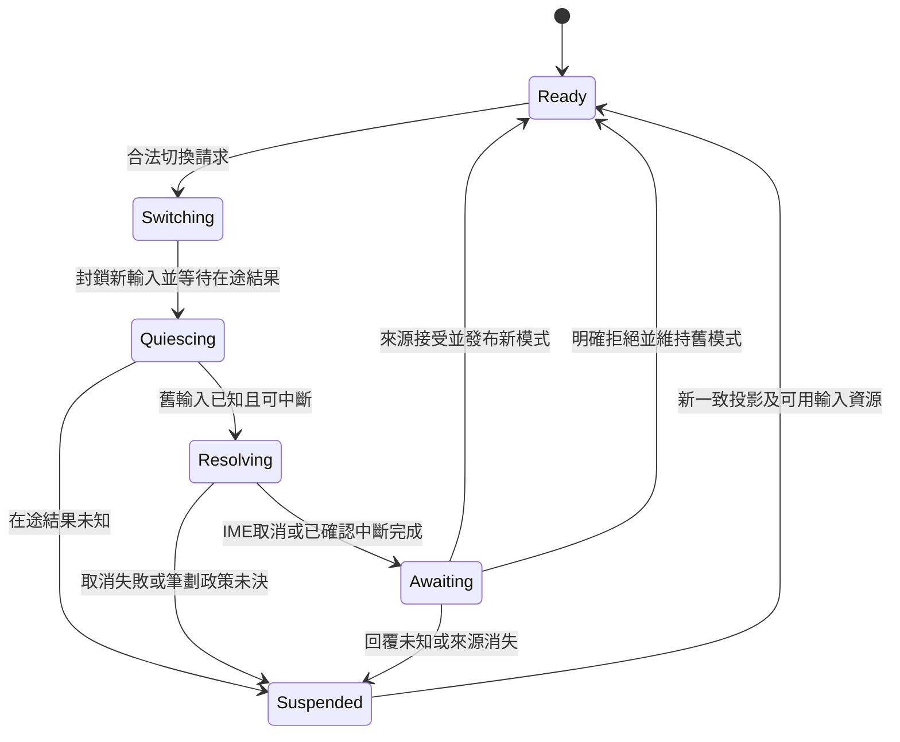

# K04：模式工具列與輸入排他契約

2026-09-11。使用者已授權 Kallopis／Krepis 完整筆記能力；本頁供下一實作切片使用，不再詢問是否開工。範圍依 [總計畫](note-components-plan.md)，手寫完整性依 [Concepts C01–C25](concepts-handwriting-spec.md)；K04 不能替代 K05 手寫交付。

狀態：模式／工具資料、同源插槽、操作 session、Flutter 輸入分流及 ABI 1.26 checked Flow 內容高度已通過相關協定驗證；可見工具列與視覺未定型。原生檢查不能代替完整模式操作與實機驗收。

獨立證據：K04 與 K01–K03 回歸及架構邊界 `+188 All tests passed!`，analyze `No issues found!`，真實 DLL provider／CJK 兩項 PASS，C ABI `100% tests passed out of 1`，均 exit 0。後續已知拒絕／目標撤銷的文字恢復路徑另有 `+13 All tests passed!` 補驗，exit 0；未知結果或關閉不恢復，也不偽造 accepted。最終 Windows debug 建置成功（`Built build\windows\x64\runner\Debug\kallopis_editor_native.exe`，exit 0）。未進行 UI／golden、實機 wheel 或鍵盤／讀屏切換驗收。

## 目標與最小範圍

工具列顯示權威確認的目前模式、目前工具及真實可用性；切換先中斷舊輸入，再由唯一來源確認後啟用新輸入。文字、手寫、導覽是互斥輸入用途，不是三份文件或三個 engine。

首個切片建立來源能力、註冊驗證、切換協定及文字中斷閉環；只有已有完整輸入處理、核心能力與資源生命週期的模式可標 enabled。手寫取樣／提交或導覽處理未接通時必須明示 unavailable，不以切換高亮、空 callback 或假筆跡宣稱模式可用。

不在此新增產品快捷鍵、工具列拖移、指筆自訂分工、內容墨色／筆寬選項或筆刷材質；這些仍保留完整範圍，但需各自契約與能力證據。

## 已查證現況與核心缺口

| 來源 | 現況／限制 |
|---|---|
| [Kallopis source](../../lib/src/capabilities/editing/internal/klp_editing_source.dart) | 已有 `KlpEditableSource`、K02／K03 可選能力與共用序號，K04 `KlpEditorModeSource` 已加入；仍從 enclosing editor 繼承，不注入第二來源。 |
| [輸入中斷](../../lib/src/capabilities/editing/internal/klp_editing_interaction.dart)、[Flutter editor](../../lib/src/rendering/flutter/internal/klp_flutter_editing.dart) | 已有 `KlpEditingInteraction.interrupt()`、綁定與中斷等待；須延伸模式用途排他，不能只把模式 button 改成 selected。 |
| [Krepis 正式標頭](D:/Projects/Krepis-m0-checked-save/include/krepis/krepis_c.h) | ABI 1.26 新增 checked Flow extent；既有 `KrepisInkBrush`、`KrepisInkRawSample`、ink capture 及 outline engine 不代表 Dart／手繪板已可用。 |
| [核心 Flow ink](D:/Projects/Krepis-m0-checked-save/src/flow_editor_ink.cpp) | begin／commit 在 composition 存在時拒絕；K05 已將新 brush 改為暫態、延至 commit 發布，後續仍缺 checked ink 輸入版本門。 |
| [Dart binding 目錄](D:/Projects/Krepis-m0-checked-save/bindings/dart/lib/src)、[Kallopis provider](D:/Projects/Krepis-m0-checked-save/bindings/kallopis/lib/src/krepis_kallopis_session.dart) | mode／tool 與 checked extent 接線已加入；ink 取樣、預覽、提交與釋放仍需補。既有 `_capture()` 是讀取投影，不是落筆 capture。 |

核心 begin／cancel／commit ink ABI 尚未接上 Kallopis 完整 stamp 原子核對；實作者需補穩定 owner、世代、版本及工具資格的原子入口，不能 Dart 先查再呼叫舊函式假裝原子。outline engine 只產生輪廓、不保存文件或在途 stroke，不可據此宣稱手寫生命週期已完成。

修正前唯讀核對發現：新 brush 在 begin 時寫入版本，cancel 不回滾。K05 已修正開始／明確取消的暫態隔離，相關核心測試通過；最新證據見 [K05 進度](handwriting-input-contract-plan.md)。現有 ink commit 仍沒有 expected input／frame，可能把舊 placement index 套用到較新的內容；後續必須補同一原子門與穩定目標。

## 規劃能力、typed slot 與註冊

`KlpEditorModeSource`、`KlpEditorModeProjection`、`KlpEditorModeRequest`、`KlpModeToolbar`、`KlpModeToolSlotChild` 已加入對應實驗入口，consumer 範例與限制見 [模式使用文件](../ai/editor-modes.md)。

`KlpEditingContent` 規劃增加單一 optional mode toolbar slot，僅接受 `KlpModeToolSlotChild`；首個本庫 `KlpModeToolbar` 只帶 id。mode／tool capability 從 enclosing editor **唯一來源繼承**；缺能力、孤立工具列、重複 slot child 或不合資格子項在組裝／安裝時拒絕。

工具項由來源註冊投影產生，不讓 consumer 另注入任意 Widget、style、painter、平台 pointer handler 或命令 callback。註冊提供者映射真實核心／平台能力；本庫控制合法用途及呈現，產品只選用已註冊功能。

| 資料 | 必要欄位與驗證 |
|---|---|
| 模式投影 | editor 完整 stamp、單調 mode revision、active mode ID、active tool ID、transition state；與目前文件／頁面／世代一致。 |
| 模式／工具註冊 | 非空唯一 ID、label、mode 所屬用途、工具所屬 mode、availability 及停用理由；能力集合不可用 label 或數字 index 作身分。 |
| 工具能力 | 所需 pointer 類別、核心操作、輸入通道支援及可用性；缺壓力／傾斜標缺席，不填入假量測。不把支援偵測等同啟用。 |
| 切換請求 | expected stamp、mode revision、目標 mode／tool ID、全 editor 共用序號；禁止任意字串執行器、外部座標或原生物件。 |
| 切換回覆 | accepted／rejected 與新權威投影，或明確 unknown requiring resync；只有 accepted 可改 active mode，不能用按下工具鈕先行改真實模式。 |

current tool 必須屬 active mode 且已註冊；重複 ID、未知 current tool、版本倒退或 capability 自相矛盾拒絕整份發布。模式被撤銷或工具失去能力時停止派新事件並要求新權威狀態，不默選另一支筆或模式。

## 切換順序與狀態



1. request 不立即改 active mode；先關閉新事件入口，等待 editor 單一在途操作明確完成。K01／K02／K03 與 K04 共用序號與排程，不為模式切換新增平行修改通道。
2. 使用者已確認：失焦、切頁及切模式取消尚未確認組字，保留已提交內容。呼叫既有 interrupt 並等核心確認、新 stamp；不能只清平台文字緩衝，也不能把正在接受的文字提交再重送。
3. 舊輸入確實停止且目標能力仍可用後，唯一來源確認 mode／tool，發布新 revision，再安裝／啟用相應 handler。任何部分失敗保持來源的最後一致狀態，不假稱切換成功。
4. 同 session 晚到回覆由原請求記錄；切頁／來源替換後不得修改新世代。未知結果先停止依賴其狀態的命令並 resync，不自行重試或偽造 rejected。關閉 toolbar 不等於已取消核心操作。

## 輸入排他及筆劃中斷界線

| 用途 | 可取得的事件／必須排除 |
|---|---|
| 文字 | 平台文字 delta、文字選取與有效鍵盤操作；不能同次 pointer 事件再開始 ink capture。 |
| 手寫 | 已啟用且註冊的筆／滑鼠取樣；相容滑鼠事件去重，不能將同一筆操作又當文字點擊或畫布拖曳。觸控／掌觸分工尚未確認。 |
| 導覽 | 已註冊的 pan／scroll／navigation handler；不改文字或提交筆跡，不以擁有 mode 名稱代替實際 viewport 能力。 |

一次手勢由單一處理者持有 pointer ID、generation 與操作開始時的 mode revision，直到已確認的完成／取消。不將中途晚到 move/up 轉送新工具；mode pending 時不能啟動第二處理者。資料時間與座標沿核心／平台既有契約，不新增換算第二來源。

**未決**：落筆期間切換工具／模式、失焦或裝置斷線，應提交、取消、延後還是拒絕切換。IME cancel 授權不自動擴張成筆劃 cancel。政策未定前不啟用可進入此未定路徑的正式手寫互動；可獨立完成資料契約與文字切換機制。墨色自由度、筆寬語意、工具變更是否作用未完成 stroke 亦不得自選。

## 風格、安裝及交付驗收

```text
KlpEditingContent 唯一來源 → mode/tool capability → typed toolbar slot → 本庫控制
完整 primitive → K04 semantic schema → resolution → bound style → 內部 renderer
mode intent → 同一在途排程 → 中斷舊handler → 權威確認 → 啟用唯一新handler
```

UI 沿既有 A 密度、控制14／18、Noto Sans TC 與工作區表面語意；本頁不新增工具列位置、圖示或幾何。selected 表示權威 active，pending 與 unavailable 各有獨立狀態；內容墨色是創作資料，不是 UI theme 覆寫。安裝資源借用 editor source，卸載解除 handler／訂閱，不釋放來源 engine。

- 先驗註冊／來源：缺 capability、錯 mode/tool、重複 ID、不同世代、能力撤銷明確拒絕，不把空 handler 標 enabled。
- 再驗切換協定：pending 排他、最後候選 IME 取消、已接受文字保留、部分失敗／未知結果、晚到回覆與來源替換；核對只有一條輸入路徑接收事件。
- 真核心驗 ink begin／commit／cancel 的版本與資源行為，再補合法樣本／preview／撤銷／保存重開；未接 Dart 與裝置前不得標手寫可用。
- 元件視覺定型後驗鍵盤與讀屏等價；Windows IME、手繪板通道、掌觸、延遲與筆劃中斷須按相應政策實機驗收，本次未執行測試。

回退只停用 K04 slot／能力註冊與新 handler，保留現有 K01–K03；錯誤時停在可重新同步的狀態，不以假 active mode 或重新排版掩蓋缺口。完整筆記、手寫及 Spatial 目標持續追蹤。

手寫後續實作依 [K05 輸入契約](handwriting-input-contract-plan.md)，不能直接啟用目前未核對版本的 legacy capture API。
