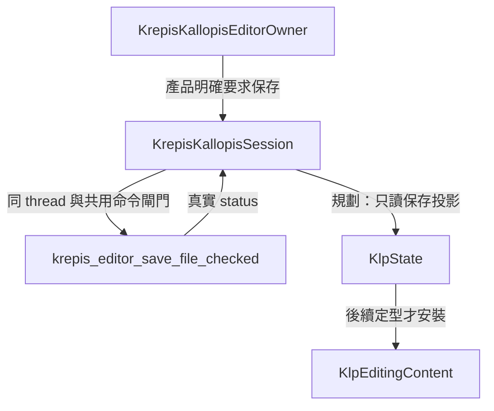

# K09：編輯器保存回饋契約

2026-09-12。保存協定、正式 owner 保存／重開及固定頂端保存操作已實作；協定與 owner 已經獨立覆核，可見操作通過局部 analyze、架構邊界與 Windows debug build，實機讀屏仍待驗收。完整 N01–N68／C01–C25／M01–M24 範圍仍依 [完整計畫](note-components-plan.md) 追蹤，不以本切片替代。

## 目標與範圍

發布可追溯至真實保存作業及內容版本的回饋；編輯交易成功不等於保存成功。首切片是同一 production owner 的 checked save、只讀狀態、明確重試及關閉協調，可獨立完成純協定與真 DLL 驗收。

不決定自動保存時機、debounce、目的地、另存／覆寫、衝突解決或關閉時是否必須保存；這些由產品政策提供。不新增未定型 UI、版面、Widget adapter 或 golden；不重建核心檔案格式與 fingerprint 模型。

## 方案與所有權

已實作的 `KlpEditingSaveSource implements KlpEditingSource` 提供 `KlpState<KlpEditingSaveProjection> get saveState` 與 `submitSave(KlpEditingSaveRequest)`，支援 save／retry 意圖；實作在既有 `KrepisKallopisSession`，由 provider 公開入口匯出。首切片為明確 manual owner command，owner 持有目的地與產品保存授權，consumer 節點不帶 path、engine、外部 callback 或任意 style。用法見 [保存與重開](../ai/editor-saving.md)。

保存投影最小欄位：`documentId/pageId/generation`（重用 editing session 身分）、單調 `stateRevision`、單調 `jobId`、`requestedContentRevision`、可空 `confirmedSavedContentRevision`、`phase: idle/saving/saved/failed`、可空錯誤分類、`outcomeKnown`、`retryAllowed`。revision 使用原有核心版本，不另計文件版本。時間文字不是排序依據；路徑与 fingerprint 不進 UI 投影。

idle 不代表已保存；以 initialText 新建的 owner 尚無成功保存證據，confirmedSavedContentRevision 為空。saved 只證明對應內容版本已保存；後續編輯令目前內容版本不同時須投影為 idle／尚未保存目前版本，保留歷史成功 revision。不把組字／selection／layout revision 變動當作內容髒污。

作業執行前，在同 owner thread、共用 busy／序號閘門內核對請求的 session 與 expected content revision，再讀核心版本並立即同步 checked save，期間不讓文字、區塊、模式等修改插入。active composition／ink capture 在首切片直接拒絕保存，不自行 cancel／commit 暫態輸入。這是首切片可用的版本一致性保證；若未來跨 isolate／非同步 snapshot 保存，必須先增核心 expected revision／receipt 契約，不能沿用此保證。UI 關閉或 state 通知不得使原生指標跨 thread 使用。

每次重試核發新 jobId；重複同一請求只回原結果，不寫第二次。只有目前 session／最新 job 可改可見 phase；舊完成只結清其原 job，不清除較新失敗。stateRevision 只排投影事件，不得用來猜保存結果。

## 失敗、重試與關閉

已知拒絕保留 confirmedSavedContentRevision，不改文件或 undo。衝突、來源遺失與不同目的地不設自動 retry；需要產品先處理，再以新作業明確要求。保存呼叫送出後的非成功／異常，若無法證明寫入邊界，outcomeKnown=false、retryAllowed=false；須先取得權威核對方案。現 ABI 沒有保存 job status/receipt，不能假造 resync 成功，也不能以重新 load 活文件覆蓋未保存編輯來核對。

retry 請求帶 expected stateRevision／failed jobId 及目前內容版本；只接受仍然適用且來源允許的失敗。重試保存哪個版本由新請求明示，不能把舊 job 的版本改成新值。同一保存 job 執行期間不排無界重試隊列。

close 先禁止新保存／重試，再等待已進入的同步保存及結果記錄結束，最後依既有 interaction 清理關 source／engine。畫面卸載只取消訂閱；不得假稱取消已落盤的保存。產品決定關閉是否要求最後保存；未提供政策時 owner 不默認觸發保存。結果未知須保留可供產品處理的終態摘要，不顯示 saved。手寫中斷仍依 K05 未決契約，不因保存或 close 推導 cancel／部分 commit。

## 分步實作與驗收

1. 在 Krepis Dart 補既有 checked-save FFI；沿既有 allocator／owner thread，不改核心持久化格式。真 DLL 驗新文件保存成功、既存目標拒絕、衝突不覆寫、來源遺失、Unicode path。重開驗證可由測試 harness 使用核心 load，不能冒称 production load 已交付。
2. Kallopis `capabilities/editing/internal` 增薄保存投影／request／source，從 provider 公開入口匯出；Krepis owner/session 實作版本核對、作業身分、只讀 state 與 close。純測試驗舊世代完成不更新新頁、舊成功不蓋新失敗、重複請求只保存一次、重試 job 前進、編輯後不沿用 saved、保存不改 undo／selection。
3. 故障注入覆蓋呼叫前配置失敗、呼叫後異常與 fingerprint 後置失敗；未知不能重送、誤報 saved 或宣稱檔案未變。關閉競爭驗 engine 釋放晚於保存執行及結果記錄；訂閱解除後不通知 UI。
4. 完成以上可稱「K09 保存協定／提供者切片」，不能稱完整 K09。實作後取得 Dart checks、真 DLL 與必要架構邊界證據；目前成果與限制見下節。

## 呈現與必要決策

目前不存在可直接使用的完整宣告式保存回饋節點。後續本庫可用封閉 text template，加合格保存回饋節點，從 enclosing editing 繼承唯一來源；consumer 只帶 id。重試 action、讀屏去重與 announce 時機、位置／尺寸／色彩仍須依既有設計定型流程落實，不自行拿舊 Widget 或外部 template style 逃生。此頁不新增布局或問卷。

root 接線前需確認產品能提供明確目的地及保存觸發；其餘自動保存／關閉保存／衝突解決保持產品責任。若要求失敗後普遍可重試，必須先補核心可查的保存結果或可證明的失敗分段，這是真缺口。若只要求明確保存成功／已知拒絕／未知保守回饋，現有同步 ABI 可交付首切片。

## 風險與回退

- 寫入後錯誤：以 outcomeKnown=false 偵測並禁止盲重試，不以一般 failure 掩蓋不確定性。
- 錯版本完成：以 session/job/stateRevision 核對；不向新頁發布舊結果。
- engine 過早釋放：close 與保存共用 owner lease；以競爭測試驗證。

回退僅停用新保存 capability／尚未交付的 UI，保留既有已保存文件及 K01–K04，不切換至無衝突保護的 legacy save。
