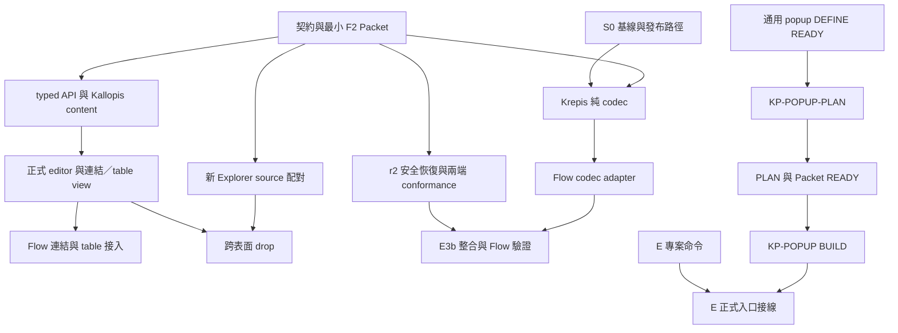

# Flow／Sidebar 前置能力：agent 分派計畫

更新：2026-09-15。狀態：使用者確認 F2 已完成；本任務的公開 Popup 已實作並整合主目錄，見 [交付紀錄](anchored-popup-delivery.md)。實作／審查由較低階 subagent 執行，必要測試由獨立 Test Author 保護。

本文件是跨 owner 的排程索引，不取代各 module 的 `architecture.md`、唯一 wire 契約或 executable Task Packet。依 [Flow 下一步](../../../planist/docs/planning/flow-next-steps.md) 接續既有成果；E、Flow 與其他格式 owner 維持原責任，表中的交接不代表已向其他 task 發出指令或改派所有權。

## 1. 目標與當前 stage

當前 stage：依 [POP-V1-r1](../../spec/anchored-popup.md) 交付的通用錨定 popup 已可從公開入口使用，供 E 接正式入口。F2 沿用原 owner 成果；不另起 codec／r2 實作者。

- 保留 F1、普通保存、`createBound`／attachment、唯一 binding／registry／bootstrap、commit receipt 與存活提交確認。
- 單一 table view／列順序已接受；popup 沿用既有預設外觀已接受，兩項均不重問。
- 不把純 codec 成功當成 editor round-trip、跨表面拖放或跨檔交易完成。
- 準備 worker 不修改產品／測試；通過依賴閘門後另派 BUILD。不重做 E 已完成成果，不把未保存內容損失政策當成技術 worker 的決定。

### 當前執行膠囊

- 授權：主 agent 指揮完成本計畫，子 agent 使用較低階模型。
- 已完成：`popup_build` 實作、`popup_review` 獨立驗證，均為 `gpt-5.6-sol`；`popup_consumer_docs` 以 `gpt-5.6-luna` 起草使用範例。主 agent 負責最終合併與核對。
- 主 agent：跨 module 契約裁決、保護測試要求、序列整合與公開交付；不由實作 worker 猜規格。
- F2 狀態由使用者本輪確認已完成，本任務未重作或重新驗收 F2。
- 已授權新 Krepis 樹 `D:/Projects/Krepis-kbf-flow-r2` 保留：準備基線 `46c2013`、精確來源匯入 `882376b`；11/11 hash 一致、analyze／scope 通過，原測試 8/9（舊 focus assertion；原 owner 的 `cb44000` 已有契約校正）。沒有在此樹另做 F2。
- 下一步：E owner 使用公開 Popup 接產品入口；原生手感依交付文件的人工項目接受。

來源：[Flow F-N1–4／F-G1–6](../../../planist/docs/planning/flow-next-steps.md)、[E 收尾](../../../planist/docs/planning/explorer-e-closeout.md)、[兩庫配對](blocknote-flow-pairing.md)。

## 2. 歷史盤點與原始分派（以下不作現行缺口或開工依據）

以下第 2 節起保留原始分派脈絡；其未完成狀態已可能被 F2 owner 與本次 Popup 交付取代。當前狀態只讀上方執行膠囊及各 owner 的最新交付。

| 項目 | 本次判定 | 下次負責角色 |
| --- | --- | --- |
| E 持久版本 binding／factory 配對 | Flow 與 E 現行文件均列已交付；兩庫舊計畫的「仍缺接線契約」需要逐條核對更新。正式 r2 reload 後整合仍待驗證 | A 契約協調 agent |
| r2 公開 API 與正式 editor | 配對文件是設計，不能 import 或當 runtime 證據 | Krepis／Kallopis 各實作 owner |
| Krepis 工作位置 | `Krepis-m0-checked-save/bindings/block_note` 目前有 architecture、plan、manifest、contracts，沒有 `lib`；manifest 明列尚未執行 S0 匯入。本次唯讀核對 11/11 來源 hash／bytes 相符，11 個 target 均不存在 | B 基線與發布 agent |
| Planist 實際依賴 | `frontend/pubspec.yaml` 指向 `../../Krepis/bindings/block_note`；指定唯一可寫樹則為 `Krepis-m0-checked-save` | B 提出可執行發布方案；Flow 不自行改 path |
| Explorer | EXP-V1-r2 已替換舊 API；KBF 的舊 `pageReferences`／`onMove` 配對不能直接沿用 | A 發出 workspace module 的重新 PLAN 子任務 |
| F2 | 尚無 executable Packet | A 與既有 Flow architecture owner 配對後發布 |
| `lockedWithEdits` | 已核對 `resumeCommitted` 目前限重載成功，`cancelOperationLock` 限未提交且未嘗試 reload；尚未明列 `saveLocked` 後的合法解鎖轉移，不能由 worker 猜方法或狀態 | A 配對 Krepis／Kallopis r2 契約 |
| `hostReplaced` | 能力層保留已取得快照與 blocked；重建及未取回記憶體內容的處理仍屬產品決策 | 產品／E owner |

## 3. 第一批：三個互不寫入對方範圍的準備任務

主 agent 保留一個協調席位；最多另開三個 agent。第一批 A／B／C 全部為 **report-only、`write_paths=[]`**：只讀指定輸入，回報給主 agent，不寫任何文件或產品。主架構 owner 依歸屬序列接回文件。任一任務完成即可依下游自己的門檻換席，不等待三項全部結束；C 不阻擋 S0／codec。

### A — 契約協調與最小 F2 Packet 準備

**目標：**將 F-G1／3／4／6 分成可獨立解除的契約依賴，讓純 codec 不等待完整 E3b。

**輸入：**Flow next steps、Flow architecture、binding／commit recovery 契約、KBF-WIRE-r2、KBF-PAIR-r2、EXP-V1-r2。

**工作與交付：**

1. M1：產出需求 → owner → 公開契約 → slice → 驗收層級的對照，校正已過時的 binding blocker；保留 reload／resume 整合尚待驗證的狀態。
2. M2：定義最小 F2 codec adapter slice 的精確檔案、Krepis API 版本、保護檔案及獨立測試輸入。基線尚未交付時標 `PACKET DRAFT`，不得填假 `base_revision`。
3. M2 同時列出兩個後續 PLAN 子任務：EXP-V1-r2 typed drag source 配對、`lockedWithEdits` 安全解鎖終點。各回 owning module 設計，不由 codec worker 補洞。Explorer 必須涵蓋完整森林／出現 ID／有限 draggable 能力、映射驗證、frame lease 失效，以及 database drop 與 Explorer drop 分流；不是把舊 `onMove` 改名為 `onDrop` 即完成。

**寫入界線：**report-only、`write_paths=[]`。Kallopis 共通配對及 module architecture 的正式更新由主架構 owner 序列整合。Planist 文件與產品由原 owner 接回，不讓 A 直接覆寫。Krepis 共通契約變更必須連同相應 module contract 一起配對，另發精確文件任務。

**驗收：**六個 F-G 均有唯一解除 owner；F2 codec 的 read／write／forbidden 邊界可核對；現有 factory、binding、registry、bootstrap 均受保護；未決 recovery 不阻擋無狀態純轉換。

### B — S0 基線與發布路徑準備

**目標：**解除 W0，提供能真正執行 scope gate 的基線與可追溯發布方式。

**輸入：**指定工作樹、S0 plan／manifest、manifest 列明的唯讀來源、各 repo 的 Git 狀態與實際 dependency path。

**工作與交付：**

1. M1：逐項核對 source hash、target 是否存在、Git base 與未提交變更歸屬，交付差異清單。
2. M2：提出保留全部既有工作、符合唯一可寫路徑與 clean isolated base 要求的 S0 方案；確有衝突時列出精確規則及最小需要授權的動作。
3. M2：交付發布矩陣：實作來源、公開套件入口、source／test hash、接收 owner、consumer 最終解析位置及接入驗證命令。

**寫入界線：**report-only、`write_paths=[]`；不在 `D:/Projects/Krepis` 或其他副本實作，不建立另一棵可寫筆記核心樹，不 reset／清檔／無差別 stage。正式 S0 必須另有 Packet，逐檔匯入且不得覆蓋漂移來源或既存 target。

**驗收：**S0 要用的來源全部可追溯；沒有把 dirty HEAD 當乾淨基線；沒有假設只改 Planist path 就能發布；任何需改唯一可寫規則的動作單獨列出，待具體方案可審查後才詢問。

### C — 通用錨定 popup DEFINE

**目標：**完成 SID-K-POPUP-01 的 DEFINE 與解除條件，供後續 PLAN／BUILD 交付 E 可用的公開組裝能力；DEFINE 完成不代表缺口已解除。

**輸入：**[popup 缺口](../../../planist/docs/planning/first-release-component-gaps.md)、workspace module architecture、現行宣告與合法組裝契約、既有 popup 預設外觀。

**工作與交付：**

1. M1：整理最小 DEFINE 的已接受需求：trigger、合法內容／角色／數量／巢狀限制、受控開關、動態錯誤／結果、關閉及焦點返回行為；尚缺產品行為明列，不將全庫 governance 的 open 項自動納入。
2. M2：交付 DEFINE 規格建議、接受證據、P1 缺項及 READY／NOT READY 判定；本任務到此結束。DEFINE READY 後另派 owning module 的 PLAN 任務，再依架構發布 Packet；C 不在同一任務續做 PLAN 或 BUILD。

**寫入界線：**report-only、`write_paths=[]`，只回報 popup DEFINE 結果；不寫 Planist 專案模板、業務操作排序或 storage。規格由主 owner 接回；後續 PLAN 與 BUILD 分別派工。

**驗收：**開關 popup 不改 Stage／Explorer selection；失敗資訊可更新；外觀沿用既有預設；無 consumer Widget、任意 renderer、局部 style 或未列明組裝。產品導航與成功／失敗處理仍由 E 擁有。

## 4. 第一個 BUILD 交付：S0 → Krepis 純 codec → Flow adapter

這是下一個交付單位，各角色只等自己的依賴：S0 等 B 與 S0 Packet；T／K-CODEC 等 A 的已接受契約、S0 與各自 Packet。popup C 可獨立續行，不是本鏈的前置。本文件本身不是開工 Packet。

| 次序／角色 | 結果與範圍 | 開工條件 | 完成證據 |
| --- | --- | --- | --- |
| S0 基線 worker | 僅匯入 manifest 列明的 module 檔案；既有測試逐位元組保留 | B 交出合規基線方案、正式 S0 Packet | source hash、原有局部測試／分析、scope；不聲稱 r2 能力完成 |
| T-CODEC 獨立 Test Author | 純 codec 的保存內容／block ID／輸入順序／跨專案拒絕測試 | A 的已接受 codec 契約、S0 基線 | 測試／fixture hash、明確失敗或待實作證據；不寫產品 |
| K-CODEC Krepis implementer | 實作並公開既定 reference codec；不操作 live session 或磁碟 | 測試凍結、S1 精確 Packet | 純轉換檢查與 exports 通過，scope 僅允許檔案 |
| V-CODEC 獨立 verifier | 從公開入口驗收交付 | K-CODEC 成果及凍結測試 | 親自執行命令／exit code、hash 與限制，不採用實作者轉述替代驗證 |
| F-CODEC 既有 Flow owner | `pln_flow_page_links.dart` 接既有 `PlnFlowPageLinkCodec`，呼叫正式 Krepis codec | API 已發布且 consumer 能解析；F2 最小 Packet、Flow 獨立測試 | 候選正文保留、順序與拒絕；不變更 session／保存回呼；將公開 adapter 交 E |

F-CODEC 寫入檔案是依現行 Flow 文件指定的候選，須由其 architecture owner 在 Packet 確認；本計畫不授權新增其他 Flow 檔案。純 codec 完成只解除 F-N2 的轉換部分。

## 5. 後續分派目錄與依賴

後續只列交付責任及進入條件，屆時才展開當前 slice 的精確 Packet。

| 任務／agent | 擁有的工作 | 前置及交接 |
| --- | --- | --- |
| K-API：Krepis typed/session | S2 typed page／database／result／projection 命令 | 使用唯一 wire，與 Kallopis editor 做 conformance；共享 controller／protocol／exports 需與 S1／S3 序列合併 |
| KP-CONTENT：Kallopis editing | content／bound／observer 的 typed 欄位與 callback | 公開 Krepis 型別就緒；projection 更新不得重開 editor，保留 asset／reference 回呼 |
| KP-EDITOR：Kallopis editor | custom blocks、table view、頁面投影、資料庫單交易編輯 | typed schema 已凍結；正式 bundle round-trip／單步 undo/redo 通過才交 Flow |
| KP-TRANSPORT：Kallopis rendering | typed bridge、WebView lifecycle 與 observer 配對 | features／wire 契約齊備；renderer 不另持正文或恢復狀態權威 |
| F-LINK／F-TABLE：既有 Flow owner | F-N2 連結 UI／開頁及 F-N3 table 命令接入 | 上述公開 API＋正式 editor 交付；保留 applied／unchanged／rejected／uncertain 差異 |
| KP-DRAG：Explorer／rendering 配對 | EXP-V1-r2 typed source、座標／target 解析 | A 完成新配對；E 提供頁面身分；單頁 drop 單次命令、不觸發 parent move |
| K-LOCK＋KP-BARRIER | Krepis S3 coordinator 與正式 editor barrier／reload／reconcile／outbox | 公開恢復終點已定義；兩端 conformance 與故障注入齊備；KP-EDITOR 共享檔案序列更新 |
| E-TX：既有 E owner | gate → save → 一致提交 → reload → 採用持久 revision → resume | codec＋r2＋receipt 公開交付；保留既有 binding／提交確認，完成跨 session 協調及失敗分支 |
| F-VERIFY：既有 Flow owner | F-N4 同 session 普通保存、外部提交後編輯與恢復配對 | E-TX 正式交付；區分 fake port、正式 editor、磁碟整合與人類接受 |
| E-COMMAND：既有 E owner | 立即建立「未命名專案」、允許重名、成功後切換；核對取消、保存失敗及載入失敗 | E 自行補 Task Packet 與必要獨立測試，可立即推進，不等 popup；失敗保護原專案、選取與未保存內容 |
| KP-POPUP-PLAN → KP-POPUP → E-ENTRY | owning module 先 PLAN，再實作通用 popup，E 接專案管理與各設定入口 | C 交 DEFINE READY 後才派 PLAN；PLAN／Packet READY 後派 BUILD；E 專案命令可先獨立完成 |
| E／Canva／資產 owner | 格式專屬 ID、引用重配、一致寫入及中斷恢復 | 各 owner 先發布共同契約，另開當前 stage PLAN |
| 產品／E owner | hostReplaced 重建及不可取回內容政策 | 先收到可取回／不可取回資料的具體案例、快照保存方式與可選恢復流程 |
| E-SHELL＋人工接受 | Sidebar 收合／重啟、入口／選取、專案切換與初始目的地完整流程 | 正式入口接線完成後由 E 交 deterministic 證據；原生 WebView／IME／拖曳／視覺手感交人類，保留 human-pending |

## 6. 並行限制與派工規則

- 同時最多主 agent＋三個子 agent；「三個席位」不代表三名 worker 可同寫一棵 dirty worktree。
- 第一批 A／B／C 均 report-only、`write_paths=[]`；共通規格、各 module architecture、根 export 與最終文件由指定 owner 序列整合。root 不把報告中的候選路徑自動當成 BUILD 白名單。
- 每個 BUILD Packet 僅擁有一個 module slice。`allowed_write` 使用精確檔案；架構、test、fixture、baseline、設定及相鄰 module 預設禁止寫入。
- Krepis S1／S2／S3 共享 protocol／controller／exports；Kallopis custom blocks／barrier 共享 `EditorApp.tsx`；content／Explorer／popup 可能共享 renderer／catalog 與 `lib/kallopis_declarative.dart`。先後接回並更新基準，不以檔案不同區段當成可安全並行。
- 獨立 Test Author 可與不依賴其結果的 PLAN 並行；同一 slice 必須先凍結測試再交 implementer。Verifier 使用 fresh context，獨立執行適當的局部檢查。
- 只由既有 owner 接回 Planist／其他格式模組；不另啟動競爭實作者。若需要改派，先列出 owner 與 write boundary 的具體變更。
- 程式使用 tab、顯示寬度 2，註解繁體中文；原生 WebView、IME、拖曳手感及視覺仍交人類接受。

## 7. 模型、估算與里程碑

工具清單可用模型包括 `gpt-6-astra`、`gpt-5.6-sol`、`gpt-5.6-terra`、`gpt-5.6-luna`、`gpt-5.5`。本次唯讀核對沿用主模型。後續建議契約協調／高風險 Test Author 使用 `gpt-6-astra`；bounded BUILD／read-back 使用 `gpt-5.6-sol`。模型可用性在真正派工時再核對。

以下為 cold-start 規劃範圍，`reference_task_ids=[]`；沒有可比較實績，不是交期或已量測用量。沿用本機 Windows、現行 Flutter/Dart 與本機檔案工具；不含等 owner、人工決策或環境修復。BUILD 精確 Packet 需將角色拆開重新估算。

| 第一批任務 | M1 累計預期 | M2 累計預期 | 超界處理 |
| --- | --- | --- | --- |
| A 契約／F2 準備 | 3k–6k tokens／20–45 分：缺口與 owner 對照 | 6k–12k／45–90 分：最小 Packet 草案及相鄰 PLAN 輸入 | 超上限回報缺少的契約；不擴張成全部 F2 實作 |
| B 基線／發布準備 | 2k–4k／15–30 分：manifest／Git 差異清單 | 4k–8k／30–60 分：S0 與發布矩陣 | source 漂移立即回報；不清除資料求過關 |
| C popup DEFINE | 3k–5k／20–40 分：需求與未決行為 | 5k–8k／40–60 分：DEFINE 建議、接受證據與 READY 判定 | 有 P1 open 就交 DEFINE 缺口，不自行編外觀；不續做 PLAN |

Krepis 舊 S0／S1 估算分別為 3k–6k／20–45 分、8k–16k／1–2 小時，包含原計畫的測試與實作工作量，僅作下一 Packet 的參考，見 [KBF PLAN](../../../Krepis-m0-checked-save/bindings/block_note/plan.md)。Flow 原 F2 的 10k–25k／2–5 小時不含上游補庫與 E3b，不拿來估整條鏈。

每次里程碑回報：任務 ID、結果、changed paths、來源或命令／exit code、測試 hash、實際時間／可取得的 token 用量、偏差、下一步。工具沒有 token 量測時寫「不可用」。同一可重現錯誤修復兩次仍失敗即附軌跡升級，不改測試要求。

## 8. 驗收與風險

| 風險 | 偵測訊號 | 處理 |
| --- | --- | --- |
| 文件與實際發布來源不同 | public symbol 缺失、hash 漂移、consumer 解析到另一棵樹 | B／Verifier 阻止宣告 ready，交 owner 發布；保留原 F1 |
| 多 owner 寫入碰撞或套用舊 Packet | scope 含非本 slice 檔案、architecture revision 不符 | 停該 slice，由主 owner 重核基準與邊界；不 reset 或覆蓋 |
| 重載／恢復把新輸入覆蓋 | late event、ack 遺失、lockedWithEdits／hostReplaced | 保留 blocked 與快照；走已接受的公開恢復終點，未定義分支不重建或清 dirty |

整體回退：保持既有普通保存路徑；未通過 conformance 的新入口不啟用。已提交資料不以回滾檔案或降版正文處理。

本計畫驗收條件：

- F-G1–6、popup 與 E 自有工作都有責任和交接點。
- codec、連結 UI、table、drop、恢復分別有門檻；未以單層證據替代整合。
- 第一批任務有目標、輸入、寫入界線、里程碑、估算與回報方式。
- 不重做已完成 binding／F1，不擅自改 dependency path 或產品資料損失政策。
- 所有 BUILD 維持 Packet／基線／獨立測試閘門；後續 slice 只列目錄。

目前已知的待裁決有兩類：B 證明現有規則下無法建立基線後提出的具體環境授權，以及產品／E 提供具體案例後的 hostReplaced 政策。若 C 查出其他尚未接受的 P1 行為，須附具體衝突及選項再交 DEFINE 裁決；既有預設外觀不重問。其餘已接受且契約內的可逆工作由 owner 自行完成。

## 9. 本次證據

- 已讀 Flow 最新任務與 E 收尾文件；未重跑其中歷次測試，歷次數量不相加。
- 已讀 KBF／EXP 公開配對與 Packet schema，確認新 Packet 要求 clean isolated `base_revision`。
- Kallopis 工作樹已有大量未提交變更；本次只新增此分派計畫，不把既有變更列為本次成果。
- 獨立唯讀 agent `audit_r2`：S0 manifest 11/11 source SHA-256／bytes 相符、11 target 不存在；唯一可寫樹 HEAD 為 `7ab045eed2456ada6f1869456a1c609ba141ca08` 且含既有變更。來源：[S0 manifest](../../../Krepis-m0-checked-save/bindings/block_note/baseline-manifest.json:10)、[S0 準備要求](../../../Krepis-m0-checked-save/bindings/block_note/plan.md:50)。此為 agent 親自執行的檔案核對，不是產品測試。
- `audit_r2` 確認解鎖契約缺口，來源：[operation API](../../../Krepis-m0-checked-save/bindings/block_note/architecture.md:101)、[reconcile wire](../../../Krepis-m0-checked-save/bindings/block_note/contracts/flow-protocol.md:155)。
- 獨立唯讀 agent `audit_consumers`：核對 factory 唯一 persist 指向 `persistence.persist`、F2 缺 Packet、新 Explorer 的 drop／lease 邊界及 popup 尚未有 module slice；本計畫據此列出保護範圍。
- 獨立 reviewer `review_dispatch` 發現三項分派問題：無關 popup 被誤列為 codec 總閘門、C 混合 DEFINE／PLAN、第一批回報寫入界線不夠明確。已改為依個別依賴換席、C 只做 DEFINE、A／B／C 全部 report-only；定向回讀確認三項正文修正。回讀另指出圖中的 popup gate 及 C 目標用語仍須同步，主 agent 已依建議補齊。
- 本地 Markdown 引用 10/10 目標存在；runtime／產品驗收不在本輪，未新增或執行產品測試。
