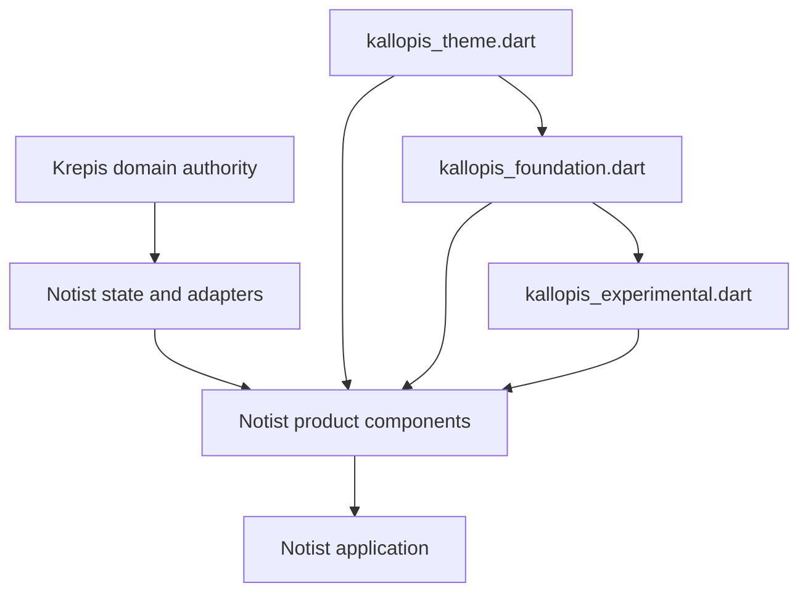
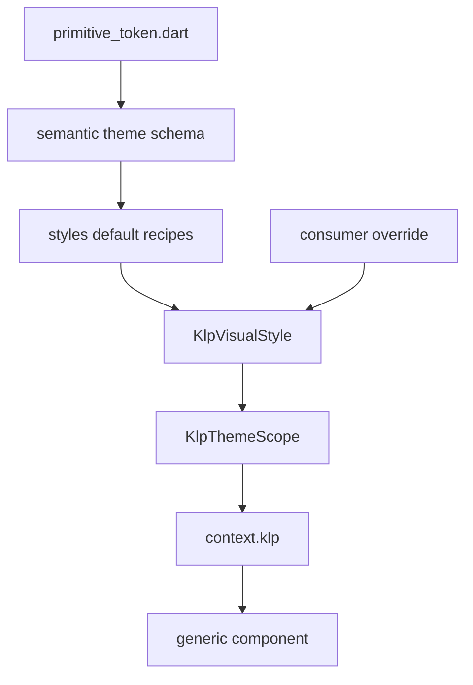

# Kallopis 前端架構契約

本文件提供給維護 Kallopis、Notist 或其他 `-ist` 產品的開發者與 agent。讀完後應能判斷程式應放在哪個倉庫、透過哪個公開入口引用，以及變更 theme、environment 或 l10n 時必須保留哪些傳遞關係。本文件是規範；[架構圖集](README.md) 只描述目前原始碼。

## 目標

- Kallopis 提供跨產品共用、沒有產品語意的視覺與互動能力。
- Notist 擁有筆記產品的畫面組合、呈現模型與工作流程。
- Krepis 擁有筆記資料、編輯交易、selection、undo、layout 與 persistence 的真相。
- 風格、執行環境與語系都從組合根透過 `BuildContext` 傳遞，避免可變 singleton。
- 公開 API 依穩定度分流，讓消費端知道相容承諾。

## 架構總覽



依賴方向只能沿箭頭前進。Kallopis 不得引用 Notist 或 Krepis 的領域型別；Notist 不得在 Flutter 層複製 Krepis 的資料權威。

## 模組責任

| 模組 | 責任 | 不負責 |
|---|---|---|
| `lib/src/tokens/` | 不可覆寫的 primitive token | semantic 用途、元件布局、產品狀態 |
| `lib/src/theme/` | semantic schema、風格合併、JSON 解析與 context 注入 | 平台與視窗狀態 |
| `lib/src/styles/` | Kallopis 出貨的預設 recipe | 消費端品牌或產品規則 |
| `lib/src/app/` | app 組合根、theme／environment／l10n 接線 | 筆記、提案或保存領域模型 |
| 通用元件目錄 | 只接收呈現資料與 callback 的視覺、布局及通用互動 | repository、transaction、產品工作流程 |
| Notist `lib/src/components/note/` | 筆記呈現元件與產品組合 | Krepis 內部狀態的第二份副本 |

### Token 與風格

`primitive_token.dart` 只保存不可被消費端覆寫的原始色階、距離與線寬。`lib/src/theme/` 下的各 theme 模型把 primitive 值命名成用途；預設 recipe 提供 semantic theme 的預設實例。元件只能讀 semantic 值，不得直接讀 primitive，也不得自行保存另一份預設值。Kallopis 不再提供 `semantic_token.dart` 轉接入口。

App 標題、Header 主標題與 Status 文字分別使用 `KlpTextRole.appTitle`、`KlpTextRole.header`、`KlpTextRole.status`。三者的拉丁字元預設解析至 IBM Plex Mono，中文字元 fallback 至套件內的 Noto Sans TC；App Title 與 Status 使用 500，Header 使用 600，並保留各自的字級與行高。Chrome 元件不得以 `label`、`code` 或 `bodyStrong` 代替這三個責任角色。



### Theme、environment 與 l10n 傳遞

`KlpApp` 是預設組合根。它分別注入視覺風格與平台環境；兩者不得合併成同一個可變全域狀態。

- Theme：`KlpVisualStyle` 經 `KlpThemeScope` 傳給 `context.klp`。明暗風格須保留消費端注入值。
- Environment：平台由 `KlpEnvironmentScope` 傳給 `context.klpPlatform`。只有 `lib/src/app/klp_platform_info.dart` 可以讀取 `defaultTargetPlatform`；元件不得改讀 `Theme.of(context).platform` 或 `dart:io Platform.is*`。既有 standalone 視窗元件暫由 `lib/src/shell/window/internal/klp_window_platform.dart` 在 Scope 缺失時相容 Material theme，而且必須先嘗試 Scope；這是單一、可移除的相容接點，不得新增第二處。
- Layout：視窗尺寸與父層限制直接讀 `MediaQuery`／`LayoutBuilder`，不複製進 `KlpEnvironmentScope`。
- L10n：語系直接讀 Flutter `Localizations`。同一資源型別採第一個支援的 delegate，因此消費端 delegate 必須排在 Kallopis 預設 delegate 前面。

## 公開 API 分級

| 入口 | 等級 | 規則 |
|---|---|---|
| `lib/kallopis.dart` | 相容總入口 | 保留既有消費端相容；新程式應優先使用職責入口 |
| `lib/kallopis_theme.dart` | Stable | theme、token 建立、JSON 與必要的 theme context API |
| `lib/kallopis_foundation.dart` | Stable | 已承諾相容的通用元件、布局與互動 |
| `lib/kallopis_experimental.dart` | Experimental | 高階 pattern；版本間可以調整，消費端必須自行承擔遷移 |
| `lib/src/` | Private | 任何外部倉庫都不得 import 或 export |

`kallopis_theme.dart` 與 `kallopis_foundation.dart` 不得 export experimental 入口或其專屬實作。Experimental 能力升為 Stable 時，必須先收斂命名與契約、補齊文件和測試，再由對應 Stable 入口明確 export。

## 跨倉邊界

| 能力 | Kallopis | Notist | Krepis |
|---|---|---|---|
| 色彩、間距、字體、元件視覺 | Authority | 消費與覆寫 semantic style | 不依賴 Flutter 視覺 |
| 通用布局與 adaptive 選擇 | Authority | 組合產品畫面 | 無 |
| Note／Block／Ink 呈現 | 提供通用視覺積木 | Authority | 提供真實資料與編輯結果 |
| Requirement／Proposal／保存狀態 | 提供無語意 feedback 元件 | Authority | 僅在核心契約需要時提供領域資料 |
| Selection／transaction／undo／persistence | 無 | 轉接並投影 | Authority |

## 禁止事項

- 不得在 Kallopis 新增 `note` 產品目錄、`KlpNote*` 公開型別或 Requirement／Proposal 領域型別。
- 不得讓 Kallopis 元件直接依賴 Notist、Krepis、repository 或 persistence。
- 不得從 Kallopis stable 入口重新匯出 experimental API。
- 不得讓外部專案引用 `package:kallopis/src/...`。
- 不得在元件內繞過 `KlpEnvironmentScope` 判斷平台。
- 不得把 `MediaQuery`、`Localizations` 或短生命週期互動狀態複製進 environment。
- 不得新增可變 singleton 作為 theme、environment 或 l10n 的第二個來源。

## 變更流程

1. 先依跨倉邊界判定 authority；若只有單一產品需要，放在產品倉庫。
2. 選擇 Stable 或 Experimental，並只從對應公開入口 export。
3. 若改動資料契約，先更新提供者，再更新消費端；不得在消費端臨時複製模型。
4. 同一批更新文件與守門測試；禁止以擴大 allowlist 或提高 baseline 取代修正。
5. 執行受影響測試、完整 analyze，以及兩個倉庫的架構邊界測試。
6. 視覺或布局有變化時，依專案規範完成 Windows 實機執行與截圖驗收。

## 驗收

Kallopis：

```powershell
D:\flutter\bin\flutter.bat test test/frontend_architecture_boundary_test.dart
D:\flutter\bin\flutter.bat analyze
```

Notist：

```powershell
D:\flutter\bin\flutter.bat test test/frontend_architecture_boundary_test.dart
D:\flutter\bin\flutter.bat analyze
```

架構變更完成時還必須確認：產品模型只存在 authority 倉庫、消費端只使用公開入口、theme／environment／l10n 各有單一傳遞來源、Stable 入口沒有反向依賴 Experimental。
