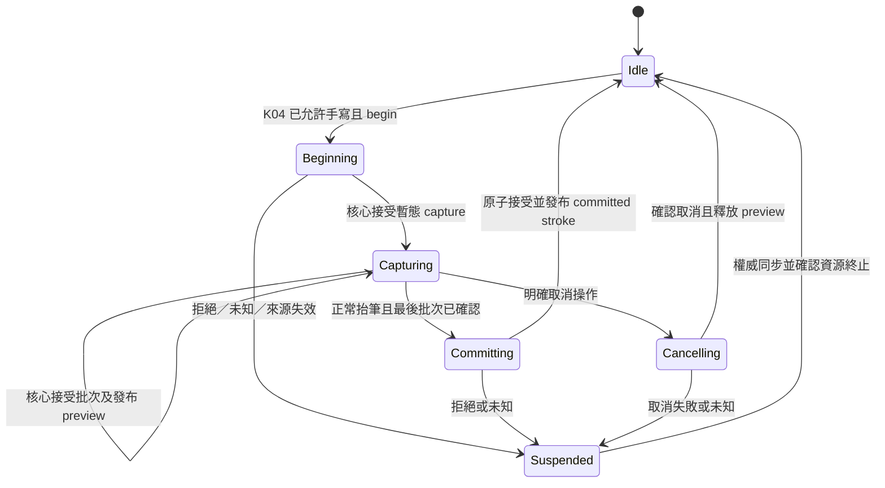

# K05：手寫取樣、預覽與權威提交契約

2026-09-11。使用者已授權完整筆記、手寫與 Spatial 能力；本頁是 [Concepts C01–C25](concepts-handwriting-spec.md) 與 [K04 模式契約](editor-mode-contract-plan.md) 的下一實作切片，不縮減完整目標。讀者為 Kallopis／Krepis 實作者，新 API、平台接線與視覺均未完成。

目前進度：核心 begin／explicit cancel 的暫態 brush 隔離已實作，新 brush 延至 stroke／placement／history 同一交易發布；相同樣式的並行 capture 若已被另一筆發布，第二次 commit 明確回 `revision_conflict`，保留 explicit cancel。隔離階段四項既有 ink 測試已由實作者與 root 分別驗證通過（capture、C ABI、Flow 顯示、capture undo；`100% tests passed out of 4`，exit 0）。後續 checked ink ABI、核心樣本／預覽與 Dart 綁定的證據見下節；Kallopis 提供者接線、平台輸入與手寫 UI 尚未交付。

共用交易補驗：`ink_apply_brush`、`ink_undo_history`、`ink_command_undo` 三項通過。`ink_brush_interner` 的本輪新建 exe 被 Windows 應用程式控制政策阻止啟動，CTest 報 `BAD_COMMAND`／exit 8，未進入測試內容；該項仍未驗證，不能算通過，也未繞過主機政策。此次四目標建置本身 exit 0。

## 目標與範圍

將真實 pointer 樣本經單一座標轉換送入核心暫態 capture，以同一核心幾何產生預覽，最後原子提交完整筆劃與必要筆刷；取消開始中的筆劃不得意外改動已提交內容、選取或撤銷歷史。

首個切片完成已註冊基本工具的 begin／samples／preview／checked commit／explicit cancel 與資源釋放。切割、遮罩、套索、圖層、精準輔助、匯入匯出維持 Concepts 後續清單；本頁不新增 UI 幾何、工具位置、筆寬／墨色選項或平台手勢政策。

**尚待使用者回答**：未完成筆劃切工具／模式、失焦或裝置斷線，取消整筆或提交目前部分。不得自行採用任一選項；IME 的已確認取消政策只適用組字，不等於手寫政策。

## 修正前證據與後續缺口

| 已查證來源 | 修正前行為與實作要求；目前進度以上方為準 |
|---|---|
| [正式標頭](D:/Projects/Krepis-m0-checked-save/include/krepis/krepis_c.h) 660–680 行 | 現有 begin／cancel／commit ink capture，沒有 update；commit 接 owner ID 但 placement 仍是 index，沒有完整 InputStamp／frame 閘門。新路徑需 checked ABI。 |
| [flow_editor_ink.cpp](D:/Projects/Krepis-m0-checked-save/src/flow_editor_ink.cpp) 14–30 行 | begin 新筆刷可直接更新 content revision 與選取的 base revision；不符合「只開始預覽，不改已提交內容」的新契約。 |
| [ink_stroke_capture.cpp](D:/Projects/Krepis-m0-checked-save/src/ink_stroke_capture.cpp) 45–50 行、[C capture](D:/Projects/Krepis-m0-checked-save/src/krepis_c_ink_capture.cpp) 99–110 行 | cancel 只標記 capture 狀態並移除 handle，不回滾已建立筆刷，也不保證 undo／文件完整不變；不得把現有 cancel 成功當新契約通過。 |
| [capture 測試](D:/Projects/Krepis-m0-checked-save/tests/ink_stroke_capture_test.cpp)、[ABI 測試](D:/Projects/Krepis-m0-checked-save/tests/ink_capture_c_abi_test.c)、[undo 測試](D:/Projects/Krepis-m0-checked-save/tests/ink_capture_undo_test.cpp) | 本輪已擴充開始／取消不發布、新／既有 brush、同 style 並行拒絕與新 brush 同次 undo／redo。未因此推定樣本緩衝、完整資源故障注入或手寫裝置驗收已完成。 |

核心必須讓新 brush record 暫存在 capture，直到 checked commit 才與 stroke／placement／history 一次發布；或提供可證明完全等價的保證。不能以 begin 提交筆刷後 cancel 再補一筆刪除交易達成，因可觀察 revision、undo、保存內容已改變。

## 唯一來源、能力與資料

### Checked ABI 接續實作

ABI 1.27 核心及 Dart 綁定已實作。原生 capture、C ABI、capture undo、Flow 顯示四項測試通過（`100% tests passed out of 4`）；root 獨立重跑 `krepis.ink_capture_c_abi` 通過（`100% tests passed out of 1`，exit 0）。Dart 獨立分析為 `No issues found!`，純契約工具與真 DLL 工具均通過；release 配置失敗修正後，真 DLL 工具再由獨立審查者執行通過（exit 0）。這些證據不代表 Kallopis 平台手寫體驗已完成。核心負責以下單一契約：

- 獨立 checked capture handle 與 registry，舊 begin／commit／cancel 不可操作新 handle。
- begin 凍結完整輸入版本、來源／pointer 身分、owner 與雙側穩定筆劃錨點，以及 frame、font／style、viewport／scroll、transform；提交時在核心內解析仍相鄰的錨點。
- append 與核心 preview 不重新發布 committed frame。同環境重繪可相容，但字型、風格或 viewport 改變仍拒絕舊座標，不能只核 content revision。
- 每 capture 最多 4096 樣本及對應批次收據，重送依已接受樣本片段核對；同序號不同內容、亂序拒絕。容量滿時轉為 overloaded，不寫入超量批次且禁止 normal commit，避免默默截短筆劃；可明確取消。
- 每 engine 最多 16 active captures、64 terminal receipts；開始時預留結果容量，或在修改前保證可記錄結果，不能先修改再丟失回覆。完成／取消釋放大量暫態資源，terminal receipt 由明確 release 確認釋放；不淘汰尚未確認的結果。
- status 可在文件版本已過期時查結果；cancel 以原凍結身分清理，不要求新文件仍匹配。commit 重送不再新增筆劃。

容量只由核心定義與回覆，Dart／Kallopis 不另存一套上限。既有 RawSample 對裝置通道缺席的表達仍待後續補足，本批不啟用正式手寫 handler。

Dart 實作入口為 Krepis 的 `bindings/dart/lib/src/krepis_checked_ink.dart`、`krepis_checked_ink_native.dart`、`krepis_checked_ink_executor.dart`，經 `krepis_native.dart` 匯出。`KrepisCheckedInkExecutor`／`KrepisCheckedInkSession` 供原生提供者使用，不是 consumer 結構樹節點。驗證工具為 `bindings/dart/tool/checked_ink_contract_checks.dart` 及 `verify_checked_ink_windows.dart`；後者通過高位 handle、完整 context、預覽、上限、終態、legacy 隔離及配置清理。release 送出前配置失敗保留 session；未知結果只允許權威查詢，沒有無證據丟棄 handle 的入口。

此批驗收須包含下列邊界；未取得測試證據前不視為完成：

- 兩個 engine 使用相同來源身分及 pointer 時，彼此的 capture handle 仍不可互用。審查發現的逐 engine 編號碰撞已改為 process-wide 原子 issuer；雙 engine、identity 錯配、16 active／64 active 加 terminal 容量、release 回收及 canceled／overloaded status 已加入 C ABI 測試。修正後四項原生測試通過，root 獨立 C ABI 重驗通過（exit 0）；並補 checked structs 的大小及關鍵位移斷言。
- begin 的 frame token 正確但 viewport／scroll 不符時，拒絕建立 capture。
- 批次中後段樣本非法或配置失敗時，已接受樣本、序號、預覽及收據保持原值；候選資料完整成功後才發布。
- terminal receipts 接近上限且仍有 active captures 時，結果容量仍有預留；完成交易不會遺失可查詢結果。
- 單批超量與累計超量都不能留下可提交的截短筆劃；完成／取消須釋放緩衝容量，不能僅清除元素數量。
- Dart release 在配置失敗、尚未呼叫核心時，不能丟棄本地 handle 並使核心 receipt 無法清理。結果未知時須保留查詢能力；一般拒絕不等於紀錄不存在，不能據此宣稱已釋放。

以下名稱均為**規劃 API**：`KlpHandwritingSource`、`KlpInkCaptureRequest`、`KlpInkSampleBatch`、`KlpInkPreview`、`KlpInkCaptureReply`。實作前依既有來源及編號契約收斂，不假稱已公開。

### 提供者接線前置缺口

暫態資料切片已實作：`KlpHandwritingState`、`KlpHandwritingCaptureIdentity`、`KlpHandwritingStateSource` 及 `KlpHandwritingStatePublisher`。使用格式見 [AI 手寫暫態資料](../ai/handwriting-state.md)。獨立批次涵蓋手寫協定、既有 drawing 與架構邊界，`+164: All tests passed!`（exit 0），靜態分析 `No issues found!`。同筆容量固定、版本／收據單調、unknown 不繞過 overload、終態與晚到事件限制均已驗證；尚未接上 Krepis 提供者或 renderer。

已查證：`KlpEditingSource` 要求同 stamp 重播同一不可變 drawing；因此 append 不得把 preview 塞回新 drawing 並沿用舊 stamp。已新增 `KlpHandwritingStateSource` 提供 `inkState`／非同步 broadcast `inkStates`，暫態快照綁定凍結 drawing reference、capture ID、批次收據序號及 preview revision。這仍是 enclosing editor 的同一來源，不是消費端另注入第二個 source；含修改請求的完整手寫能力仍待接線。

`KrepisKallopisSession` 現有 `_busy` 只涵蓋單次原生呼叫。手寫需另有跨 begin 到終態清理的 capture lease，與既有 editor issuer 共用協調器，期間不得讓文字、區塊、命令或模式修改穿過。editor 命令 sequence 與每 capture 的 batch sequence 分別驗證，不能混為一個序號。

目前 ABI 1.27 接受 caller 提供 owner／雙側筆劃 anchor／transform／capture width，但沒有完整的 checked ink target 查詢；既有文字命中、scene 及 block controls 不提供 overlay 相鄰筆劃與 owner-local 映射。因此不能以空 overlay anchor 或前端推算矩形補出正式 begin adapter。

下一個核心查詢須在同一讀取門內，從完整 rendered context、落筆位置及明確 placement intent 回傳合法 target、雙側穩定錨點與座標環境；begin 再驗證 query 後是否失效。筆跡附著區塊或整頁的選擇尚待使用者回答，不能先假定；註冊工具的筆刷配置及缺通道編碼也需補齊。可獨立推進暫態快照與 lease 機制，但不得宣稱真實落筆已接通。

K05 能力由 enclosing `KlpEditingContent` 的唯一來源繼承，沿 K04 已註冊 tool／mode；不得另傳 engine、source、pointer callback、Widget、Path 或任意 painter。若需新增合格手寫內容／裝飾 slot，由本庫 definition 明確限定資格與數量，控制節點只帶 id，不開第二種組裝入口。

| 模型 | 必要欄位／限制 |
|---|---|
| capture 身分 | document／page／session generation、完整 input stamp、mode／tool revision、來源核發 capture ID、穩定 owner ID；handle 不跨 editor 重用。 |
| begin 請求 | 目前 tool ID、穩定內容錨點、對應 frame／layout／viewport／transform 識別；核心同一原子門核對組字已結束、工具可用、owner 存在及可寫。 |
| 樣本 | capture ID、批次序號、pointer ID／裝置類別、單調時間、明確座標空間、位置與壓力／傾斜等各通道的可用旗標；不以零值冒充不存在的量測。 |
| preview | capture ID、已接受樣本尾序號、preview revision、核心幾何與同一 transform；純暫態，不併入 committed drawing、文件順序或保存快照。 |
| commit 請求 | capture ID、完整 expected stamp、最後接受樣本序號、穩定 owner／相對 stable anchor、已確認 placement transform；不提交晚到 index。 |
| 回覆 | accepted／rejected 與一致投影、capture 狀態；未知結果需 resync，不重送。commit 接受後才有正式 stroke ID／history，保存成功另由保存系統表示。 |

placement 的 stable anchor 必須在核心原子門內解析，再執行提交；目標被刪除、移動致條件失效、鎖定或 frame 過期時整筆拒絕。不因 index 仍合法就將筆跡插入別的位置；是否可 rebase 另定，首切片不得自動重定位。

## 樣本、座標與暫態預覽

- 平台只收集真實事件及其通道支援；DPI／screen→viewport 只在平台邊界換算，viewport→內容使用該手勢已核對的核心反變換。取樣、preview、命中、commit 必須同一座標契約。
- 核心既有 RawSample 與 9-byte 編碼有量化限制，提供者必須明示轉換／範圍／捨入／缺通道表達；非有限、非法範圍、亂序與錯 capture 樣本拒絕，不靜默夾值或猜壓力。
- 樣本批次採有界緩衝及明確背壓；容量與耗盡回覆須在實作時定義並測試，不能無界累積，也不能悄悄丟掉真實點後宣稱完整筆劃。預測樣本若未建立獨立契約，不納入首版。
- ABI 1.27 已新增核心暫態 append／preview 接點；提供者接線仍須確認尾序號及預覽版本後才重播幾何。不得在 Kallopis 複製一套平滑、壓感或筆刷輪廓算法。
- preview 使用封閉中立幾何，樣本權威與筆刷計算仍在核心。切 viewport／重排使 transform 失效時暫停舊座標輸入；重新取得一致狀態前不能縮放舊 preview 假裝已正確換算。

## 排他、在途與結束協定



K01–K05 共用 editor 序號與單一在途閘門；capture 活躍期間，文字／區塊／命令修改及模式切換必須走同一協調器，不得平行改文件。相容滑鼠事件去重，同一 pointer 手勢不能同時落筆與選字／pan；掌觸及筆指分工保留 K04 未決條件。

正常 up 只在全部已接受樣本可識別時發一次 checked commit；重複 up、重送批次或同序號請求不能產生第二筆。未知結果先查 capture／操作結果，禁止自動重試。關閉 UI 不省略核心終止與資源釋放；晚到回覆只回原世代記錄，不更新新頁。

explicit cancel 不生成 stroke、不增加 content revision、不改已提交 brush 集合、選取、undo／redo 或保存快照；應釋放樣本、preview 與暫態 brush，保留可查詢的 terminal receipt，收到明確 release 後才釋放 handle 記錄。已成功 commit 不能再 cancel 冒充撤銷，必須走核心 undo。重用既有 brush 的取消也不得刪除此 brush。

筆劃中切工具／模式、失焦或斷線在使用者回答前保留為未決中斷路徑，不自動套 cancel 或部分 commit。可先驗明確取消與正常 up；不能把未解的中斷包成空 callback 後宣稱正式手寫可用。

## 風格與分步驗收

```text
editor 唯一來源／K04 tool → K05 capture → 真實樣本 → 核心暫態幾何 → 中立 preview
完整 primitive → 手寫呈現 semantic → bound style → 本庫 renderer
checked commit → 同一核心交易的 brush＋stroke＋placement＋history → 一致 committed 投影
```

沿既有 A 密度、Noto 與 Stage 風格，不新增控制幾何。內容墨色、筆寬、材質、超界裁切與筆劃中斷仍未定型；幾何可重播不代表筆刷外觀已核准。產品只供資料及產品保存政策，不得透過內容色彩入口修改元件 theme。

1. 核心先修 begin／cancel 隔離，再補 checked ABI、stable placement 與樣本／preview；以新舊 brush、空 capture、配置故障、重複取消驗 committed snapshot、content revision、selection、undo／redo、資源計數不變或回到基線。
2. 真 ABI 驗 begin 前後並無已提交內容改變；取消後保存重開無孤立 brush；commit 只產生一次完整結果，undo 移除同次新 brush／stroke 而不刪原有共用 brush，redo 恢復；失敗無半成品。
3. 提供者驗跨 session、舊 frame、目標刪除／重排、錯 tool、亂序批次、未知 commit、late reply、完整回讀失敗與資源清理；故障後不能把舊 placement index 套到新文件。
4. Kallopis 驗唯一來源、能力缺失拒絕、單一手勢擁有者、座標一致、preview 清理與背壓；裝置實測記錄 OS／手繪板／驅動、真實通道、延遲及已確認中斷政策。未定型前不新增 UI／golden，本次不跑測試。

回退只停用未完成 K05 能力與 handler，保留已提交文件及 K01–K04；不得以舊 capture API 或假預覽冒充交付。完整 C01–C25 與筆記／Spatial 目標仍持續追蹤。
