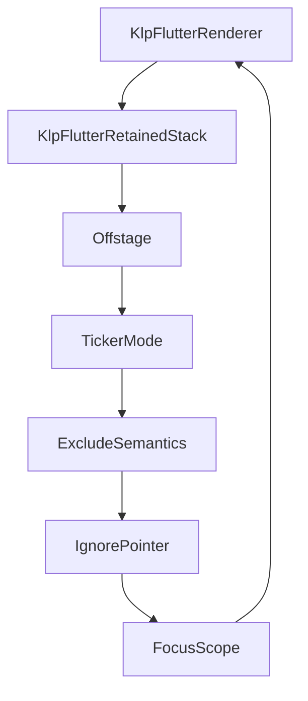
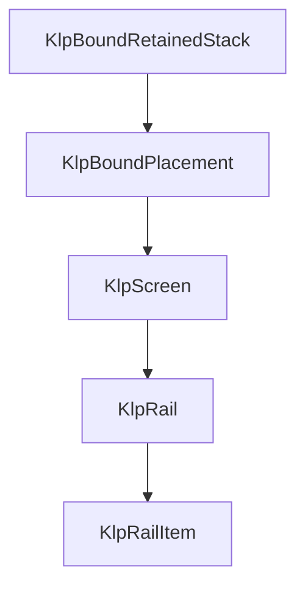
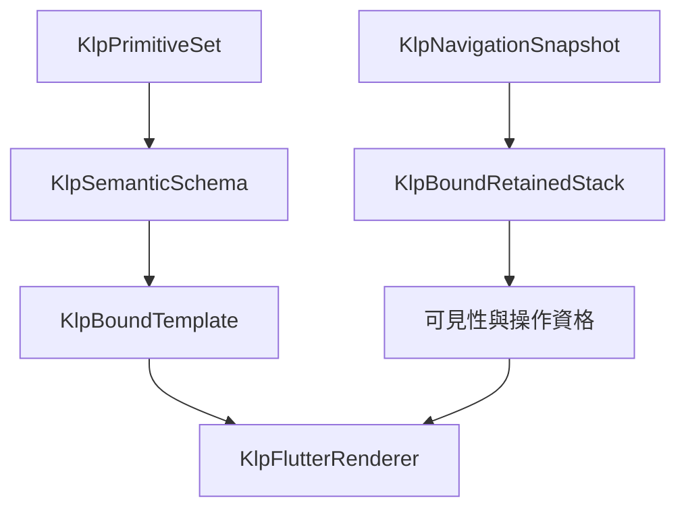

# 導覽交易與保留畫面契約

狀態：實作中。Navigation 核心、保留頁、應用入口、初始政策、平台返回、中立 stack 還原、單頁平台 URI 進入與提交後 platform route report 已完成本批自動化測試；多頁實機互動與實際瀏覽器 history 尚未驗證。讀者為維護 application、runtime 與功能組件的人員。

目標：消費端在應用結構內註冊目的地、畫面資料映射與政策，本庫安裝導覽能力。消費端不建立 Flutter router、NavigatorState 或自行接線控制器。依據 [遷移計畫](restructure-migration-plan.md) 的 screen／router 範圍實作，資料交易與持久化權威仍由外部提供。

## 責任與依賴

| 位置 | 權責 |
|---|---|
| `capabilities/navigation/` | 型別化目的地、位置、結果、唯讀交易與 guard 政策；不依賴 Flutter 或 Screen |
| `capabilities/navigation/internal/` | 單一導覽狀態機、候選堆疊、取消與同步提交接點 |
| `application/` | 路由註冊與畫面資料映射；將候選堆疊轉為同一棵受控樹 |
| `runtime/` | 整樹驗證、準備與資源交易，保留未移除畫面的資源 |
| `rendering/flutter/` | 呈現已提交畫面；管理可見性、輸入、焦點、語意與 ticker |
| `features/` | 將語意操作交給已安裝能力，依已提交狀態呈現選取 |

## 公開資料與內部操作

`KlpDestination<P, R>` 保留參數 P 與結果 R 的原始驗證器。目的地名稱用於註冊診斷；同名的另一個物件不能冒充已註冊目的地。`.location(P)` 建立帶參數的位置，泛型上轉不放寬參數或結果限制。

成功完成、取消、拒絕與失敗以不同 outcome 表示；成功的 nullable 結果不得被誤判為取消。單次 push 的提交判定與最終離開結果是兩個不同時間點。呼叫者可先知道導覽是否提交，並在該 entry 真正離開後收到一次最終結果。

狀態機屬 internal。即使具備 push、pop、complete 方法，也不構成消費端手動建立控制器的使用方式。應用 session 已負責安裝與操作繫結，消費端只透過 route input 建立宣告式 action，不自行持有 machine、派送 action 或接線 controller。

核心原建構子已私有化，改由 `KlpNavigationMachine.start` 執行初始 beforeEnter；初始 transition 的 from 為 null，isInitial 為 true。沒有 guard 或同步 guard 維持同步完成；非同步 guard 必須允許且來源未取消才可提交。拒絕、失敗與過期回覆不建立畫面資源，不能以另一個公開建構子繞過初始政策。

## 應用入口整合

應用固定使用 `KlpApplication.router`。`KlpRouter` 保存穩定 id、初始位置及不可變路由定義；單畫面也註冊一條路由，不保留 `child` 作第二入口。`KlpRoute<P, R>` 的 mapper 接收庫內建立的 `KlpRouteInput<P, R>`，回傳 `KlpScreen` 宣告；不接受 Flutter Widget 或 BuildContext。`runKlpApp` 只接受 `KlpState<KlpApplication>`，而 screen child 必須具備 `KlpScreenBody` 資格；外部編譯負例固定驗證兩個入口都不能以 Widget 取代。

Input 提供 typed parameters，以及 `navigate`／`finish`／`back` action factory；消費端不建立它，也不建立 session 或 controller。action 綁定 entry identity 及呈現世代，僅目前有效 entry 可由本庫派送。`back` 離開目前 entry；內部 push ticket 的 cancel 只撤銷尚未提交的請求，兩者的生命週期不同。

來源更新以新定義重新投影全部 retained entries。先驗證所有目的地物件仍存在，準備成功且 runtime 已提交後，才採用新政策與 input 世代；準備失敗保留舊定義與操作。router id 或初始位置的變更不得暗中重置現有堆疊。

平台返回交由本庫宿主處理：可返回時即消耗該事件，即使 guard 拒絕也不能把事件漏給平台退出應用。根畫面且沒有待決操作時才回報未處理。中立 stack 還原由 [受控導覽還原](controlled-navigation-restoration.md) 定義；瀏覽器網址、深連結與平台 adapter 仍需後續完整策略，不以此初次接點當成全部平台能力。

初始 guard 或畫面準備失敗的同步／非同步行為必須一致：不安裝不完整畫面，回報失敗，保留來源訂閱供下一份宣告修正。失敗嘗試自行建立的 machine／資源仍需清理。只有宿主無法取得來源或訂閱等初始化失敗才執行宿主清理；多個錯誤原因不得互相覆蓋。啟動等待與失敗目前先使用庫內等待／診斷呈現，正式功能性狀態畫面與預設外觀仍須後續定義。

## 交易順序

1. 驗證註冊、目的地物件、參數、頂層結果型別與目前是否已有待決操作。
2. 建立不可變候選堆疊與唯一 entry id；此時不改畫面、選取或舊資源。
3. 依序執行離開與進入政策；guard 只取得唯讀前後狀態與取消訊號。
4. guard 完成後再次核對待決交易是否仍有效，才呼叫同步提交接點。
5. 應用與 runtime 在提交接點內驗證並安裝候選整樹。
6. 根據接點回報的提交狀態發布導覽堆疊；完成離開 entry 的結果，並撤銷不再有效的操作。

| 情況 | 必須維持的結果 |
|---|---|
| guard 拒絕、取消或拋錯 | 舊畫面與資源保留，選取不提前改變 |
| 建立新畫面或資源在提交前失敗 | 候選新增資源清理，舊堆疊維持 |
| 提交後通知／清理拋錯 | 新堆疊仍為權威；錯誤明確標記已提交，不聲稱回滾 |
| 待決期間再次導覽 | 明確拒絕忙碌操作，不形成第二條並行提交路徑 |
| 來源更新或有效政策替換 | 撤銷舊待決交易；晚到的 guard 結果不能提交 |
| 移除仍在堆疊內的註冊 | 拒絕替換，不產生無定義的保留畫面 |
| dispose | 取消待決與仍未完成結果；晚到回覆不得重新安裝 |

提交接點必須以 `KlpNavigationCommitException` 指明失敗時是否已提交。若接點直接拋出未分類例外，核心不能猜測畫面狀態：目前以 `KlpNavigationCommitContractException` 保留原錯誤與堆疊，使 decision Future 失敗，撤銷機器並結束未完成結果；應用擁有端仍負責處置自己的 runtime。這是內部接點違約，與一般 guard 拒絕不同。

取消代表停止採納結果，不保證中止外部 I/O。取消通知可供外部清理，但不移交本庫資源的處置權。

## 保留畫面與識別

每次入棧建立獨立 entry identity。不同 entry 可使用相同 screen 或子元件 local id；runtime 以 entry 範圍區隔資源與呈現 key。消費端 callback 所見的 local id 不因內部命名空間而改變。

候選堆疊轉成一棵保留樹，沿用單一 runtime 安裝交易。整套 primitive 或應用來源更新必須涵蓋仍保留的 entry，避免返回舊畫面時出現另一版本的定義或風格。

隱藏畫面保留資源，但停用輸入、可取得焦點的能力、可存取語意與動畫 ticker；隱藏前取得的操作不能繞過可見性限制。返回時只恢復仍有效的焦點位置，移除 entry 時才釋放其資源。

以下呈現契約已接入 Router 應用，測試與建置證據見 [進度紀錄](restructure-progress.md)。Windows Release 已成功建置，但桌面操作由使用者停止，多頁實機互動仍未驗證；它不定義新的畫面布局或正式外觀。







```text
entry identity → keyed retained page → same element lifecycle
committed active entry → visible + input + focus + semantics + ticker
inactive entry → retained state + disabled interaction
primitive → semantic → existing bound values（不新增樣式參數）
```

| 屬性 | 來源與權限 | 修改位置 |
|---|---|---|
| 頁面內容、幾何與風格 | 既有 Screen／foundation 與已解析 semantic；無新外觀要求 | 保持既有呈現資料 |
| 目前頁面 | 已提交導覽 entry | 應用編譯為 active identity |
| 隱藏頁的輸入、焦點、語意及 ticker | 本庫保留畫面生命週期政策 | internal renderer；操作 lease 另由 runtime 控制 |
| 返回焦點 | 同一保留頁內仍有效的焦點節點 | internal renderer 管理，不暴露 FocusNode |

Rail item 只接收 `KlpAction?`，不接收可直接派送導覽的 callback。`KlpCallbackAction` 成功後保留 rail 本地選取；route input 產生的封閉導覽 action 則由 application session 派送，僅在 decision 為 committed 時才允許 rail 寫入選取。guard 拒絕、根畫面的 back、失效 entry 與已撤銷 frame 都不改選取。若導覽提交在 await 期間替換原 rail，原放置不得再寫入已釋放狀態。

route action 的具體型別與綁定皆為 application library 私有。外部只看得到 `KlpAction`，不能建構 route action、呼叫 execute，或使用舊的 `push`／`complete`／`cancel`。feature 僅依賴 action handler 能力介面，因此不反向依賴 application。

## 驗收關卡

- 核心：泛型上轉、假目的地、錯誤參數／結果、nullable 成功、busy、晚到 guard、替換與 dispose、提交前後錯誤、根畫面返回。
- 整合：同目的地重複入棧、重複 local id、隱藏畫面狀態保留、全樹風格更新、取消不改選取、移除清理、失敗不釋放原畫面。
- 呈現：隱藏畫面不接收鍵盤／點擊／語意操作、ticker 停止、返回焦點、平台返回與結果傳遞。
- 完整 P5：單頁 platform URI 進入與 route-information channel 已接通；實際瀏覽器 history、完整 stack URL 與相關支援矩陣仍需實作與證據；純狀態機通過不代表 P5 完成。

整體現況見 [重構總覽](current-refactor-overview.md)，既有安裝機制見 [應用 runtime](application-runtime-prototype.md)。
