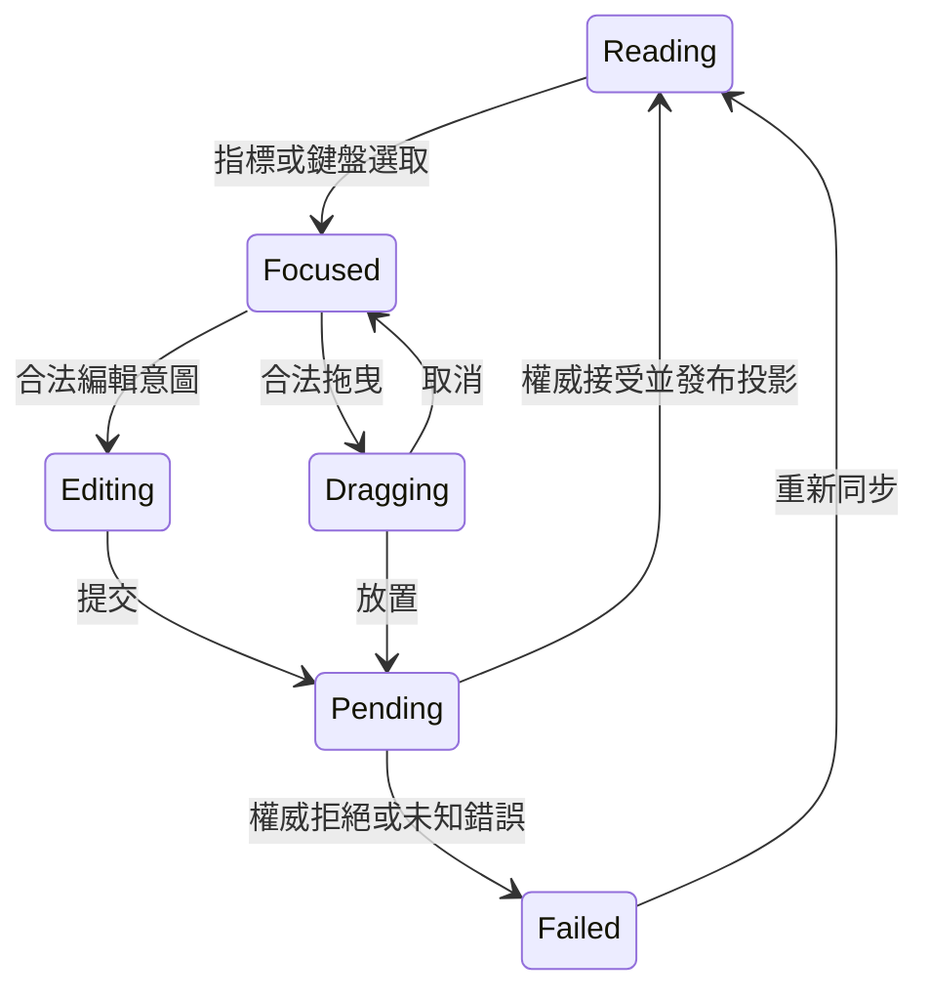

# Notion 筆記元件蒸餾：逐項契約

2026-09-11。狀態：官方文件盤點與 Kallopis 設計提案；未完成 Notion 實機逐項驗證。此頁不能宣稱所有功能已交付。範圍來自使用者要求，外觀仍以 Craft 官網為主。

## 來源與完整性

- S1：[文字編輯與內容分類](https://www.notion.com/help/writing-and-editing-basics)。
- S2：[Block API](https://developers.notion.com/reference/block)。資料結構佐證，官方明說不涵蓋全部 UI 元件。
- S3：[欄、標題與分隔線](https://www.notion.com/help/columns-headings-and-dividers)。
- S4：[同步區塊](https://www.notion.com/help/synced-blocks)。
- S5：[資料庫視圖索引](https://www.notion.com/help/category/database-views/all)、[視圖 API 指南](https://developers.notion.com/guides/data-apis/working-with-views)。
- S6：[按鈕](https://www.notion.com/en-gb/help/buttons)、[公式](https://www.notion.com/en-gb/help/math-equations)。本輪僅搜尋定位，詳細操作待讀。

「文件列有」與「互動已查證」分開。下方來源表示官方可定位的類型；資料、slot、事件與驗收欄是 Kallopis 擬議契約，不聲稱 Notion 採用相同內部架構。API 的 heading_4 與一般說明頁的 H1–H3 有範圍差異；H4 保留待查，不擅自推定桌面 UI 已提供。

## 共用契約

### 2026-09-12：直接成品蒸餾的清單驗收基線

讀者為實作者與驗收 AI。以下依 [Notion 官方快捷鍵](https://www.notion.com/help/keyboard-shortcuts) 核對；官方說明證據不等於本機互動已驗收。

| 觸發 | 成品明示結果 | 本庫適配與交付缺口 |
|---|---|---|
| 行首輸入 `-`、`+` 或 `*` 後空白 | 建立無序清單 | 核心原子移除語法並轉換；組字中的暫存符號不得觸發。待接輸入捷徑 |
| 行首輸入 `1.`、`a.` 或 `i.` 後空白 | 建立有序清單 | 識別輸入語法與 marker 呈現政策分離；字母／羅馬序號外觀仍待核實 |
| Tab／Shift+Tab | 巢狀／移出；縮排到前方區塊內 | 使用既有 checked list operation；鍵盤入口尚待接通 |
| 選取父區塊 | 同時選取巢狀內容 | 核心需發布完整子樹 membership；僅移動時擴張後代還不滿足此體驗 |
| Shift+上下方向鍵／Shift+點擊 | 延伸連續區塊選取 | 沿 K02 stable endpoints；須補父子清單情境驗收 |
| Shift+Enter | 區塊內換行 | 保持同一 block ID，續行對齊正文；marker 不成為正文字符 |
| `/turn` | 顯示區塊轉換選單 | 使用本庫封閉種類選單與既有 range 交易；不暴露原生 widget 或樣式 |

空清單項 Enter、行首 Backspace、觸控手勢及讀屏措辭：此來源未充分定義，列為待成品實測，不宣稱與 Notion 一致。取消未確認組字、單筆 undo、統一風格與受限插槽是使用者指定的本庫契約。

交付順序：上述行為 → Flutter Catalog 可操作案例 → 與來源核對 → 補必要核心契約。清單 marker／hanging indent 與命中幾何未交付前，N06／N07 保持未完成。先前整體百分比沒有逐項加權驗收依據，不能當成完成證據。

所有節點具備穩定身分、內容版本與能力投影。內容／子項由核心發布，不在 Kallopis 再保存可變文件樹。讀取與修改共用同一份來源；consumer 只提供資料來源與型別化操作接點。

以下為 slot 資格的設計名稱，尚非已公開 Dart 型別：

| 資格 | 允許內容 | 禁止組裝 |
|---|---|---|
| FlowBlock | 頁面內可重排內容節點 | 任意 Widget、表格 cell 當頂層 block、物件自行掛載另一個根 |
| InlineContent | 文字片段、標記、行內引用／公式 | FlowBlock 或任意布局子樹 |
| NestedBlocks | 宣告可巢狀的 FlowBlock | 祖先循環、同一 placement 出現兩次 |
| Column | 欄組專用欄容器 | 欄組直接接受文字、跨欄共享同一 placement |
| TableRow / TableCell | 對應表格 schema 的列與格 | 欄數不一致、原生 Widget cell |
| Reference | 核心參照身分與解析狀態 | 將來源內容複製進第二棵可寫樹 |
| Attachment | 資產身分、媒體型別與取得狀態 | 網頁任意腳本、外部 painter 或無限制 URL widget |

共用事件：建立、轉換、複製、刪除、重排、縮排、移出、選取與格式意圖均經權威回覆；disabled 或唯讀不能只降低透明度仍執行。hover／鍵盤焦點由本庫掌管；文字選取、區塊選取與輸入模式由同一操作 session 仲裁。撤銷／重做只呼叫核心，不在 UI 存操作歷史。

格式標記屬於文件語意，例如強調、刪除、程式碼與引用；實際字體、顏色與幾何由本庫解析。Notion 的任意色彩選項不直接轉成 consumer 的 style 參數。使用者是否可編輯某種語意由產品能力宣告，本庫決定其呈現。

## N01–N20：文字與容器

所有下表項目的互動實機狀態均為待驗證；實作狀態均為未接入新公開筆記節點。

| ID | 元件／來源 | 必要資料與 slot | 特有操作／狀態 | 必要驗收 |
|---|---|---|---|---|
| N01 | 段落 S1 | InlineContent、合法巢狀能力 | 分段／合併、空段落、輸入中 | 輸入法與拆併交易一致，附著物保留身分 |
| N02 | 一級標題 S1 | inline、heading level | 轉換／導覽 | 與目錄及標題投影同步 |
| N03 | 二級標題 S1 | 同上 | 同上 | 級別不由 fontSize 取代 |
| N04 | 三級標題 S1 | 同上 | 同上 | 轉換不丟文字標記 |
| N05 | 四級標題 S2 | 待 UI 核對 | 不提前暴露產品入口 | 確認實際平台及語意後才啟用 |
| N06 | 無序清單 S1 | inline、NestedBlocks | 縮排／移出／分段 | 清單嵌套與鍵盤導覽一致 |
| N07 | 有序清單 S1 | inline、核心序號投影 | 序列重算、重排 | 編號由核心給定，不由可見列索引推算 |
| N08 | 待辦 S1 | inline、checked、NestedBlocks | 勾選／取消、pending | 拒絕交易不顯示已完成 |
| N09 | 摺疊 S1 | summary inline、NestedBlocks | 開啟／收合、隱藏內容焦點 | 收合不刪內容，隱藏區不能接收輸入 |
| N10 | 摺疊標題 S2/S3 | heading、NestedBlocks | 摺疊與標題能力組合 | 不建立另一套標題語意 |
| N11 | 引用 S1 | inline、NestedBlocks | 轉換、複製、選取 | 裝飾與文字選取不互搶 |
| N12 | 提示區塊 S1 | icon 語意、inline、NestedBlocks | icon／用途意圖 | 對比、鍵盤與讀屏，無局部 style |
| N13 | 分隔線 S1 | 純結構葉節點 | 選取／移動／刪除 | 不接受文字 cursor 或 children |
| N14 | 子頁面 S1 | Reference、摘要 | 開啟／移動／建立 | 無權限／遺失／載入中可辨別 |
| N15 | 頁面連結 S1 | Reference | 導覽／移除參照 | 刪參照不刪來源 |
| N16 | 欄組 S2/S3 | Column 集合 | 調整欄寬、移入／移出 | 窄視窗轉譯不改原始欄內容順序 |
| N17 | 欄 S2/S3 | NestedBlocks、欄身分 | 容器範圍重排 | 拒絕循環與無父欄組的非法安裝 |
| N18 | 簡易表格 S1 | schema、TableRow | 增刪列欄、標頭 | 所有列滿足欄數，鍵盤可跨 cell |
| N19 | 表格列 S2 | TableCell 集合 | 列操作／選取 | 取消操作不出現半列 |
| N20 | 表格格內容 S2 | InlineContent | 組字、貼上區域 | 跨格剪貼以單次核心交易處理 |

## N21–N40：行內與媒體

| ID | 元件／來源 | 契約及驗收重点 |
|---|---|---|
| N21 | 文字強調 S1/S2 | 範圍與語意標記；不能以自行切割 String 的方式修改權威富文字。 |
| N22 | 超連結 S1 | 標籤、目標、啟用狀態；編輯與導覽分開，失效連結有回饋。 |
| N23 | 人員提及 S1 | 人員參照與顯示資料；查無人員／無權限不能變成空白文字。 |
| N24 | 頁面提及 S1 | 穩定頁面參照；重新命名由來源更新，無第二份名稱權威。 |
| N25 | 日期 S1 | 日期／時間語意與格式化來源；時區不得由畫面猜測。 |
| N26 | 提醒 S1 | 排程身分、狀態與操作；提醒服務由產品擁有，不能只畫圖示當已排程。 |
| N27 | Emoji S1 | 正規文字或資產參照；字符、選取與後備顯示一致。 |
| N28 | 行內公式 S6 | 表達式、核心定位與解析狀態；非法表達式顯示錯誤，避免破壞周邊 IME。 |
| N29 | 區塊公式 S2/S6 | 表達式葉節點；編輯、預覽與錯誤可切換，不能任意注入 HTML。 |
| N30 | 程式碼 S1 | 文字、語言、核心語法投影；縮排、複製、選取與水平捲動可操作。 |
| N31 | 圖片 S1 | Attachment、替代文字、caption；載入／失敗／替換與尺寸投影。 |
| N32 | 音訊 S1 | Attachment、播放資料；載入／暫停／結束／錯誤，卸載釋放播放資源。 |
| N33 | 影片 S1 | 同上與畫面範圍；播放手勢不得啟動區塊拖曳。 |
| N34 | 檔案 S1 | 資產名稱／型別／取得狀態；缺檔與下載失敗可理解。 |
| N35 | 書籤 S1 | 目標與來源摘要；未載入摘要仍有可理解入口。 |
| N36 | 外部嵌入 S1 | 受限 provider 資料接點；每個 provider 個別追蹤，不能以任意 Widget 通吃。 |
| N37 | PDF S1 | 文件及頁面投影；頁碼、縮放、選取與載入取消需可驗收。 |
| N38 | Link preview S2 | 參照、摘要與可用性；与一般超連結不同呈現但共用導覽意圖。 |
| N39 | Caption S1/S2 | 媒體專用 InlineContent；不能變成獨立資產或取代替代文字。 |
| N40 | 外部 provider 個別接線 S1 | 另建 provider 清單與逐項支援欄；此項是索引入口，不代表已涵蓋所有 provider。 |

## N41–N55：導覽、同步與進階

| ID | 元件／來源 | 契約及驗收重點 |
|---|---|---|
| N41 | 目錄 S1/S3 | 核心標題投影與錨點；內容變更後更新、失效錨點處理。 |
| N42 | 麵包屑 S1 | 父系參照鏈與目的地；循環／權限中斷可辨別。 |
| N43 | 同步來源 S4 | 原始來源身分、權限與版本；編輯只有單一來源。 |
| N44 | 同步參照 S4 | Reference；解同步是核心複製交易，不是 UI 偷存 children。 |
| N45 | 按鈕 S6 | 標籤、合法 action、可用性及 pending；交易成功和後續保存分開。 |
| N46 | 範本／重複內容 S2 | 範本參照、建立意圖；每次建立取得新身分。API 的舊 template 類型不當成目前 UI 全貌。 |
| N47 | 區塊註解 S1 | 討論參照、錨點、讀寫能力；錨點失效與權限變更有明確狀態。 |
| N48 | 行內註解 S1 | 富文字範圍參照；文字更新後由核心調整錨點。 |
| N49 | 編輯建議 S1 | 建議投影与接受／拒絕意圖；不能在 UI 直接改主文。 |
| N50 | AI 操作入口 S1 | 合法操作、資料權限與作業狀態；模型與內容提交由產品服务負責。 |
| N51 | 會議筆記 S2 | 官方資料類型可定位；完整 UI／音訊授權／轉錄生命週期待查。 |
| N52 | 轉錄 S2 | 舊名稱及新名稱對照，不當成兩份可寫權威；平台行為待查。 |
| N53 | Tab 類內容 S2 | API 類型可定位，UI 意義與可插入範圍待查；不可混用 app Router。 |
| N54 | HTML 類內容 S2 | API 類型可定位，來源與 UI 安全邊界待查；不提供原生腳本注入。 |
| N55 | 未支援內容 S2 | 保留身分、可理解類型與能力；不能靜默丟棄或替換成空段落。 |

## N56–N68：頁面內資料庫與視圖

來源 S5；存在性與實際 UI 支援須分開驗證。各視圖共享同一資料來源、查詢與權限，不在 Kallopis 另存資料庫。

| ID | 對象 | 契約及驗收重點 |
|---|---|---|
| N56 | 資料庫容器 | 資料來源、schema、view id；inline／整頁以結構槽轉譯，不複製資料。 |
| N57 | Table view | 列／欄投影、排序與編輯意圖；與 N18 簡易表格分開。 |
| N58 | Board view | 分組與卡片投影；跨組拖曳只提出更新意圖。 |
| N59 | Gallery view | 卡片摘要與媒體；虛擬化不影響身分及選取。 |
| N60 | List view | 精簡資料列；鍵盤導覽與篩選後焦點恢復。 |
| N61 | Calendar view | 日期欄位與日程投影；時區／跨日與拖曳修改由來源確認。 |
| N62 | Timeline view | 時間範圍、分組、里程碑；調整時間有預覽、取消與提交。 |
| N63 | Chart view | 已聚合資料與語意序列；非視覺層重新運算資料權威。 |
| N64 | Form view | 欄位、驗證與提交狀態；載入失敗及重送不能造成重複資料。 |
| N65 | Map view | API 指南可定位；地理資料與 provider 能力另立契約，互動細節待查。 |
| N66 | Dashboard view | API 指南可定位；子視圖資格及與一般頁面欄組的界線待查。 |
| N67 | Feed view | 說明中心索引可定位；排序／載入及權限細節待查。 |
| N68 | Filter／sort／group／property controls | 以型別化查詢与欄位 schema 操作；逐種 property editor 還須另表展開。 |

## 操作狀態機與架構落點



此為共用操作輪廓；文字組字依 K01 子狀態機，不能套此圖刪除細節。提出操作前驗證權限、來源版本與輸入模式；unknown 不等於 rejected，不能自動重送。

```text
features/editing：區塊、行內、媒體與資料庫視圖的受限組合
foundation：封閉文字／幾何／媒體呈現語言及語意解析
capabilities/editing：版本、輸入、選取與提交機制
runtime installation：焦點、輸入、播放及浮層資源
Planist adapter：核心投影及產品政策
Krepis／資料服務：文件、交易、儲存與參照權威
```

## 實作依賴與驗收

先完成編輯投影、字素映射與平台輸入，再接 N01–N13；媒體資源與參照能力到位後接 N14–N55；資料來源與欄位契約到位後接 N56–N68。不是刪除後段範圍，而是按真實依賴交付。

每個 ID 必须具備：合法／非法組裝測試、權威拒絕及取消、鍵盤操作、可理解無障礙語意、同一風格來源、資料更新與卸載驗收；與相鄰區塊共同編輯、重排、複製後保留內容及參照一致性。所有涉及 UI 的驗證按元件定型階段執行。

尚未完成的完整性工作：逐頁核對 S6、所有媒體 provider、資料库欄位編輯器、進階 API 與 UI 差異、Windows 實機。這些都有具體待查類別，不能在交付審核時以「基本區塊已完成」略過。
