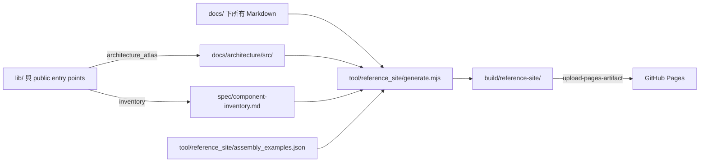

# Kallopis Reference Site 計畫

## 目標與動機

建立可由 GitHub Pages 發布的靜態 reference site，讓新 consumer 能從首頁與 Get Started 進入各分類、API 及元件的獨立頁面。網站必須以 repository 內既有文件與程式碼為唯一資料來源，避免手寫 HTML 與 architecture-atlas 或 component inventory 分岔。

## 範圍

### In

- 建立 Node 無第三方相依的靜態站產生器與可提交的網站來源。
- 產生首頁、Get Started、分類導覽、全文搜尋索引、所有元件／API 型別的獨立 HTML 頁。
- 以 `spec/component-inventory.md` 判定容器型元件；每個有子元件組裝關係的型別均需對應一段 Dart 組裝範例。
- 建立 GitHub Pages workflow，在 `main` push 或手動觸發時建置與部署。
- 在 CI 驗證產生器可執行、輸出完整且每個容器型元件都有範例。

### Out

- 不變更 Kallopis public API、元件實作或既有 architecture-atlas 的解析規則。
- 不自行發布網站、啟用 repository Pages 設定或變更 GitHub repository 權限以外的外部狀態。
- 不將 `build/reference-site/` 產物納入版本控制；發佈 workflow 在 CI 產生 artifact。

## 方案

`tool/reference_site/generate.mjs` 會建立四種頁面：

1. `index.html`：Kallopis 簡介、快速入口與分類摘要。
2. `get-started.html`：以現有 `docs/ai/` 的 consumer 契約與組裝模板為依據。
3. `components/<name>.html`：每個 `spec/component-inventory.md` 中列出的 public `Klp*` 型別各一頁；左側 navigator 依領域分組。
4. `api/<source-path>.html`：每個 `docs/architecture/src/` 產生頁各一頁，保留來源宣告、架構圖與原始碼連結。
5. `guides/<source-path>.html`：每個其餘 `docs/` Markdown 各一頁，保留原始目錄結構。

產生器必須產出 `search-index.json`，讓純前端搜尋可依型別名、分類與說明過濾，不需要 server。

### 容器範例規則

產生器從 component inventory 的「組成」欄辨識非葉節點。`assembly_examples.json` 必須對每一個非葉 `Klp*` 型別提供一段已驗證的 Dart 範例；建置在缺少範例、重複 key 或指向非容器型別時失敗。範例只使用對應 public library，不使用 `package:kallopis/src/...`。

## 分步實作清單

1. 建立 reference-site feature spec、資料來源契約與 container example 清單。
   - 檔案：`spec/reference-site.md`、`tool/reference_site/assembly_examples.json`。
   - 證據：驗證腳本可列出 inventory 所有容器型別，且無缺漏範例。
2. 實作靜態站產生器與固定網站 assets。
   - 檔案：`tool/reference_site/generate.mjs`、`tool/reference_site/verify.mjs`、`tool/reference_site/static/`。
   - 證據：產生首頁、Get Started、分類／API／元件頁與搜尋索引。
3. 撰寫所有容器型元件的 Dart 組裝範例並建立 compile contract。
   - 檔案：`tool/reference_site/assembly_examples.json`、`test/reference_site_examples_test.dart`。
   - 證據：每段範例只使用公開入口並可由 Dart analyzer 編譯。
4. 新增 GitHub Pages workflow 與 CI build gate。
   - 檔案：`.github/workflows/pages.yml`、`.github/workflows/ci.yml`。
   - 證據：workflow 使用 `actions/upload-pages-artifact` 與 `actions/deploy-pages`；CI 可產生網站並執行 verify。
5. 本機建置、驗證連結與審閱輸出。
   - 指令：`node tool/reference_site/generate.mjs`、`node tool/reference_site/verify.mjs`、`flutter test test/reference_site_examples_test.dart`。
   - 證據：每個 inventory 型別有 component page、每個 atlas source page 有 API page、所有內部連結有效。

## 驗收條件

1. 執行 `node tool/reference_site/generate.mjs` 後，輸出包含 `index.html`、`get-started.html`、`search-index.json`。
2. `node tool/reference_site/verify.mjs` 成功，且每一個 component inventory 的 public `Klp*` 型別都有 `components/<slug>.html`。
3. verify 成功，且每一個 inventory 非葉型別都有非空 Dart assembly example。
4. verify 成功，且每個 `docs/architecture/src/` 的 Markdown API 頁均有對應 HTML 頁與有效內部連結。
5. `test/reference_site_examples_test.dart` 成功，確認範例沒有 private `src/` import 且可編譯。
6. GitHub Pages workflow 僅在 `main` push 或手動觸發部署；pull request 僅建置與驗證，不能部署。

## 風險與回退

| 風險 | 偵測訊號 | 應對 |
|---|---|---|
| inventory 與 atlas 落後於 source | generator 找不到型別或文件 | build 失敗並要求先執行既有產生器／inventory 更新。 |
| container 範例使用 private 或過時 API | compile contract 失敗 | 修正唯一的 `assembly_examples.json`，不在網站頁重複內容。 |
| GitHub Pages 未啟用 | deploy job 由 GitHub 拒絕 | 保留 workflow；repository 管理者在 Settings 啟用 Pages 後重跑。 |

回退方式：移除 reference-site workflow 與工具目錄即可；既有 `docs/`、package 與 public API 均不受影響。

## 待核准

- 此計畫以「全部 public `Klp*` inventory 型別」為「所有元件」的可驗證定義；每個型別有獨立頁，非葉型別必有組裝範例。
- GitHub Pages 會部署靜態 artifact，但實際啟用 Pages repository 設定仍由 repository 管理者完成。
