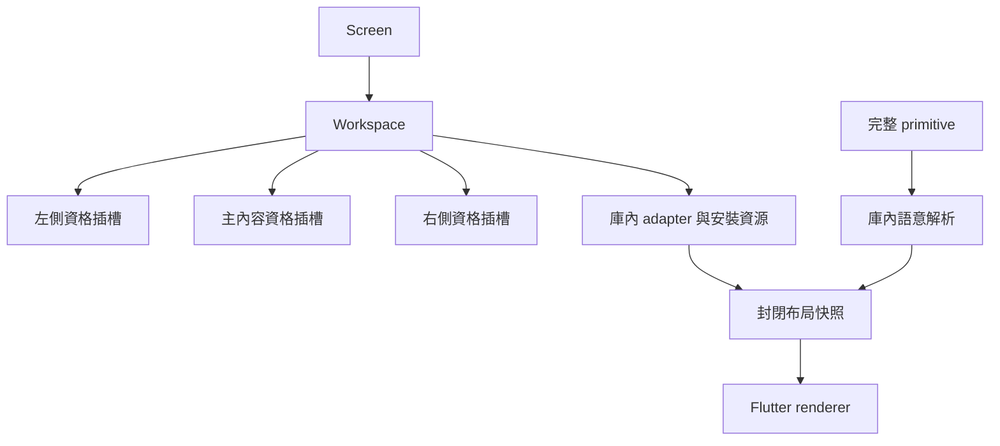

# 固定位置、可拉伸 Workspace 樣板

> 2026-09-12：本文為舊 Workspace 樣板紀錄。新第一層布局契約見 [KlpAppLayout](../../spec/klp-app-layout.md)；Frame 已核准平整、零 padding，外距／欄距／圓角 12px，深色主內容比輔助區亮。本文下方舊陰影、8px gap 及深色 Stage 較暗的規則不再適用新路徑。

狀態：功能方向已確認；尺寸與視覺為 proposed，尚未 frozen-screen。

使用者確認：桌面最多三欄，平板預設左中且左右互斥，手機側欄全畫面覆蓋；首版允許拉伸、收合，不允許交換、排序、跨欄移動。Pencil hover 未採用。

## 呈現與所有權

Header 位於 app 背景。第一層 panel 無邊框、柔和陰影；內部元件採平面分層。沿用既有預設 light 的 app / surface / stageSurface：EAE7E1 / F2F0EB / FFFFFF，dark：232323 / 303030 / 292929。深色 Stage 比側欄暗，文字對比較高。

本輪元件鏈：本庫 Workspace → 封閉呈現資料 → 庫內背景 Header、保留狀態的三個 Panel、拉伸命中區。產品沒有 Widget、BuildContext、局部風格或幾何輸入。



```text
primitive → workspace semantic → bound style → renderer
viewport + host platform capability → mode → visible regions + widths
pointer absolute local position → clamped width preference → resolved layout
```

| 屬性 | 來源與權限 | 本輪設定 |
|---|---|---|
| 三階色彩 | 使用者要求沿用既有預設，preset → semantic → bound | 不由 consumer 覆寫 |
| 圓角／間距 | 庫內語意，試作值未定型 | 14 / 8，外距 12 |
| 欄寬 | 庫內配置演算法，使用者拉伸只改狀態 | 預設 256 / 280，min 200，max 400；Stage min 360 |
| Header | 背景層，庫內配置 | 桌面預設 32；觸控至少 48，隨文字縮放增加 |
| 響應 | 平台能力與實際寬度共同決定 | mobile shortestSide <600；tablet 最多兩欄；desktop/web 可三欄 |

## 行為與驗收

- 桌面從完整三欄開始；視窗縮小先隱藏右欄，不覆寫手動偏好；放大恢復。
- 平板維持單一側欄選擇；窄視窗退為全畫面側欄。
- 拉伸使用絕對座標，限制另一側與 Stage 的可用空間。鍵盤焦點可用左右鍵調寬。
- 暫時隱藏的 Panel 保持掛載、捲動與資料狀態；停用其焦點、語意及動畫。
- 手機初始主內容；側欄返回回到主內容。初期偏好只存活於已安裝的 Workspace，尚不提供跨啟動持久化。
- 基礎算法以非 UI 單元測試驗證；視覺探索期只做人工操作與分析，不建立／更新 golden。
- 示範內容不等於 Planist 正式產品規格。實機 iPad、觸控及系統返回需另外驗收。

## 實作路徑

features/workspace 的宣告與 adapter；capabilities/layout 的狀態與純配置策略；styling 的 preset／semantic；foundation/binding 的封閉快照；rendering/flutter 的平台呈現；example 的純宣告式消費樣板。

新增功能獨立於舊 Dock；不刪改舊元件。若樣板不採用，移除其宣告即可；舊入口不受此批影響。

## 本輪驗證紀錄

密度 A 更新：使用者選定控制高度 32、圖示 16、水平內距 10、圖文距離 6、列高 36、字級 14／行高 20、控制圓角 8。Workspace Header 改用獨立的 control semantic 與 `KlpFlutterControl`，不再借用 Header 高度與 Panel 圓角當作按鈕尺寸。其餘容器與正文規格保留。

本次靜態分析無問題，密度／配置與架構測試共 163 項通過。淺色及深色 web 建置成功，人工確認正式 Flaticon 呈現、滑鼠收合展開與 accessibility 語意啟動收合。原生觸控、鍵盤焦點視覺與大字縮放尚未實機驗收；不以純演算法測試代替。建置仍有既有 CupertinoIcons 字型提示。

瀏覽器人工確認桌面三欄、滑鼠拉伸、鍵盤調寬、收合展開、窄視窗左中／中右互斥，以及手機寬度的全畫面側欄與 Header 返回。這些是瀏覽器樣板證據，不代表原生手機或 iPad 已驗收。

靜態分析通過；配置演算法與前端架構邊界共 160 項測試通過。淺色與深色 web 建置成功；建置仍提示既有 CupertinoIcons 字型缺失。依使用者要求保留 Tab 縮排，本輪未執行格式 CI，也未新增或重算視覺測試。
