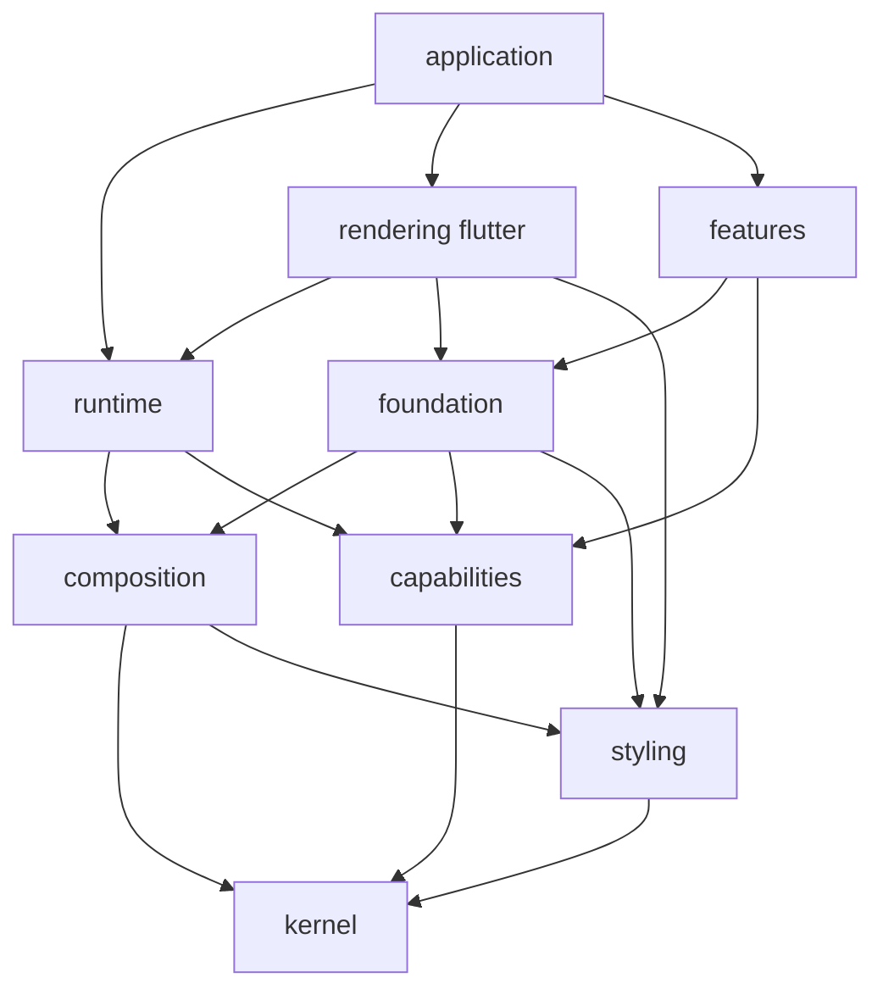

# 宣告式功能框架：檔案架構與遷移計畫

> 命名已定案：保留 Kallopis 品牌與 `kallopis` package，宣告式 API 統一使用 `Klp` 前綴及 `klp_` 檔名。新入口為 `kallopis_declarative.dart`；本機資料夾與 GitHub 倉庫名稱維持 Kallopis。歷史驗證檔案保留原路徑。

狀態：使用者已接受架構方向與 Kallopis 命名並要求開始重構；首批純資料契約已實作，完整架構穩定性仍待流程樣板及演進驗證。日期：2026-09-09。實際進度見 [遷移進度](restructure-progress.md)。
讀者：專案擁有者與後續實作者。閱讀順序：現況 → 目標目錄 → 契約 → 遷移階段 → 命名。
規劃階段僅新增文件；使用者後續已授權實作，現正依階段推進，不更新 golden 或提交既有工作。

## 目標與動機

從可覆寫風格的 Flutter 視覺庫，轉為受控宣告式 UI 與功能框架。消費端以 child／children 組合公開元件，注入資料及 callback，不實作 Widget build(Context)，也不組裝原生 Flutter Widget。

功能層允許筆記、無限畫布與節點編排等領域能力，產品可以直接使用、借用公開部件或透過契約擴充。中立表示不綁定特定產品，不表示所有功能都沒有領域概念。不以外部遷移成本、舊 API 相容或已有產品數量限制目標設計。

## 範圍

納入：檔案責任、依賴方向、公開入口、擴充介面、風格、狀態、控制器、資料、無障礙、動態、Screen／Router、功能模組、驗收與命名遷移。

不替筆記／畫布／節點功能發明完整需求，不自行更動外部產品或 Krepis 的資料權威。原先的資料夾與 GitHub 更名要求已由保留 Kallopis 的最新決策取代；不包含額外公開發布套件。

凍結區：本次開始前全部已修改、刪除及未追蹤檔案；既有資產與 golden；Notist、Krepis 等外部倉庫。後續遷移須先保存包含未追蹤檔案的工作基準，不可從 HEAD 另起後遺漏正在進行的重構。

## 現況查核

本次命令查核基於工作目錄，不是只看已提交版本。最後提交為 `8db8ea2 refactor: establish semantic design architecture`。

| 項目 | 查核結果 |
|---|---|
| Git 初始狀態 | 619 修改、24 刪除、665 未追蹤狀態列，共 1,308 列；未追蹤目錄可能代表多檔，不等於檔案總數 |
| 實際 SDK | PATH 為 D:/flutter/bin；Flutter 3.44.2、Dart 3.12.2。不同於 AGENTS.md 的舊環境紀錄 |
| 套件 | pubspec.yaml：kallopis 0.8.0、publish_to none；直接執行相依僅 Flutter，舊文件的 flutter_svg 說法已不符目前宣告 |
| Dart 檔案數 | lib/src 869；test 126；example/test 7，包含支援檔，不表示測試案例數 |
| 公開入口 | theme、foundation、experimental 與相容總入口；foundation 仍匯出 theme 與 App |
| 風格 | KlpVisualStyle 接受 semantic／component 模型；KlpTokenOverride 提供局部色彩覆寫 |
| 組合 | KlpPanelLayout 仍 implements Widget 並回傳 Widget；KlpRow 子項為 List<Widget> 且接受 double gap |
| 功能 | canvas_workspace、artifact_workspace 已存在，但直接 import Flutter；不能據名稱宣稱已有完整無限畫布或筆記引擎 |
| 路由 | klp_router.dart 與 parts 依賴 Flutter／KlpPanelLayout；需要拆出非 Widget 契約 |
| 圖集 | 已先從圖集選取 app、theme、layout、controls；人工摘要的部分路徑仍指向拆檔前位置，引用須回到原始碼核對 |

來源：[pubspec](../../pubspec.yaml)、[公開入口](../../lib/kallopis_foundation.dart)、[風格模型](../../lib/src/theme/klp_visual_style.dart)、[局部覆寫](../../lib/src/theme/klp_theme_scope.dart)、[Panel 契約](../../lib/src/layout/klp_panel_layout.dart)、[Row](../../lib/src/layout/klp_row.dart)、[Canvas 現有實作](../../lib/src/editor/canvas_workspace/klp_canvas_workspace.dart)、[路由](../../lib/src/routing/klp_router.dart)。

既有驗證結果另見 [查核紀錄](restructure-audit.md)。本文件不是健康狀態通過證明。

## 方案

### 已確認的設計契約

1. 消費端不接觸 Widget、BuildContext、Flutter State 或任意 renderer callback。
2. 容器 child／children 接受指定資格介面，如 railItem；元件可以具備多種資格，實際插槽決定本次角色。
3. Primitive schema 固定、參數中立，只能整套替換值，不能由消費端加欄位；完整性由驗證器檢查。
4. 自訂元件開發者可以補充 semantic 風格參照。這是定義期契約，元件實例不注入 style，也不局部覆寫。
5. 本庫掌握解析演算法；semantic 參照須具型別、可檢查，不能透過任意函式或最終外觀值跳過解析。
6. 基礎層提供受控能力；features 提供可拆用、可擴充的通用功能，不以「目前兩個產品使用」作入庫條件。
7. 容器、組件、基礎元件各自擁有明定屬性；不以最後覆寫者勝出的 style merge 取代所有權。
8. 狀態唯一來源、平台／語系來源一致、資產載入正確與既有資料權威仍須維持。
9. 公開使用模型只有一套總體結構樹。同一語意畫面結構只有一種標準表示；不能另外提供 builder、手動 provider/controller 接線或 imperative mount 等等效組裝入口。這不要求所有 Dart 原始碼字面相同，變數抽取與純資料重用不構成另一套 API。
10. 功能節點注入總體樹即代表安裝意圖。本庫依節點定義、註冊、平台與環境建立預設資料結構、狀態、控制器及演算法；消費端只提供必要產品資料與 callback，不能被要求重做機制接線。

### 唯一結構樹與功能安裝

2026-09-09 使用者補充：本庫暴露的目標是同一畫面只有一種寫法，消費端注入總體結構樹即可安裝功能。以下收斂前文的多入口概念：公開 library 可按能力提供型別，但所有使用仍進入同一樹與同一 runtime；多個 library 不是多種安裝方式。

總體樹具有根配置、Screen／功能節點、受限插槽與內容節點。整套 primitive 風格及應用級政策在根配置提供；功能資料與 callback 在所屬節點提供。具體 constructor 與樹 schema 在 P2 定稿，不先加入任意 configuration map。

註冊契約保存型別識別、資料 schema、插槽資格、semantic 定義、必要能力、預設狀態、控制器建立政策與平台策略。註冊表為每個應用根擁有的受控定義集合，不是可變全域 singleton；自訂組件的註冊也是定義期工作，不要求每個實例再次註冊。

安裝順序固定為：結構與參照驗證 → 定義解析與依賴檢查 → 平台／政策選擇 → 建立本庫擁有資源 → 綁定外部資料 → 掛載呈現。失敗須釋放本次已建立資源，不留下半安裝狀態；卸載依依賴反序釋放。相同識別下資料更新不得重複安裝，結構移動與更換定義的狀態保留規則須寫入契約。

| 情況 | 本庫責任 |
|---|---|
| 合法功能但未提供可選狀態／controller | 按唯一政策建立預設實作，不要求產品手動接線 |
| 缺少必要產品資料 | 明確指出節點與缺少欄位；不虛構業務資料 |
| 定義未註冊／重複識別／相依循環 | 掛載前拒絕，禁止靜默採用最後註冊者 |
| 平台支援能力不同 | 依已登錄的能力矩陣選策略；明定回退或明確拒絕，不猜測 |
| 安裝途中失敗／卸載 | 回收本庫自建資源，取消訂閱；不釋放借用來源 |
| 外部資料更新／平台偏好改變 | 根據已定義政策更新既有執行實例，保留應保留的狀態 |

「所有情況、平台」轉成可列舉的支援矩陣：平台、輸入方式、可用尺寸、文字縮放、語系方向、動態／無障礙偏好、資料生命週期與功能能力組合。每項必須有預設處理、明定回退或拒絕；未知未來平台不宣稱已驗證。平台與視窗尺寸仍是不同資料，不把窄 Windows 視窗當 Android。

功能擴充保留在定義與受控策略契約；終端使用者不手選內部演算法、不自行組出第二套等效功能安裝流程。若一個 Screen 可由兩套公開 API 表達同一語意，應收斂為單一路徑，而非兩套都列成推薦用法。

### 目標檔案架構

以下全部為擬議路徑。先維持單一套件並檢查依賴；不預先建立空資料夾。是否拆 package 可在介面驗證後決定，不把單套件當永久限制。

```text
lib/
├── application.dart                啟動、Screen 與配置入口
├── foundation.dart                 基礎宣告入口
├── extensions.dart                 自訂組件定義入口
├── style.dart                      Primitive 及 semantic 定義入口
├── capabilities/                   每項機制獨立公開入口
├── features/                       每項功能獨立公開入口
├── experimental.dart               未定型 API，Stable 不反向匯出
└── src/
	├── kernel/
	│	├── identity/                  定義與放置識別
	│	├── lifecycle/                 擁有、附接、釋放契約
	│	└── diagnostics/               結構化錯誤與路徑
	├── composition/
	│	├── nodes/                     宣告節點
	│	├── slots/                     通用插槽協定
	│	├── definitions/               自訂組件定義與展開描述
	│	├── registry/                  根擁有的型別／能力註冊
	│	└── validation/                結構驗證
	├── capabilities/
	│	├── accessibility/
	│	├── motion/
	│	├── state/
	│	├── controllers/
	│	├── data/
	│	└── navigation/                Screen、目的地與路由
	├── styling/
	│	├── primitives/                固定 schema 與完整值集合
	│	├── references/                Typed semantic 參照
	│	├── resolution/                唯一求值與狀態演算法
	│	├── validation/                完整性、型別、循環與範圍
	│	└── presets/                   本庫整套風格
	├── foundation/
	│	├── content/
	│	├── layout/
	│	├── interaction/
	│	├── surface/
	│	└── accessibility/             無障礙宣告節點
	├── features/
	│	├── actions/
	│	├── navigation/                Rail、Tabs 等可見功能
	│	├── forms/
	│	├── collections/
	│	├── feedback/
	│	├── overlays/
	│	├── workspace/
	│	├── note_editor/               先定義契約再建立
	│	├── infinite_canvas/           先定義契約再建立
	│	└── node_editor/               先定義契約再建立
	├── runtime/
	│	├── mounting/                  每個放置位置的執行實例
	│	├── installation/              功能依賴、預設建立與失敗回收
	│	├── updates/                   差異、資料更新與展開
	│	├── scheduling/                更新排程
	│	└── capability_binding/        附接各機制
	├── rendering/flutter/
	│	├── content/
	│	├── layout/
	│	├── interaction/
	│	├── surface/
	│	├── accessibility/             Flutter 語意樹轉接
	│	└── environment/               Flutter 環境與平台讀取
	└── application/
		├── bootstrap/                 唯一組合根
		├── configuration/
		└── localization/
test/
├── architecture/                   依賴與公開 API 型別
├── contracts/                      正向與拒絕案例
├── capabilities/
├── styling/
├── foundation/
├── features/
└── support/
example/                            Catalog 與消費端契約示範
spec/                               契約與決策，沿用既有位置
docs/architecture/                  提案與現況图集分開
tool/                               Verify、清單、圖集及消費端檢查
```

每個 feature 的 `contracts/`、`parts/`、`behavior/`、`state/`、`controllers/`、`semantics/`、`presets/` 依實際責任建立，不要求每個部件都配空資料夾。railItem 留在 rail，不移到全域 interfaces。具體 controller 留在功能內，capabilities/controllers 只提供共用契約與基礎實作。功能局部 semantic 隨功能保存；styling 保存的是參照語言與求值規則。

### 依賴規則

箭頭表示來源依賴目標；圖中是擬議模組，不是現有 import 圖。



- Kernel 不知道任何功能；capability 之間允許經明定契約單向依賴，例如 data 使用 state，不建立任意互相 import。
- Composition 的定義持有 semantic schema，註冊階段依賴 styling 的引用驗證；styling 不反向依賴 composition。節點實例仍不持有局部風格輸入。
- Features 可依賴另一 feature 的公開子能力，須登錄且無循環，例如 node_editor 使用 infinite_canvas 的視口；不可依賴 internal。
- Runtime 只認識通用描述與機制，不建立各 feature 的專用 Widget；feature 應展開至 foundation 能力。新型繪製能力不足時擴充 foundation／renderer，不留 consumer renderer 插槽。
- Flutter 類型原則上局限 rendering 與 application 平台接線；公開資料契約不得洩漏 Widget、BuildContext、ThemeData、AnimationController 或 NavigatorState。
- 不機械複製 Flutter 所有類別，也不要求每個宣告一個 renderer；僅對必需能力建立受控模型。

### 各機制的介面與基礎實作範圍

| 機制 | 契約 | 初始實作 | 負面／生命週期驗收 |
|---|---|---|---|
| Accessibility | 偏好來源、描述、策略 | 系統偏好轉接、基本語意與鍵盤支援 | 缺必要名稱拒絕；模式切換保留焦點與資料；基本支援不能關閉 |
| Motion | 動態政策、轉場意圖、時鐘契約 | 標準、減少動態、即時完成 | 取消／關閉不改操作結果，不遺留動畫控制器 |
| State | 唯讀來源、更新入口、scope | 本地狀態容器 | 內部管理與外部控制互斥；釋放後拒絕更新 |
| Controllers | 命令、查詢、附接、擁有權 | 單一附接與生命週期檢查 | 重複附接或釋放後命令明確失敗；不複製 state |
| Data | 值／集合來源、操作結果、取消 | 記憶體與非同步來源 | 舊請求晚到不覆蓋新資料；借用來源不被代為 dispose |
| Navigation | Screen 宣告、目的地、參數、結果 | 堆疊、返回、guard 與識別 | 未註冊目的地／錯誤參數拒絕；取消導覽不提前釋放畫面 |

介面名稱與 Dart 簽章尚未定稿；以上不是可直接呼叫的現有 API。P2／P3 以可編譯樣板驗證後才凍結簽章。資料映射可以是純資料函式；禁止的是取得 Context／Widget 或任意風格求值的出口。

同一元件描述可放置多次，但每次放置有獨立焦點、懸停與動畫生命週期；外部資料來源可共用。Framework 擁有自建資源，借用 controller／source 不自動 dispose。

### 防錯保證範圍

型別：容器接受指定介面；公開建構子不提供 raw Widget、style override。開放的 railItem 介面只能提供宣告／資料能力，不能藉實作介面取得 renderer。

執行驗證：重複 ID、選取值不存在、semantic 參照缺失／循環、primitive 缺欄位／多欄位／非法值、重複 controller 附接明確拒絕並指出路徑。外部輸入不能只用 release 模式消失的 assert 驗證。

消費端治理：Dart 的 lib/src 不是語言存取隔離。`dart run tool/verify_declarative_consumer.dart <source-file-or-directory>` 以 analyzer AST 檢查 consumer 的 import／export，拒絕 Flutter、`dart:ui`、`kallopis/src` 與非宣告式入口；根目錄 Verify 與 GitHub CI 已檢查 `example/lib/klp_runtime_demo.dart`，產品 CI 必須以同一工具檢查自己的受控來源。公開 API 型別另由 `test/klp_declarative_public_api_test.dart` 檢查。禁用檢查、fork 套件或自行啟動另一棵 Flutter 樹屬於繞過整體契約，不能宣稱單一 package 能從語言層阻止所有程式。

### 現有目錄遷移映射

| 現有路徑 | 目標 | 處理方式 |
|---|---|---|
| lib/src/tokens、styles、theme | styling；元件 semantics；rendering | 拆原料、用途、演算法與 Flutter ThemeExtension；不整批改名 |
| lib/src/layout、typography、surface | foundation 與 rendering | 把描述和 Widget／Painter 分離；移除公開 raw 數值逃生口 |
| lib/src/foundation | kernel／foundation／rendering | 圖示資料、平台 scope、工具需逐項分類 |
| lib/src/interaction | capabilities／foundation／feature behavior | 區分共用機制、基礎宣告與功能策略 |
| lib/src/controls、form | features/actions、forms | 以基礎宣告重組；semantic 隨功能 |
| lib/src/data | features/collections 等 | 這是呈現功能，不直接搬到 capabilities/data |
| lib/src/navigation | features/navigation | 保留容器／項目責任，建立 typed slots |
| lib/src/feedback、overlay | features/feedback、overlays | 底層能力不足先下沉，不直接碰 Flutter |
| lib/src/shell、settings | features/workspace；forms／navigation 組合 | settings 不預設獨立引擎，依責任拆分 |
| lib/src/editor | feature 候選 | artifact、canvas 等逐項驗證，不當成完整未來引擎 |
| lib/src/routing | capabilities/navigation＋rendering 轉接 | Screen 不回傳 Widget；router 狀態單一來源 |
| lib/src/app、l10n | application＋rendering/environment | 平台、locale、縮放保持唯一來源 |
| lib/src/components | 逐項盤點後歸屬 | 不因同名直接當新 features 根 |
| example、test、tool | 對應新契約與目錄 | Catalog 改為真正受控消費端；更新清單與圖集生成器 |

### 功能與資料權威

筆記 UI 可入 features/note_editor；文件 transaction、undo、persistence 目前仍由既有契約指定的權威負責。尚未檢查 Notist／Krepis 原始碼，不聲稱已完成跨庫盤點。

Infinite canvas 候選責任：視口、座標、縮放、平移與內容承載。Node editor 候選責任：節點／port／edge 呈現與編排，單向使用畫布能力。產品工作流程、保存格式與業務合法性需以 adapter 接入。是否把領域引擎也移入本库，須另立資料所有權 ADR，不在本次搬檔時順便複製。

## 分步實作清單

每階段獨立提交與驗收；以下未實作。共用完成證據為 Verify、受影響邊界契約與 diff 審查；新畫面視覺需依定型階段驗收，不用舊 golden 倒推新設計。

| 階段 | 工作／檔案範圍 | 完成證據與回退點 |
|---|---|---|
| P0 工作基準 | 保存 status、tracked diff、未追蹤內容及雜湊；檢查 pubspec、tool/verify.ps1、現有測試 | 可重建本次工作目錄；基線失敗分類。只備份不清理，不能只存 git diff |
| P1 新契約 | spec/decisions 新 ADR；AGENTS.md、README、frontend-boundaries、相關 design knowledge 與守門測試 | 新舊規則取代矩陣一致；不加 allowlist 規避新方向 |
| P2 契約樣板 | src/kernel、composition、styling 的最小模型；test/contracts | child 接口、多介面、自訂 semantic、完整 primitive 正向可編譯；raw Widget／非法插槽負向不通過 |
| P3 機制樣板 | capabilities/state、data、controllers；runtime；rendering/flutter；application | 外部／內部狀態互斥；訂閱釋放、重複附接、晚到資料與放置識別測試通過 |
| P4 第一條完整流程 | foundation 必要能力；features/navigation/rail；example 的隔離示範 | 自訂項目透過介面進 rail；資料更新、callback、風格切換與焦點一致；消費端零 Widget build |
| P5 橫向機制 | accessibility、motion、navigation；Screen 及 Router；擴充 P4 示範 | 關動畫結果不變；偏好切換；返回／guard／取消／恢復生命週期；不另開 renderer 入口 |
| P6 分批遷移 | 先 actions/forms，再 collections/feedback/overlays，再 workspace/editor 候選；同批遷移對應測試 | 每批公开 API 清單與舊→新對照；沒有跨層 import；不搬產品資料權威。Form 的非視覺所有權與資格樣板見 [受控 Form 樣板](controlled-form-prototype.md) |
| P7 消費與守門 | lib 公開入口、example、test/architecture、tool 與圖集 briefs | Catalog 使用受控 API；惡意原生 import／轉接 import fixture 被拒；圖集生成與人工摘要一致 |
| P8 命名收斂 | 宣告式 lib 入口、Klp 識別字與 klp_ 檔名、example、測試、文件；package 與資產前綴維持 kallopis | 新入口 import 檢查；完整 Verify；剩餘舊識別逐筆分類，歷史證據路徑保持真實 |
| P9 收束 | 刪除已替代舊實作與臨時遷移入口，更新 ADR 狀態及 CHANGELOG | 無平行 state／resolver；Stable 不匯出 experimental；功能部件可單獨取用 |
| P10 最終名稱核對 | 保留 Kallopis 倉庫及 D:/Projects/Kallopis 資料夾，核對 remote、工具與文件接線 | 現有名稱正確，不執行資料夾或 GitHub 更名；歷史基線維持原路徑 |

P2–P5 先走一條完整流程，不先建立全部機制空殼。舊實作暫留只是為每步可驗證；不承諾永久相容層。遷移期間新舊入口分離，不能讓新模型透過轉接接受任意舊 Widget。

補充階段閘門：P2 先確定唯一總體樹 schema 及 registry 契約；P3 加入 installation 與預設資源建立；P4 示範只注入節點即可安裝，不手動配置 provider、controller 或平台分支；P5 建立支援情境矩陣並驗證回退／拒絕。Controller 契約仍存在，但由本庫預設接線，不能成為必要的第二種組裝方法。

P5 完成後、P6 大規模遷移前，必須通過下節的架構演進案例。P9 再用已移植功能重驗一次。重構後重新定義正式預設風格、增加／修改元件另成工作階段；不把新視覺設計混入搬移基線。

## 架構穩定性與後續演進評估

使用者預計重構後重定義預設風格並新增／修改元件。評估結論：目前責任分離能支持此方向，但尚無實作證據，不能宣稱架構已穩定。穩定的判準是常見演進具有可預期修改範圍，不必改總體樹使用方式、重接狀態或新增例外入口；不是所有檔案與 schema 永遠不變。

### 變更影響邊界

| 後續變更 | 預期允許修改 | 應保持不變 |
|---|---|---|
| 既有 schema 下替換整套 primitive | styling/presets、風格資料與其驗證 | 消費端結構樹、資料綁定、組件定義、controller 接線 |
| 重定義預設風格的語意映射 | 本庫相關 semantics／resolution 與定型後視覺證據 | 消費端結構樹、產品資料及事件契約 |
| 調整既有元件外觀 | 該元件 semantic／composition；必要時修正既有基礎能力 | 父容器權限、元件識別與業務狀態 |
| 新增可由既有基礎能力表達的元件 | 元件定義、介面實作、semantic、註冊與公開匯出 | kernel、runtime、既有元件及 consumer 安裝流程 |
| 新增可重用功能 | feature 與必要契約、註冊 | 既有功能及共用 runtime；消費端僅增加所需節點 |
| 新增目前無法表達的繪製／互動能力 | foundation、對應 renderer 與能力契約 | 不因此開放任意 Widget／Context；既有節點語意維持 |
| 改變必要資料、插槽義務或事件含義 | 受影響契約與明確遷移對照 | 不假裝是純外觀變更；其餘功能不得連帶破壞 |

重新定義預設風格不保證只改 primitive。若變更的是用途映射、狀態混色或組合幾何，應改所屬 semantic／演算法，不能為追求「只改一檔」扭曲 primitive。

### 必須先解決的穩定性風險

1. 固定 primitive schema 的表達力：先用兩套差異明確的測試風格驗證色彩、字體、尺度、邊界與動態。消費端不能擴充 schema；本庫未來若確需改 schema，視為版本化契約變更，提供舊→新資料轉換或明確不相容診斷，不能偷偷補欄位改變結果。測試風格不是使用者的新正式預設風格。
2. 受控擴充與唯一寫法：自訂元件定義不能迫使 runtime 新增按 feature 名稱分支；需要新增的渲染能力應在基礎層登錄。每種功能語意只有一個標準樹契約，但不試圖禁止不同產品內容或所有語意等價 Dart 表達式。
3. 動態註冊與可重現性：目前計畫採建立根時解析並固定有效定義集合；掛載中不允許任意修改同識別定義。未來需要熱替換時另定交易與版本協定，不先加入可變全域 registry。
4. 風格與結構版本不能冒充生命週期識別：換風格不重新安裝功能，不清空選取／輸入／路由。求值快取需要包含原料、semantic 定義及環境版本，避免樣式不更新或跨環境污染。
5. 多介面並不自動免除不相容：擴充既有 railItem 的必要義務會破壞自訂實作。新增義務須另立版本／能力或明確遷移，不以新增必填成員假稱向後相容。

### 演進案例與通過證據

| 案例 | 檢查方式 | 通過標準 |
|---|---|---|
| 同一 Screen 切換兩套測試原料 | 凍結 consumer 樹 fixture；觀察資料、安裝計數及解析值 | consumer 檔案不改；安裝計數不增；選取／輸入不遺失；新值生效 |
| 修改 rail 內部呈現規則 | 比較变更檔案及所有權檢查 | 不改 consumer、kernel、runtime；不越權修改子項內容 |
| 第三方新增 railItem 並另具一個既有插槽資格 | 僅新增擴充定義、semantic、註冊與示範資料 | 沒有 runtime 特判；依插槽解析角色；不同放置的互動狀態分離 |
| 新增一個由既有能力組成的功能 | 使用既有 registration／installation 路徑 | 只注入節點即安裝；沒有新的 provider／mount 寫法 |
| 安裝失敗與移除 | 注入建立失敗／非同步晚到，記錄資源計數 | 自建資源全部釋放；借用來源保持可用；無半安裝節點 |
| Schema 與 semantic 定義變更 | 舊資料、缺欄位、未知參照 fixture | 支援版本可解析；不支援版本在掛載前有路徑診斷，無靜默 fallback |

這些案例先驗證型別、資料、資源與依賴邊界；新視覺尚未定型時不建立 golden 期待值。正式風格與元件定型後，才補視覺／互動驗收。效能不能僅靠結構推論；大資料畫布／列表功能進入實作前需另定工作量、平台及可量測預算，未量測不宣稱性能穩定。

若上述常見變更需要修改 kernel／runtime、重寫消費樹或開例外，P6 不開始大規模遷移，先調整架構。穩定性證據與視覺定型證據分別記錄。

## 驗收條件

1. 架構檢查器檢查實際解析後依賴：foundation 無 features／rendering 反向依賴；feature 依賴無循環。
2. 公開 API 檢查：所有消費入口及其傳遞型別不含 Widget、BuildContext、ThemeData 與任意渲染 callback；negative fixture 不通過分析。
3. rail 正向 fixture 接受實作 railItem 的自訂宣告；不相符子項編譯失敗；同元件多角色依插槽解析，放置狀態互不污染。
4. Primitive 輸入少欄位、多欄位、非法值均拒絕；兩套合法原料使用同一 semantic 定義，元件實例沒有 style 參數。
5. Semantic 參照錯誤與循環拒絕，診斷包含元件及參照路徑；容器屬性不能被子項覆寫。
6. 狀態、controller 與資料來源的擁有／借用、附接／取消、過期結果有測試；同一狀態沒有兩個寫入權威。
7. Screen、路由返回／取消與可選動態不破壞資料；基本無障礙、縮放與減少動態依契約驗證。
8. 每個公開 feature 部件可在最小 host 獨立取用，不依賴完整 preset 偷渡的祖先或隱藏 state。
9. 舊規則以新 ADR 明確取代，原有決策保留歷史；筆記領域資料所有權無無聲變更。
10. Verify 的 analyze、root tests、example tests 均 exit 0；frontend_architecture_boundary_test.dart 持續執行；圖集 freshness 與人工摘要同步。
11. 以 `kallopis` package 及宣告式入口建立最小消費端，驗證字型／圖示，不僅依賴編譯成功。Golden 變更有已核准視覺原因。
12. 唯一寫法：每個支援畫面語意有唯一標準樹 fixture；API 清單不得存在等效 builder、imperative mount 或原生 wrapper 入口。此驗收針對公開表示法，不宣稱證明所有 Dart 程式的語意等價。
13. 只注入功能節點即可完成預設安裝；測試確認預設 state／controller／策略建立一次、更新不重裝、移除後全部自建資源釋放。測試植入中途失敗，沒有殘留半安裝狀態。
14. 註冊衝突、缺必要資料、未知平台能力與相依循環均有具路徑診斷；支援矩陣每列都對應測試或明確標為未支援，不用任意例外輸入跳過。
15. 最終名稱核對：品牌 Kallopis、package kallopis、API 前綴 Klp、本機資料夾 D:/Projects/Kallopis；GitHub 與 origin 保留既有正確名稱，不進行無意義的同名改名。

## 風險與回退

| 風險 | 偵測訊號 | 處理 |
|---|---|---|
| 覆蓋未提交拆檔成果 | 遷移後缺少未追蹤檔或內容雜湊不符 | P0 完整工作快照；每批只提交明定檔案；不用 reset --hard 或工作樹清理 |
| 自建宣告框架過度膨脹／逃生口重現 | 為 rail 樣板新增通用 build callback、任意 Widget 或大量一對一 wrapper | 回到 P2/P4 收斂必要能力；以負向 fixture 守住公開邊界 |
| 風格與資料權責分叉 | 子項覆蓋容器；controller 與 source 各存一份；複製 Krepis transaction | 屬性權限表與所有權 ADR；按 feature 回退，不把 baseline 或 allowlist 調高 |

整體回退：每階段保存獨立 checkpoint 與證據；只撤回該階段新增／修改，不撤回先前的人類工作。外部產品與持久化格式未遷移前不做不可逆切換。

## 命名決策

使用者已決定保留 **Kallopis**，package 為 `kallopis`，宣告式 API 使用 `Klp` 前綴與 `klp_` 檔名。新架構從 `kallopis_declarative.dart` 匯出，既有視覺 API 繼續從舊入口匯出；隔離依 library 可達性檢查，相同型別名稱不代表相同來源。

本機資料夾與 GitHub 倉庫保留 Kallopis。先前候選名稱與改名提案已被此決策取代，不再作為待執行階段。歷史驗證紀錄的原始檔名及路徑不改寫；公開發布仍不在本次範圍。

## 待裁決問題

1. 已接受：此架構方向與遷移規劃；最新要求加入穩定性評估，完成演進案例才視為實作已驗證，不因接受方向就宣稱穩定。
2. 已定案：Kallopis／kallopis／Klp。新舊 API 以公開 library 可達性區分，不以相同的 Klp 前綴判斷來源。
3. 筆記 transaction／undo／persistence 是否仍留在 Krepis？本計畫預設保留現有權威，外部原始碼未盤點；若要改由框架持有，需先增加專門遷移階段。

## 來源與規則修訂

- [現行前端契約](frontend-boundaries.md)：P1 改寫風格與功能邊界，保留資料權威與單一來源。
- [KLP-0001](../../spec/decisions/KLP-0001-scope-token-architecture-and-extraction-method.md)、[KLP-0003](../../spec/decisions/KLP-0003-note-semantics-owned-by-notist.md)：新 ADR 取代 primitive 不可替換、至少兩產品及筆記 UI 不入庫規則；不抹除歷史。
- [Flutter 架構建議](https://docs.flutter.dev/app-architecture/recommendations)：採納責任分離與單向資料流；本目錄不是 Flutter 官方唯一架構，也不因此強制引入某個狀態套件。
- [Dart implementation_imports](https://dart.dev/tools/linter-rules/implementation_imports)：lib/src 可被外部引用，必須搭配強制分析治理，不能宣稱目錄等同語言隔離。
- [Synaxis 同名軟體](https://www.teclasystem.com/synaxis/)：命名初篩的直接來源。
