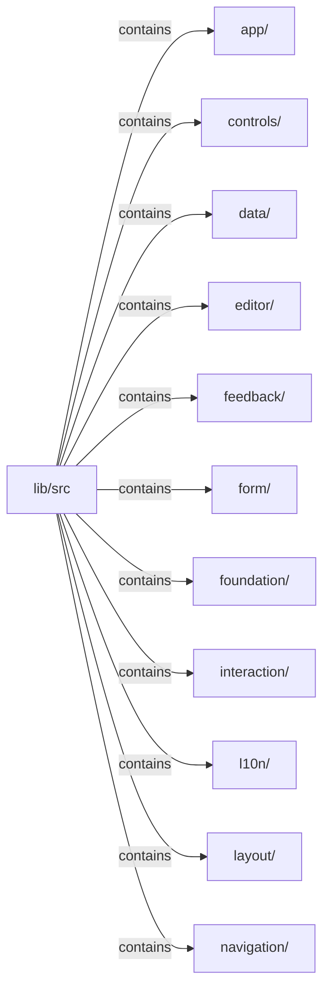
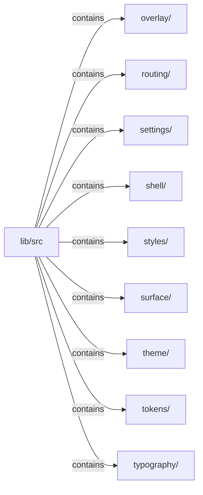

# lib/src：架構分析入口

## 範圍

閱讀 `lib/src` 的直接子目錄與 Dart 檔案。結構圖表示實際檔案包含關係；依賴圖表示本層檔案明寫的 directives。每個檔案頁另列直接依賴、宣告、欄位、方法、建構子及行號證據。

## 本層直接依賴圖

箭頭以本層 Dart 檔案明寫的 directive 彙總到目標所在目錄或外部套件邊界；不遞迴將子目錄依賴算入本層。相同目標的不同 directive 類型分開計數。

本層檔案未宣告跨目錄依賴；子目錄依賴請循下一層入口閱讀。

| 目標邊界 | 關係 | directive 數 | 第一筆來源證據 |
|---|---|---|---|
| 無 | — | 0 | 來源清單見本層檔案 |

## 目錄結構圖

## 子目錄

| 目錄 | 導航 | 來源證據 |
|---|---|---|
| `app/` | [架構入口](app/README.md) | [來源目錄](../../../lib/src/app) |
| `controls/` | [架構入口](controls/README.md) | [來源目錄](../../../lib/src/controls) |
| `data/` | [架構入口](data/README.md) | [來源目錄](../../../lib/src/data) |
| `editor/` | [架構入口](editor/README.md) | [來源目錄](../../../lib/src/editor) |
| `feedback/` | [架構入口](feedback/README.md) | [來源目錄](../../../lib/src/feedback) |
| `form/` | [架構入口](form/README.md) | [來源目錄](../../../lib/src/form) |
| `foundation/` | [架構入口](foundation/README.md) | [來源目錄](../../../lib/src/foundation) |
| `interaction/` | [架構入口](interaction/README.md) | [來源目錄](../../../lib/src/interaction) |
| `l10n/` | [架構入口](l10n/README.md) | [來源目錄](../../../lib/src/l10n) |
| `layout/` | [架構入口](layout/README.md) | [來源目錄](../../../lib/src/layout) |
| `navigation/` | [架構入口](navigation/README.md) | [來源目錄](../../../lib/src/navigation) |
| `overlay/` | [架構入口](overlay/README.md) | [來源目錄](../../../lib/src/overlay) |
| `routing/` | [架構入口](routing/README.md) | [來源目錄](../../../lib/src/routing) |
| `settings/` | [架構入口](settings/README.md) | [來源目錄](../../../lib/src/settings) |
| `shell/` | [架構入口](shell/README.md) | [來源目錄](../../../lib/src/shell) |
| `styles/` | [架構入口](styles/README.md) | [來源目錄](../../../lib/src/styles) |
| `surface/` | [架構入口](surface/README.md) | [來源目錄](../../../lib/src/surface) |
| `theme/` | [架構入口](theme/README.md) | [來源目錄](../../../lib/src/theme) |
| `tokens/` | [架構入口](tokens/README.md) | [來源目錄](../../../lib/src/tokens) |
| `typography/` | [架構入口](typography/README.md) | [來源目錄](../../../lib/src/typography) |

## 本層檔案

| 檔案 | 宣告 | 細節 | 來源證據 |
|---|---|---|---|
| 無 | 本層沒有 Dart 檔案 | — | — |

## 閱讀說明

箭頭只表示來源明寫的靜態關係；import 不等於呼叫。未分析動態呼叫、欄位的實際物件擁有權、狀態轉移或渲染流程；型別未進行語意解析，繼承目標保留原始型別拼寫。public／private 依 Dart 名稱前綴判斷；public 宣告不代表已由 `lib/kallopis.dart` 匯出。

本頁的目錄與檔案由來源清冊產生；`manifest.json` 位於本圖集根目錄，可核對 SHA-256 與覆蓋數。人工模組摘要存於 `tool/architecture_atlas/briefs/`，重新生成時保留。
