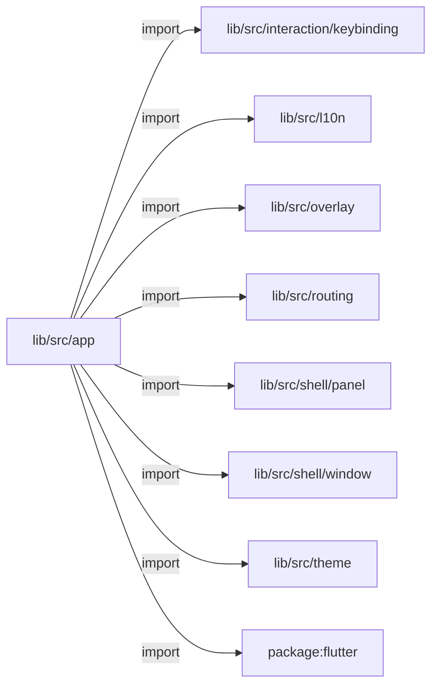
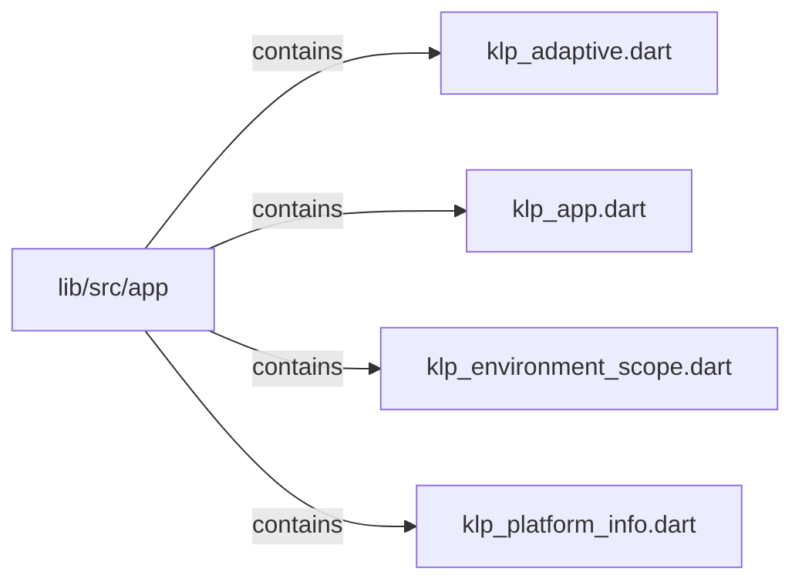

# lib/src/app：架構分析入口

[上一層](../README.md)

## 範圍

閱讀 `lib/src/app` 的直接子目錄與 Dart 檔案。結構圖表示實際檔案包含關係；依賴圖表示本層檔案明寫的 directives。每個檔案頁另列直接依賴、宣告、欄位、方法、建構子及行號證據。

## 模組閱讀重點

## 分析入口

`app/` 由 `KlpApp` 組合環境 scope、App 控制 scope、MaterialApp、風格、語系、可選路由與視窗標頭；Panel Tree 內容由透明 Material 提供文字與互動祖先。`KlpEnvironmentScope` 只提供執行平台，`KlpAppController` 管理明暗模式，視覺 token 仍由 theme 模組解析。`KlpAdaptive` 只選平台分支，各分支回傳 `KlpPanelLayout`；此目錄無巢狀子目錄。

| 想查的問題 | 符號與來源 |
| --- | --- |
| App 與明暗控制的入口？ | KlpApp／KlpAppController — `lib/src/app/klp_app.dart:83`、`lib/src/app/klp_app.dart:17` |
| 平台如何注入與讀取？ | KlpEnvironmentScope／KlpEnvironmentContext.klpPlatform — `lib/src/app/klp_environment_scope.dart:6`、`lib/src/app/klp_environment_scope.dart:36` |
| 平台來源與分支在哪？ | KlpPlatformInfo.current／KlpAdaptive.build — `lib/src/app/klp_platform_info.dart:11`、`lib/src/app/klp_adaptive.dart:27` |
| 路由、Material 與主題如何組裝？ | _KlpAppState.build — `lib/src/app/klp_app.dart:243` |

重要關係：

- `_KlpAppState.build` → `KlpEnvironmentScope` → `KlpAppScope` → MaterialApp：平台環境與 App 控制分開注入；`buildKlpTheme` 建立目前明暗的視覺值（`lib/src/app/klp_app.dart:284`、`lib/src/app/klp_app.dart:295`）。
- `context.klpPlatform` → `KlpEnvironmentScope.of`：訂閱最近環境，缺席時拋錯；尺寸、safe area、縮放與語系仍讀當前子樹的 MediaQuery／Localizations，不在 scope 複製（`lib/src/app/klp_environment_scope.dart:16`、`lib/src/app/klp_environment_scope.dart:36`）。
- `KlpAdaptive.build` → 環境平台 → windows／android／other builder：未提供 other 時回退 windows；分支內用 LayoutBuilder 處理局部尺寸。舊 `KlpAppScope.platformOf` 僅保留相容回退（`lib/src/app/klp_adaptive.dart:27`、`lib/src/app/klp_app.dart:403`）。

閱讀時區分組裝呼叫與 import 依賴；import 箭頭不表示執行先後。

## 本層直接依賴圖

箭頭以本層 Dart 檔案明寫的 directive 彙總到目標所在目錄或外部套件邊界；不遞迴將子目錄依賴算入本層。相同目標的不同 directive 類型分開計數。

| 目標邊界 | 關係 | directive 數 | 第一筆來源證據 |
|---|---|---|---|
| <code>lib/src/interaction/keybinding</code> | import | 1 | [lib/src/app/klp_app.dart:12](../../../../lib/src/app/klp_app.dart#L12) |
| <code>lib/src/l10n</code> | import | 1 | [lib/src/app/klp_app.dart:3](../../../../lib/src/app/klp_app.dart#L3) |
| <code>lib/src/overlay</code> | import | 1 | [lib/src/app/klp_app.dart:4](../../../../lib/src/app/klp_app.dart#L4) |
| <code>lib/src/routing</code> | import | 1 | [lib/src/app/klp_app.dart:5](../../../../lib/src/app/klp_app.dart#L5) |
| <code>lib/src/shell/panel</code> | import | 2 | [lib/src/app/klp_adaptive.dart:6](../../../../lib/src/app/klp_adaptive.dart#L6) |
| <code>lib/src/shell/window</code> | import | 1 | [lib/src/app/klp_app.dart:6](../../../../lib/src/app/klp_app.dart#L6) |
| <code>lib/src/theme</code> | import | 2 | [lib/src/app/klp_app.dart:7](../../../../lib/src/app/klp_app.dart#L7) |
| <code>package:flutter</code> | import | 4 | [lib/src/app/klp_adaptive.dart:1](../../../../lib/src/app/klp_adaptive.dart#L1) |

### 同目錄依賴

| 來源 → 目標 | 關係 | 證據 |
|---|---|---|
| <code>klp_adaptive.dart → klp_app.dart</code> | import | [lib/src/app/klp_adaptive.dart:3](../../../../lib/src/app/klp_adaptive.dart#L3) |
| <code>klp_adaptive.dart → klp_environment_scope.dart</code> | import | [lib/src/app/klp_adaptive.dart:4](../../../../lib/src/app/klp_adaptive.dart#L4) |
| <code>klp_adaptive.dart → klp_platform_info.dart</code> | import | [lib/src/app/klp_adaptive.dart:5](../../../../lib/src/app/klp_adaptive.dart#L5) |
| <code>klp_app.dart → klp_platform_info.dart</code> | import | [lib/src/app/klp_app.dart:9](../../../../lib/src/app/klp_app.dart#L9) |
| <code>klp_app.dart → klp_environment_scope.dart</code> | import | [lib/src/app/klp_app.dart:10](../../../../lib/src/app/klp_app.dart#L10) |
| <code>klp_environment_scope.dart → klp_platform_info.dart</code> | import | [lib/src/app/klp_environment_scope.dart:3](../../../../lib/src/app/klp_environment_scope.dart#L3) |

## 目錄結構圖

## 子目錄

| 目錄 | 導航 | 來源證據 |
|---|---|---|
| 無 | 目前沒有下一層目錄 | — |

## 本層檔案

| 檔案 | 宣告 | 細節 | 來源證據 |
|---|---|---|---|
| `klp_adaptive.dart` | KlpAdaptiveBuilder, KlpAdaptive | [架構與 API](klp_adaptive.md) | [lib/src/app/klp_adaptive.dart:1](../../../../lib/src/app/klp_adaptive.dart#L1) |
| `klp_app.dart` | KlpAppController, KlpApp, _KlpAppState, _KlpAppFrame, KlpAppScope | [架構與 API](klp_app.md) | [lib/src/app/klp_app.dart:1](../../../../lib/src/app/klp_app.dart#L1) |
| `klp_environment_scope.dart` | KlpEnvironmentScope, KlpEnvironmentContext | [架構與 API](klp_environment_scope.md) | [lib/src/app/klp_environment_scope.dart:1](../../../../lib/src/app/klp_environment_scope.dart#L1) |
| `klp_platform_info.dart` | KlpAppPlatform, KlpPlatformInfo | [架構與 API](klp_platform_info.md) | [lib/src/app/klp_platform_info.dart:1](../../../../lib/src/app/klp_platform_info.dart#L1) |

## 閱讀說明

箭頭只表示來源明寫的靜態關係；import 不等於呼叫。未分析動態呼叫、欄位的實際物件擁有權、狀態轉移或渲染流程；型別未進行語意解析，繼承目標保留原始型別拼寫。public／private 依 Dart 名稱前綴判斷；public 宣告不代表已由 `lib/kallopis.dart` 匯出。

本頁的目錄與檔案由來源清冊產生；`manifest.json` 位於本圖集根目錄，可核對 SHA-256 與覆蓋數。人工模組摘要存於 `tool/architecture_atlas/briefs/`，重新生成時保留。
