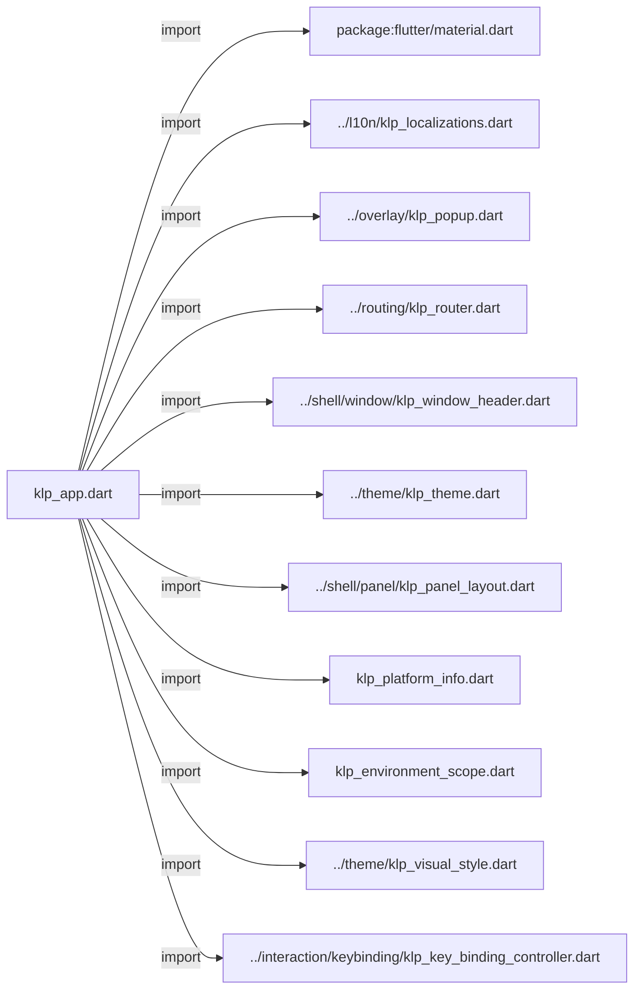
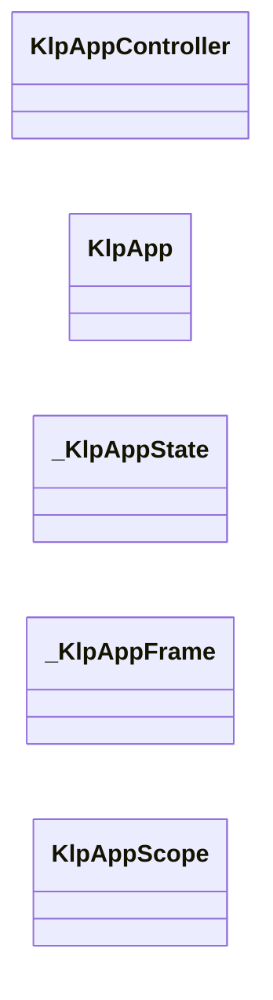
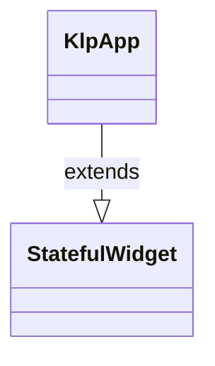
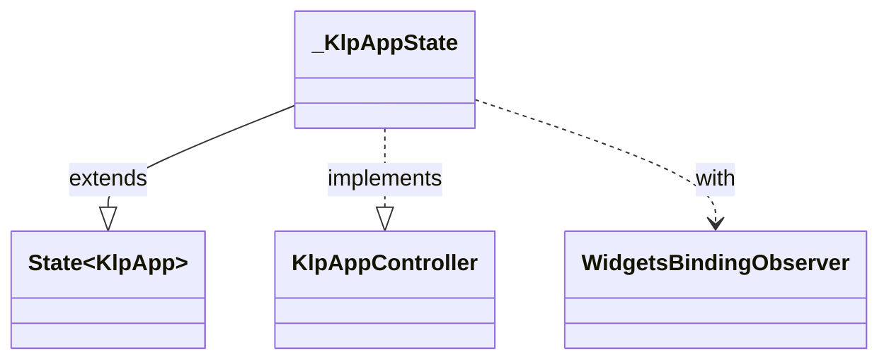
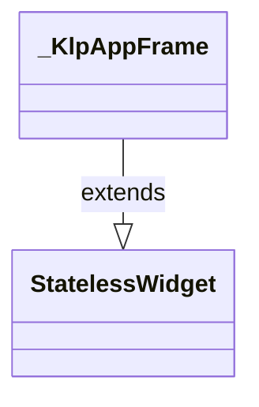
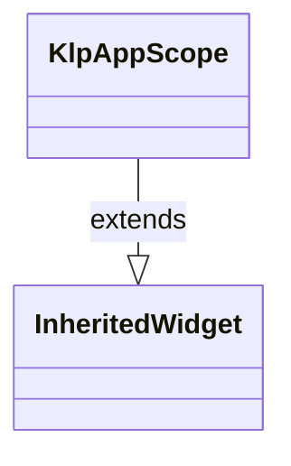

# klp_app.dart：直接依賴與宣告架構

[回到目錄](README.md) · [來源檔案](../../../../lib/src/app/klp_app.dart)

## 範圍

核心是 `lib/src/app/klp_app.dart`。主要視角為該檔案明寫的 import／export／part；輔助視角為本檔宣告及 extends／implements／with／on 關係。只展開一層外部邊界。

## 直接依賴圖



## 依賴證據

| 關係 | 原始 directive | 來源 |
|---|---|---|
| import | <code>import &#x27;package:flutter/material.dart&#x27;;</code> | [lib/src/app/klp_app.dart:1](../../../../lib/src/app/klp_app.dart#L1) |
| import | <code>import &#x27;../l10n/klp_localizations.dart&#x27;;</code> | [lib/src/app/klp_app.dart:3](../../../../lib/src/app/klp_app.dart#L3) |
| import | <code>import &#x27;../overlay/klp_popup.dart&#x27;;</code> | [lib/src/app/klp_app.dart:4](../../../../lib/src/app/klp_app.dart#L4) |
| import | <code>import &#x27;../routing/klp_router.dart&#x27;;</code> | [lib/src/app/klp_app.dart:5](../../../../lib/src/app/klp_app.dart#L5) |
| import | <code>import &#x27;../shell/window/klp_window_header.dart&#x27;;</code> | [lib/src/app/klp_app.dart:6](../../../../lib/src/app/klp_app.dart#L6) |
| import | <code>import &#x27;../theme/klp_theme.dart&#x27;;</code> | [lib/src/app/klp_app.dart:7](../../../../lib/src/app/klp_app.dart#L7) |
| import | <code>import &#x27;../shell/panel/klp_panel_layout.dart&#x27;;</code> | [lib/src/app/klp_app.dart:8](../../../../lib/src/app/klp_app.dart#L8) |
| import | <code>import &#x27;klp_platform_info.dart&#x27;;</code> | [lib/src/app/klp_app.dart:9](../../../../lib/src/app/klp_app.dart#L9) |
| import | <code>import &#x27;klp_environment_scope.dart&#x27;;</code> | [lib/src/app/klp_app.dart:10](../../../../lib/src/app/klp_app.dart#L10) |
| import | <code>import &#x27;../theme/klp_visual_style.dart&#x27;;</code> | [lib/src/app/klp_app.dart:11](../../../../lib/src/app/klp_app.dart#L11) |
| import | <code>import &#x27;../interaction/keybinding/klp_key_binding_controller.dart&#x27;;</code> | [lib/src/app/klp_app.dart:12](../../../../lib/src/app/klp_app.dart#L12) |

## 宣告關係圖

本組節點是本檔宣告；沒有箭頭的宣告未在此圖主張互相依賴。












## 宣告與成員證據

成員包含 public 與 private；簽章取自來源，省略函式本體與欄位初始值。`(inferred)` 表示來源未明寫型別；建構子只顯示參數部分，不含初始化列表。

### KlpAppController

ClassDeclaration · public · [lib/src/app/klp_app.dart:14](../../../../lib/src/app/klp_app.dart#L14)

<code>abstract class KlpAppController</code>

來源註解摘要：[KlpApp] 對外的控制面。 只暴露「目前是什麼」與「切換」，不暴露 [KlpVisualStyle] 或 `ThemeData` 本身； 消費者透過 [KlpApp.lightStyle] 與 [KlpApp.darkStyle] 注入完整風格。


| 成員 | 可見性 | 簽章／型別 | 來源註解摘要 | 證據 |
|---|---|---|---|---|
| getter <code>brightness</code> | public | <code>Brightness get brightness</code> | 目前實際套用的明暗（[ThemeMode.system] 時已解析成 [Brightness.light] 或 [Brightness.dark]）。 | [lib/src/app/klp_app.dart:19](../../../../lib/src/app/klp_app.dart#L19) |
| getter <code>themeMode</code> | public | <code>ThemeMode get themeMode</code> | 目前的 [ThemeMode]。與 [brightness] 的差別：這個可能是 [ThemeMode.system]。 | [lib/src/app/klp_app.dart:23](../../../../lib/src/app/klp_app.dart#L23) |
| method <code>toggleBrightness</code> | public | <code>void toggleBrightness()</code> | 在淺色／深色之間切換。若目前是 [ThemeMode.system]，切換後固定為明確的 [ThemeMode.light] 或 [ThemeMode.dark]（切換到目前 [brightness] 的反面）—— 「切換」是使用者的明確動作，不該切完又被系統設定蓋回去。 | [lib/src/app/klp_app.dart:26](../../../../lib/src/app/klp_app.dart#L26) |
| method <code>setThemeMode</code> | public | <code>void setThemeMode(ThemeMode mode)</code> | 直接指定 [ThemeMode]，包含切回 [ThemeMode.system]。 | [lib/src/app/klp_app.dart:31](../../../../lib/src/app/klp_app.dart#L31) |
| getter <code>keyBindings</code> | public | <code>KlpKeyBindingController get keyBindings</code> | App 內集中管理 app／page／region 快捷鍵的 controller。 | [lib/src/app/klp_app.dart:34](../../../../lib/src/app/klp_app.dart#L34) |

### KlpApp

ClassDeclaration · public · [lib/src/app/klp_app.dart:38](../../../../lib/src/app/klp_app.dart#L38)

<code>class KlpApp extends StatefulWidget</code>

來源註解摘要：`MaterialApp` 的接入層，收掉每個消費者都得自己組一次的樣板。 沒有它時，消費者要自己：套 `buildKlpTheme` 的亮／暗兩份 `ThemeData`、記得把 `themeAnimationDuration` 歸零（否則主題切換的動畫中途會有半數幀停在舊值上， 見 README「深淺切換不做過場」）、決定明暗狀態放哪裡並手刻切換入口、如果用了 [KlpRouter] 還要自己架 [KlpRouterScope]。這些細節不涉及任何產品語意，每個 `-ist` 產品各刻一次只會讓實作各自漂移——因此收進庫。 ## 最小用法 ```dart KlpApp( home: KlpPanelFrame(content: const MyHomePage()), ) ``` ## 搭配 router 給了 [router] 但沒給 [home] 時，自動以 [KlpRouterOutlet] 當作首頁； 兩者都給時，[home] 仍會被包在 [KlpRouterScope] 之下，因此 [home] 的子樹 裡任何位置都能用 `context.klpRouter`（[KlpRouterOutlet] 放在哪一層由消費者 自己決定）。 ```dart KlpApp( router: KlpRouter( routes: [ KlpRoute( id: &#x27;home&#x27;, builder: (_) =&gt; KlpPanelFrame(content: const HomePage()), ), ], initialId: &#x27;home&#x27;, ), ) ``` ## 切換明暗 ```

- `extends` → <code>StatefulWidget</code>：[lib/src/app/klp_app.dart:85](../../../../lib/src/app/klp_app.dart#L85)

| 成員 | 可見性 | 簽章／型別 | 來源註解摘要 | 證據 |
|---|---|---|---|---|
| constructor <code>KlpApp</code> | public | <code>const KlpApp({ super.key, this.style = KlpVisualStyle.defaultStyle, this.lightStyle, this.darkStyle, this.initialThemeMode = ThemeMode.light, this.keyBindingController, this.router, this.home, this.popup, this.title = &#x27;&#x27;, this.appIcon, this.showWindowHeader = true, this.headerActions, this.windowHeader, this.onMinimize, this.onToggleMaximize, this.onClose, this.isMaximized = false, this.showWindowControls = true, this.startMaximized = true, this.minWidth, this.minHeight, this.locale, this.localizationsDelegates, this.supportedLocales = const &lt;Locale&gt;[Locale(&#x27;en&#x27;, &#x27;US&#x27;)], this.builder, this.debugShowCheckedModeBanner = true, })</code> |  | [lib/src/app/klp_app.dart:86](../../../../lib/src/app/klp_app.dart#L86) |
| field <code>style</code> | public | <code>final KlpVisualStyle style</code> | 向後相容的共用風格基底；未提供對應的完整風格時，色彩仍隨明暗套用內建值。 | [lib/src/app/klp_app.dart:118](../../../../lib/src/app/klp_app.dart#L118) |
| field <code>lightStyle</code> | public | <code>final KlpVisualStyle? lightStyle</code> | 淺色模式的完整視覺風格；提供後不會被 [style] 或內建色彩改寫。 | [lib/src/app/klp_app.dart:121](../../../../lib/src/app/klp_app.dart#L121) |
| field <code>darkStyle</code> | public | <code>final KlpVisualStyle? darkStyle</code> | 深色模式的完整視覺風格；提供後不會被 [style] 或內建色彩改寫。 | [lib/src/app/klp_app.dart:124](../../../../lib/src/app/klp_app.dart#L124) |
| field <code>initialThemeMode</code> | public | <code>final ThemeMode initialThemeMode</code> | 啟動時的明暗狀態。 | [lib/src/app/klp_app.dart:127](../../../../lib/src/app/klp_app.dart#L127) |
| field <code>keyBindingController</code> | public | <code>final KlpKeyBindingController? keyBindingController</code> | 可選的快捷鍵 controller；未提供時由 [KlpApp] 建立並管理生命週期。 | [lib/src/app/klp_app.dart:130](../../../../lib/src/app/klp_app.dart#L130) |
| field <code>router</code> | public | <code>final KlpRouter? router</code> | 選擇性的分發器。給了就自動架好 [KlpRouterScope]，見類別 dartdoc。 | [lib/src/app/klp_app.dart:133](../../../../lib/src/app/klp_app.dart#L133) |
| field <code>home</code> | public | <code>final KlpPanelLayout? home</code> | 首頁內容。[router] 存在且這裡未給值時，退回 [KlpRouterOutlet]。 | [lib/src/app/klp_app.dart:136](../../../../lib/src/app/klp_app.dart#L136) |
| field <code>popup</code> | public | <code>final KlpPopupBackground? popup</code> | 選擇性的 App 層 popup；顯示時仍會讓視窗標題列保有拖動與雙擊優先權。 | [lib/src/app/klp_app.dart:139](../../../../lib/src/app/klp_app.dart#L139) |
| field <code>title</code> | public | <code>final String title</code> |  | [lib/src/app/klp_app.dart:141](../../../../lib/src/app/klp_app.dart#L141) |
| field <code>appIcon</code> | public | <code>final Widget? appIcon</code> | 應用程式圖示內容；標題列尺寸由目前 [style] 的 shell geometry 決定。 | [lib/src/app/klp_app.dart:144](../../../../lib/src/app/klp_app.dart#L144) |
| field <code>showWindowHeader</code> | public | <code>final bool showWindowHeader</code> | 是否顯示自帶的頂部視窗標題列（預設為 true）。 | [lib/src/app/klp_app.dart:147](../../../../lib/src/app/klp_app.dart#L147) |
| field <code>headerActions</code> | public | <code>final List&lt;Widget&gt;? headerActions</code> | 標題列頂部自訂快捷按鈕。 | [lib/src/app/klp_app.dart:150](../../../../lib/src/app/klp_app.dart#L150) |
| field <code>windowHeader</code> | public | <code>final Widget? windowHeader</code> | 完全自訂的視窗標題列 Widget（提供時覆蓋預設產生的 [KlpWindowHeader]）。 | [lib/src/app/klp_app.dart:153](../../../../lib/src/app/klp_app.dart#L153) |
| field <code>onMinimize</code> | public | <code>final VoidCallback? onMinimize</code> | 視窗最小化回呼。 | [lib/src/app/klp_app.dart:156](../../../../lib/src/app/klp_app.dart#L156) |
| field <code>onToggleMaximize</code> | public | <code>final VoidCallback? onToggleMaximize</code> | 視窗最大化／還原回呼。 | [lib/src/app/klp_app.dart:159](../../../../lib/src/app/klp_app.dart#L159) |
| field <code>onClose</code> | public | <code>final VoidCallback? onClose</code> | 視窗關閉回呼。 | [lib/src/app/klp_app.dart:162](../../../../lib/src/app/klp_app.dart#L162) |
| field <code>isMaximized</code> | public | <code>final bool isMaximized</code> | 視窗是否處於最大化狀態。 | [lib/src/app/klp_app.dart:165](../../../../lib/src/app/klp_app.dart#L165) |
| field <code>showWindowControls</code> | public | <code>final bool showWindowControls</code> | 是否在標題列展示視窗管理控制鈕。 | [lib/src/app/klp_app.dart:168](../../../../lib/src/app/klp_app.dart#L168) |
| field <code>startMaximized</code> | public | <code>final bool startMaximized</code> | 是否在首次建立時確保原生視窗最大化；已最大化時不會切換回視窗化。 | [lib/src/app/klp_app.dart:171](../../../../lib/src/app/klp_app.dart#L171) |
| field <code>minWidth</code> | public | <code>final double? minWidth</code> | 視窗最小允許寬度（邏輯像素）。 | [lib/src/app/klp_app.dart:174](../../../../lib/src/app/klp_app.dart#L174) |
| field <code>minHeight</code> | public | <code>final double? minHeight</code> | 視窗最小允許高度（邏輯像素）。 | [lib/src/app/klp_app.dart:177](../../../../lib/src/app/klp_app.dart#L177) |
| field <code>locale</code> | public | <code>final Locale? locale</code> |  | [lib/src/app/klp_app.dart:179](../../../../lib/src/app/klp_app.dart#L179) |
| field <code>localizationsDelegates</code> | public | <code>final Iterable&lt;LocalizationsDelegate&lt;dynamic&gt;&gt;? localizationsDelegates</code> | 額外的 localization delegate。[KlpApp] 會把這些 delegate 排在內建預設值前面， 因此消費者提供的 [KlpLocalizationsDelegate] 會優先覆寫預設字串；其他資源型別也會合併載入。 | [lib/src/app/klp_app.dart:183](../../../../lib/src/app/klp_app.dart#L183) |
| field <code>supportedLocales</code> | public | <code>final Iterable&lt;Locale&gt; supportedLocales</code> |  | [lib/src/app/klp_app.dart:184](../../../../lib/src/app/klp_app.dart#L184) |
| field <code>builder</code> | public | <code>final TransitionBuilder? builder</code> |  | [lib/src/app/klp_app.dart:185](../../../../lib/src/app/klp_app.dart#L185) |
| field <code>debugShowCheckedModeBanner</code> | public | <code>final bool debugShowCheckedModeBanner</code> |  | [lib/src/app/klp_app.dart:186](../../../../lib/src/app/klp_app.dart#L186) |
| method <code>of</code> | public | <code>static KlpAppController of(BuildContext context)</code> | 取得目前的 [KlpAppController]，通常用來切換明暗。 呼叫端會在 [brightness] 或 [themeMode] 改變時自動重建——這是 `InheritedWidget` 的標準行為，不需要另外訂閱。 | [lib/src/app/klp_app.dart:188](../../../../lib/src/app/klp_app.dart#L188) |
| method <code>createState</code> | public | <code>State&lt;KlpApp&gt; createState()</code> |  | [lib/src/app/klp_app.dart:200](../../../../lib/src/app/klp_app.dart#L200) |

### _KlpAppState

ClassDeclaration · private · [lib/src/app/klp_app.dart:204](../../../../lib/src/app/klp_app.dart#L204)

<code>class _KlpAppState extends State&lt;KlpApp&gt; with WidgetsBindingObserver implements KlpAppController</code>

- `extends` → <code>State&lt;KlpApp&gt;</code>：[lib/src/app/klp_app.dart:204](../../../../lib/src/app/klp_app.dart#L204)
- `implements` → <code>KlpAppController</code>：[lib/src/app/klp_app.dart:204](../../../../lib/src/app/klp_app.dart#L204)
- `with` → <code>WidgetsBindingObserver</code>：[lib/src/app/klp_app.dart:204](../../../../lib/src/app/klp_app.dart#L204)

| 成員 | 可見性 | 簽章／型別 | 來源註解摘要 | 證據 |
|---|---|---|---|---|
| field <code>_themeMode</code> | private | <code>late ThemeMode _themeMode</code> |  | [lib/src/app/klp_app.dart:205](../../../../lib/src/app/klp_app.dart#L205) |
| field <code>_keyBindings</code> | private | <code>late KlpKeyBindingController _keyBindings</code> |  | [lib/src/app/klp_app.dart:206](../../../../lib/src/app/klp_app.dart#L206) |
| field <code>_ownsKeyBindings</code> | private | <code>bool _ownsKeyBindings</code> |  | [lib/src/app/klp_app.dart:207](../../../../lib/src/app/klp_app.dart#L207) |
| method <code>initState</code> | public | <code>void initState()</code> |  | [lib/src/app/klp_app.dart:209](../../../../lib/src/app/klp_app.dart#L209) |
| method <code>dispose</code> | public | <code>void dispose()</code> |  | [lib/src/app/klp_app.dart:225](../../../../lib/src/app/klp_app.dart#L225) |
| method <code>didChangePlatformBrightness</code> | public | <code>void didChangePlatformBrightness()</code> |  | [lib/src/app/klp_app.dart:232](../../../../lib/src/app/klp_app.dart#L232) |
| method <code>didUpdateWidget</code> | public | <code>void didUpdateWidget(covariant KlpApp oldWidget)</code> |  | [lib/src/app/klp_app.dart:239](../../../../lib/src/app/klp_app.dart#L239) |
| getter <code>themeMode</code> | public | <code>ThemeMode get themeMode</code> |  | [lib/src/app/klp_app.dart:256](../../../../lib/src/app/klp_app.dart#L256) |
| getter <code>keyBindings</code> | public | <code>KlpKeyBindingController get keyBindings</code> |  | [lib/src/app/klp_app.dart:259](../../../../lib/src/app/klp_app.dart#L259) |
| getter <code>brightness</code> | public | <code>Brightness get brightness</code> |  | [lib/src/app/klp_app.dart:262](../../../../lib/src/app/klp_app.dart#L262) |
| method <code>toggleBrightness</code> | public | <code>void toggleBrightness()</code> |  | [lib/src/app/klp_app.dart:270](../../../../lib/src/app/klp_app.dart#L270) |
| method <code>setThemeMode</code> | public | <code>void setThemeMode(ThemeMode mode)</code> |  | [lib/src/app/klp_app.dart:279](../../../../lib/src/app/klp_app.dart#L279) |
| method <code>build</code> | public | <code>Widget build(BuildContext context)</code> |  | [lib/src/app/klp_app.dart:284](../../../../lib/src/app/klp_app.dart#L284) |
| method <code>_styleFor</code> | private | <code>KlpVisualStyle _styleFor(Brightness brightness)</code> |  | [lib/src/app/klp_app.dart:364](../../../../lib/src/app/klp_app.dart#L364) |

### _KlpAppFrame

ClassDeclaration · private · [lib/src/app/klp_app.dart:378](../../../../lib/src/app/klp_app.dart#L378)

<code>class _KlpAppFrame extends StatelessWidget</code>

來源註解摘要：鋪設 App background，並以 appFrameInset padding 包住 Header 與產品主內容。

- `extends` → <code>StatelessWidget</code>：[lib/src/app/klp_app.dart:379](../../../../lib/src/app/klp_app.dart#L379)

| 成員 | 可見性 | 簽章／型別 | 來源註解摘要 | 證據 |
|---|---|---|---|---|
| constructor <code>_KlpAppFrame</code> | private | <code>const _KlpAppFrame({ required this.header, required this.body, required this.toolbarHeight, this.popup, })</code> |  | [lib/src/app/klp_app.dart:380](../../../../lib/src/app/klp_app.dart#L380) |
| field <code>header</code> | public | <code>final Widget? header</code> |  | [lib/src/app/klp_app.dart:387](../../../../lib/src/app/klp_app.dart#L387) |
| field <code>body</code> | public | <code>final Widget body</code> |  | [lib/src/app/klp_app.dart:388](../../../../lib/src/app/klp_app.dart#L388) |
| field <code>toolbarHeight</code> | public | <code>final double toolbarHeight</code> |  | [lib/src/app/klp_app.dart:389](../../../../lib/src/app/klp_app.dart#L389) |
| field <code>popup</code> | public | <code>final KlpPopupBackground? popup</code> |  | [lib/src/app/klp_app.dart:390](../../../../lib/src/app/klp_app.dart#L390) |
| method <code>build</code> | public | <code>Widget build(BuildContext context)</code> |  | [lib/src/app/klp_app.dart:392](../../../../lib/src/app/klp_app.dart#L392) |

### KlpAppScope

ClassDeclaration · public · [lib/src/app/klp_app.dart:448](../../../../lib/src/app/klp_app.dart#L448)

<code>class KlpAppScope extends InheritedWidget</code>

來源註解摘要：供 [KlpApp.of] 查找的 `InheritedWidget`。 [brightness] 與 [themeMode] 是資料欄位而非只有 [controller] 一個引用， 這樣 [updateShouldNotify] 才能在它們改變時真正回傳 `true`，讓依賴它的 子樹重建——只放 controller 引用的話，同一個物件永遠 `==` 自己，不會觸發重建。

- `extends` → <code>InheritedWidget</code>：[lib/src/app/klp_app.dart:453](../../../../lib/src/app/klp_app.dart#L453)

| 成員 | 可見性 | 簽章／型別 | 來源註解摘要 | 證據 |
|---|---|---|---|---|
| constructor <code>KlpAppScope</code> | public | <code>const KlpAppScope({ super.key, required this.controller, required this.platform, required this.brightness, required this.themeMode, required super.child, })</code> |  | [lib/src/app/klp_app.dart:454](../../../../lib/src/app/klp_app.dart#L454) |
| field <code>controller</code> | public | <code>final KlpAppController controller</code> |  | [lib/src/app/klp_app.dart:463](../../../../lib/src/app/klp_app.dart#L463) |
| field <code>platform</code> | public | <code>final KlpPlatformInfo platform</code> | 舊版 scope 的相容欄位；新平台讀取由 KlpEnvironmentScope 提供。 | [lib/src/app/klp_app.dart:465](../../../../lib/src/app/klp_app.dart#L465) |
| field <code>brightness</code> | public | <code>final Brightness brightness</code> |  | [lib/src/app/klp_app.dart:466](../../../../lib/src/app/klp_app.dart#L466) |
| field <code>themeMode</code> | public | <code>final ThemeMode themeMode</code> |  | [lib/src/app/klp_app.dart:467](../../../../lib/src/app/klp_app.dart#L467) |
| method <code>platformOf</code> | public | <code>static KlpPlatformInfo platformOf(BuildContext context)</code> | 相容入口：優先訂閱平台環境，舊有獨立 AppScope 仍可讀取其平台。 | [lib/src/app/klp_app.dart:469](../../../../lib/src/app/klp_app.dart#L469) |
| method <code>updateShouldNotify</code> | public | <code>bool updateShouldNotify(KlpAppScope oldWidget)</code> |  | [lib/src/app/klp_app.dart:480](../../../../lib/src/app/klp_app.dart#L480) |

## 閱讀說明與限制

箭頭只表示來源明寫的靜態關係；import 不等於呼叫。未分析動態呼叫、欄位的實際物件擁有權、狀態轉移或渲染流程；型別未進行語意解析，繼承目標保留原始型別拼寫。public／private 依 Dart 名稱前綴判斷；public 宣告不代表已由 `lib/kallopis.dart` 匯出。

本頁由 `tool/architecture_atlas` 產生；編輯來源或生成工具後重新產生，避免手改本頁。
