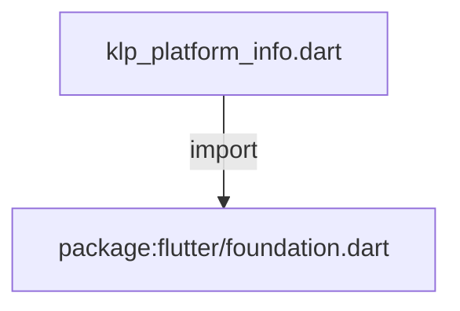
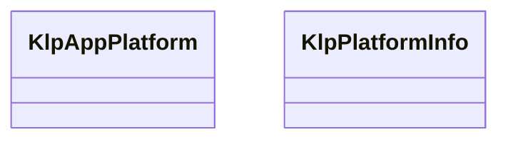

# klp_platform_info.dart：直接依賴與宣告架構

[回到目錄](README.md) · [來源檔案](../../../../lib/src/app/klp_platform_info.dart)

## 範圍

核心是 `lib/src/app/klp_platform_info.dart`。主要視角為該檔案明寫的 import／export／part；輔助視角為本檔宣告及 extends／implements／with／on 關係。只展開一層外部邊界。

## 直接依賴圖

## 依賴證據

| 關係 | 原始 directive | 來源 |
|---|---|---|
| import | <code>import &#x27;package:flutter/foundation.dart&#x27;;</code> | [lib/src/app/klp_platform_info.dart:1](../../../../lib/src/app/klp_platform_info.dart#L1) |

## 宣告關係圖

本組節點是本檔宣告；沒有箭頭的宣告未在此圖主張互相依賴。

## 宣告與成員證據

成員包含 public 與 private；簽章取自來源，省略函式本體與欄位初始值。`(inferred)` 表示來源未明寫型別；建構子只顯示參數部分，不含初始化列表。

### KlpAppPlatform

EnumDeclaration · public · [lib/src/app/klp_platform_info.dart:3](../../../../lib/src/app/klp_platform_info.dart#L3)

<code>enum KlpAppPlatform</code>

來源註解摘要：Kallopis 支援的執行平台分類。

| 成員 | 可見性 | 簽章／型別 | 來源註解摘要 | 證據 |
|---|---|---|---|---|
| enum value <code>android</code> | public | <code>android</code> |  | [lib/src/app/klp_platform_info.dart:4](../../../../lib/src/app/klp_platform_info.dart#L4) |
| enum value <code>ios</code> | public | <code>ios</code> |  | [lib/src/app/klp_platform_info.dart:4](../../../../lib/src/app/klp_platform_info.dart#L4) |
| enum value <code>windows</code> | public | <code>windows</code> |  | [lib/src/app/klp_platform_info.dart:4](../../../../lib/src/app/klp_platform_info.dart#L4) |
| enum value <code>macos</code> | public | <code>macos</code> |  | [lib/src/app/klp_platform_info.dart:4](../../../../lib/src/app/klp_platform_info.dart#L4) |
| enum value <code>linux</code> | public | <code>linux</code> |  | [lib/src/app/klp_platform_info.dart:4](../../../../lib/src/app/klp_platform_info.dart#L4) |
| enum value <code>web</code> | public | <code>web</code> |  | [lib/src/app/klp_platform_info.dart:4](../../../../lib/src/app/klp_platform_info.dart#L4) |
| enum value <code>other</code> | public | <code>other</code> |  | [lib/src/app/klp_platform_info.dart:4](../../../../lib/src/app/klp_platform_info.dart#L4) |

### KlpPlatformInfo

ClassDeclaration · public · [lib/src/app/klp_platform_info.dart:6](../../../../lib/src/app/klp_platform_info.dart#L6)

<code>class KlpPlatformInfo</code>

來源註解摘要：由 Kallopis 環境 scope 注入子樹的執行平台資訊。

| 成員 | 可見性 | 簽章／型別 | 來源註解摘要 | 證據 |
|---|---|---|---|---|
| constructor <code>KlpPlatformInfo</code> | public | <code>const KlpPlatformInfo({required this.platform})</code> |  | [lib/src/app/klp_platform_info.dart:9](../../../../lib/src/app/klp_platform_info.dart#L9) |
| constructor <code>current</code> | public | <code>factory KlpPlatformInfo.current()</code> |  | [lib/src/app/klp_platform_info.dart:11](../../../../lib/src/app/klp_platform_info.dart#L11) |
| field <code>platform</code> | public | <code>final KlpAppPlatform platform</code> |  | [lib/src/app/klp_platform_info.dart:25](../../../../lib/src/app/klp_platform_info.dart#L25) |
| getter <code>isAndroid</code> | public | <code>bool get isAndroid</code> |  | [lib/src/app/klp_platform_info.dart:26](../../../../lib/src/app/klp_platform_info.dart#L26) |
| getter <code>isWindows</code> | public | <code>bool get isWindows</code> |  | [lib/src/app/klp_platform_info.dart:27](../../../../lib/src/app/klp_platform_info.dart#L27) |
| getter <code>isDesktop</code> | public | <code>bool get isDesktop</code> |  | [lib/src/app/klp_platform_info.dart:28](../../../../lib/src/app/klp_platform_info.dart#L28) |
| getter <code>isMobile</code> | public | <code>bool get isMobile</code> |  | [lib/src/app/klp_platform_info.dart:29](../../../../lib/src/app/klp_platform_info.dart#L29) |

## 閱讀說明與限制

箭頭只表示來源明寫的靜態關係；import 不等於呼叫。未分析動態呼叫、欄位的實際物件擁有權、狀態轉移或渲染流程；型別未進行語意解析，繼承目標保留原始型別拼寫。public／private 依 Dart 名稱前綴判斷；public 宣告不代表已由 `lib/kallopis.dart` 匯出。

本頁由 `tool/architecture_atlas` 產生；編輯來源或生成工具後重新產生，避免手改本頁。
