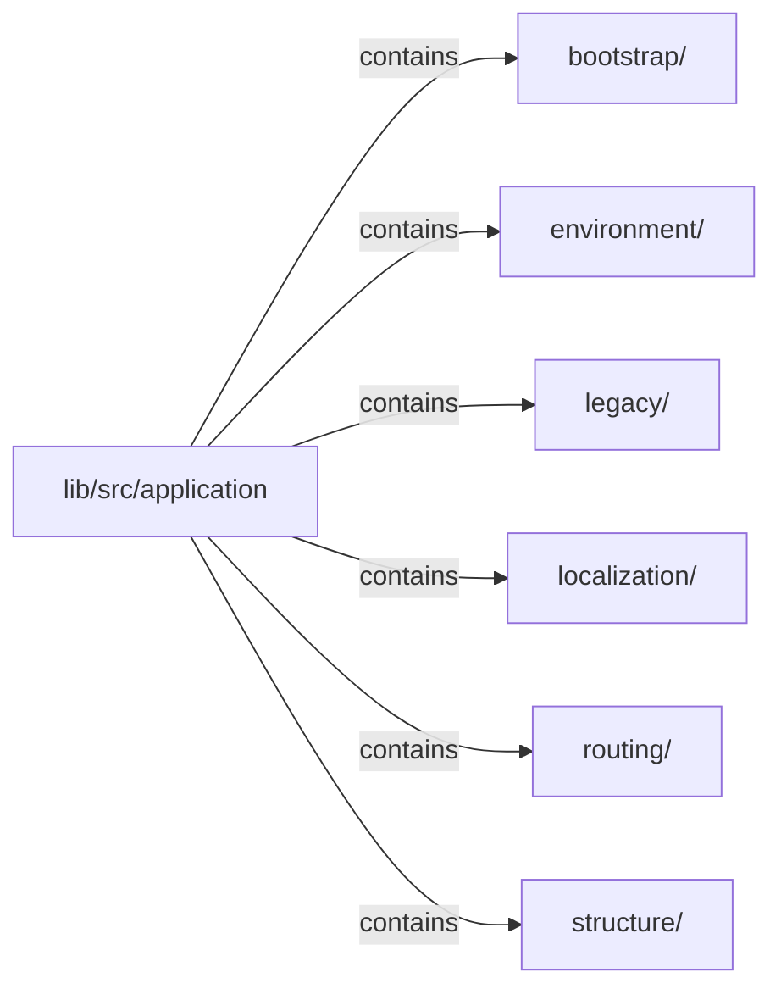

# lib/src/application：架構分析入口

[上一層](../README.md)

## 範圍

閱讀 `lib/src/application` 的直接子目錄與 Dart 檔案。結構圖表示實際檔案包含關係；依賴圖表示本層檔案明寫的 directives。每個檔案頁另列直接依賴、宣告、欄位、方法、建構子及行號證據。

## 模組閱讀重點

## 分析入口

`structure/klp_application.dart` 是唯一 application library 及資料根：包含標題、完整 primitive 風格組、必填 `KlpRouter` 與外部元件定義。單畫面也透過路由映射產生 `KlpScreen`；screen child 必須具備 `KlpScreenBody` 資格。消費端以 `runKlpApp(KlpState<KlpApplication>)` 啟動，再更新同一份宣告資料；不提供 Widget、BuildContext、renderer 或功能 controller 接線。

`routing/klp_router.dart`、`klp_route.dart`、`klp_route_input.dart` 及 bootstrap／host／session 都是主 library 的 parts。`KlpRoute<P, R>` 的私有 mapper 只產生宣告資料；`KlpRouteInput<P, R>` 由私有建構子建立，只借用綁定 entry 的參數與 push／complete／cancel 操作。沒有公開 session、controller 或跨檔案使用的 input factory。

`bootstrap/internal/klp_application_adapters.dart` 集中註冊 screen、rail、scope、retained screens 與外部元件 adapter。私有 host 借用宣告來源並持有私有 application session；session 擁有 navigation machine 及唯一 `KlpTreeRuntime`。初始 guard 成功後才投影畫面；每次導覽或來源更新將全部 retained entries 一同轉成 scoped 樹，避免多個 runtime 的獨立提交。

`klp_application_session_commit.dart` 在整樹準備及安裝成功後採用新路由定義、政策與操作世代；失敗保留已提交畫面與舊操作。router id、初始位置或仍保留目的地的物件身分不能藉來源更新暗中替換。`klp_application_session_actions.dart` 同時檢查已提交世代、目前 entry 與 session 狀態，隱藏或過期輸入不能操作另一個畫面。

宿主以來源世代拒絕舊訂閱的延遲通知；來源替換、初始化失敗與卸載透過 kernel 的生命週期步驟執行器完成清理。個別取消失敗不阻止後續 runtime 釋放或新來源接線，多個錯誤保留各自的原因及堆疊。Widget 來源替換期間的失敗交由 Flutter 錯誤通道回報，讓已提交宿主仍能完成重建。

Router、初始政策、typed entry 結果與平台返回已接入應用程式碼，驗證證據以 [重構進度](../../restructure-progress.md) 為準。網址、深連結、還原、完整環境／語系／能力策略及正式預設風格仍待完成。此入口仍屬 Klp 實驗契約，不代表整庫遷移完成。詳細提交規則見 [導覽交易](../../navigation-transaction-prototype.md)。

## 本層直接依賴圖

箭頭以本層 Dart 檔案明寫的 directive 彙總到目標所在目錄或外部套件邊界；不遞迴將子目錄依賴算入本層。相同目標的不同 directive 類型分開計數。

本層檔案未宣告跨目錄依賴；子目錄依賴請循下一層入口閱讀。

| 目標邊界 | 關係 | directive 數 | 第一筆來源證據 |
|---|---|---|---|
| 無 | — | 0 | 來源清單見本層檔案 |

## 目錄結構圖

## 子目錄

| 目錄 | 導航 | 來源證據 |
|---|---|---|
| `bootstrap/` | [架構入口](bootstrap/README.md) | [來源目錄](../../../../lib/src/application/bootstrap) |
| `environment/` | [架構入口](environment/README.md) | [來源目錄](../../../../lib/src/application/environment) |
| `legacy/` | [架構入口](legacy/README.md) | [來源目錄](../../../../lib/src/application/legacy) |
| `localization/` | [架構入口](localization/README.md) | [來源目錄](../../../../lib/src/application/localization) |
| `routing/` | [架構入口](routing/README.md) | [來源目錄](../../../../lib/src/application/routing) |
| `structure/` | [架構入口](structure/README.md) | [來源目錄](../../../../lib/src/application/structure) |

## 本層檔案

| 檔案 | 宣告 | 細節 | 來源證據 |
|---|---|---|---|
| 無 | 本層沒有 Dart 檔案 | — | — |

## 閱讀說明

箭頭只表示來源明寫的靜態關係；import 不等於呼叫。未分析動態呼叫、欄位的實際物件擁有權、狀態轉移或渲染流程；型別未進行語意解析，繼承目標保留原始型別拼寫。public／private 依 Dart 名稱前綴判斷；public 宣告不代表已由 `lib/kallopis.dart` 匯出。

本頁的目錄與檔案由來源清冊產生；`manifest.json` 位於本圖集根目錄，可核對 SHA-256 與覆蓋數。人工模組摘要存於 `tool/architecture_atlas/briefs/`，重新生成時保留。
