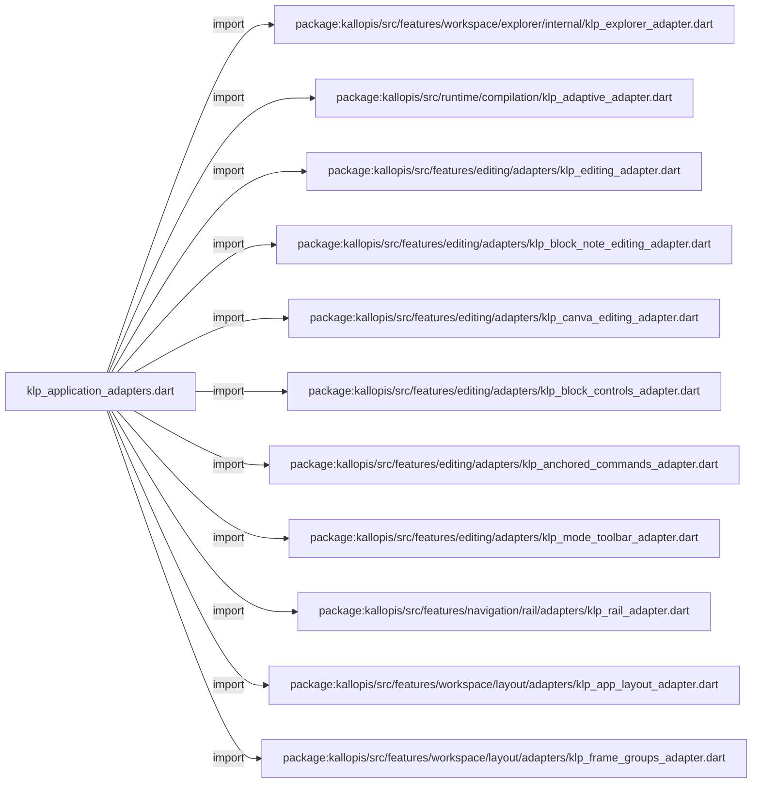
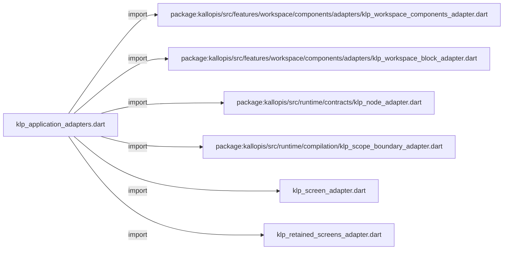

# klp_application_adapters.dart：直接依賴與宣告架構

[回到目錄](README.md) · [來源檔案](../../../../../../lib/src/application/bootstrap/internal/klp_application_adapters.dart)

## 範圍

核心是 `lib/src/application/bootstrap/internal/klp_application_adapters.dart`。主要視角為該檔案明寫的 import／export／part；輔助視角為本檔宣告及 extends／implements／with／on 關係。只展開一層外部邊界。

## 直接依賴圖

## 依賴證據

| 關係 | 原始 directive | 來源 |
|---|---|---|
| import | <code>import &#x27;package:kallopis/src/features/workspace/explorer/internal/klp_explorer_adapter.dart&#x27;;</code> | [lib/src/application/bootstrap/internal/klp_application_adapters.dart:1](../../../../../../lib/src/application/bootstrap/internal/klp_application_adapters.dart#L1) |
| import | <code>import &#x27;package:kallopis/src/runtime/compilation/klp_adaptive_adapter.dart&#x27;;</code> | [lib/src/application/bootstrap/internal/klp_application_adapters.dart:2](../../../../../../lib/src/application/bootstrap/internal/klp_application_adapters.dart#L2) |
| import | <code>import &#x27;package:kallopis/src/features/editing/adapters/klp_editing_adapter.dart&#x27;;</code> | [lib/src/application/bootstrap/internal/klp_application_adapters.dart:3](../../../../../../lib/src/application/bootstrap/internal/klp_application_adapters.dart#L3) |
| import | <code>import &#x27;package:kallopis/src/features/editing/adapters/klp_block_note_editing_adapter.dart&#x27;;</code> | [lib/src/application/bootstrap/internal/klp_application_adapters.dart:4](../../../../../../lib/src/application/bootstrap/internal/klp_application_adapters.dart#L4) |
| import | <code>import &#x27;package:kallopis/src/features/editing/adapters/klp_canva_editing_adapter.dart&#x27;;</code> | [lib/src/application/bootstrap/internal/klp_application_adapters.dart:5](../../../../../../lib/src/application/bootstrap/internal/klp_application_adapters.dart#L5) |
| import | <code>import &#x27;package:kallopis/src/features/editing/adapters/klp_block_controls_adapter.dart&#x27;;</code> | [lib/src/application/bootstrap/internal/klp_application_adapters.dart:6](../../../../../../lib/src/application/bootstrap/internal/klp_application_adapters.dart#L6) |
| import | <code>import &#x27;package:kallopis/src/features/editing/adapters/klp_anchored_commands_adapter.dart&#x27;;</code> | [lib/src/application/bootstrap/internal/klp_application_adapters.dart:7](../../../../../../lib/src/application/bootstrap/internal/klp_application_adapters.dart#L7) |
| import | <code>import &#x27;package:kallopis/src/features/editing/adapters/klp_mode_toolbar_adapter.dart&#x27;;</code> | [lib/src/application/bootstrap/internal/klp_application_adapters.dart:8](../../../../../../lib/src/application/bootstrap/internal/klp_application_adapters.dart#L8) |
| import | <code>import &#x27;package:kallopis/src/features/navigation/rail/adapters/klp_rail_adapter.dart&#x27;;</code> | [lib/src/application/bootstrap/internal/klp_application_adapters.dart:9](../../../../../../lib/src/application/bootstrap/internal/klp_application_adapters.dart#L9) |
| import | <code>import &#x27;package:kallopis/src/features/workspace/layout/adapters/klp_app_layout_adapter.dart&#x27;;</code> | [lib/src/application/bootstrap/internal/klp_application_adapters.dart:10](../../../../../../lib/src/application/bootstrap/internal/klp_application_adapters.dart#L10) |
| import | <code>import &#x27;package:kallopis/src/features/workspace/layout/adapters/klp_frame_groups_adapter.dart&#x27;;</code> | [lib/src/application/bootstrap/internal/klp_application_adapters.dart:11](../../../../../../lib/src/application/bootstrap/internal/klp_application_adapters.dart#L11) |
| import | <code>import &#x27;package:kallopis/src/features/workspace/components/adapters/klp_workspace_components_adapter.dart&#x27;;</code> | [lib/src/application/bootstrap/internal/klp_application_adapters.dart:12](../../../../../../lib/src/application/bootstrap/internal/klp_application_adapters.dart#L12) |
| import | <code>import &#x27;package:kallopis/src/features/workspace/components/adapters/klp_workspace_block_adapter.dart&#x27;;</code> | [lib/src/application/bootstrap/internal/klp_application_adapters.dart:13](../../../../../../lib/src/application/bootstrap/internal/klp_application_adapters.dart#L13) |
| import | <code>import &#x27;package:kallopis/src/runtime/contracts/klp_node_adapter.dart&#x27;;</code> | [lib/src/application/bootstrap/internal/klp_application_adapters.dart:14](../../../../../../lib/src/application/bootstrap/internal/klp_application_adapters.dart#L14) |
| import | <code>import &#x27;package:kallopis/src/runtime/compilation/klp_scope_boundary_adapter.dart&#x27;;</code> | [lib/src/application/bootstrap/internal/klp_application_adapters.dart:15](../../../../../../lib/src/application/bootstrap/internal/klp_application_adapters.dart#L15) |
| import | <code>import &#x27;klp_screen_adapter.dart&#x27;;</code> | [lib/src/application/bootstrap/internal/klp_application_adapters.dart:16](../../../../../../lib/src/application/bootstrap/internal/klp_application_adapters.dart#L16) |
| import | <code>import &#x27;klp_retained_screens_adapter.dart&#x27;;</code> | [lib/src/application/bootstrap/internal/klp_application_adapters.dart:17](../../../../../../lib/src/application/bootstrap/internal/klp_application_adapters.dart#L17) |

## 宣告關係圖

本檔沒有 class／enum／mixin／extension 宣告；頂層函式、變數與 typedef 見下表。

## 宣告與成員證據

成員包含 public 與 private；簽章取自來源，省略函式本體與欄位初始值。`(inferred)` 表示來源未明寫型別；建構子只顯示參數部分，不含初始化列表。

### klpApplicationAdapters

FunctionDeclaration · public · [lib/src/application/bootstrap/internal/klp_application_adapters.dart:19](../../../../../../lib/src/application/bootstrap/internal/klp_application_adapters.dart#L19)

<code>List&lt;KlpNodeAdapter&gt; klpApplicationAdapters()</code>

來源註解摘要：功能註冊集中在組合根，執行核心不反向認識個別功能。

## 閱讀說明與限制

箭頭只表示來源明寫的靜態關係；import 不等於呼叫。未分析動態呼叫、欄位的實際物件擁有權、狀態轉移或渲染流程；型別未進行語意解析，繼承目標保留原始型別拼寫。public／private 依 Dart 名稱前綴判斷；public 宣告不代表已由 `lib/kallopis.dart` 匯出。

本頁由 `tool/architecture_atlas` 產生；編輯來源或生成工具後重新產生，避免手改本頁。
