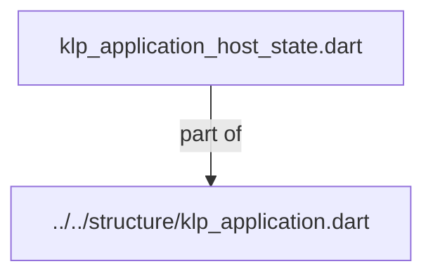
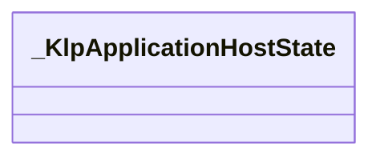
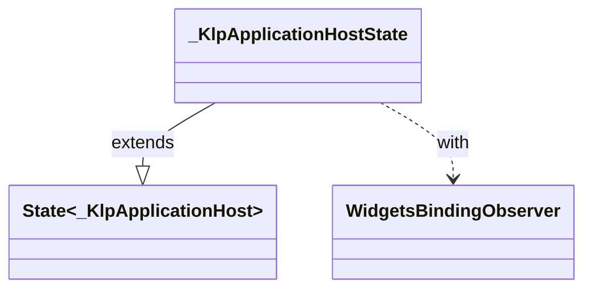

# klp_application_host_state.dart：直接依賴與宣告架構

[回到目錄](README.md) · [來源檔案](../../../../../../lib/src/application/bootstrap/internal/klp_application_host_state.dart)

## 範圍

核心是 `lib/src/application/bootstrap/internal/klp_application_host_state.dart`。主要視角為該檔案明寫的 import／export／part；輔助視角為本檔宣告及 extends／implements／with／on 關係。只展開一層外部邊界。

## 直接依賴圖

## 依賴證據

| 關係 | 原始 directive | 來源 |
|---|---|---|
| part of | <code>part of &#x27;../../structure/klp_application.dart&#x27;;</code> | [lib/src/application/bootstrap/internal/klp_application_host_state.dart:1](../../../../../../lib/src/application/bootstrap/internal/klp_application_host_state.dart#L1) |

## 宣告關係圖

本組節點是本檔宣告；沒有箭頭的宣告未在此圖主張互相依賴。

## 宣告與成員證據

成員包含 public 與 private；簽章取自來源，省略函式本體與欄位初始值。`(inferred)` 表示來源未明寫型別；建構子只顯示參數部分，不含初始化列表。

### _KlpApplicationHostState

ClassDeclaration · private · [lib/src/application/bootstrap/internal/klp_application_host_state.dart:3](../../../../../../lib/src/application/bootstrap/internal/klp_application_host_state.dart#L3)

<code>class _KlpApplicationHostState extends State&lt;_KlpApplicationHost&gt; with WidgetsBindingObserver</code>

- `extends` → <code>State&lt;_KlpApplicationHost&gt;</code>：[lib/src/application/bootstrap/internal/klp_application_host_state.dart:3](../../../../../../lib/src/application/bootstrap/internal/klp_application_host_state.dart#L3)
- `with` → <code>WidgetsBindingObserver</code>：[lib/src/application/bootstrap/internal/klp_application_host_state.dart:4](../../../../../../lib/src/application/bootstrap/internal/klp_application_host_state.dart#L4)

| 成員 | 可見性 | 簽章／型別 | 來源註解摘要 | 證據 |
|---|---|---|---|---|
| field <code>_session</code> | private | <code>late final _KlpApplicationSession _session</code> |  | [lib/src/application/bootstrap/internal/klp_application_host_state.dart:5](../../../../../../lib/src/application/bootstrap/internal/klp_application_host_state.dart#L5) |
| field <code>_subscription</code> | private | <code>KlpSubscription? _subscription</code> |  | [lib/src/application/bootstrap/internal/klp_application_host_state.dart:6](../../../../../../lib/src/application/bootstrap/internal/klp_application_host_state.dart#L6) |
| field <code>_sourceGeneration</code> | private | <code>int _sourceGeneration</code> |  | [lib/src/application/bootstrap/internal/klp_application_host_state.dart:7](../../../../../../lib/src/application/bootstrap/internal/klp_application_host_state.dart#L7) |
| method <code>initState</code> | public | <code>void initState()</code> |  | [lib/src/application/bootstrap/internal/klp_application_host_state.dart:9](../../../../../../lib/src/application/bootstrap/internal/klp_application_host_state.dart#L9) |
| method <code>_subscribe</code> | private | <code>void _subscribe()</code> |  | [lib/src/application/bootstrap/internal/klp_application_host_state.dart:32](../../../../../../lib/src/application/bootstrap/internal/klp_application_host_state.dart#L32) |
| method <code>_changed</code> | private | <code>void _changed()</code> |  | [lib/src/application/bootstrap/internal/klp_application_host_state.dart:39](../../../../../../lib/src/application/bootstrap/internal/klp_application_host_state.dart#L39) |
| method <code>_reportError</code> | private | <code>void _reportError(Object error, StackTrace stack)</code> |  | [lib/src/application/bootstrap/internal/klp_application_host_state.dart:43](../../../../../../lib/src/application/bootstrap/internal/klp_application_host_state.dart#L43) |
| method <code>_reportRouteInformation</code> | private | <code>void _reportRouteInformation(Uri uri, bool replace)</code> |  | [lib/src/application/bootstrap/internal/klp_application_host_state.dart:53](../../../../../../lib/src/application/bootstrap/internal/klp_application_host_state.dart#L53) |
| method <code>_receive</code> | private | <code>void _receive(KlpApplication application)</code> |  | [lib/src/application/bootstrap/internal/klp_application_host_state.dart:64](../../../../../../lib/src/application/bootstrap/internal/klp_application_host_state.dart#L64) |
| method <code>_accept</code> | private | <code>void _accept(KlpApplication application)</code> |  | [lib/src/application/bootstrap/internal/klp_application_host_state.dart:72](../../../../../../lib/src/application/bootstrap/internal/klp_application_host_state.dart#L72) |
| method <code>didPopRoute</code> | public | <code>Future&lt;bool&gt; didPopRoute()</code> |  | [lib/src/application/bootstrap/internal/klp_application_host_state.dart:74](../../../../../../lib/src/application/bootstrap/internal/klp_application_host_state.dart#L74) |
| method <code>didPushRouteInformation</code> | public | <code>Future&lt;bool&gt; didPushRouteInformation( RouteInformation routeInformation, )</code> |  | [lib/src/application/bootstrap/internal/klp_application_host_state.dart:77](../../../../../../lib/src/application/bootstrap/internal/klp_application_host_state.dart#L77) |
| method <code>didChangeAccessibilityFeatures</code> | public | <code>void didChangeAccessibilityFeatures()</code> |  | [lib/src/application/bootstrap/internal/klp_application_host_state.dart:88](../../../../../../lib/src/application/bootstrap/internal/klp_application_host_state.dart#L88) |
| method <code>didUpdateWidget</code> | public | <code>void didUpdateWidget(_KlpApplicationHost oldWidget)</code> |  | [lib/src/application/bootstrap/internal/klp_application_host_state.dart:94](../../../../../../lib/src/application/bootstrap/internal/klp_application_host_state.dart#L94) |
| method <code>build</code> | public | <code>Widget build(BuildContext context)</code> |  | [lib/src/application/bootstrap/internal/klp_application_host_state.dart:122](../../../../../../lib/src/application/bootstrap/internal/klp_application_host_state.dart#L122) |
| method <code>_environment</code> | private | <code>KlpApplicationEnvironment _environment()</code> |  | [lib/src/application/bootstrap/internal/klp_application_host_state.dart:165](../../../../../../lib/src/application/bootstrap/internal/klp_application_host_state.dart#L165) |
| method <code>_background</code> | private | <code>KlpColor _background(KlpBoundTemplate content)</code> |  | [lib/src/application/bootstrap/internal/klp_application_host_state.dart:191](../../../../../../lib/src/application/bootstrap/internal/klp_application_host_state.dart#L191) |
| method <code>dispose</code> | public | <code>void dispose()</code> |  | [lib/src/application/bootstrap/internal/klp_application_host_state.dart:211](../../../../../../lib/src/application/bootstrap/internal/klp_application_host_state.dart#L211) |

## 閱讀說明與限制

箭頭只表示來源明寫的靜態關係；import 不等於呼叫。未分析動態呼叫、欄位的實際物件擁有權、狀態轉移或渲染流程；型別未進行語意解析，繼承目標保留原始型別拼寫。public／private 依 Dart 名稱前綴判斷；public 宣告不代表已由 `lib/kallopis.dart` 匯出。

本頁由 `tool/architecture_atlas` 產生；編輯來源或生成工具後重新產生，避免手改本頁。
