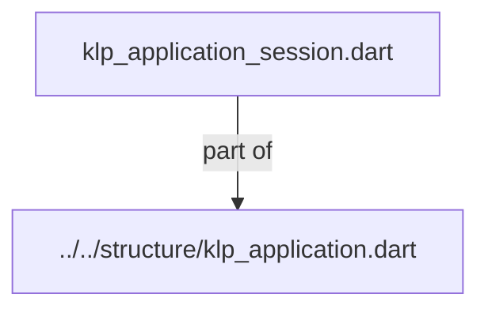
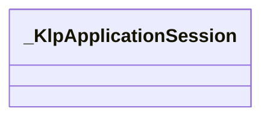

# klp_application_session.dart：直接依賴與宣告架構

[回到目錄](README.md) · [來源檔案](../../../../../../lib/src/application/bootstrap/internal/klp_application_session.dart)

## 範圍

核心是 `lib/src/application/bootstrap/internal/klp_application_session.dart`。主要視角為該檔案明寫的 import／export／part；輔助視角為本檔宣告及 extends／implements／with／on 關係。只展開一層外部邊界。

## 直接依賴圖

## 依賴證據

| 關係 | 原始 directive | 來源 |
|---|---|---|
| part of | <code>part of &#x27;../../structure/klp_application.dart&#x27;;</code> | [lib/src/application/bootstrap/internal/klp_application_session.dart:1](../../../../../../lib/src/application/bootstrap/internal/klp_application_session.dart#L1) |

## 宣告關係圖

本組節點是本檔宣告；沒有箭頭的宣告未在此圖主張互相依賴。

## 宣告與成員證據

成員包含 public 與 private；簽章取自來源，省略函式本體與欄位初始值。`(inferred)` 表示來源未明寫型別；建構子只顯示參數部分，不含初始化列表。

### _KlpApplicationSession

ClassDeclaration · private · [lib/src/application/bootstrap/internal/klp_application_session.dart:3](../../../../../../lib/src/application/bootstrap/internal/klp_application_session.dart#L3)

<code>final class _KlpApplicationSession</code>

來源註解摘要：唯一應用擁有端；來源更新與導覽提交共用同一樹與 FIFO。

| 成員 | 可見性 | 簽章／型別 | 來源註解摘要 | 證據 |
|---|---|---|---|---|
| field <code>onChanged</code> | public | <code>final void Function() onChanged</code> |  | [lib/src/application/bootstrap/internal/klp_application_session.dart:5](../../../../../../lib/src/application/bootstrap/internal/klp_application_session.dart#L5) |
| field <code>onAsyncError</code> | public | <code>final void Function(Object, StackTrace) onAsyncError</code> |  | [lib/src/application/bootstrap/internal/klp_application_session.dart:6](../../../../../../lib/src/application/bootstrap/internal/klp_application_session.dart#L6) |
| field <code>onRouteInformationChanged</code> | public | <code>final void Function(Uri, bool) onRouteInformationChanged</code> |  | [lib/src/application/bootstrap/internal/klp_application_session.dart:7](../../../../../../lib/src/application/bootstrap/internal/klp_application_session.dart#L7) |
| field <code>_runtime</code> | private | <code>final KlpTreeRuntime _runtime</code> |  | [lib/src/application/bootstrap/internal/klp_application_session.dart:8](../../../../../../lib/src/application/bootstrap/internal/klp_application_session.dart#L8) |
| field <code>_queue</code> | private | <code>final List&lt;KlpApplication&gt; _queue</code> |  | [lib/src/application/bootstrap/internal/klp_application_session.dart:9](../../../../../../lib/src/application/bootstrap/internal/klp_application_session.dart#L9) |
| field <code>_machine</code> | private | <code>KlpNavigationMachine? _machine</code> |  | [lib/src/application/bootstrap/internal/klp_application_session.dart:10](../../../../../../lib/src/application/bootstrap/internal/klp_application_session.dart#L10) |
| field <code>_application</code> | private | <code>KlpApplication? _application</code> |  | [lib/src/application/bootstrap/internal/klp_application_session.dart:11](../../../../../../lib/src/application/bootstrap/internal/klp_application_session.dart#L11) |
| field <code>_epoch</code> | private | <code>_KlpApplicationEpoch? _epoch</code> |  | [lib/src/application/bootstrap/internal/klp_application_session.dart:12](../../../../../../lib/src/application/bootstrap/internal/klp_application_session.dart#L12) |
| field <code>_startupCancellation</code> | private | <code>Completer&lt;void&gt;? _startupCancellation</code> |  | [lib/src/application/bootstrap/internal/klp_application_session.dart:13](../../../../../../lib/src/application/bootstrap/internal/klp_application_session.dart#L13) |
| field <code>_startupGeneration</code> | private | <code>int _startupGeneration</code> |  | [lib/src/application/bootstrap/internal/klp_application_session.dart:14](../../../../../../lib/src/application/bootstrap/internal/klp_application_session.dart#L14) |
| field <code>_starting</code> | private | <code>bool _starting</code> |  | [lib/src/application/bootstrap/internal/klp_application_session.dart:15](../../../../../../lib/src/application/bootstrap/internal/klp_application_session.dart#L15) |
| field <code>_completingStartup</code> | private | <code>bool _completingStartup</code> |  | [lib/src/application/bootstrap/internal/klp_application_session.dart:16](../../../../../../lib/src/application/bootstrap/internal/klp_application_session.dart#L16) |
| field <code>_terminal</code> | private | <code>bool _terminal</code> |  | [lib/src/application/bootstrap/internal/klp_application_session.dart:17](../../../../../../lib/src/application/bootstrap/internal/klp_application_session.dart#L17) |
| field <code>_processing</code> | private | <code>bool _processing</code> |  | [lib/src/application/bootstrap/internal/klp_application_session.dart:18](../../../../../../lib/src/application/bootstrap/internal/klp_application_session.dart#L18) |
| field <code>_projecting</code> | private | <code>bool _projecting</code> |  | [lib/src/application/bootstrap/internal/klp_application_session.dart:19](../../../../../../lib/src/application/bootstrap/internal/klp_application_session.dart#L19) |
| field <code>_scheduled</code> | private | <code>bool _scheduled</code> |  | [lib/src/application/bootstrap/internal/klp_application_session.dart:20](../../../../../../lib/src/application/bootstrap/internal/klp_application_session.dart#L20) |
| field <code>_disposed</code> | private | <code>bool _disposed</code> |  | [lib/src/application/bootstrap/internal/klp_application_session.dart:21](../../../../../../lib/src/application/bootstrap/internal/klp_application_session.dart#L21) |
| field <code>_startupError</code> | private | <code>Object? _startupError</code> |  | [lib/src/application/bootstrap/internal/klp_application_session.dart:22](../../../../../../lib/src/application/bootstrap/internal/klp_application_session.dart#L22) |
| constructor <code>_KlpApplicationSession</code> | private | <code>_KlpApplicationSession({ required this.onChanged, required this.onAsyncError, required this.onRouteInformationChanged, })</code> |  | [lib/src/application/bootstrap/internal/klp_application_session.dart:24](../../../../../../lib/src/application/bootstrap/internal/klp_application_session.dart#L24) |
| getter <code>frame</code> | public | <code>KlpRuntimeFrame? get frame</code> |  | [lib/src/application/bootstrap/internal/klp_application_session.dart:30](../../../../../../lib/src/application/bootstrap/internal/klp_application_session.dart#L30) |
| getter <code>title</code> | public | <code>String get title</code> |  | [lib/src/application/bootstrap/internal/klp_application_session.dart:31](../../../../../../lib/src/application/bootstrap/internal/klp_application_session.dart#L31) |
| getter <code>isPending</code> | public | <code>bool get isPending</code> |  | [lib/src/application/bootstrap/internal/klp_application_session.dart:32](../../../../../../lib/src/application/bootstrap/internal/klp_application_session.dart#L32) |
| getter <code>startupError</code> | public | <code>Object? get startupError</code> |  | [lib/src/application/bootstrap/internal/klp_application_session.dart:33](../../../../../../lib/src/application/bootstrap/internal/klp_application_session.dart#L33) |
| method <code>accept</code> | public | <code>void accept(KlpApplication application)</code> |  | [lib/src/application/bootstrap/internal/klp_application_session.dart:35](../../../../../../lib/src/application/bootstrap/internal/klp_application_session.dart#L35) |
| method <code>_drain</code> | private | <code>void _drain()</code> |  | [lib/src/application/bootstrap/internal/klp_application_session.dart:47](../../../../../../lib/src/application/bootstrap/internal/klp_application_session.dart#L47) |
| method <code>_schedule</code> | private | <code>void _schedule()</code> |  | [lib/src/application/bootstrap/internal/klp_application_session.dart:76](../../../../../../lib/src/application/bootstrap/internal/klp_application_session.dart#L76) |
| method <code>_start</code> | private | <code>void _start(KlpApplication application)</code> |  | [lib/src/application/bootstrap/internal/klp_application_session.dart:94](../../../../../../lib/src/application/bootstrap/internal/klp_application_session.dart#L94) |
| method <code>_finishStart</code> | private | <code>void _finishStart(KlpNavigationStart result, int generation)</code> |  | [lib/src/application/bootstrap/internal/klp_application_session.dart:141](../../../../../../lib/src/application/bootstrap/internal/klp_application_session.dart#L141) |
| method <code>handleBack</code> | public | <code>Future&lt;bool&gt; handleBack()</code> |  | [lib/src/application/bootstrap/internal/klp_application_session.dart:163](../../../../../../lib/src/application/bootstrap/internal/klp_application_session.dart#L163) |
| method <code>restore</code> | public | <code>Future&lt;bool&gt; restore(KlpNavigationRestoration restoration)</code> |  | [lib/src/application/bootstrap/internal/klp_application_session.dart:188](../../../../../../lib/src/application/bootstrap/internal/klp_application_session.dart#L188) |
| method <code>dispose</code> | public | <code>void dispose()</code> |  | [lib/src/application/bootstrap/internal/klp_application_session.dart:209](../../../../../../lib/src/application/bootstrap/internal/klp_application_session.dart#L209) |

## 閱讀說明與限制

箭頭只表示來源明寫的靜態關係；import 不等於呼叫。未分析動態呼叫、欄位的實際物件擁有權、狀態轉移或渲染流程；型別未進行語意解析，繼承目標保留原始型別拼寫。public／private 依 Dart 名稱前綴判斷；public 宣告不代表已由 `lib/kallopis.dart` 匯出。

本頁由 `tool/architecture_atlas` 產生；編輯來源或生成工具後重新產生，避免手改本頁。
