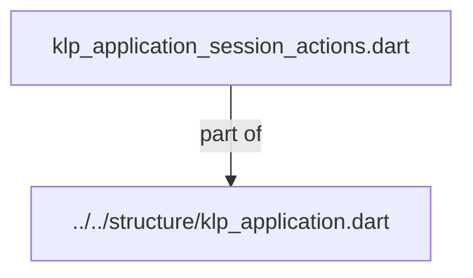
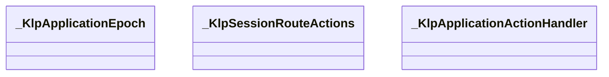
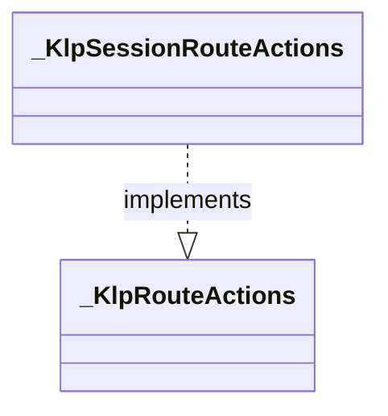
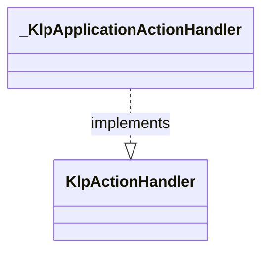

# klp_application_session_actions.dart：直接依賴與宣告架構

[回到目錄](README.md) · [來源檔案](../../../../../../lib/src/application/bootstrap/internal/klp_application_session_actions.dart)

## 範圍

核心是 `lib/src/application/bootstrap/internal/klp_application_session_actions.dart`。主要視角為該檔案明寫的 import／export／part；輔助視角為本檔宣告及 extends／implements／with／on 關係。只展開一層外部邊界。

## 直接依賴圖

## 依賴證據

| 關係 | 原始 directive | 來源 |
|---|---|---|
| part of | <code>part of &#x27;../../structure/klp_application.dart&#x27;;</code> | [lib/src/application/bootstrap/internal/klp_application_session_actions.dart:1](../../../../../../lib/src/application/bootstrap/internal/klp_application_session_actions.dart#L1) |

## 宣告關係圖

本組節點是本檔宣告；沒有箭頭的宣告未在此圖主張互相依賴。

## 宣告與成員證據

成員包含 public 與 private；簽章取自來源，省略函式本體與欄位初始值。`(inferred)` 表示來源未明寫型別；建構子只顯示參數部分，不含初始化列表。

### _KlpApplicationEpoch

ClassDeclaration · private · [lib/src/application/bootstrap/internal/klp_application_session_actions.dart:3](../../../../../../lib/src/application/bootstrap/internal/klp_application_session_actions.dart#L3)

<code>final class _KlpApplicationEpoch</code>

| 成員 | 可見性 | 簽章／型別 | 來源註解摘要 | 證據 |
|---|---|---|---|---|
| field <code>committed</code> | public | <code>bool committed</code> |  | [lib/src/application/bootstrap/internal/klp_application_session_actions.dart:5](../../../../../../lib/src/application/bootstrap/internal/klp_application_session_actions.dart#L5) |

### _KlpSessionRouteActions

ClassDeclaration · private · [lib/src/application/bootstrap/internal/klp_application_session_actions.dart:8](../../../../../../lib/src/application/bootstrap/internal/klp_application_session_actions.dart#L8)

<code>final class _KlpSessionRouteActions implements _KlpRouteActions</code>

來源註解摘要：操作借用綁定完整 entry 與已提交世代，舊輸入與隱藏頁不能啟動交易。

- `implements` → <code>_KlpRouteActions</code>：[lib/src/application/bootstrap/internal/klp_application_session_actions.dart:9](../../../../../../lib/src/application/bootstrap/internal/klp_application_session_actions.dart#L9)

| 成員 | 可見性 | 簽章／型別 | 來源註解摘要 | 證據 |
|---|---|---|---|---|
| field <code>session</code> | public | <code>final _KlpApplicationSession session</code> |  | [lib/src/application/bootstrap/internal/klp_application_session_actions.dart:11](../../../../../../lib/src/application/bootstrap/internal/klp_application_session_actions.dart#L11) |
| field <code>epoch</code> | public | <code>final _KlpApplicationEpoch epoch</code> |  | [lib/src/application/bootstrap/internal/klp_application_session_actions.dart:12](../../../../../../lib/src/application/bootstrap/internal/klp_application_session_actions.dart#L12) |
| field <code>entry</code> | public | <code>final KlpNavigationEntry entry</code> |  | [lib/src/application/bootstrap/internal/klp_application_session_actions.dart:13](../../../../../../lib/src/application/bootstrap/internal/klp_application_session_actions.dart#L13) |
| constructor <code>_KlpSessionRouteActions</code> | private | <code>const _KlpSessionRouteActions(this.session, this.epoch, this.entry)</code> |  | [lib/src/application/bootstrap/internal/klp_application_session_actions.dart:15](../../../../../../lib/src/application/bootstrap/internal/klp_application_session_actions.dart#L15) |
| getter <code>_valid</code> | private | <code>bool get _valid</code> |  | [lib/src/application/bootstrap/internal/klp_application_session_actions.dart:17](../../../../../../lib/src/application/bootstrap/internal/klp_application_session_actions.dart#L17) |
| method <code>push</code> | public | <code>KlpNavigationTicket&lt;T&gt; push&lt;T&gt;(KlpLocation&lt;T&gt; location)</code> |  | [lib/src/application/bootstrap/internal/klp_application_session_actions.dart:19](../../../../../../lib/src/application/bootstrap/internal/klp_application_session_actions.dart#L19) |
| method <code>complete</code> | public | <code>Future&lt;KlpNavigationDecision&gt; complete(Object? result)</code> |  | [lib/src/application/bootstrap/internal/klp_application_session_actions.dart:25](../../../../../../lib/src/application/bootstrap/internal/klp_application_session_actions.dart#L25) |
| method <code>cancel</code> | public | <code>Future&lt;KlpNavigationDecision&gt; cancel()</code> |  | [lib/src/application/bootstrap/internal/klp_application_session_actions.dart:31](../../../../../../lib/src/application/bootstrap/internal/klp_application_session_actions.dart#L31) |

### _KlpApplicationActionHandler

ClassDeclaration · private · [lib/src/application/bootstrap/internal/klp_application_session_actions.dart:38](../../../../../../lib/src/application/bootstrap/internal/klp_application_session_actions.dart#L38)

<code>final class _KlpApplicationActionHandler implements KlpActionHandler</code>

來源註解摘要：application 是唯一能理解 route action 的層；feature 僅依賴 action handler 介面。

- `implements` → <code>KlpActionHandler</code>：[lib/src/application/bootstrap/internal/klp_application_session_actions.dart:39](../../../../../../lib/src/application/bootstrap/internal/klp_application_session_actions.dart#L39)

| 成員 | 可見性 | 簽章／型別 | 來源註解摘要 | 證據 |
|---|---|---|---|---|
| field <code>session</code> | public | <code>final _KlpApplicationSession session</code> |  | [lib/src/application/bootstrap/internal/klp_application_session_actions.dart:41](../../../../../../lib/src/application/bootstrap/internal/klp_application_session_actions.dart#L41) |
| constructor <code>_KlpApplicationActionHandler</code> | private | <code>const _KlpApplicationActionHandler(this.session)</code> |  | [lib/src/application/bootstrap/internal/klp_application_session_actions.dart:43](../../../../../../lib/src/application/bootstrap/internal/klp_application_session_actions.dart#L43) |
| method <code>accepts</code> | public | <code>bool accepts(KlpAction action)</code> |  | [lib/src/application/bootstrap/internal/klp_application_session_actions.dart:45](../../../../../../lib/src/application/bootstrap/internal/klp_application_session_actions.dart#L45) |
| method <code>activate</code> | public | <code>Future&lt;KlpActionActivation&gt; activate(KlpAction action, KlpPlacementId source)</code> |  | [lib/src/application/bootstrap/internal/klp_application_session_actions.dart:51](../../../../../../lib/src/application/bootstrap/internal/klp_application_session_actions.dart#L51) |
| method <code>push</code> | public | <code>Future&lt;KlpActionActivation&gt; push&lt;T&gt;(_KlpPushAction&lt;T&gt; action)</code> |  | [lib/src/application/bootstrap/internal/klp_application_session_actions.dart:64](../../../../../../lib/src/application/bootstrap/internal/klp_application_session_actions.dart#L64) |
| method <code>finish</code> | public | <code>Future&lt;KlpActionActivation&gt; finish(_KlpFinishAction action)</code> |  | [lib/src/application/bootstrap/internal/klp_application_session_actions.dart:70](../../../../../../lib/src/application/bootstrap/internal/klp_application_session_actions.dart#L70) |
| method <code>back</code> | public | <code>Future&lt;KlpActionActivation&gt; back(_KlpBackAction action)</code> |  | [lib/src/application/bootstrap/internal/klp_application_session_actions.dart:72](../../../../../../lib/src/application/bootstrap/internal/klp_application_session_actions.dart#L72) |
| method <code>_deliverResult</code> | private | <code>Future&lt;void&gt; _deliverResult&lt;T&gt;(KlpNavigationTicket&lt;T&gt; ticket, void Function(T value)? onResult)</code> |  | [lib/src/application/bootstrap/internal/klp_application_session_actions.dart:74](../../../../../../lib/src/application/bootstrap/internal/klp_application_session_actions.dart#L74) |

## 閱讀說明與限制

箭頭只表示來源明寫的靜態關係；import 不等於呼叫。未分析動態呼叫、欄位的實際物件擁有權、狀態轉移或渲染流程；型別未進行語意解析，繼承目標保留原始型別拼寫。public／private 依 Dart 名稱前綴判斷；public 宣告不代表已由 `lib/kallopis.dart` 匯出。

本頁由 `tool/architecture_atlas` 產生；編輯來源或生成工具後重新產生，避免手改本頁。
