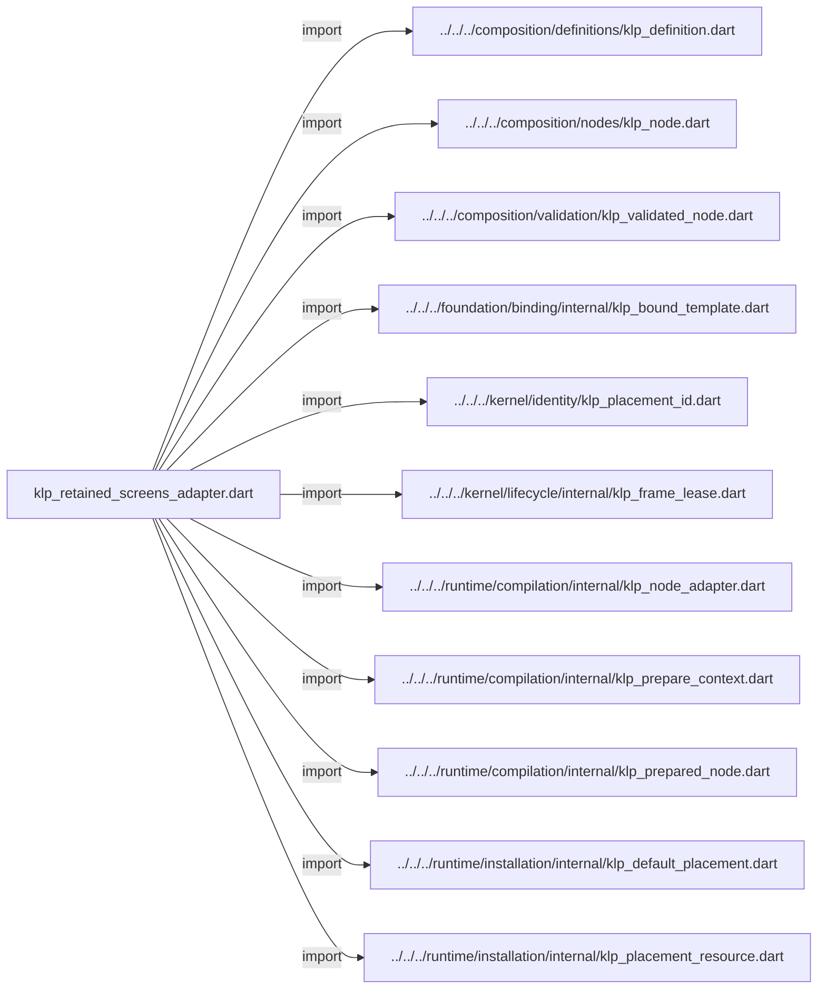
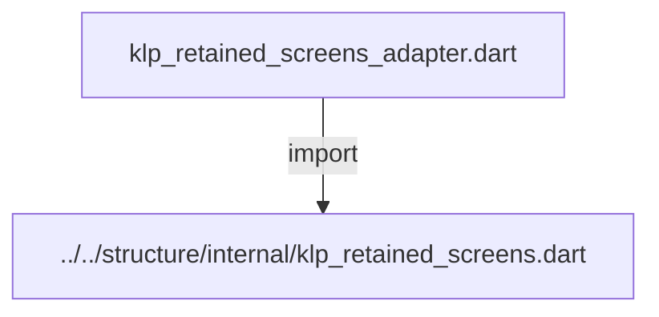
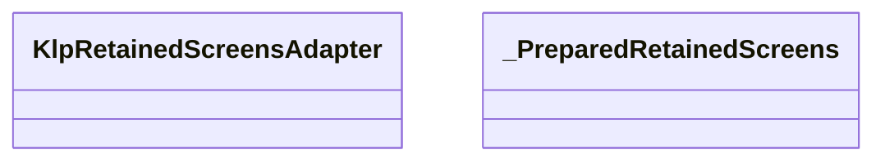
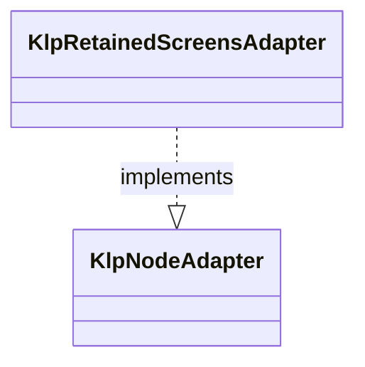
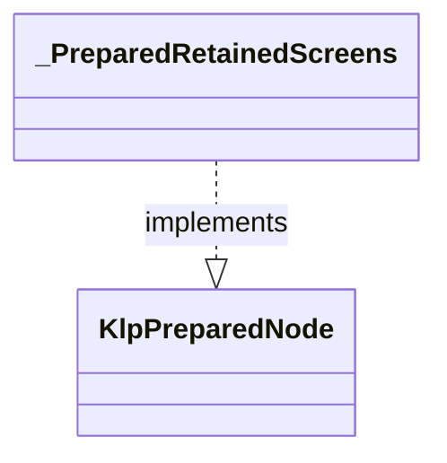

# klp_retained_screens_adapter.dart：直接依賴與宣告架構

[回到目錄](README.md) · [來源檔案](../../../../../../lib/src/application/bootstrap/internal/klp_retained_screens_adapter.dart)

## 範圍

核心是 `lib/src/application/bootstrap/internal/klp_retained_screens_adapter.dart`。主要視角為該檔案明寫的 import／export／part；輔助視角為本檔宣告及 extends／implements／with／on 關係。只展開一層外部邊界。

## 直接依賴圖

## 依賴證據

| 關係 | 原始 directive | 來源 |
|---|---|---|
| import | <code>import &#x27;../../../composition/definitions/klp_definition.dart&#x27;;</code> | [lib/src/application/bootstrap/internal/klp_retained_screens_adapter.dart:1](../../../../../../lib/src/application/bootstrap/internal/klp_retained_screens_adapter.dart#L1) |
| import | <code>import &#x27;../../../composition/nodes/klp_node.dart&#x27;;</code> | [lib/src/application/bootstrap/internal/klp_retained_screens_adapter.dart:2](../../../../../../lib/src/application/bootstrap/internal/klp_retained_screens_adapter.dart#L2) |
| import | <code>import &#x27;../../../composition/validation/klp_validated_node.dart&#x27;;</code> | [lib/src/application/bootstrap/internal/klp_retained_screens_adapter.dart:3](../../../../../../lib/src/application/bootstrap/internal/klp_retained_screens_adapter.dart#L3) |
| import | <code>import &#x27;../../../foundation/binding/internal/klp_bound_template.dart&#x27;;</code> | [lib/src/application/bootstrap/internal/klp_retained_screens_adapter.dart:4](../../../../../../lib/src/application/bootstrap/internal/klp_retained_screens_adapter.dart#L4) |
| import | <code>import &#x27;../../../kernel/identity/klp_placement_id.dart&#x27;;</code> | [lib/src/application/bootstrap/internal/klp_retained_screens_adapter.dart:5](../../../../../../lib/src/application/bootstrap/internal/klp_retained_screens_adapter.dart#L5) |
| import | <code>import &#x27;../../../kernel/lifecycle/internal/klp_frame_lease.dart&#x27;;</code> | [lib/src/application/bootstrap/internal/klp_retained_screens_adapter.dart:6](../../../../../../lib/src/application/bootstrap/internal/klp_retained_screens_adapter.dart#L6) |
| import | <code>import &#x27;../../../runtime/compilation/internal/klp_node_adapter.dart&#x27;;</code> | [lib/src/application/bootstrap/internal/klp_retained_screens_adapter.dart:7](../../../../../../lib/src/application/bootstrap/internal/klp_retained_screens_adapter.dart#L7) |
| import | <code>import &#x27;../../../runtime/compilation/internal/klp_prepare_context.dart&#x27;;</code> | [lib/src/application/bootstrap/internal/klp_retained_screens_adapter.dart:8](../../../../../../lib/src/application/bootstrap/internal/klp_retained_screens_adapter.dart#L8) |
| import | <code>import &#x27;../../../runtime/compilation/internal/klp_prepared_node.dart&#x27;;</code> | [lib/src/application/bootstrap/internal/klp_retained_screens_adapter.dart:9](../../../../../../lib/src/application/bootstrap/internal/klp_retained_screens_adapter.dart#L9) |
| import | <code>import &#x27;../../../runtime/installation/internal/klp_default_placement.dart&#x27;;</code> | [lib/src/application/bootstrap/internal/klp_retained_screens_adapter.dart:10](../../../../../../lib/src/application/bootstrap/internal/klp_retained_screens_adapter.dart#L10) |
| import | <code>import &#x27;../../../runtime/installation/internal/klp_placement_resource.dart&#x27;;</code> | [lib/src/application/bootstrap/internal/klp_retained_screens_adapter.dart:11](../../../../../../lib/src/application/bootstrap/internal/klp_retained_screens_adapter.dart#L11) |
| import | <code>import &#x27;../../structure/internal/klp_retained_screens.dart&#x27;;</code> | [lib/src/application/bootstrap/internal/klp_retained_screens_adapter.dart:12](../../../../../../lib/src/application/bootstrap/internal/klp_retained_screens_adapter.dart#L12) |

## 宣告關係圖

本組節點是本檔宣告；沒有箭頭的宣告未在此圖主張互相依賴。

## 宣告與成員證據

成員包含 public 與 private；簽章取自來源，省略函式本體與欄位初始值。`(inferred)` 表示來源未明寫型別；建構子只顯示參數部分，不含初始化列表。

### KlpRetainedScreensAdapter

ClassDeclaration · public · [lib/src/application/bootstrap/internal/klp_retained_screens_adapter.dart:14](../../../../../../lib/src/application/bootstrap/internal/klp_retained_screens_adapter.dart#L14)

<code>final class KlpRetainedScreensAdapter implements KlpNodeAdapter</code>

來源註解摘要：保留頁在同一準備階段決定目前身份，提交後不重新讀取消費端資料。

- `implements` → <code>KlpNodeAdapter</code>：[lib/src/application/bootstrap/internal/klp_retained_screens_adapter.dart:15](../../../../../../lib/src/application/bootstrap/internal/klp_retained_screens_adapter.dart#L15)

| 成員 | 可見性 | 簽章／型別 | 來源註解摘要 | 證據 |
|---|---|---|---|---|
| constructor <code>KlpRetainedScreensAdapter</code> | public | <code>const KlpRetainedScreensAdapter()</code> |  | [lib/src/application/bootstrap/internal/klp_retained_screens_adapter.dart:16](../../../../../../lib/src/application/bootstrap/internal/klp_retained_screens_adapter.dart#L16) |
| getter <code>contract</code> | public | <code>KlpDefinition&lt;KlpNode&gt; get contract</code> |  | [lib/src/application/bootstrap/internal/klp_retained_screens_adapter.dart:18](../../../../../../lib/src/application/bootstrap/internal/klp_retained_screens_adapter.dart#L18) |
| method <code>prepare</code> | public | <code>KlpPreparedNode prepare( KlpNode node, KlpValidatedNode snapshot, KlpPrepareContext context, )</code> |  | [lib/src/application/bootstrap/internal/klp_retained_screens_adapter.dart:21](../../../../../../lib/src/application/bootstrap/internal/klp_retained_screens_adapter.dart#L21) |

### _PreparedRetainedScreens

ClassDeclaration · private · [lib/src/application/bootstrap/internal/klp_retained_screens_adapter.dart:34](../../../../../../lib/src/application/bootstrap/internal/klp_retained_screens_adapter.dart#L34)

<code>final class _PreparedRetainedScreens implements KlpPreparedNode</code>

- `implements` → <code>KlpPreparedNode</code>：[lib/src/application/bootstrap/internal/klp_retained_screens_adapter.dart:34](../../../../../../lib/src/application/bootstrap/internal/klp_retained_screens_adapter.dart#L34)

| 成員 | 可見性 | 簽章／型別 | 來源註解摘要 | 證據 |
|---|---|---|---|---|
| field <code>activeId</code> | public | <code>final KlpPlacementId activeId</code> |  | [lib/src/application/bootstrap/internal/klp_retained_screens_adapter.dart:35](../../../../../../lib/src/application/bootstrap/internal/klp_retained_screens_adapter.dart#L35) |
| constructor <code>_PreparedRetainedScreens</code> | private | <code>const _PreparedRetainedScreens(this.activeId)</code> |  | [lib/src/application/bootstrap/internal/klp_retained_screens_adapter.dart:37](../../../../../../lib/src/application/bootstrap/internal/klp_retained_screens_adapter.dart#L37) |
| method <code>createResource</code> | public | <code>KlpPlacementResource createResource(KlpValidatedNode node)</code> |  | [lib/src/application/bootstrap/internal/klp_retained_screens_adapter.dart:39](../../../../../../lib/src/application/bootstrap/internal/klp_retained_screens_adapter.dart#L39) |
| method <code>materialize</code> | public | <code>KlpBoundTemplate materialize( KlpPlacementResource resource, List&lt;KlpBoundTemplate&gt; children, KlpFrameLease lease, )</code> |  | [lib/src/application/bootstrap/internal/klp_retained_screens_adapter.dart:43](../../../../../../lib/src/application/bootstrap/internal/klp_retained_screens_adapter.dart#L43) |

## 閱讀說明與限制

箭頭只表示來源明寫的靜態關係；import 不等於呼叫。未分析動態呼叫、欄位的實際物件擁有權、狀態轉移或渲染流程；型別未進行語意解析，繼承目標保留原始型別拼寫。public／private 依 Dart 名稱前綴判斷；public 宣告不代表已由 `lib/kallopis.dart` 匯出。

本頁由 `tool/architecture_atlas` 產生；編輯來源或生成工具後重新產生，避免手改本頁。
