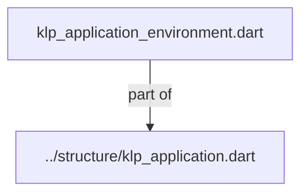
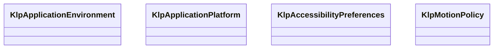

# klp_application_environment.dart：直接依賴與宣告架構

[回到目錄](README.md) · [來源檔案](../../../../../lib/src/application/environment/klp_application_environment.dart)

## 範圍

核心是 `lib/src/application/environment/klp_application_environment.dart`。主要視角為該檔案明寫的 import／export／part；輔助視角為本檔宣告及 extends／implements／with／on 關係。只展開一層外部邊界。

## 直接依賴圖

## 依賴證據

| 關係 | 原始 directive | 來源 |
|---|---|---|
| part of | <code>part of &#x27;../structure/klp_application.dart&#x27;;</code> | [lib/src/application/environment/klp_application_environment.dart:1](../../../../../lib/src/application/environment/klp_application_environment.dart#L1) |

## 宣告關係圖

本組節點是本檔宣告；沒有箭頭的宣告未在此圖主張互相依賴。

## 宣告與成員證據

成員包含 public 與 private；簽章取自來源，省略函式本體與欄位初始值。`(inferred)` 表示來源未明寫型別；建構子只顯示參數部分，不含初始化列表。

### KlpApplicationEnvironment

ClassDeclaration · public · [lib/src/application/environment/klp_application_environment.dart:3](../../../../../lib/src/application/environment/klp_application_environment.dart#L3)

<code>final class KlpApplicationEnvironment</code>

來源註解摘要：本庫從執行環境取得的不可覆寫偏好快照。 消費端不建立或注入此值；應用宿主是唯一來源。功能可依此新增 受控的語意策略，不能改以平台分支或任意 Flutter 設定取代它。

| 成員 | 可見性 | 簽章／型別 | 來源註解摘要 | 證據 |
|---|---|---|---|---|
| constructor <code>_</code> | private | <code>const KlpApplicationEnvironment._({ required this.platform, required this.accessibility, required this.motion, })</code> |  | [lib/src/application/environment/klp_application_environment.dart:8](../../../../../lib/src/application/environment/klp_application_environment.dart#L8) |
| field <code>platform</code> | public | <code>final KlpApplicationPlatform platform</code> |  | [lib/src/application/environment/klp_application_environment.dart:14](../../../../../lib/src/application/environment/klp_application_environment.dart#L14) |
| field <code>accessibility</code> | public | <code>final KlpAccessibilityPreferences accessibility</code> |  | [lib/src/application/environment/klp_application_environment.dart:15](../../../../../lib/src/application/environment/klp_application_environment.dart#L15) |
| field <code>motion</code> | public | <code>final KlpMotionPolicy motion</code> |  | [lib/src/application/environment/klp_application_environment.dart:16](../../../../../lib/src/application/environment/klp_application_environment.dart#L16) |

### KlpApplicationPlatform

EnumDeclaration · public · [lib/src/application/environment/klp_application_environment.dart:19](../../../../../lib/src/application/environment/klp_application_environment.dart#L19)

<code>enum KlpApplicationPlatform</code>

來源註解摘要：應用可依賴的平台分類；不洩漏 Flutter 平台型別。

| 成員 | 可見性 | 簽章／型別 | 來源註解摘要 | 證據 |
|---|---|---|---|---|
| enum value <code>android</code> | public | <code>android</code> |  | [lib/src/application/environment/klp_application_environment.dart:20](../../../../../lib/src/application/environment/klp_application_environment.dart#L20) |
| enum value <code>ios</code> | public | <code>ios</code> |  | [lib/src/application/environment/klp_application_environment.dart:20](../../../../../lib/src/application/environment/klp_application_environment.dart#L20) |
| enum value <code>windows</code> | public | <code>windows</code> |  | [lib/src/application/environment/klp_application_environment.dart:20](../../../../../lib/src/application/environment/klp_application_environment.dart#L20) |
| enum value <code>macos</code> | public | <code>macos</code> |  | [lib/src/application/environment/klp_application_environment.dart:20](../../../../../lib/src/application/environment/klp_application_environment.dart#L20) |
| enum value <code>linux</code> | public | <code>linux</code> |  | [lib/src/application/environment/klp_application_environment.dart:20](../../../../../lib/src/application/environment/klp_application_environment.dart#L20) |
| enum value <code>web</code> | public | <code>web</code> |  | [lib/src/application/environment/klp_application_environment.dart:20](../../../../../lib/src/application/environment/klp_application_environment.dart#L20) |
| enum value <code>other</code> | public | <code>other</code> |  | [lib/src/application/environment/klp_application_environment.dart:20](../../../../../lib/src/application/environment/klp_application_environment.dart#L20) |

### KlpAccessibilityPreferences

ClassDeclaration · public · [lib/src/application/environment/klp_application_environment.dart:22](../../../../../lib/src/application/environment/klp_application_environment.dart#L22)

<code>final class KlpAccessibilityPreferences</code>

來源註解摘要：系統輔助功能偏好。基本語意與鍵盤支援不受此值關閉。

| 成員 | 可見性 | 簽章／型別 | 來源註解摘要 | 證據 |
|---|---|---|---|---|
| constructor <code>_</code> | private | <code>const KlpAccessibilityPreferences._({ required this.accessibleNavigation, required this.boldText, required this.highContrast, })</code> |  | [lib/src/application/environment/klp_application_environment.dart:24](../../../../../lib/src/application/environment/klp_application_environment.dart#L24) |
| field <code>accessibleNavigation</code> | public | <code>final bool accessibleNavigation</code> |  | [lib/src/application/environment/klp_application_environment.dart:30](../../../../../lib/src/application/environment/klp_application_environment.dart#L30) |
| field <code>boldText</code> | public | <code>final bool boldText</code> |  | [lib/src/application/environment/klp_application_environment.dart:31](../../../../../lib/src/application/environment/klp_application_environment.dart#L31) |
| field <code>highContrast</code> | public | <code>final bool highContrast</code> |  | [lib/src/application/environment/klp_application_environment.dart:32](../../../../../lib/src/application/environment/klp_application_environment.dart#L32) |

### KlpMotionPolicy

EnumDeclaration · public · [lib/src/application/environment/klp_application_environment.dart:35](../../../../../lib/src/application/environment/klp_application_environment.dart#L35)

<code>enum KlpMotionPolicy</code>

來源註解摘要：動態強度只由系統偏好決定，元件不得各自改寫。

| 成員 | 可見性 | 簽章／型別 | 來源註解摘要 | 證據 |
|---|---|---|---|---|
| enum value <code>standard</code> | public | <code>standard</code> |  | [lib/src/application/environment/klp_application_environment.dart:36](../../../../../lib/src/application/environment/klp_application_environment.dart#L36) |
| enum value <code>reduced</code> | public | <code>reduced</code> |  | [lib/src/application/environment/klp_application_environment.dart:36](../../../../../lib/src/application/environment/klp_application_environment.dart#L36) |
| enum value <code>immediate</code> | public | <code>immediate</code> |  | [lib/src/application/environment/klp_application_environment.dart:36](../../../../../lib/src/application/environment/klp_application_environment.dart#L36) |

## 閱讀說明與限制

箭頭只表示來源明寫的靜態關係；import 不等於呼叫。未分析動態呼叫、欄位的實際物件擁有權、狀態轉移或渲染流程；型別未進行語意解析，繼承目標保留原始型別拼寫。public／private 依 Dart 名稱前綴判斷；public 宣告不代表已由 `lib/kallopis.dart` 匯出。

本頁由 `tool/architecture_atlas` 產生；編輯來源或生成工具後重新產生，避免手改本頁。
