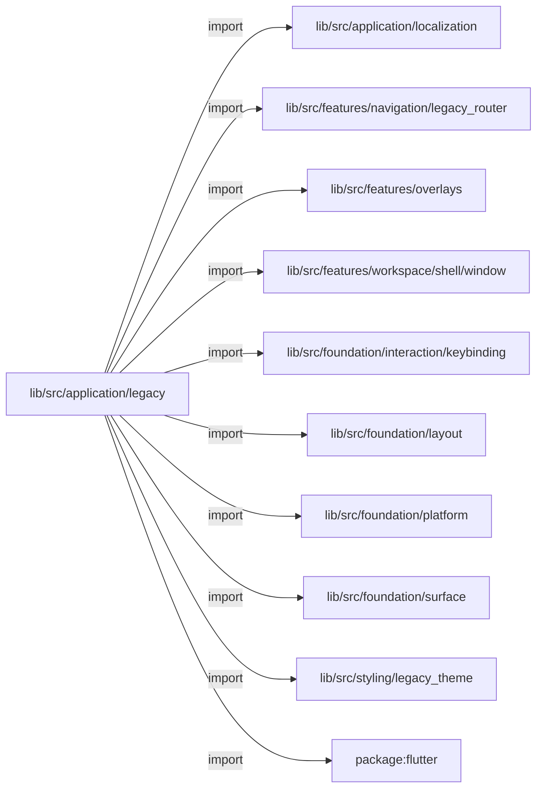
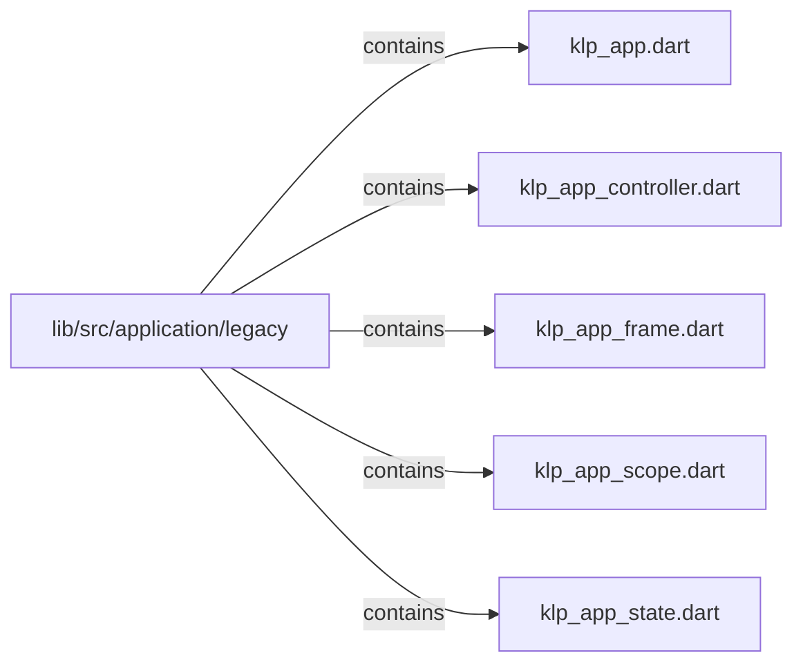

# lib/src/application/legacy：架構分析入口

[上一層](../README.md)

## 範圍

閱讀 `lib/src/application/legacy` 的直接子目錄與 Dart 檔案。結構圖表示實際檔案包含關係；依賴圖表示本層檔案明寫的 directives。每個檔案頁另列直接依賴、宣告、欄位、方法、建構子及行號證據。

## 本層直接依賴圖

箭頭以本層 Dart 檔案明寫的 directive 彙總到目標所在目錄或外部套件邊界；不遞迴將子目錄依賴算入本層。相同目標的不同 directive 類型分開計數。

| 目標邊界 | 關係 | directive 數 | 第一筆來源證據 |
|---|---|---|---|
| <code>lib/src/application/localization</code> | import | 1 | [lib/src/application/legacy/klp_app.dart:3](../../../../../lib/src/application/legacy/klp_app.dart#L3) |
| <code>lib/src/features/navigation/legacy_router</code> | import | 1 | [lib/src/application/legacy/klp_app.dart:14](../../../../../lib/src/application/legacy/klp_app.dart#L14) |
| <code>lib/src/features/overlays</code> | import | 1 | [lib/src/application/legacy/klp_app.dart:13](../../../../../lib/src/application/legacy/klp_app.dart#L13) |
| <code>lib/src/features/workspace/shell/window</code> | import | 3 | [lib/src/application/legacy/klp_app.dart:15](../../../../../lib/src/application/legacy/klp_app.dart#L15) |
| <code>lib/src/foundation/interaction/keybinding</code> | import | 2 | [lib/src/application/legacy/klp_app.dart:20](../../../../../lib/src/application/legacy/klp_app.dart#L20) |
| <code>lib/src/foundation/layout</code> | import | 7 | [lib/src/application/legacy/klp_app.dart:6](../../../../../lib/src/application/legacy/klp_app.dart#L6) |
| <code>lib/src/foundation/platform</code> | import | 4 | [lib/src/application/legacy/klp_app.dart:4](../../../../../lib/src/application/legacy/klp_app.dart#L4) |
| <code>lib/src/foundation/surface</code> | import | 1 | [lib/src/application/legacy/klp_app.dart:21](../../../../../lib/src/application/legacy/klp_app.dart#L21) |
| <code>lib/src/styling/legacy_theme</code> | import | 2 | [lib/src/application/legacy/klp_app.dart:18](../../../../../lib/src/application/legacy/klp_app.dart#L18) |
| <code>package:flutter</code> | import | 3 | [lib/src/application/legacy/klp_app.dart:1](../../../../../lib/src/application/legacy/klp_app.dart#L1) |

### 同目錄依賴

| 來源 → 目標 | 關係 | 證據 |
|---|---|---|
| <code>klp_app.dart → klp_app_controller.dart</code> | import | [lib/src/application/legacy/klp_app.dart:22](../../../../../lib/src/application/legacy/klp_app.dart#L22) |
| <code>klp_app.dart → klp_app_scope.dart</code> | import | [lib/src/application/legacy/klp_app.dart:23](../../../../../lib/src/application/legacy/klp_app.dart#L23) |
| <code>klp_app.dart → klp_app_controller.dart</code> | export | [lib/src/application/legacy/klp_app.dart:25](../../../../../lib/src/application/legacy/klp_app.dart#L25) |
| <code>klp_app.dart → klp_app_scope.dart</code> | export | [lib/src/application/legacy/klp_app.dart:26](../../../../../lib/src/application/legacy/klp_app.dart#L26) |
| <code>klp_app.dart → klp_app_frame.dart</code> | part | [lib/src/application/legacy/klp_app.dart:28](../../../../../lib/src/application/legacy/klp_app.dart#L28) |
| <code>klp_app.dart → klp_app_state.dart</code> | part | [lib/src/application/legacy/klp_app.dart:29](../../../../../lib/src/application/legacy/klp_app.dart#L29) |
| <code>klp_app_frame.dart → klp_app.dart</code> | part of | [lib/src/application/legacy/klp_app_frame.dart:1](../../../../../lib/src/application/legacy/klp_app_frame.dart#L1) |
| <code>klp_app_scope.dart → klp_app_controller.dart</code> | import | [lib/src/application/legacy/klp_app_scope.dart:5](../../../../../lib/src/application/legacy/klp_app_scope.dart#L5) |
| <code>klp_app_state.dart → klp_app.dart</code> | part of | [lib/src/application/legacy/klp_app_state.dart:1](../../../../../lib/src/application/legacy/klp_app_state.dart#L1) |

## 目錄結構圖

## 子目錄

| 目錄 | 導航 | 來源證據 |
|---|---|---|
| 無 | 目前沒有下一層目錄 | — |

## 本層檔案

| 檔案 | 宣告 | 細節 | 來源證據 |
|---|---|---|---|
| `klp_app.dart` | KlpApp | [架構與 API](klp_app.md) | [lib/src/application/legacy/klp_app.dart:1](../../../../../lib/src/application/legacy/klp_app.dart#L1) |
| `klp_app_controller.dart` | KlpAppController | [架構與 API](klp_app_controller.md) | [lib/src/application/legacy/klp_app_controller.dart:1](../../../../../lib/src/application/legacy/klp_app_controller.dart#L1) |
| `klp_app_frame.dart` | _KlpAppFrame | [架構與 API](klp_app_frame.md) | [lib/src/application/legacy/klp_app_frame.dart:1](../../../../../lib/src/application/legacy/klp_app_frame.dart#L1) |
| `klp_app_scope.dart` | KlpAppScope | [架構與 API](klp_app_scope.md) | [lib/src/application/legacy/klp_app_scope.dart:1](../../../../../lib/src/application/legacy/klp_app_scope.dart#L1) |
| `klp_app_state.dart` | _KlpAppState | [架構與 API](klp_app_state.md) | [lib/src/application/legacy/klp_app_state.dart:1](../../../../../lib/src/application/legacy/klp_app_state.dart#L1) |

## 閱讀說明

箭頭只表示來源明寫的靜態關係；import 不等於呼叫。未分析動態呼叫、欄位的實際物件擁有權、狀態轉移或渲染流程；型別未進行語意解析，繼承目標保留原始型別拼寫。public／private 依 Dart 名稱前綴判斷；public 宣告不代表已由 `lib/kallopis.dart` 匯出。

本頁的目錄與檔案由來源清冊產生；`manifest.json` 位於本圖集根目錄，可核對 SHA-256 與覆蓋數。人工模組摘要存於 `tool/architecture_atlas/briefs/`，重新生成時保留。
