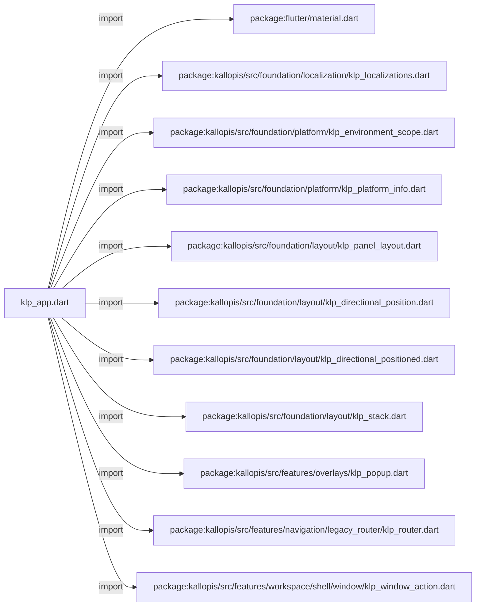
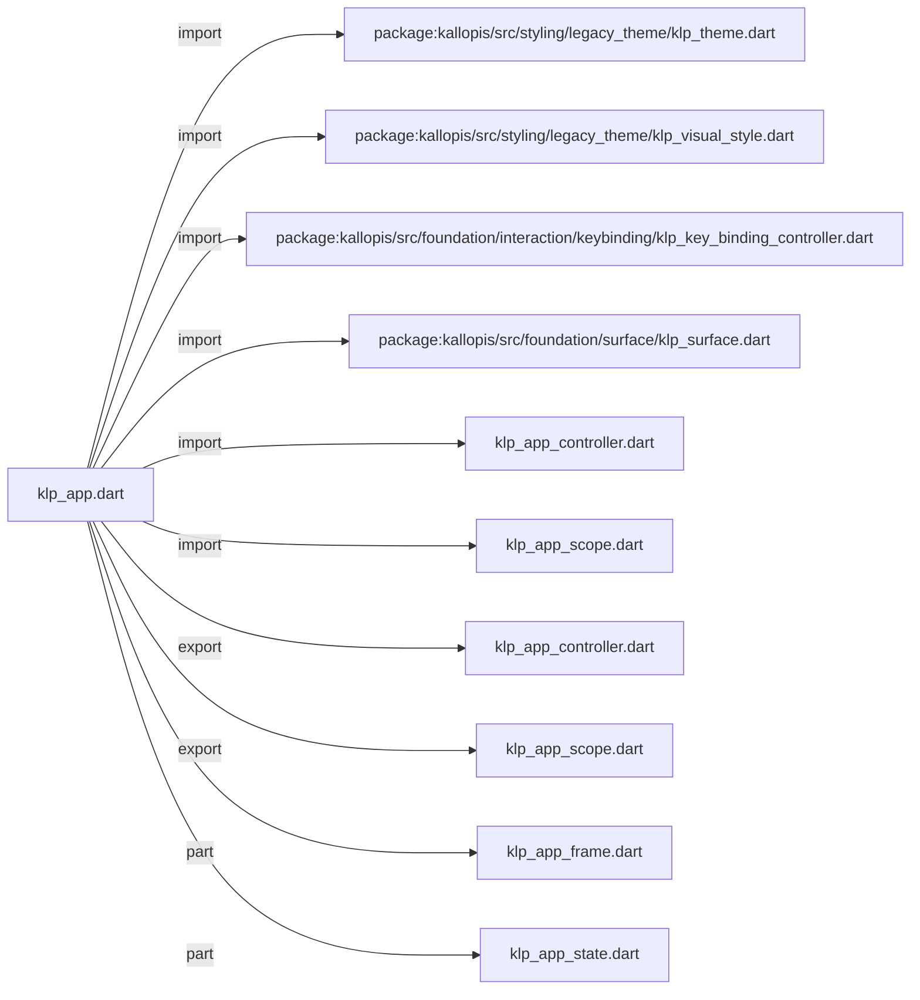
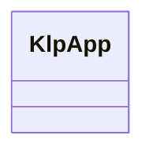
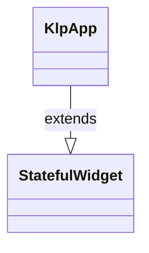

# klp_app.dart：直接依賴與宣告架構

[回到目錄](README.md) · [來源檔案](../../../../../lib/src/application/legacy/klp_app.dart)

## 範圍

核心是 `lib/src/application/legacy/klp_app.dart`。主要視角為該檔案明寫的 import／export／part；輔助視角為本檔宣告及 extends／implements／with／on 關係。只展開一層外部邊界。

## 直接依賴圖

## 依賴證據

| 關係 | 原始 directive | 來源 |
|---|---|---|
| import | <code>import &#x27;package:flutter/material.dart&#x27;;</code> | [lib/src/application/legacy/klp_app.dart:1](../../../../../lib/src/application/legacy/klp_app.dart#L1) |
| import | <code>import &#x27;package:kallopis/src/foundation/localization/klp_localizations.dart&#x27;;</code> | [lib/src/application/legacy/klp_app.dart:3](../../../../../lib/src/application/legacy/klp_app.dart#L3) |
| import | <code>import &#x27;package:kallopis/src/foundation/platform/klp_environment_scope.dart&#x27;;</code> | [lib/src/application/legacy/klp_app.dart:4](../../../../../lib/src/application/legacy/klp_app.dart#L4) |
| import | <code>import &#x27;package:kallopis/src/foundation/platform/klp_platform_info.dart&#x27;;</code> | [lib/src/application/legacy/klp_app.dart:5](../../../../../lib/src/application/legacy/klp_app.dart#L5) |
| import | <code>import &#x27;package:kallopis/src/foundation/layout/klp_panel_layout.dart&#x27;;</code> | [lib/src/application/legacy/klp_app.dart:6](../../../../../lib/src/application/legacy/klp_app.dart#L6) |
| import | <code>import &#x27;package:kallopis/src/foundation/layout/klp_directional_position.dart&#x27;;</code> | [lib/src/application/legacy/klp_app.dart:7](../../../../../lib/src/application/legacy/klp_app.dart#L7) |
| import | <code>import &#x27;package:kallopis/src/foundation/layout/klp_directional_positioned.dart&#x27;;</code> | [lib/src/application/legacy/klp_app.dart:8](../../../../../lib/src/application/legacy/klp_app.dart#L8) |
| import | <code>import &#x27;package:kallopis/src/foundation/layout/klp_stack.dart&#x27;;</code> | [lib/src/application/legacy/klp_app.dart:9](../../../../../lib/src/application/legacy/klp_app.dart#L9) |
| import | <code>import &#x27;package:kallopis/src/features/overlays/klp_popup.dart&#x27;;</code> | [lib/src/application/legacy/klp_app.dart:10](../../../../../lib/src/application/legacy/klp_app.dart#L10) |
| import | <code>import &#x27;package:kallopis/src/features/navigation/legacy_router/klp_router.dart&#x27;;</code> | [lib/src/application/legacy/klp_app.dart:11](../../../../../lib/src/application/legacy/klp_app.dart#L11) |
| import | <code>import &#x27;package:kallopis/src/features/workspace/shell/window/klp_window_action.dart&#x27;;</code> | [lib/src/application/legacy/klp_app.dart:12](../../../../../lib/src/application/legacy/klp_app.dart#L12) |
| import | <code>import &#x27;package:kallopis/src/styling/legacy_theme/klp_theme.dart&#x27;;</code> | [lib/src/application/legacy/klp_app.dart:13](../../../../../lib/src/application/legacy/klp_app.dart#L13) |
| import | <code>import &#x27;package:kallopis/src/styling/legacy_theme/klp_visual_style.dart&#x27;;</code> | [lib/src/application/legacy/klp_app.dart:14](../../../../../lib/src/application/legacy/klp_app.dart#L14) |
| import | <code>import &#x27;package:kallopis/src/foundation/interaction/keybinding/klp_key_binding_controller.dart&#x27;;</code> | [lib/src/application/legacy/klp_app.dart:15](../../../../../lib/src/application/legacy/klp_app.dart#L15) |
| import | <code>import &#x27;package:kallopis/src/foundation/surface/klp_surface.dart&#x27;;</code> | [lib/src/application/legacy/klp_app.dart:16](../../../../../lib/src/application/legacy/klp_app.dart#L16) |
| import | <code>import &#x27;klp_app_controller.dart&#x27;;</code> | [lib/src/application/legacy/klp_app.dart:17](../../../../../lib/src/application/legacy/klp_app.dart#L17) |
| import | <code>import &#x27;klp_app_scope.dart&#x27;;</code> | [lib/src/application/legacy/klp_app.dart:18](../../../../../lib/src/application/legacy/klp_app.dart#L18) |
| export | <code>export &#x27;klp_app_controller.dart&#x27;;</code> | [lib/src/application/legacy/klp_app.dart:20](../../../../../lib/src/application/legacy/klp_app.dart#L20) |
| export | <code>export &#x27;klp_app_scope.dart&#x27;;</code> | [lib/src/application/legacy/klp_app.dart:21](../../../../../lib/src/application/legacy/klp_app.dart#L21) |
| part | <code>part &#x27;klp_app_frame.dart&#x27;;</code> | [lib/src/application/legacy/klp_app.dart:23](../../../../../lib/src/application/legacy/klp_app.dart#L23) |
| part | <code>part &#x27;klp_app_state.dart&#x27;;</code> | [lib/src/application/legacy/klp_app.dart:24](../../../../../lib/src/application/legacy/klp_app.dart#L24) |

## 宣告關係圖

本組節點是本檔宣告；沒有箭頭的宣告未在此圖主張互相依賴。

## 宣告與成員證據

成員包含 public 與 private；簽章取自來源，省略函式本體與欄位初始值。`(inferred)` 表示來源未明寫型別；建構子只顯示參數部分，不含初始化列表。

### KlpApp

ClassDeclaration · public · [lib/src/application/legacy/klp_app.dart:26](../../../../../lib/src/application/legacy/klp_app.dart#L26)

<code>class KlpApp extends StatefulWidget</code>

來源註解摘要：\MaterialApp\ 的接入層，收掉每個消費者都得自己組一次的樣板。

- `extends` → <code>StatefulWidget</code>：[lib/src/application/legacy/klp_app.dart:27](../../../../../lib/src/application/legacy/klp_app.dart#L27)

| 成員 | 可見性 | 簽章／型別 | 來源註解摘要 | 證據 |
|---|---|---|---|---|
| constructor <code>KlpApp</code> | public | <code>const KlpApp({ super.key, this.style = KlpVisualStyle.defaultStyle, this.lightStyle, this.darkStyle, this.initialThemeMode = ThemeMode.light, this.keyBindingController, this.router, this.home, this.popup, this.title = &#x27;&#x27;, this.startMaximized = true, this.minWidth, this.minHeight, this.locale, this.localizationsDelegates, this.supportedLocales = const &lt;Locale&gt;[Locale(&#x27;en&#x27;, &#x27;US&#x27;)], this.builder, this.debugShowCheckedModeBanner = true, })</code> |  | [lib/src/application/legacy/klp_app.dart:28](../../../../../lib/src/application/legacy/klp_app.dart#L28) |
| field <code>style</code> | public | <code>final KlpVisualStyle style</code> | 向後相容的共用風格基底；未提供對應的完整風格時，色彩仍隨明暗套用內建值。 | [lib/src/application/legacy/klp_app.dart:51](../../../../../lib/src/application/legacy/klp_app.dart#L51) |
| field <code>lightStyle</code> | public | <code>final KlpVisualStyle? lightStyle</code> | 淺色模式的完整視覺風格；提供後不會被 [style] 或內建色彩改寫。 | [lib/src/application/legacy/klp_app.dart:54](../../../../../lib/src/application/legacy/klp_app.dart#L54) |
| field <code>darkStyle</code> | public | <code>final KlpVisualStyle? darkStyle</code> | 深色模式的完整視覺風格；提供後不會被 [style] 或內建色彩改寫。 | [lib/src/application/legacy/klp_app.dart:57](../../../../../lib/src/application/legacy/klp_app.dart#L57) |
| field <code>initialThemeMode</code> | public | <code>final ThemeMode initialThemeMode</code> | 啟動時的明暗狀態。 | [lib/src/application/legacy/klp_app.dart:60](../../../../../lib/src/application/legacy/klp_app.dart#L60) |
| field <code>keyBindingController</code> | public | <code>final KlpKeyBindingController? keyBindingController</code> | 可選的快捷鍵 controller；未提供時由 [KlpApp] 建立並管理生命週期。 | [lib/src/application/legacy/klp_app.dart:63](../../../../../lib/src/application/legacy/klp_app.dart#L63) |
| field <code>router</code> | public | <code>final KlpRouter? router</code> | 選擇性的分發器。給了就自動架好 [KlpRouterScope]，見類別 dartdoc。 | [lib/src/application/legacy/klp_app.dart:66](../../../../../lib/src/application/legacy/klp_app.dart#L66) |
| field <code>home</code> | public | <code>final KlpPanelLayout? home</code> | 首頁內容。[router] 存在且這裡未給值時，退回 [KlpRouterOutlet]。 | [lib/src/application/legacy/klp_app.dart:69](../../../../../lib/src/application/legacy/klp_app.dart#L69) |
| field <code>popup</code> | public | <code>final KlpPopupBackground? popup</code> | 選擇性的 App 層 popup；顯示時覆蓋於最外層。 | [lib/src/application/legacy/klp_app.dart:72](../../../../../lib/src/application/legacy/klp_app.dart#L72) |
| field <code>title</code> | public | <code>final String title</code> |  | [lib/src/application/legacy/klp_app.dart:74](../../../../../lib/src/application/legacy/klp_app.dart#L74) |
| field <code>startMaximized</code> | public | <code>final bool startMaximized</code> | 是否在首次建立時確保原生視窗最大化；已最大化時不會切換回視窗化。 | [lib/src/application/legacy/klp_app.dart:77](../../../../../lib/src/application/legacy/klp_app.dart#L77) |
| field <code>minWidth</code> | public | <code>final double? minWidth</code> | 視窗最小允許寬度（邏輯像素）。 | [lib/src/application/legacy/klp_app.dart:80](../../../../../lib/src/application/legacy/klp_app.dart#L80) |
| field <code>minHeight</code> | public | <code>final double? minHeight</code> | 視窗最小允許高度（邏輯像素）。 | [lib/src/application/legacy/klp_app.dart:83](../../../../../lib/src/application/legacy/klp_app.dart#L83) |
| field <code>locale</code> | public | <code>final Locale? locale</code> |  | [lib/src/application/legacy/klp_app.dart:85](../../../../../lib/src/application/legacy/klp_app.dart#L85) |
| field <code>localizationsDelegates</code> | public | <code>final Iterable&lt;LocalizationsDelegate&lt;dynamic&gt;&gt;? localizationsDelegates</code> | 額外的 localization delegate。[KlpApp] 會把這些 delegate 排在內建預設值前面， 因此消費者提供的 [KlpLocalizationsDelegate] 會優先覆寫預設字串；其他資源型別也會合併載入。 | [lib/src/application/legacy/klp_app.dart:89](../../../../../lib/src/application/legacy/klp_app.dart#L89) |
| field <code>supportedLocales</code> | public | <code>final Iterable&lt;Locale&gt; supportedLocales</code> |  | [lib/src/application/legacy/klp_app.dart:90](../../../../../lib/src/application/legacy/klp_app.dart#L90) |
| field <code>builder</code> | public | <code>final TransitionBuilder? builder</code> |  | [lib/src/application/legacy/klp_app.dart:91](../../../../../lib/src/application/legacy/klp_app.dart#L91) |
| field <code>debugShowCheckedModeBanner</code> | public | <code>final bool debugShowCheckedModeBanner</code> |  | [lib/src/application/legacy/klp_app.dart:92](../../../../../lib/src/application/legacy/klp_app.dart#L92) |
| method <code>of</code> | public | <code>static KlpAppController of(BuildContext context)</code> | 取得目前的 [KlpAppController]，通常用來切換明暗。 呼叫端會在 [brightness] 或 [themeMode] 改變時自動重建——這是 \InheritedWidget\ 的標準行為，不需要另外訂閱。 | [lib/src/application/legacy/klp_app.dart:94](../../../../../lib/src/application/legacy/klp_app.dart#L94) |
| method <code>createState</code> | public | <code>State&lt;KlpApp&gt; createState()</code> |  | [lib/src/application/legacy/klp_app.dart:106](../../../../../lib/src/application/legacy/klp_app.dart#L106) |

## 閱讀說明與限制

箭頭只表示來源明寫的靜態關係；import 不等於呼叫。未分析動態呼叫、欄位的實際物件擁有權、狀態轉移或渲染流程；型別未進行語意解析，繼承目標保留原始型別拼寫。public／private 依 Dart 名稱前綴判斷；public 宣告不代表已由 `lib/kallopis.dart` 匯出。

本頁由 `tool/architecture_atlas` 產生；編輯來源或生成工具後重新產生，避免手改本頁。
