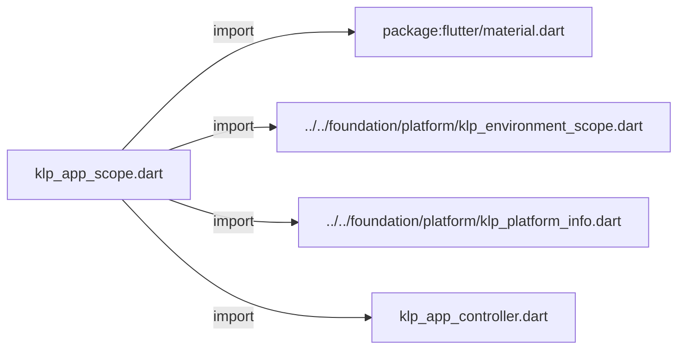
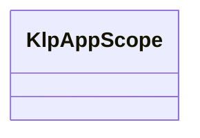
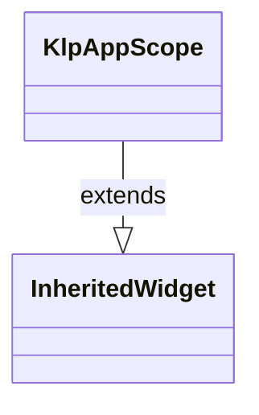

# klp_app_scope.dart：直接依賴與宣告架構

[回到目錄](README.md) · [來源檔案](../../../../../lib/src/application/legacy/klp_app_scope.dart)

## 範圍

核心是 `lib/src/application/legacy/klp_app_scope.dart`。主要視角為該檔案明寫的 import／export／part；輔助視角為本檔宣告及 extends／implements／with／on 關係。只展開一層外部邊界。

## 直接依賴圖

## 依賴證據

| 關係 | 原始 directive | 來源 |
|---|---|---|
| import | <code>import &#x27;package:flutter/material.dart&#x27;;</code> | [lib/src/application/legacy/klp_app_scope.dart:1](../../../../../lib/src/application/legacy/klp_app_scope.dart#L1) |
| import | <code>import &#x27;../../foundation/platform/klp_environment_scope.dart&#x27;;</code> | [lib/src/application/legacy/klp_app_scope.dart:3](../../../../../lib/src/application/legacy/klp_app_scope.dart#L3) |
| import | <code>import &#x27;../../foundation/platform/klp_platform_info.dart&#x27;;</code> | [lib/src/application/legacy/klp_app_scope.dart:4](../../../../../lib/src/application/legacy/klp_app_scope.dart#L4) |
| import | <code>import &#x27;klp_app_controller.dart&#x27;;</code> | [lib/src/application/legacy/klp_app_scope.dart:5](../../../../../lib/src/application/legacy/klp_app_scope.dart#L5) |

## 宣告關係圖

本組節點是本檔宣告；沒有箭頭的宣告未在此圖主張互相依賴。

## 宣告與成員證據

成員包含 public 與 private；簽章取自來源，省略函式本體與欄位初始值。`(inferred)` 表示來源未明寫型別；建構子只顯示參數部分，不含初始化列表。

### KlpAppScope

ClassDeclaration · public · [lib/src/application/legacy/klp_app_scope.dart:7](../../../../../lib/src/application/legacy/klp_app_scope.dart#L7)

<code>class KlpAppScope extends InheritedWidget</code>

來源註解摘要：將應用程式控制器、平台及主題狀態注入子樹。

- `extends` → <code>InheritedWidget</code>：[lib/src/application/legacy/klp_app_scope.dart:8](../../../../../lib/src/application/legacy/klp_app_scope.dart#L8)

| 成員 | 可見性 | 簽章／型別 | 來源註解摘要 | 證據 |
|---|---|---|---|---|
| constructor <code>KlpAppScope</code> | public | <code>const KlpAppScope({ super.key, required this.controller, required this.platform, required this.brightness, required this.themeMode, required super.child, })</code> |  | [lib/src/application/legacy/klp_app_scope.dart:9](../../../../../lib/src/application/legacy/klp_app_scope.dart#L9) |
| field <code>controller</code> | public | <code>final KlpAppController controller</code> |  | [lib/src/application/legacy/klp_app_scope.dart:18](../../../../../lib/src/application/legacy/klp_app_scope.dart#L18) |
| field <code>platform</code> | public | <code>final KlpPlatformInfo platform</code> |  | [lib/src/application/legacy/klp_app_scope.dart:19](../../../../../lib/src/application/legacy/klp_app_scope.dart#L19) |
| field <code>brightness</code> | public | <code>final Brightness brightness</code> |  | [lib/src/application/legacy/klp_app_scope.dart:20](../../../../../lib/src/application/legacy/klp_app_scope.dart#L20) |
| field <code>themeMode</code> | public | <code>final ThemeMode themeMode</code> |  | [lib/src/application/legacy/klp_app_scope.dart:21](../../../../../lib/src/application/legacy/klp_app_scope.dart#L21) |
| method <code>platformOf</code> | public | <code>static KlpPlatformInfo platformOf(BuildContext context)</code> | 優先訂閱平台環境，並保留舊版獨立 App scope 的相容讀取。 | [lib/src/application/legacy/klp_app_scope.dart:23](../../../../../lib/src/application/legacy/klp_app_scope.dart#L23) |
| method <code>updateShouldNotify</code> | public | <code>bool updateShouldNotify(KlpAppScope oldWidget)</code> |  | [lib/src/application/legacy/klp_app_scope.dart:34](../../../../../lib/src/application/legacy/klp_app_scope.dart#L34) |

## 閱讀說明與限制

箭頭只表示來源明寫的靜態關係；import 不等於呼叫。未分析動態呼叫、欄位的實際物件擁有權、狀態轉移或渲染流程；型別未進行語意解析，繼承目標保留原始型別拼寫。public／private 依 Dart 名稱前綴判斷；public 宣告不代表已由 `lib/kallopis.dart` 匯出。

本頁由 `tool/architecture_atlas` 產生；編輯來源或生成工具後重新產生，避免手改本頁。
