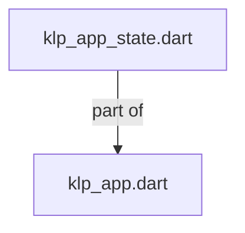
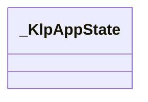
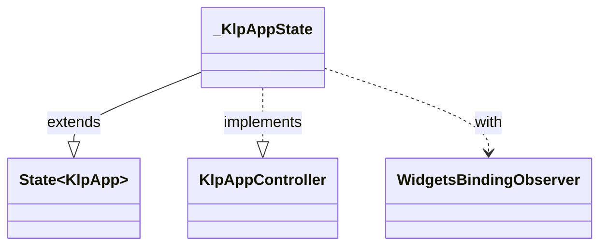

# klp_app_state.dart：直接依賴與宣告架構

[回到目錄](README.md) · [來源檔案](../../../../../lib/src/application/legacy/klp_app_state.dart)

## 範圍

核心是 `lib/src/application/legacy/klp_app_state.dart`。主要視角為該檔案明寫的 import／export／part；輔助視角為本檔宣告及 extends／implements／with／on 關係。只展開一層外部邊界。

## 直接依賴圖

## 依賴證據

| 關係 | 原始 directive | 來源 |
|---|---|---|
| part of | <code>part of &#x27;klp_app.dart&#x27;;</code> | [lib/src/application/legacy/klp_app_state.dart:1](../../../../../lib/src/application/legacy/klp_app_state.dart#L1) |

## 宣告關係圖

本組節點是本檔宣告；沒有箭頭的宣告未在此圖主張互相依賴。

## 宣告與成員證據

成員包含 public 與 private；簽章取自來源，省略函式本體與欄位初始值。`(inferred)` 表示來源未明寫型別；建構子只顯示參數部分，不含初始化列表。

### _KlpAppState

ClassDeclaration · private · [lib/src/application/legacy/klp_app_state.dart:3](../../../../../lib/src/application/legacy/klp_app_state.dart#L3)

<code>class _KlpAppState extends State&lt;KlpApp&gt; with WidgetsBindingObserver implements KlpAppController</code>

來源註解摘要：管理 Kallopis 應用程式主題、快捷鍵與平台生命週期。

- `extends` → <code>State&lt;KlpApp&gt;</code>：[lib/src/application/legacy/klp_app_state.dart:4](../../../../../lib/src/application/legacy/klp_app_state.dart#L4)
- `implements` → <code>KlpAppController</code>：[lib/src/application/legacy/klp_app_state.dart:6](../../../../../lib/src/application/legacy/klp_app_state.dart#L6)
- `with` → <code>WidgetsBindingObserver</code>：[lib/src/application/legacy/klp_app_state.dart:5](../../../../../lib/src/application/legacy/klp_app_state.dart#L5)

| 成員 | 可見性 | 簽章／型別 | 來源註解摘要 | 證據 |
|---|---|---|---|---|
| field <code>_themeMode</code> | private | <code>late ThemeMode _themeMode</code> |  | [lib/src/application/legacy/klp_app_state.dart:7](../../../../../lib/src/application/legacy/klp_app_state.dart#L7) |
| field <code>_keyBindings</code> | private | <code>late KlpKeyBindingController _keyBindings</code> |  | [lib/src/application/legacy/klp_app_state.dart:8](../../../../../lib/src/application/legacy/klp_app_state.dart#L8) |
| field <code>_ownsKeyBindings</code> | private | <code>bool _ownsKeyBindings</code> |  | [lib/src/application/legacy/klp_app_state.dart:9](../../../../../lib/src/application/legacy/klp_app_state.dart#L9) |
| method <code>initState</code> | public | <code>void initState()</code> |  | [lib/src/application/legacy/klp_app_state.dart:11](../../../../../lib/src/application/legacy/klp_app_state.dart#L11) |
| method <code>dispose</code> | public | <code>void dispose()</code> |  | [lib/src/application/legacy/klp_app_state.dart:27](../../../../../lib/src/application/legacy/klp_app_state.dart#L27) |
| method <code>didChangePlatformBrightness</code> | public | <code>void didChangePlatformBrightness()</code> |  | [lib/src/application/legacy/klp_app_state.dart:34](../../../../../lib/src/application/legacy/klp_app_state.dart#L34) |
| method <code>didUpdateWidget</code> | public | <code>void didUpdateWidget(covariant KlpApp oldWidget)</code> |  | [lib/src/application/legacy/klp_app_state.dart:41](../../../../../lib/src/application/legacy/klp_app_state.dart#L41) |
| getter <code>themeMode</code> | public | <code>ThemeMode get themeMode</code> |  | [lib/src/application/legacy/klp_app_state.dart:58](../../../../../lib/src/application/legacy/klp_app_state.dart#L58) |
| getter <code>keyBindings</code> | public | <code>KlpKeyBindingController get keyBindings</code> |  | [lib/src/application/legacy/klp_app_state.dart:61](../../../../../lib/src/application/legacy/klp_app_state.dart#L61) |
| getter <code>brightness</code> | public | <code>Brightness get brightness</code> |  | [lib/src/application/legacy/klp_app_state.dart:64](../../../../../lib/src/application/legacy/klp_app_state.dart#L64) |
| method <code>toggleBrightness</code> | public | <code>void toggleBrightness()</code> |  | [lib/src/application/legacy/klp_app_state.dart:72](../../../../../lib/src/application/legacy/klp_app_state.dart#L72) |
| method <code>setThemeMode</code> | public | <code>void setThemeMode(ThemeMode mode)</code> |  | [lib/src/application/legacy/klp_app_state.dart:81](../../../../../lib/src/application/legacy/klp_app_state.dart#L81) |
| method <code>build</code> | public | <code>Widget build(BuildContext context)</code> |  | [lib/src/application/legacy/klp_app_state.dart:86](../../../../../lib/src/application/legacy/klp_app_state.dart#L86) |
| method <code>_styleFor</code> | private | <code>KlpVisualStyle _styleFor(Brightness brightness)</code> |  | [lib/src/application/legacy/klp_app_state.dart:164](../../../../../lib/src/application/legacy/klp_app_state.dart#L164) |

## 閱讀說明與限制

箭頭只表示來源明寫的靜態關係；import 不等於呼叫。未分析動態呼叫、欄位的實際物件擁有權、狀態轉移或渲染流程；型別未進行語意解析，繼承目標保留原始型別拼寫。public／private 依 Dart 名稱前綴判斷；public 宣告不代表已由 `lib/kallopis.dart` 匯出。

本頁由 `tool/architecture_atlas` 產生；編輯來源或生成工具後重新產生，避免手改本頁。
