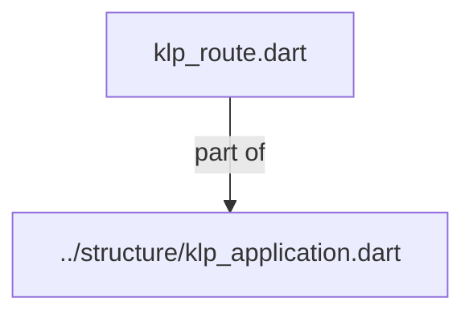
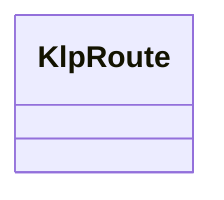

# klp_route.dart：直接依賴與宣告架構

[回到目錄](README.md) · [來源檔案](../../../../../lib/src/application/routing/klp_route.dart)

## 範圍

核心是 `lib/src/application/routing/klp_route.dart`。主要視角為該檔案明寫的 import／export／part；輔助視角為本檔宣告及 extends／implements／with／on 關係。只展開一層外部邊界。

## 直接依賴圖

## 依賴證據

| 關係 | 原始 directive | 來源 |
|---|---|---|
| part of | <code>part of &#x27;../structure/klp_application.dart&#x27;;</code> | [lib/src/application/routing/klp_route.dart:1](../../../../../lib/src/application/routing/klp_route.dart#L1) |

## 宣告關係圖

本組節點是本檔宣告；沒有箭頭的宣告未在此圖主張互相依賴。

## 宣告與成員證據

成員包含 public 與 private；簽章取自來源，省略函式本體與欄位初始值。`(inferred)` 表示來源未明寫型別；建構子只顯示參數部分，不含初始化列表。

### KlpRoute

ClassDeclaration · public · [lib/src/application/routing/klp_route.dart:3](../../../../../lib/src/application/routing/klp_route.dart#L3)

<code>final class KlpRoute&lt;P, R&gt;</code>

來源註解摘要：畫面映射只取得型別化資料與受控操作，不取得渲染上下文或風格權限。

| 成員 | 可見性 | 簽章／型別 | 來源註解摘要 | 證據 |
|---|---|---|---|---|
| field <code>destination</code> | public | <code>final KlpDestination&lt;P, R&gt; destination</code> |  | [lib/src/application/routing/klp_route.dart:6](../../../../../lib/src/application/routing/klp_route.dart#L6) |
| field <code>_screen</code> | private | <code>final KlpScreen Function(KlpRouteInput&lt;P, R&gt;) _screen</code> |  | [lib/src/application/routing/klp_route.dart:7](../../../../../lib/src/application/routing/klp_route.dart#L7) |
| field <code>_beforeEnter</code> | private | <code>final FutureOr&lt;bool&gt; Function(KlpNavigationTransition)? _beforeEnter</code> |  | [lib/src/application/routing/klp_route.dart:8](../../../../../lib/src/application/routing/klp_route.dart#L8) |
| field <code>_beforeLeave</code> | private | <code>final FutureOr&lt;bool&gt; Function(KlpNavigationTransition)? _beforeLeave</code> |  | [lib/src/application/routing/klp_route.dart:9](../../../../../lib/src/application/routing/klp_route.dart#L9) |
| constructor <code>KlpRoute</code> | public | <code>KlpRoute(KlpDestination&lt;P, R&gt; destination, { required KlpScreen Function(KlpRouteInput&lt;P, R&gt;) screen, FutureOr&lt;bool&gt; Function(KlpNavigationTransition)? beforeEnter, FutureOr&lt;bool&gt; Function(KlpNavigationTransition)? beforeLeave, })</code> |  | [lib/src/application/routing/klp_route.dart:11](../../../../../lib/src/application/routing/klp_route.dart#L11) |
| constructor <code>_</code> | private | <code>KlpRoute._(this.destination, this._screen, this._beforeEnter, this._beforeLeave)</code> |  | [lib/src/application/routing/klp_route.dart:17](../../../../../lib/src/application/routing/klp_route.dart#L17) |
| getter <code>_policy</code> | private | <code>KlpRoutePolicy get _policy</code> |  | [lib/src/application/routing/klp_route.dart:19](../../../../../lib/src/application/routing/klp_route.dart#L19) |
| method <code>_project</code> | private | <code>KlpScreen _project(KlpNavigationEntry entry, _KlpRouteActions actions)</code> |  | [lib/src/application/routing/klp_route.dart:21](../../../../../lib/src/application/routing/klp_route.dart#L21) |

## 閱讀說明與限制

箭頭只表示來源明寫的靜態關係；import 不等於呼叫。未分析動態呼叫、欄位的實際物件擁有權、狀態轉移或渲染流程；型別未進行語意解析，繼承目標保留原始型別拼寫。public／private 依 Dart 名稱前綴判斷；public 宣告不代表已由 `lib/kallopis.dart` 匯出。

本頁由 `tool/architecture_atlas` 產生；編輯來源或生成工具後重新產生，避免手改本頁。
