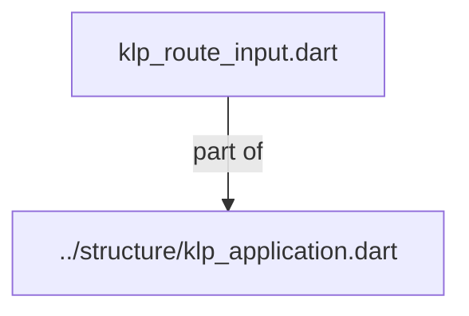
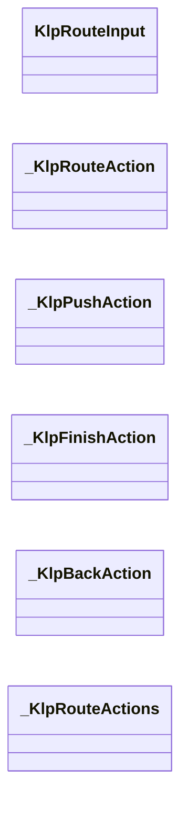
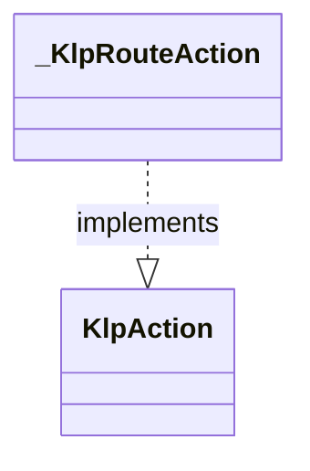
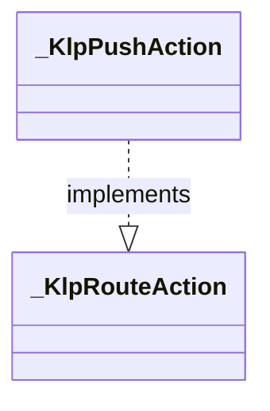
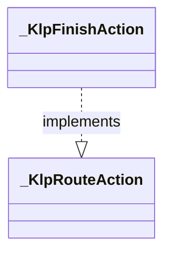
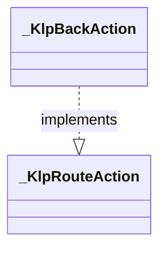

# klp_route_input.dart：直接依賴與宣告架構

[回到目錄](README.md) · [來源檔案](../../../../../lib/src/application/routing/klp_route_input.dart)

## 範圍

核心是 `lib/src/application/routing/klp_route_input.dart`。主要視角為該檔案明寫的 import／export／part；輔助視角為本檔宣告及 extends／implements／with／on 關係。只展開一層外部邊界。

## 直接依賴圖

## 依賴證據

| 關係 | 原始 directive | 來源 |
|---|---|---|
| part of | <code>part of &#x27;../structure/klp_application.dart&#x27;;</code> | [lib/src/application/routing/klp_route_input.dart:1](../../../../../lib/src/application/routing/klp_route_input.dart#L1) |

## 宣告關係圖

本組節點是本檔宣告；沒有箭頭的宣告未在此圖主張互相依賴。

## 宣告與成員證據

成員包含 public 與 private；簽章取自來源，省略函式本體與欄位初始值。`(inferred)` 表示來源未明寫型別；建構子只顯示參數部分，不含初始化列表。

### KlpRouteInput

ClassDeclaration · public · [lib/src/application/routing/klp_route_input.dart:3](../../../../../lib/src/application/routing/klp_route_input.dart#L3)

<code>final class KlpRouteInput&lt;P, R&gt;</code>

來源註解摘要：本庫依目前放置建立的借用輸入，外部不能自行建構或替換操作接線。

| 成員 | 可見性 | 簽章／型別 | 來源註解摘要 | 證據 |
|---|---|---|---|---|
| field <code>parameters</code> | public | <code>final P parameters</code> |  | [lib/src/application/routing/klp_route_input.dart:6](../../../../../lib/src/application/routing/klp_route_input.dart#L6) |
| field <code>_actions</code> | private | <code>final _KlpRouteActions _actions</code> |  | [lib/src/application/routing/klp_route_input.dart:7](../../../../../lib/src/application/routing/klp_route_input.dart#L7) |
| constructor <code>_</code> | private | <code>const KlpRouteInput._(this.parameters, this._actions)</code> |  | [lib/src/application/routing/klp_route_input.dart:9](../../../../../lib/src/application/routing/klp_route_input.dart#L9) |
| method <code>navigate</code> | public | <code>KlpAction navigate&lt;T&gt;(KlpLocation&lt;T&gt; location, {void Function(T value)? onResult})</code> | 建立受目前 entry 綁定的導覽宣告；只有安裝後的本庫 handler 能派送它。 | [lib/src/application/routing/klp_route_input.dart:11](../../../../../lib/src/application/routing/klp_route_input.dart#L11) |
| method <code>finish</code> | public | <code>KlpAction finish(R result)</code> | 建立目前 route 的完成宣告；結果型別維持 route 宣告的 R。 | [lib/src/application/routing/klp_route_input.dart:14](../../../../../lib/src/application/routing/klp_route_input.dart#L14) |
| method <code>back</code> | public | <code>KlpAction back()</code> | 建立目前 route 的返回宣告；根畫面會由導覽核心拒絕。 | [lib/src/application/routing/klp_route_input.dart:17](../../../../../lib/src/application/routing/klp_route_input.dart#L17) |

### _KlpRouteAction

ClassDeclaration · private · [lib/src/application/routing/klp_route_input.dart:21](../../../../../lib/src/application/routing/klp_route_input.dart#L21)

<code>abstract interface class _KlpRouteAction implements KlpAction</code>

- `implements` → <code>KlpAction</code>：[lib/src/application/routing/klp_route_input.dart:21](../../../../../lib/src/application/routing/klp_route_input.dart#L21)

| 成員 | 可見性 | 簽章／型別 | 來源註解摘要 | 證據 |
|---|---|---|---|---|
| method <code>activate</code> | public | <code>Future&lt;KlpActionActivation&gt; activate(_KlpApplicationActionHandler handler)</code> |  | [lib/src/application/routing/klp_route_input.dart:23](../../../../../lib/src/application/routing/klp_route_input.dart#L23) |

### _KlpPushAction

ClassDeclaration · private · [lib/src/application/routing/klp_route_input.dart:26](../../../../../lib/src/application/routing/klp_route_input.dart#L26)

<code>final class _KlpPushAction&lt;T&gt; implements _KlpRouteAction</code>

- `implements` → <code>_KlpRouteAction</code>：[lib/src/application/routing/klp_route_input.dart:26](../../../../../lib/src/application/routing/klp_route_input.dart#L26)

| 成員 | 可見性 | 簽章／型別 | 來源註解摘要 | 證據 |
|---|---|---|---|---|
| field <code>actions</code> | public | <code>final _KlpRouteActions actions</code> |  | [lib/src/application/routing/klp_route_input.dart:28](../../../../../lib/src/application/routing/klp_route_input.dart#L28) |
| field <code>location</code> | public | <code>final KlpLocation&lt;T&gt; location</code> |  | [lib/src/application/routing/klp_route_input.dart:29](../../../../../lib/src/application/routing/klp_route_input.dart#L29) |
| field <code>onResult</code> | public | <code>final void Function(T value)? onResult</code> |  | [lib/src/application/routing/klp_route_input.dart:30](../../../../../lib/src/application/routing/klp_route_input.dart#L30) |
| constructor <code>_KlpPushAction</code> | private | <code>const _KlpPushAction(this.actions, this.location, this.onResult)</code> |  | [lib/src/application/routing/klp_route_input.dart:32](../../../../../lib/src/application/routing/klp_route_input.dart#L32) |
| method <code>activate</code> | public | <code>Future&lt;KlpActionActivation&gt; activate(_KlpApplicationActionHandler handler)</code> |  | [lib/src/application/routing/klp_route_input.dart:34](../../../../../lib/src/application/routing/klp_route_input.dart#L34) |

### _KlpFinishAction

ClassDeclaration · private · [lib/src/application/routing/klp_route_input.dart:38](../../../../../lib/src/application/routing/klp_route_input.dart#L38)

<code>final class _KlpFinishAction implements _KlpRouteAction</code>

- `implements` → <code>_KlpRouteAction</code>：[lib/src/application/routing/klp_route_input.dart:38](../../../../../lib/src/application/routing/klp_route_input.dart#L38)

| 成員 | 可見性 | 簽章／型別 | 來源註解摘要 | 證據 |
|---|---|---|---|---|
| field <code>actions</code> | public | <code>final _KlpRouteActions actions</code> |  | [lib/src/application/routing/klp_route_input.dart:40](../../../../../lib/src/application/routing/klp_route_input.dart#L40) |
| field <code>result</code> | public | <code>final Object? result</code> |  | [lib/src/application/routing/klp_route_input.dart:41](../../../../../lib/src/application/routing/klp_route_input.dart#L41) |
| constructor <code>_KlpFinishAction</code> | private | <code>const _KlpFinishAction(this.actions, this.result)</code> |  | [lib/src/application/routing/klp_route_input.dart:43](../../../../../lib/src/application/routing/klp_route_input.dart#L43) |
| method <code>activate</code> | public | <code>Future&lt;KlpActionActivation&gt; activate(_KlpApplicationActionHandler handler)</code> |  | [lib/src/application/routing/klp_route_input.dart:45](../../../../../lib/src/application/routing/klp_route_input.dart#L45) |

### _KlpBackAction

ClassDeclaration · private · [lib/src/application/routing/klp_route_input.dart:49](../../../../../lib/src/application/routing/klp_route_input.dart#L49)

<code>final class _KlpBackAction implements _KlpRouteAction</code>

- `implements` → <code>_KlpRouteAction</code>：[lib/src/application/routing/klp_route_input.dart:49](../../../../../lib/src/application/routing/klp_route_input.dart#L49)

| 成員 | 可見性 | 簽章／型別 | 來源註解摘要 | 證據 |
|---|---|---|---|---|
| field <code>actions</code> | public | <code>final _KlpRouteActions actions</code> |  | [lib/src/application/routing/klp_route_input.dart:51](../../../../../lib/src/application/routing/klp_route_input.dart#L51) |
| constructor <code>_KlpBackAction</code> | private | <code>const _KlpBackAction(this.actions)</code> |  | [lib/src/application/routing/klp_route_input.dart:53](../../../../../lib/src/application/routing/klp_route_input.dart#L53) |
| method <code>activate</code> | public | <code>Future&lt;KlpActionActivation&gt; activate(_KlpApplicationActionHandler handler)</code> |  | [lib/src/application/routing/klp_route_input.dart:55](../../../../../lib/src/application/routing/klp_route_input.dart#L55) |

### _KlpRouteActions

ClassDeclaration · private · [lib/src/application/routing/klp_route_input.dart:59](../../../../../lib/src/application/routing/klp_route_input.dart#L59)

<code>abstract interface class _KlpRouteActions</code>

來源註解摘要：應用 session 持有 entry 與操作期限；此接點不對消費端公開。

| 成員 | 可見性 | 簽章／型別 | 來源註解摘要 | 證據 |
|---|---|---|---|---|
| method <code>push</code> | public | <code>KlpNavigationTicket&lt;T&gt; push&lt;T&gt;(KlpLocation&lt;T&gt; location)</code> |  | [lib/src/application/routing/klp_route_input.dart:62](../../../../../lib/src/application/routing/klp_route_input.dart#L62) |
| method <code>complete</code> | public | <code>Future&lt;KlpNavigationDecision&gt; complete(Object? result)</code> |  | [lib/src/application/routing/klp_route_input.dart:63](../../../../../lib/src/application/routing/klp_route_input.dart#L63) |
| method <code>cancel</code> | public | <code>Future&lt;KlpNavigationDecision&gt; cancel()</code> |  | [lib/src/application/routing/klp_route_input.dart:64](../../../../../lib/src/application/routing/klp_route_input.dart#L64) |

## 閱讀說明與限制

箭頭只表示來源明寫的靜態關係；import 不等於呼叫。未分析動態呼叫、欄位的實際物件擁有權、狀態轉移或渲染流程；型別未進行語意解析，繼承目標保留原始型別拼寫。public／private 依 Dart 名稱前綴判斷；public 宣告不代表已由 `lib/kallopis.dart` 匯出。

本頁由 `tool/architecture_atlas` 產生；編輯來源或生成工具後重新產生，避免手改本頁。
