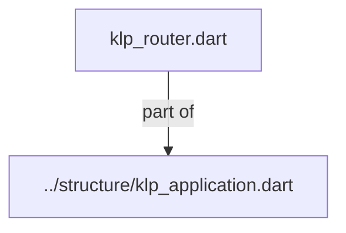
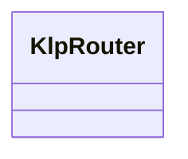

# klp_router.dart：直接依賴與宣告架構

[回到目錄](README.md) · [來源檔案](../../../../../lib/src/application/routing/klp_router.dart)

## 範圍

核心是 `lib/src/application/routing/klp_router.dart`。主要視角為該檔案明寫的 import／export／part；輔助視角為本檔宣告及 extends／implements／with／on 關係。只展開一層外部邊界。

## 直接依賴圖

## 依賴證據

| 關係 | 原始 directive | 來源 |
|---|---|---|
| part of | <code>part of &#x27;../structure/klp_application.dart&#x27;;</code> | [lib/src/application/routing/klp_router.dart:1](../../../../../lib/src/application/routing/klp_router.dart#L1) |

## 宣告關係圖

本組節點是本檔宣告；沒有箭頭的宣告未在此圖主張互相依賴。

## 宣告與成員證據

成員包含 public 與 private；簽章取自來源，省略函式本體與欄位初始值。`(inferred)` 表示來源未明寫型別；建構子只顯示參數部分，不含初始化列表。

### KlpRouter

ClassDeclaration · public · [lib/src/application/routing/klp_router.dart:3](../../../../../lib/src/application/routing/klp_router.dart#L3)

<code>final class KlpRouter</code>

來源註解摘要：單一或多畫面皆透過路由資料宣告，消費端不建立導覽控制器。

| 成員 | 可見性 | 簽章／型別 | 來源註解摘要 | 證據 |
|---|---|---|---|---|
| field <code>id</code> | public | <code>final String id</code> |  | [lib/src/application/routing/klp_router.dart:5](../../../../../lib/src/application/routing/klp_router.dart#L5) |
| field <code>initial</code> | public | <code>final KlpLocation&lt;Object?&gt; initial</code> |  | [lib/src/application/routing/klp_router.dart:6](../../../../../lib/src/application/routing/klp_router.dart#L6) |
| field <code>routes</code> | public | <code>final List&lt;KlpRoute&lt;Object?, Object?&gt;&gt; routes</code> |  | [lib/src/application/routing/klp_router.dart:7](../../../../../lib/src/application/routing/klp_router.dart#L7) |
| field <code>restoration</code> | public | <code>final KlpNavigationRestoration? restoration</code> |  | [lib/src/application/routing/klp_router.dart:8](../../../../../lib/src/application/routing/klp_router.dart#L8) |
| field <code>_initialStack</code> | private | <code>late final List&lt;KlpLocation&lt;Object?&gt;&gt; _initialStack</code> |  | [lib/src/application/routing/klp_router.dart:9](../../../../../lib/src/application/routing/klp_router.dart#L9) |
| constructor <code>KlpRouter</code> | public | <code>KlpRouter({ required this.id, required this.initial, required List&lt;KlpRoute&lt;Object?, Object?&gt;&gt; routes, this.restoration, })</code> |  | [lib/src/application/routing/klp_router.dart:11](../../../../../lib/src/application/routing/klp_router.dart#L11) |
| getter <code>supportsRestoration</code> | public | <code>bool get supportsRestoration</code> |  | [lib/src/application/routing/klp_router.dart:46](../../../../../lib/src/application/routing/klp_router.dart#L46) |
| method <code>_decodeRestoration</code> | private | <code>List&lt;KlpLocation&lt;Object?&gt;&gt; _decodeRestoration( KlpNavigationRestoration value, Map&lt;String, KlpDestination&lt;Object?, Object?&gt;&gt; destinations, )</code> |  | [lib/src/application/routing/klp_router.dart:49](../../../../../lib/src/application/routing/klp_router.dart#L49) |
| method <code>_restore</code> | private | <code>List&lt;KlpLocation&lt;Object?&gt;&gt; _restore( KlpNavigationRestoration value, )</code> |  | [lib/src/application/routing/klp_router.dart:69](../../../../../lib/src/application/routing/klp_router.dart#L69) |

## 閱讀說明與限制

箭頭只表示來源明寫的靜態關係；import 不等於呼叫。未分析動態呼叫、欄位的實際物件擁有權、狀態轉移或渲染流程；型別未進行語意解析，繼承目標保留原始型別拼寫。public／private 依 Dart 名稱前綴判斷；public 宣告不代表已由 `lib/kallopis.dart` 匯出。

本頁由 `tool/architecture_atlas` 產生；編輯來源或生成工具後重新產生，避免手改本頁。
