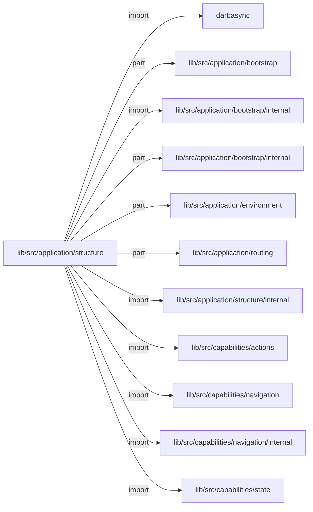
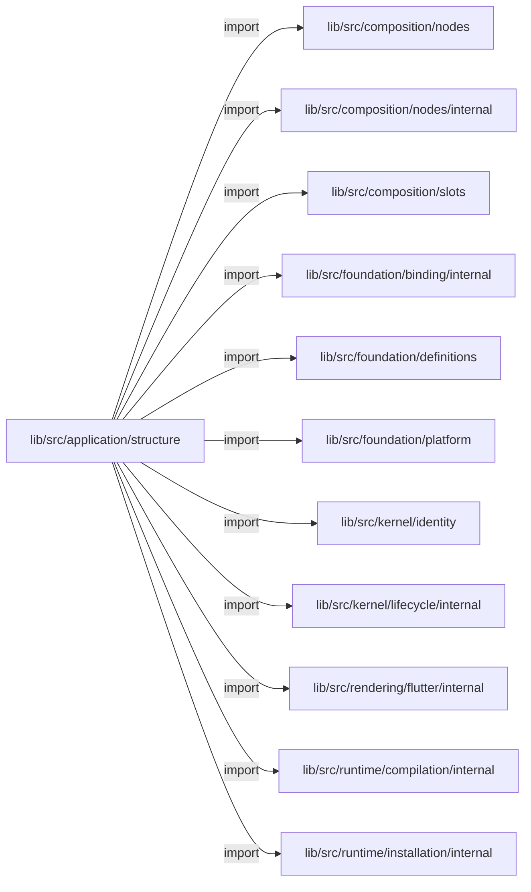
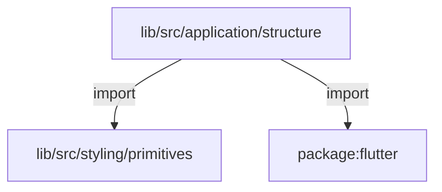
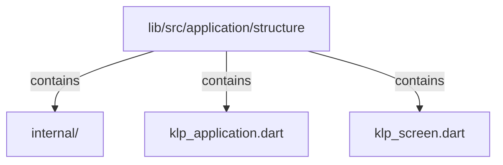

# lib/src/application/structure：架構分析入口

[上一層](../README.md)

## 範圍

閱讀 `lib/src/application/structure` 的直接子目錄與 Dart 檔案。結構圖表示實際檔案包含關係；依賴圖表示本層檔案明寫的 directives。每個檔案頁另列直接依賴、宣告、欄位、方法、建構子及行號證據。

## 本層直接依賴圖

箭頭以本層 Dart 檔案明寫的 directive 彙總到目標所在目錄或外部套件邊界；不遞迴將子目錄依賴算入本層。相同目標的不同 directive 類型分開計數。

| 目標邊界 | 關係 | directive 數 | 第一筆來源證據 |
|---|---|---|---|
| <code>dart:async</code> | import | 1 | [lib/src/application/structure/klp_application.dart:1](../../../../../lib/src/application/structure/klp_application.dart#L1) |
| <code>lib/src/application/bootstrap</code> | part | 1 | [lib/src/application/structure/klp_application.dart:47](../../../../../lib/src/application/structure/klp_application.dart#L47) |
| <code>lib/src/application/bootstrap/internal</code> | import | 1 | [lib/src/application/structure/klp_application.dart:39](../../../../../lib/src/application/structure/klp_application.dart#L39) |
| <code>lib/src/application/bootstrap/internal</code> | part | 5 | [lib/src/application/structure/klp_application.dart:48](../../../../../lib/src/application/structure/klp_application.dart#L48) |
| <code>lib/src/application/environment</code> | part | 1 | [lib/src/application/structure/klp_application.dart:46](../../../../../lib/src/application/structure/klp_application.dart#L46) |
| <code>lib/src/application/routing</code> | part | 3 | [lib/src/application/structure/klp_application.dart:43](../../../../../lib/src/application/structure/klp_application.dart#L43) |
| <code>lib/src/application/structure/internal</code> | import | 1 | [lib/src/application/structure/klp_application.dart:41](../../../../../lib/src/application/structure/klp_application.dart#L41) |
| <code>lib/src/capabilities/actions</code> | import | 3 | [lib/src/application/structure/klp_application.dart:8](../../../../../lib/src/application/structure/klp_application.dart#L8) |
| <code>lib/src/capabilities/navigation</code> | import | 12 | [lib/src/application/structure/klp_application.dart:11](../../../../../lib/src/application/structure/klp_application.dart#L11) |
| <code>lib/src/capabilities/navigation/internal</code> | import | 2 | [lib/src/application/structure/klp_application.dart:18](../../../../../lib/src/application/structure/klp_application.dart#L18) |
| <code>lib/src/capabilities/state</code> | import | 2 | [lib/src/application/structure/klp_application.dart:6](../../../../../lib/src/application/structure/klp_application.dart#L6) |
| <code>lib/src/composition/nodes</code> | import | 2 | [lib/src/application/structure/klp_application.dart:26](../../../../../lib/src/application/structure/klp_application.dart#L26) |
| <code>lib/src/composition/nodes/internal</code> | import | 1 | [lib/src/application/structure/klp_application.dart:25](../../../../../lib/src/application/structure/klp_application.dart#L25) |
| <code>lib/src/composition/slots</code> | import | 3 | [lib/src/application/structure/klp_screen.dart:2](../../../../../lib/src/application/structure/klp_screen.dart#L2) |
| <code>lib/src/foundation/binding/internal</code> | import | 1 | [lib/src/application/structure/klp_application.dart:27](../../../../../lib/src/application/structure/klp_application.dart#L27) |
| <code>lib/src/foundation/definitions</code> | import | 1 | [lib/src/application/structure/klp_application.dart:28](../../../../../lib/src/application/structure/klp_application.dart#L28) |
| <code>lib/src/foundation/platform</code> | import | 2 | [lib/src/application/structure/klp_application.dart:29](../../../../../lib/src/application/structure/klp_application.dart#L29) |
| <code>lib/src/kernel/identity</code> | import | 1 | [lib/src/application/structure/klp_application.dart:32](../../../../../lib/src/application/structure/klp_application.dart#L32) |
| <code>lib/src/kernel/lifecycle/internal</code> | import | 1 | [lib/src/application/structure/klp_application.dart:31](../../../../../lib/src/application/structure/klp_application.dart#L31) |
| <code>lib/src/rendering/flutter/internal</code> | import | 1 | [lib/src/application/structure/klp_application.dart:33](../../../../../lib/src/application/structure/klp_application.dart#L33) |
| <code>lib/src/runtime/compilation/internal</code> | import | 2 | [lib/src/application/structure/klp_application.dart:34](../../../../../lib/src/application/structure/klp_application.dart#L34) |
| <code>lib/src/runtime/installation/internal</code> | import | 1 | [lib/src/application/structure/klp_application.dart:36](../../../../../lib/src/application/structure/klp_application.dart#L36) |
| <code>lib/src/styling/primitives</code> | import | 2 | [lib/src/application/structure/klp_application.dart:37](../../../../../lib/src/application/structure/klp_application.dart#L37) |
| <code>package:flutter</code> | import | 2 | [lib/src/application/structure/klp_application.dart:3](../../../../../lib/src/application/structure/klp_application.dart#L3) |

### 同目錄依賴

| 來源 → 目標 | 關係 | 證據 |
|---|---|---|
| <code>klp_application.dart → klp_screen.dart</code> | import | [lib/src/application/structure/klp_application.dart:40](../../../../../lib/src/application/structure/klp_application.dart#L40) |

## 目錄結構圖

## 子目錄

| 目錄 | 導航 | 來源證據 |
|---|---|---|
| `internal/` | [架構入口](internal/README.md) | [來源目錄](../../../../../lib/src/application/structure/internal) |

## 本層檔案

| 檔案 | 宣告 | 細節 | 來源證據 |
|---|---|---|---|
| `klp_application.dart` | KlpApplication | [架構與 API](klp_application.md) | [lib/src/application/structure/klp_application.dart:1](../../../../../lib/src/application/structure/klp_application.dart#L1) |
| `klp_screen.dart` | KlpScreen | [架構與 API](klp_screen.md) | [lib/src/application/structure/klp_screen.dart:1](../../../../../lib/src/application/structure/klp_screen.dart#L1) |

## 閱讀說明

箭頭只表示來源明寫的靜態關係；import 不等於呼叫。未分析動態呼叫、欄位的實際物件擁有權、狀態轉移或渲染流程；型別未進行語意解析，繼承目標保留原始型別拼寫。public／private 依 Dart 名稱前綴判斷；public 宣告不代表已由 `lib/kallopis.dart` 匯出。

本頁的目錄與檔案由來源清冊產生；`manifest.json` 位於本圖集根目錄，可核對 SHA-256 與覆蓋數。人工模組摘要存於 `tool/architecture_atlas/briefs/`，重新生成時保留。
