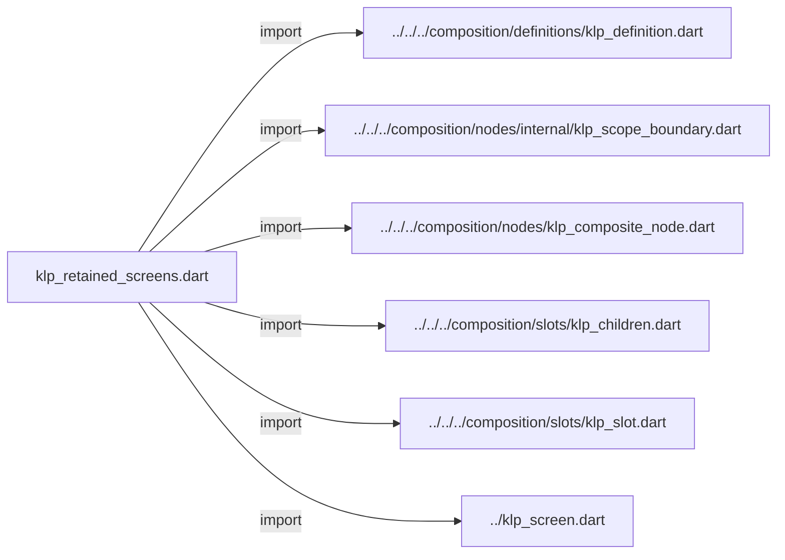
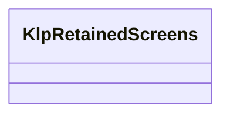
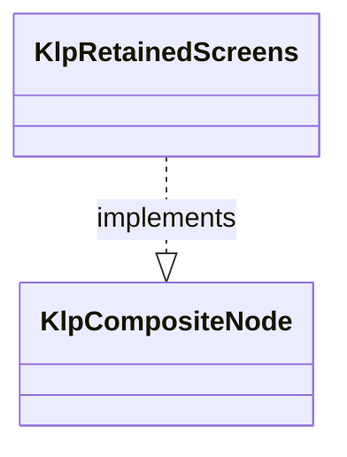

# klp_retained_screens.dart：直接依賴與宣告架構

[回到目錄](README.md) · [來源檔案](../../../../../../lib/src/application/structure/internal/klp_retained_screens.dart)

## 範圍

核心是 `lib/src/application/structure/internal/klp_retained_screens.dart`。主要視角為該檔案明寫的 import／export／part；輔助視角為本檔宣告及 extends／implements／with／on 關係。只展開一層外部邊界。

## 直接依賴圖

## 依賴證據

| 關係 | 原始 directive | 來源 |
|---|---|---|
| import | <code>import &#x27;../../../composition/definitions/klp_definition.dart&#x27;;</code> | [lib/src/application/structure/internal/klp_retained_screens.dart:1](../../../../../../lib/src/application/structure/internal/klp_retained_screens.dart#L1) |
| import | <code>import &#x27;../../../composition/nodes/internal/klp_scope_boundary.dart&#x27;;</code> | [lib/src/application/structure/internal/klp_retained_screens.dart:2](../../../../../../lib/src/application/structure/internal/klp_retained_screens.dart#L2) |
| import | <code>import &#x27;../../../composition/nodes/klp_composite_node.dart&#x27;;</code> | [lib/src/application/structure/internal/klp_retained_screens.dart:3](../../../../../../lib/src/application/structure/internal/klp_retained_screens.dart#L3) |
| import | <code>import &#x27;../../../composition/slots/klp_children.dart&#x27;;</code> | [lib/src/application/structure/internal/klp_retained_screens.dart:4](../../../../../../lib/src/application/structure/internal/klp_retained_screens.dart#L4) |
| import | <code>import &#x27;../../../composition/slots/klp_slot.dart&#x27;;</code> | [lib/src/application/structure/internal/klp_retained_screens.dart:5](../../../../../../lib/src/application/structure/internal/klp_retained_screens.dart#L5) |
| import | <code>import &#x27;../klp_screen.dart&#x27;;</code> | [lib/src/application/structure/internal/klp_retained_screens.dart:6](../../../../../../lib/src/application/structure/internal/klp_retained_screens.dart#L6) |

## 宣告關係圖

本組節點是本檔宣告；沒有箭頭的宣告未在此圖主張互相依賴。

## 宣告與成員證據

成員包含 public 與 private；簽章取自來源，省略函式本體與欄位初始值。`(inferred)` 表示來源未明寫型別；建構子只顯示參數部分，不含初始化列表。

### KlpRetainedScreens

ClassDeclaration · public · [lib/src/application/structure/internal/klp_retained_screens.dart:8](../../../../../../lib/src/application/structure/internal/klp_retained_screens.dart#L8)

<code>final class KlpRetainedScreens implements KlpCompositeNode</code>

來源註解摘要：應用根將全部保留畫面放入同一棵樹，只有目前 entry 開啟操作資格。

- `implements` → <code>KlpCompositeNode</code>：[lib/src/application/structure/internal/klp_retained_screens.dart:9](../../../../../../lib/src/application/structure/internal/klp_retained_screens.dart#L9)

| 成員 | 可見性 | 簽章／型別 | 來源註解摘要 | 證據 |
|---|---|---|---|---|
| field <code>typeId</code> | public | <code>static const (inferred) typeId</code> |  | [lib/src/application/structure/internal/klp_retained_screens.dart:11](../../../../../../lib/src/application/structure/internal/klp_retained_screens.dart#L11) |
| field <code>entriesSlot</code> | public | <code>static final (inferred) entriesSlot</code> |  | [lib/src/application/structure/internal/klp_retained_screens.dart:12](../../../../../../lib/src/application/structure/internal/klp_retained_screens.dart#L12) |
| field <code>contract</code> | public | <code>static final (inferred) contract</code> |  | [lib/src/application/structure/internal/klp_retained_screens.dart:13](../../../../../../lib/src/application/structure/internal/klp_retained_screens.dart#L13) |
| field <code>id</code> | public | <code>final String id</code> |  | [lib/src/application/structure/internal/klp_retained_screens.dart:16](../../../../../../lib/src/application/structure/internal/klp_retained_screens.dart#L16) |
| field <code>activeEntry</code> | public | <code>final String activeEntry</code> |  | [lib/src/application/structure/internal/klp_retained_screens.dart:17](../../../../../../lib/src/application/structure/internal/klp_retained_screens.dart#L17) |
| field <code>children</code> | public | <code>final KlpChildren children</code> |  | [lib/src/application/structure/internal/klp_retained_screens.dart:19](../../../../../../lib/src/application/structure/internal/klp_retained_screens.dart#L19) |
| constructor <code>KlpRetainedScreens</code> | public | <code>KlpRetainedScreens({required this.id, required this.activeEntry, required Map&lt;String, KlpScreen&gt; screens})</code> |  | [lib/src/application/structure/internal/klp_retained_screens.dart:21](../../../../../../lib/src/application/structure/internal/klp_retained_screens.dart#L21) |
| method <code>_children</code> | private | <code>static KlpChildren _children(Map&lt;String, KlpScreen&gt; screens, String activeEntry)</code> |  | [lib/src/application/structure/internal/klp_retained_screens.dart:23](../../../../../../lib/src/application/structure/internal/klp_retained_screens.dart#L23) |
| getter <code>definitionId</code> | public | <code>String get definitionId</code> |  | [lib/src/application/structure/internal/klp_retained_screens.dart:30](../../../../../../lib/src/application/structure/internal/klp_retained_screens.dart#L30) |

## 閱讀說明與限制

箭頭只表示來源明寫的靜態關係；import 不等於呼叫。未分析動態呼叫、欄位的實際物件擁有權、狀態轉移或渲染流程；型別未進行語意解析，繼承目標保留原始型別拼寫。public／private 依 Dart 名稱前綴判斷；public 宣告不代表已由 `lib/kallopis.dart` 匯出。

本頁由 `tool/architecture_atlas` 產生；編輯來源或生成工具後重新產生，避免手改本頁。
