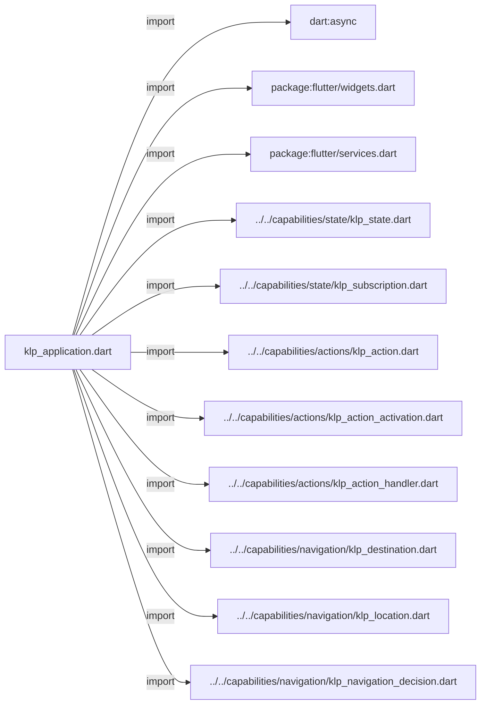
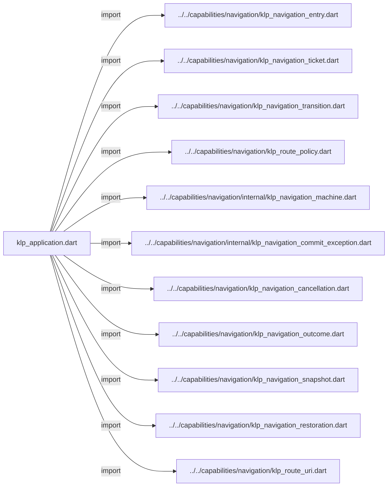
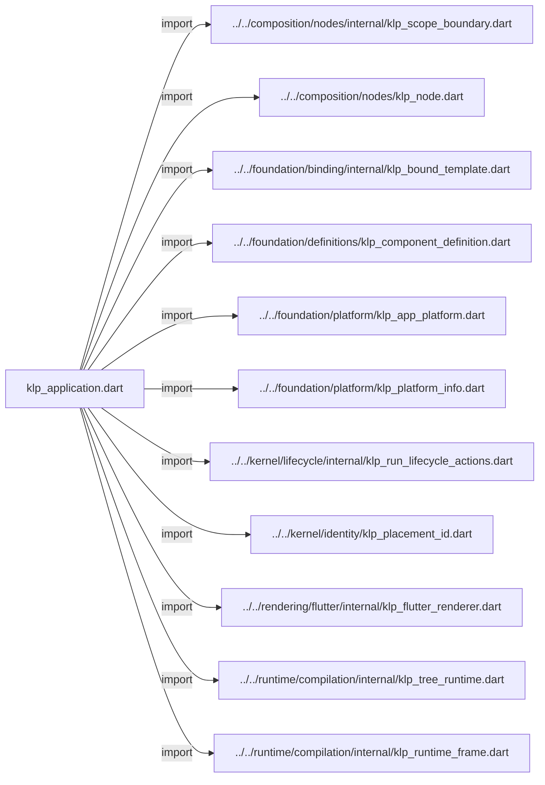
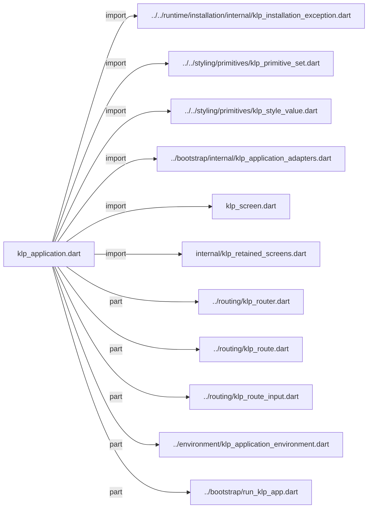
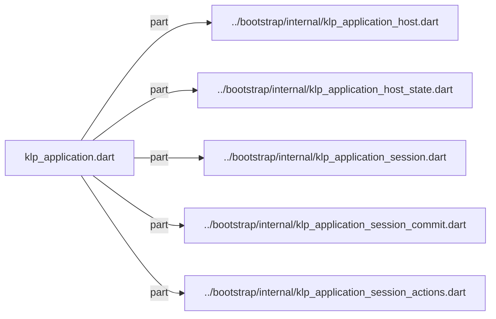
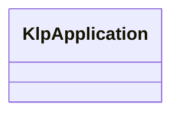

# klp_application.dart：直接依賴與宣告架構

[回到目錄](README.md) · [來源檔案](../../../../../lib/src/application/structure/klp_application.dart)

## 範圍

核心是 `lib/src/application/structure/klp_application.dart`。主要視角為該檔案明寫的 import／export／part；輔助視角為本檔宣告及 extends／implements／with／on 關係。只展開一層外部邊界。

## 直接依賴圖

## 依賴證據

| 關係 | 原始 directive | 來源 |
|---|---|---|
| import | <code>import &#x27;dart:async&#x27;;</code> | [lib/src/application/structure/klp_application.dart:1](../../../../../lib/src/application/structure/klp_application.dart#L1) |
| import | <code>import &#x27;package:flutter/widgets.dart&#x27;;</code> | [lib/src/application/structure/klp_application.dart:3](../../../../../lib/src/application/structure/klp_application.dart#L3) |
| import | <code>import &#x27;package:flutter/services.dart&#x27;;</code> | [lib/src/application/structure/klp_application.dart:4](../../../../../lib/src/application/structure/klp_application.dart#L4) |
| import | <code>import &#x27;../../capabilities/state/klp_state.dart&#x27;;</code> | [lib/src/application/structure/klp_application.dart:6](../../../../../lib/src/application/structure/klp_application.dart#L6) |
| import | <code>import &#x27;../../capabilities/state/klp_subscription.dart&#x27;;</code> | [lib/src/application/structure/klp_application.dart:7](../../../../../lib/src/application/structure/klp_application.dart#L7) |
| import | <code>import &#x27;../../capabilities/actions/klp_action.dart&#x27;;</code> | [lib/src/application/structure/klp_application.dart:8](../../../../../lib/src/application/structure/klp_application.dart#L8) |
| import | <code>import &#x27;../../capabilities/actions/klp_action_activation.dart&#x27;;</code> | [lib/src/application/structure/klp_application.dart:9](../../../../../lib/src/application/structure/klp_application.dart#L9) |
| import | <code>import &#x27;../../capabilities/actions/klp_action_handler.dart&#x27;;</code> | [lib/src/application/structure/klp_application.dart:10](../../../../../lib/src/application/structure/klp_application.dart#L10) |
| import | <code>import &#x27;../../capabilities/navigation/klp_destination.dart&#x27;;</code> | [lib/src/application/structure/klp_application.dart:11](../../../../../lib/src/application/structure/klp_application.dart#L11) |
| import | <code>import &#x27;../../capabilities/navigation/klp_location.dart&#x27;;</code> | [lib/src/application/structure/klp_application.dart:12](../../../../../lib/src/application/structure/klp_application.dart#L12) |
| import | <code>import &#x27;../../capabilities/navigation/klp_navigation_decision.dart&#x27;;</code> | [lib/src/application/structure/klp_application.dart:13](../../../../../lib/src/application/structure/klp_application.dart#L13) |
| import | <code>import &#x27;../../capabilities/navigation/klp_navigation_entry.dart&#x27;;</code> | [lib/src/application/structure/klp_application.dart:14](../../../../../lib/src/application/structure/klp_application.dart#L14) |
| import | <code>import &#x27;../../capabilities/navigation/klp_navigation_ticket.dart&#x27;;</code> | [lib/src/application/structure/klp_application.dart:15](../../../../../lib/src/application/structure/klp_application.dart#L15) |
| import | <code>import &#x27;../../capabilities/navigation/klp_navigation_transition.dart&#x27;;</code> | [lib/src/application/structure/klp_application.dart:16](../../../../../lib/src/application/structure/klp_application.dart#L16) |
| import | <code>import &#x27;../../capabilities/navigation/klp_route_policy.dart&#x27;;</code> | [lib/src/application/structure/klp_application.dart:17](../../../../../lib/src/application/structure/klp_application.dart#L17) |
| import | <code>import &#x27;../../capabilities/navigation/internal/klp_navigation_machine.dart&#x27;;</code> | [lib/src/application/structure/klp_application.dart:18](../../../../../lib/src/application/structure/klp_application.dart#L18) |
| import | <code>import &#x27;../../capabilities/navigation/internal/klp_navigation_commit_exception.dart&#x27;;</code> | [lib/src/application/structure/klp_application.dart:19](../../../../../lib/src/application/structure/klp_application.dart#L19) |
| import | <code>import &#x27;../../capabilities/navigation/klp_navigation_cancellation.dart&#x27;;</code> | [lib/src/application/structure/klp_application.dart:20](../../../../../lib/src/application/structure/klp_application.dart#L20) |
| import | <code>import &#x27;../../capabilities/navigation/klp_navigation_outcome.dart&#x27;;</code> | [lib/src/application/structure/klp_application.dart:21](../../../../../lib/src/application/structure/klp_application.dart#L21) |
| import | <code>import &#x27;../../capabilities/navigation/klp_navigation_snapshot.dart&#x27;;</code> | [lib/src/application/structure/klp_application.dart:22](../../../../../lib/src/application/structure/klp_application.dart#L22) |
| import | <code>import &#x27;../../capabilities/navigation/klp_navigation_restoration.dart&#x27;;</code> | [lib/src/application/structure/klp_application.dart:23](../../../../../lib/src/application/structure/klp_application.dart#L23) |
| import | <code>import &#x27;../../capabilities/navigation/klp_route_uri.dart&#x27;;</code> | [lib/src/application/structure/klp_application.dart:24](../../../../../lib/src/application/structure/klp_application.dart#L24) |
| import | <code>import &#x27;../../composition/nodes/internal/klp_scope_boundary.dart&#x27;;</code> | [lib/src/application/structure/klp_application.dart:25](../../../../../lib/src/application/structure/klp_application.dart#L25) |
| import | <code>import &#x27;../../composition/nodes/klp_node.dart&#x27;;</code> | [lib/src/application/structure/klp_application.dart:26](../../../../../lib/src/application/structure/klp_application.dart#L26) |
| import | <code>import &#x27;../../foundation/binding/internal/klp_bound_template.dart&#x27;;</code> | [lib/src/application/structure/klp_application.dart:27](../../../../../lib/src/application/structure/klp_application.dart#L27) |
| import | <code>import &#x27;../../foundation/definitions/klp_component_definition.dart&#x27;;</code> | [lib/src/application/structure/klp_application.dart:28](../../../../../lib/src/application/structure/klp_application.dart#L28) |
| import | <code>import &#x27;../../foundation/platform/klp_app_platform.dart&#x27;;</code> | [lib/src/application/structure/klp_application.dart:29](../../../../../lib/src/application/structure/klp_application.dart#L29) |
| import | <code>import &#x27;../../foundation/platform/klp_platform_info.dart&#x27;;</code> | [lib/src/application/structure/klp_application.dart:30](../../../../../lib/src/application/structure/klp_application.dart#L30) |
| import | <code>import &#x27;../../kernel/lifecycle/internal/klp_run_lifecycle_actions.dart&#x27;;</code> | [lib/src/application/structure/klp_application.dart:31](../../../../../lib/src/application/structure/klp_application.dart#L31) |
| import | <code>import &#x27;../../kernel/identity/klp_placement_id.dart&#x27;;</code> | [lib/src/application/structure/klp_application.dart:32](../../../../../lib/src/application/structure/klp_application.dart#L32) |
| import | <code>import &#x27;../../rendering/flutter/internal/klp_flutter_renderer.dart&#x27;;</code> | [lib/src/application/structure/klp_application.dart:33](../../../../../lib/src/application/structure/klp_application.dart#L33) |
| import | <code>import &#x27;../../runtime/compilation/internal/klp_tree_runtime.dart&#x27;;</code> | [lib/src/application/structure/klp_application.dart:34](../../../../../lib/src/application/structure/klp_application.dart#L34) |
| import | <code>import &#x27;../../runtime/compilation/internal/klp_runtime_frame.dart&#x27;;</code> | [lib/src/application/structure/klp_application.dart:35](../../../../../lib/src/application/structure/klp_application.dart#L35) |
| import | <code>import &#x27;../../runtime/installation/internal/klp_installation_exception.dart&#x27;;</code> | [lib/src/application/structure/klp_application.dart:36](../../../../../lib/src/application/structure/klp_application.dart#L36) |
| import | <code>import &#x27;../../styling/primitives/klp_primitive_set.dart&#x27;;</code> | [lib/src/application/structure/klp_application.dart:37](../../../../../lib/src/application/structure/klp_application.dart#L37) |
| import | <code>import &#x27;../../styling/primitives/klp_style_value.dart&#x27;;</code> | [lib/src/application/structure/klp_application.dart:38](../../../../../lib/src/application/structure/klp_application.dart#L38) |
| import | <code>import &#x27;../bootstrap/internal/klp_application_adapters.dart&#x27;;</code> | [lib/src/application/structure/klp_application.dart:39](../../../../../lib/src/application/structure/klp_application.dart#L39) |
| import | <code>import &#x27;klp_screen.dart&#x27;;</code> | [lib/src/application/structure/klp_application.dart:40](../../../../../lib/src/application/structure/klp_application.dart#L40) |
| import | <code>import &#x27;internal/klp_retained_screens.dart&#x27;;</code> | [lib/src/application/structure/klp_application.dart:41](../../../../../lib/src/application/structure/klp_application.dart#L41) |
| part | <code>part &#x27;../routing/klp_router.dart&#x27;;</code> | [lib/src/application/structure/klp_application.dart:43](../../../../../lib/src/application/structure/klp_application.dart#L43) |
| part | <code>part &#x27;../routing/klp_route.dart&#x27;;</code> | [lib/src/application/structure/klp_application.dart:44](../../../../../lib/src/application/structure/klp_application.dart#L44) |
| part | <code>part &#x27;../routing/klp_route_input.dart&#x27;;</code> | [lib/src/application/structure/klp_application.dart:45](../../../../../lib/src/application/structure/klp_application.dart#L45) |
| part | <code>part &#x27;../environment/klp_application_environment.dart&#x27;;</code> | [lib/src/application/structure/klp_application.dart:46](../../../../../lib/src/application/structure/klp_application.dart#L46) |
| part | <code>part &#x27;../bootstrap/run_klp_app.dart&#x27;;</code> | [lib/src/application/structure/klp_application.dart:47](../../../../../lib/src/application/structure/klp_application.dart#L47) |
| part | <code>part &#x27;../bootstrap/internal/klp_application_host.dart&#x27;;</code> | [lib/src/application/structure/klp_application.dart:48](../../../../../lib/src/application/structure/klp_application.dart#L48) |
| part | <code>part &#x27;../bootstrap/internal/klp_application_host_state.dart&#x27;;</code> | [lib/src/application/structure/klp_application.dart:49](../../../../../lib/src/application/structure/klp_application.dart#L49) |
| part | <code>part &#x27;../bootstrap/internal/klp_application_session.dart&#x27;;</code> | [lib/src/application/structure/klp_application.dart:50](../../../../../lib/src/application/structure/klp_application.dart#L50) |
| part | <code>part &#x27;../bootstrap/internal/klp_application_session_commit.dart&#x27;;</code> | [lib/src/application/structure/klp_application.dart:51](../../../../../lib/src/application/structure/klp_application.dart#L51) |
| part | <code>part &#x27;../bootstrap/internal/klp_application_session_actions.dart&#x27;;</code> | [lib/src/application/structure/klp_application.dart:52](../../../../../lib/src/application/structure/klp_application.dart#L52) |

## 宣告關係圖

本組節點是本檔宣告；沒有箭頭的宣告未在此圖主張互相依賴。

## 宣告與成員證據

成員包含 public 與 private；簽章取自來源，省略函式本體與欄位初始值。`(inferred)` 表示來源未明寫型別；建構子只顯示參數部分，不含初始化列表。

### KlpApplication

ClassDeclaration · public · [lib/src/application/structure/klp_application.dart:54](../../../../../lib/src/application/structure/klp_application.dart#L54)

<code>final class KlpApplication</code>

來源註解摘要：整份應用宣告；外部只更新此資料，不負責掛載功能資源。

| 成員 | 可見性 | 簽章／型別 | 來源註解摘要 | 證據 |
|---|---|---|---|---|
| field <code>title</code> | public | <code>final String title</code> |  | [lib/src/application/structure/klp_application.dart:56](../../../../../lib/src/application/structure/klp_application.dart#L56) |
| field <code>primitives</code> | public | <code>final KlpPrimitiveSet primitives</code> |  | [lib/src/application/structure/klp_application.dart:57](../../../../../lib/src/application/structure/klp_application.dart#L57) |
| field <code>router</code> | public | <code>final KlpRouter router</code> |  | [lib/src/application/structure/klp_application.dart:58](../../../../../lib/src/application/structure/klp_application.dart#L58) |
| field <code>components</code> | public | <code>final List&lt;KlpComponentDefinition&lt;KlpNode&gt;&gt; components</code> |  | [lib/src/application/structure/klp_application.dart:59](../../../../../lib/src/application/structure/klp_application.dart#L59) |
| field <code>onNavigationRestorationChanged</code> | public | <code>final void Function(KlpNavigationRestoration restoration)? onNavigationRestorationChanged</code> |  | [lib/src/application/structure/klp_application.dart:61](../../../../../lib/src/application/structure/klp_application.dart#L61) |
| constructor <code>KlpApplication</code> | public | <code>KlpApplication({ required this.title, required this.primitives, required this.router, Iterable&lt;KlpComponentDefinition&lt;KlpNode&gt;&gt; components = const [], this.onNavigationRestorationChanged, })</code> |  | [lib/src/application/structure/klp_application.dart:63](../../../../../lib/src/application/structure/klp_application.dart#L63) |

## 閱讀說明與限制

箭頭只表示來源明寫的靜態關係；import 不等於呼叫。未分析動態呼叫、欄位的實際物件擁有權、狀態轉移或渲染流程；型別未進行語意解析，繼承目標保留原始型別拼寫。public／private 依 Dart 名稱前綴判斷；public 宣告不代表已由 `lib/kallopis.dart` 匯出。

本頁由 `tool/architecture_atlas` 產生；編輯來源或生成工具後重新產生，避免手改本頁。
