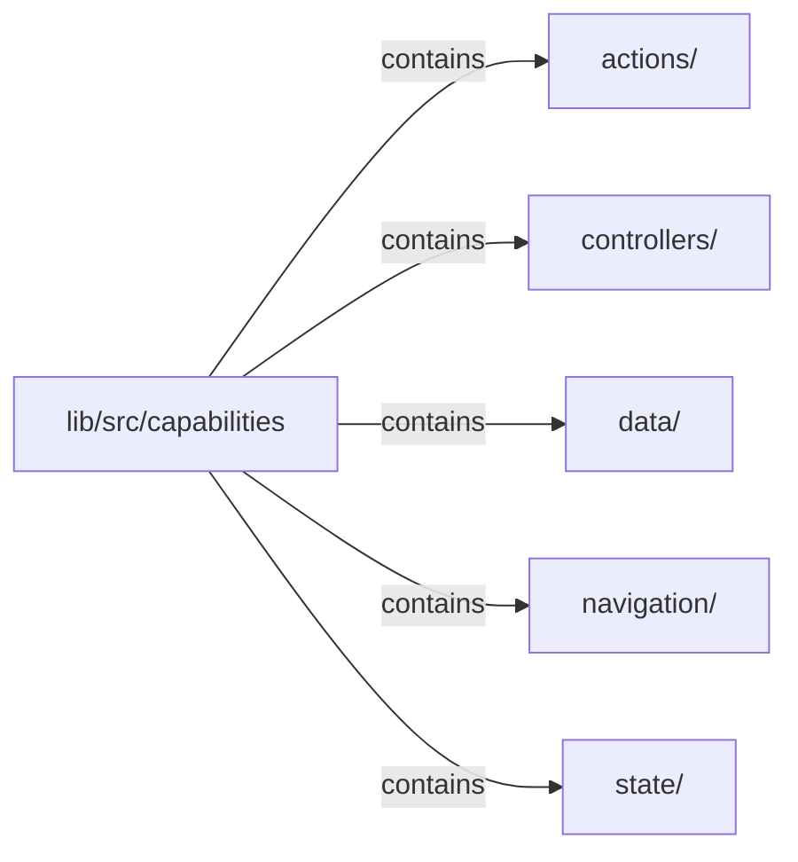

# lib/src/capabilities：架構分析入口

[上一層](../README.md)

## 範圍

閱讀 `lib/src/capabilities` 的直接子目錄與 Dart 檔案。結構圖表示實際檔案包含關係；依賴圖表示本層檔案明寫的 directives。每個檔案頁另列直接依賴、宣告、欄位、方法、建構子及行號證據。

## 模組閱讀重點

## 分析入口

目前提供純資料 state、借用 controller 與非同步資料擁有者。`state/klp_mutable_state.dart` 由擁有端寫入，`readOnly` 回傳私有 facade；`state/klp_state.dart` 是借用介面，訂閱取消在 `klp_subscription.dart`。

`controllers/klp_state_controller.dart` 只管理附接，不複製來源值或釋放外部 state。訂閱支援重入更新、通知中取消與釋放。

`data/klp_async_data.dart` 透過共用 state 發布待命、載入、成功與失敗。generation 使晚到結果失效；cancel 不終止底層 I/O。資料操作錯誤成為失敗狀態，訂閱通知錯誤回報呼叫端；初始通知失敗時，僅復原仍屬於原請求的狀態。此能力尚未接到功能樹的自動安裝或 Flutter renderer。

`navigation/` 提供型別化 destination、location、outcome 與 guard；`navigation/internal/` 是候選堆疊、取消、提交與結果完成的純 Dart 核心。`KlpNavigationMachine.start` 執行初始 guard，允許同步或非同步政策，成功後才呼叫應用提交埠。提交結果與離開結果分開，接點違約不能被誤報為一般拒絕。Application session 已持有並接線此核心，消費端只取得 entry 綁定的 typed input；核心不依賴 Screen 或 Flutter。網址、深連結與還原仍待後續策略。參見 [導覽交易樣板](../../navigation-transaction-prototype.md)。

## 本層直接依賴圖

箭頭以本層 Dart 檔案明寫的 directive 彙總到目標所在目錄或外部套件邊界；不遞迴將子目錄依賴算入本層。相同目標的不同 directive 類型分開計數。

本層檔案未宣告跨目錄依賴；子目錄依賴請循下一層入口閱讀。

| 目標邊界 | 關係 | directive 數 | 第一筆來源證據 |
|---|---|---|---|
| 無 | — | 0 | 來源清單見本層檔案 |

## 目錄結構圖

## 子目錄

| 目錄 | 導航 | 來源證據 |
|---|---|---|
| `actions/` | [架構入口](actions/README.md) | [來源目錄](../../../../lib/src/capabilities/actions) |
| `controllers/` | [架構入口](controllers/README.md) | [來源目錄](../../../../lib/src/capabilities/controllers) |
| `data/` | [架構入口](data/README.md) | [來源目錄](../../../../lib/src/capabilities/data) |
| `navigation/` | [架構入口](navigation/README.md) | [來源目錄](../../../../lib/src/capabilities/navigation) |
| `state/` | [架構入口](state/README.md) | [來源目錄](../../../../lib/src/capabilities/state) |

## 本層檔案

| 檔案 | 宣告 | 細節 | 來源證據 |
|---|---|---|---|
| 無 | 本層沒有 Dart 檔案 | — | — |

## 閱讀說明

箭頭只表示來源明寫的靜態關係；import 不等於呼叫。未分析動態呼叫、欄位的實際物件擁有權、狀態轉移或渲染流程；型別未進行語意解析，繼承目標保留原始型別拼寫。public／private 依 Dart 名稱前綴判斷；public 宣告不代表已由 `lib/kallopis.dart` 匯出。

本頁的目錄與檔案由來源清冊產生；`manifest.json` 位於本圖集根目錄，可核對 SHA-256 與覆蓋數。人工模組摘要存於 `tool/architecture_atlas/briefs/`，重新生成時保留。
