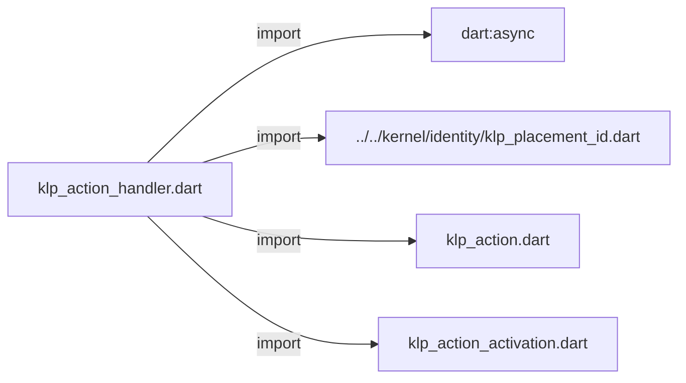
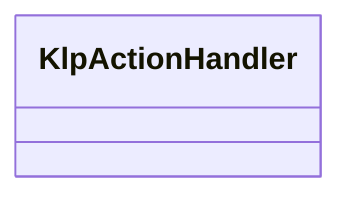

# klp_action_handler.dart：直接依賴與宣告架構

[回到目錄](README.md) · [來源檔案](../../../../../lib/src/capabilities/actions/klp_action_handler.dart)

## 範圍

核心是 `lib/src/capabilities/actions/klp_action_handler.dart`。主要視角為該檔案明寫的 import／export／part；輔助視角為本檔宣告及 extends／implements／with／on 關係。只展開一層外部邊界。

## 直接依賴圖

## 依賴證據

| 關係 | 原始 directive | 來源 |
|---|---|---|
| import | <code>import &#x27;dart:async&#x27;;</code> | [lib/src/capabilities/actions/klp_action_handler.dart:1](../../../../../lib/src/capabilities/actions/klp_action_handler.dart#L1) |
| import | <code>import &#x27;../../kernel/identity/klp_placement_id.dart&#x27;;</code> | [lib/src/capabilities/actions/klp_action_handler.dart:3](../../../../../lib/src/capabilities/actions/klp_action_handler.dart#L3) |
| import | <code>import &#x27;klp_action.dart&#x27;;</code> | [lib/src/capabilities/actions/klp_action_handler.dart:4](../../../../../lib/src/capabilities/actions/klp_action_handler.dart#L4) |
| import | <code>import &#x27;klp_action_activation.dart&#x27;;</code> | [lib/src/capabilities/actions/klp_action_handler.dart:5](../../../../../lib/src/capabilities/actions/klp_action_handler.dart#L5) |

## 宣告關係圖

本組節點是本檔宣告；沒有箭頭的宣告未在此圖主張互相依賴。

## 宣告與成員證據

成員包含 public 與 private；簽章取自來源，省略函式本體與欄位初始值。`(inferred)` 表示來源未明寫型別；建構子只顯示參數部分，不含初始化列表。

### KlpActionHandler

ClassDeclaration · public · [lib/src/capabilities/actions/klp_action_handler.dart:7](../../../../../lib/src/capabilities/actions/klp_action_handler.dart#L7)

<code>abstract interface class KlpActionHandler</code>

來源註解摘要：安裝期注入的操作派送器；feature 只知道此能力，不依賴 application。

| 成員 | 可見性 | 簽章／型別 | 來源註解摘要 | 證據 |
|---|---|---|---|---|
| method <code>accepts</code> | public | <code>bool accepts(KlpAction action)</code> |  | [lib/src/capabilities/actions/klp_action_handler.dart:9](../../../../../lib/src/capabilities/actions/klp_action_handler.dart#L9) |
| method <code>activate</code> | public | <code>FutureOr&lt;KlpActionActivation&gt; activate( KlpAction action, KlpPlacementId source, )</code> |  | [lib/src/capabilities/actions/klp_action_handler.dart:10](../../../../../lib/src/capabilities/actions/klp_action_handler.dart#L10) |

### acceptsKlpAction

FunctionDeclaration · public · [lib/src/capabilities/actions/klp_action_handler.dart:16](../../../../../lib/src/capabilities/actions/klp_action_handler.dart#L16)

<code>bool acceptsKlpAction(KlpActionHandler? handler, KlpAction action)</code>

來源註解摘要：準備期只允許本庫可派送的 action；假實作不能進入已安裝樹。

### dispatchKlpAction

FunctionDeclaration · public · [lib/src/capabilities/actions/klp_action_handler.dart:20](../../../../../lib/src/capabilities/actions/klp_action_handler.dart#L20)

<code>FutureOr&lt;KlpActionActivation&gt; dispatchKlpAction( KlpActionHandler? handler, KlpAction action, KlpPlacementId source, )</code>

來源註解摘要：唯一 action 派送入口；未綁定的導覽 action 一律拒絕。

## 閱讀說明與限制

箭頭只表示來源明寫的靜態關係；import 不等於呼叫。未分析動態呼叫、欄位的實際物件擁有權、狀態轉移或渲染流程；型別未進行語意解析，繼承目標保留原始型別拼寫。public／private 依 Dart 名稱前綴判斷；public 宣告不代表已由 `lib/kallopis.dart` 匯出。

本頁由 `tool/architecture_atlas` 產生；編輯來源或生成工具後重新產生，避免手改本頁。
