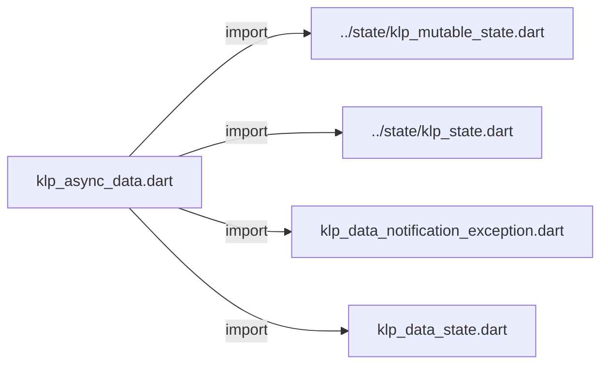
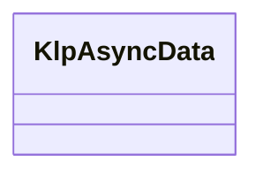

# klp_async_data.dart：直接依賴與宣告架構

[回到目錄](README.md) · [來源檔案](../../../../../lib/src/capabilities/data/klp_async_data.dart)

## 範圍

核心是 `lib/src/capabilities/data/klp_async_data.dart`。主要視角為該檔案明寫的 import／export／part；輔助視角為本檔宣告及 extends／implements／with／on 關係。只展開一層外部邊界。

## 直接依賴圖

## 依賴證據

| 關係 | 原始 directive | 來源 |
|---|---|---|
| import | <code>import &#x27;../state/klp_mutable_state.dart&#x27;;</code> | [lib/src/capabilities/data/klp_async_data.dart:1](../../../../../lib/src/capabilities/data/klp_async_data.dart#L1) |
| import | <code>import &#x27;../state/klp_state.dart&#x27;;</code> | [lib/src/capabilities/data/klp_async_data.dart:2](../../../../../lib/src/capabilities/data/klp_async_data.dart#L2) |
| import | <code>import &#x27;klp_data_notification_exception.dart&#x27;;</code> | [lib/src/capabilities/data/klp_async_data.dart:3](../../../../../lib/src/capabilities/data/klp_async_data.dart#L3) |
| import | <code>import &#x27;klp_data_state.dart&#x27;;</code> | [lib/src/capabilities/data/klp_async_data.dart:4](../../../../../lib/src/capabilities/data/klp_async_data.dart#L4) |

## 宣告關係圖

本組節點是本檔宣告；沒有箭頭的宣告未在此圖主張互相依賴。

## 宣告與成員證據

成員包含 public 與 private；簽章取自來源，省略函式本體與欄位初始值。`(inferred)` 表示來源未明寫型別；建構子只顯示參數部分，不含初始化列表。

### KlpAsyncData

ClassDeclaration · public · [lib/src/capabilities/data/klp_async_data.dart:6](../../../../../lib/src/capabilities/data/klp_async_data.dart#L6)

<code>final class KlpAsyncData&lt;T&gt;</code>

來源註解摘要：非同步資料擁有者，沿用共用狀態的唯讀借用與通知機制。

| 成員 | 可見性 | 簽章／型別 | 來源註解摘要 | 證據 |
|---|---|---|---|---|
| field <code>_state</code> | private | <code>final KlpMutableState&lt;KlpDataState&lt;T&gt;&gt; _state</code> |  | [lib/src/capabilities/data/klp_async_data.dart:8](../../../../../lib/src/capabilities/data/klp_async_data.dart#L8) |
| field <code>_generation</code> | private | <code>int _generation</code> |  | [lib/src/capabilities/data/klp_async_data.dart:11](../../../../../lib/src/capabilities/data/klp_async_data.dart#L11) |
| field <code>_publishing</code> | private | <code>bool _publishing</code> |  | [lib/src/capabilities/data/klp_async_data.dart:12](../../../../../lib/src/capabilities/data/klp_async_data.dart#L12) |
| getter <code>state</code> | public | <code>KlpState&lt;KlpDataState&lt;T&gt;&gt; get state</code> |  | [lib/src/capabilities/data/klp_async_data.dart:14](../../../../../lib/src/capabilities/data/klp_async_data.dart#L14) |
| getter <code>isDisposed</code> | public | <code>bool get isDisposed</code> |  | [lib/src/capabilities/data/klp_async_data.dart:15](../../../../../lib/src/capabilities/data/klp_async_data.dart#L15) |
| method <code>load</code> | public | <code>Future&lt;void&gt; load(Future&lt;T&gt; Function() operation)</code> | 等待本次操作結束並採納或捨棄結果後完成；取消不提早完成。 操作的同步或非同步錯誤成為資料狀態，不拒絕回傳的 Future。 已釋放使用與訂閱者錯誤仍拒絕 Future，不偽裝成資料失敗。 若載入通知中被取消、取代或釋放，操作不會啟動。 通知內重入的載入先保留請求識別，延至通知結束才發布與啟動。 | [lib/src/capabilities/data/klp_async_data.dart:17](../../../../../lib/src/capabilities/data/klp_async_data.dart#L17) |
| method <code>cancel</code> | public | <code>void cancel()</code> | 停止採納目前載入結果並回到待命，不取消底層 I/O。 非載入階段不改變資料；釋放後呼叫會失敗。 | [lib/src/capabilities/data/klp_async_data.dart:48](../../../../../lib/src/capabilities/data/klp_async_data.dart#L48) |
| method <code>dispose</code> | public | <code>void dispose()</code> | 釋放訂閱並使所有未完成請求失效，可重複呼叫。 | [lib/src/capabilities/data/klp_async_data.dart:58](../../../../../lib/src/capabilities/data/klp_async_data.dart#L58) |
| method <code>_accepts</code> | private | <code>bool _accepts(int generation)</code> |  | [lib/src/capabilities/data/klp_async_data.dart:66](../../../../../lib/src/capabilities/data/klp_async_data.dart#L66) |
| method <code>_startLoading</code> | private | <code>void _startLoading(int generation)</code> |  | [lib/src/capabilities/data/klp_async_data.dart:68](../../../../../lib/src/capabilities/data/klp_async_data.dart#L68) |
| method <code>_publish</code> | private | <code>void _publish(KlpDataState&lt;T&gt; value)</code> |  | [lib/src/capabilities/data/klp_async_data.dart:88](../../../../../lib/src/capabilities/data/klp_async_data.dart#L88) |
| method <code>_requireActive</code> | private | <code>void _requireActive()</code> |  | [lib/src/capabilities/data/klp_async_data.dart:99](../../../../../lib/src/capabilities/data/klp_async_data.dart#L99) |

## 閱讀說明與限制

箭頭只表示來源明寫的靜態關係；import 不等於呼叫。未分析動態呼叫、欄位的實際物件擁有權、狀態轉移或渲染流程；型別未進行語意解析，繼承目標保留原始型別拼寫。public／private 依 Dart 名稱前綴判斷；public 宣告不代表已由 `lib/kallopis.dart` 匯出。

本頁由 `tool/architecture_atlas` 產生；編輯來源或生成工具後重新產生，避免手改本頁。
