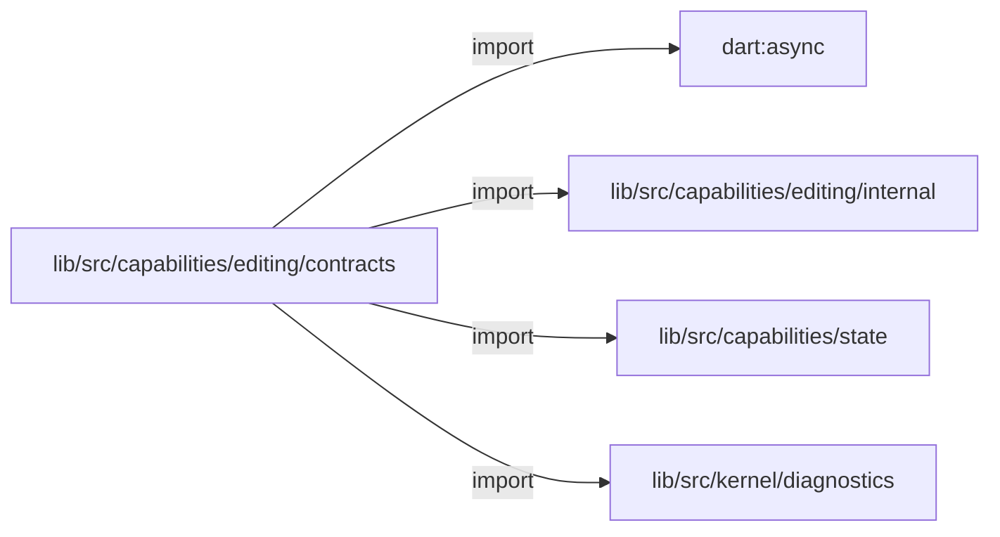
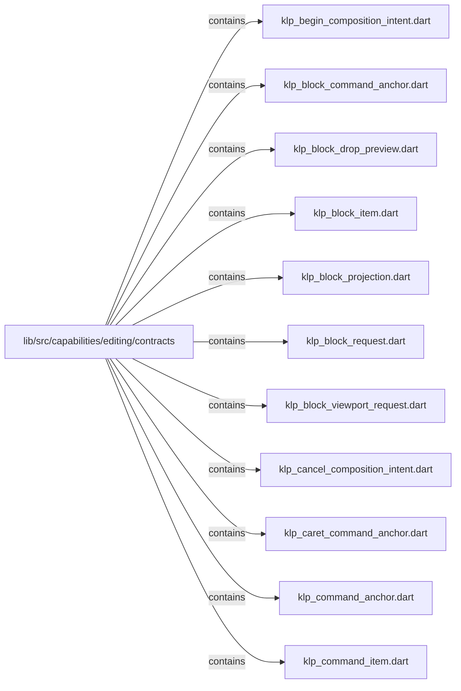
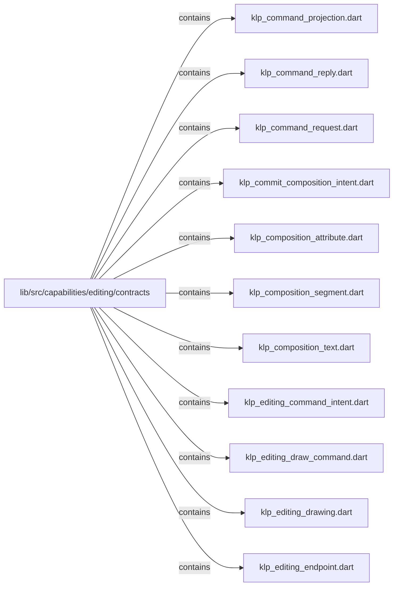
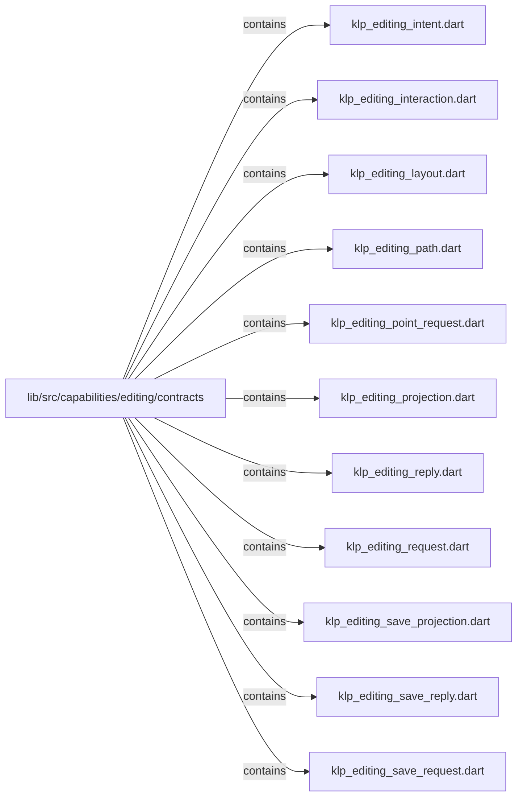
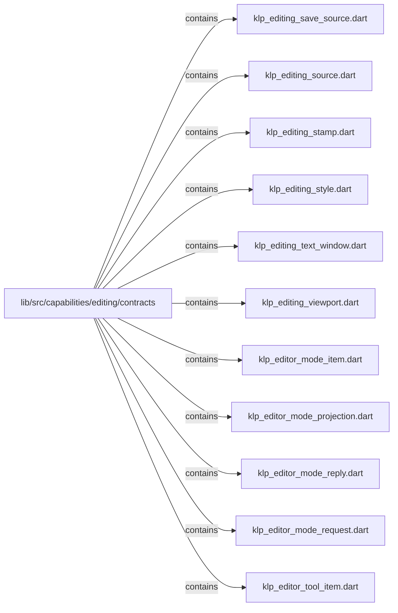
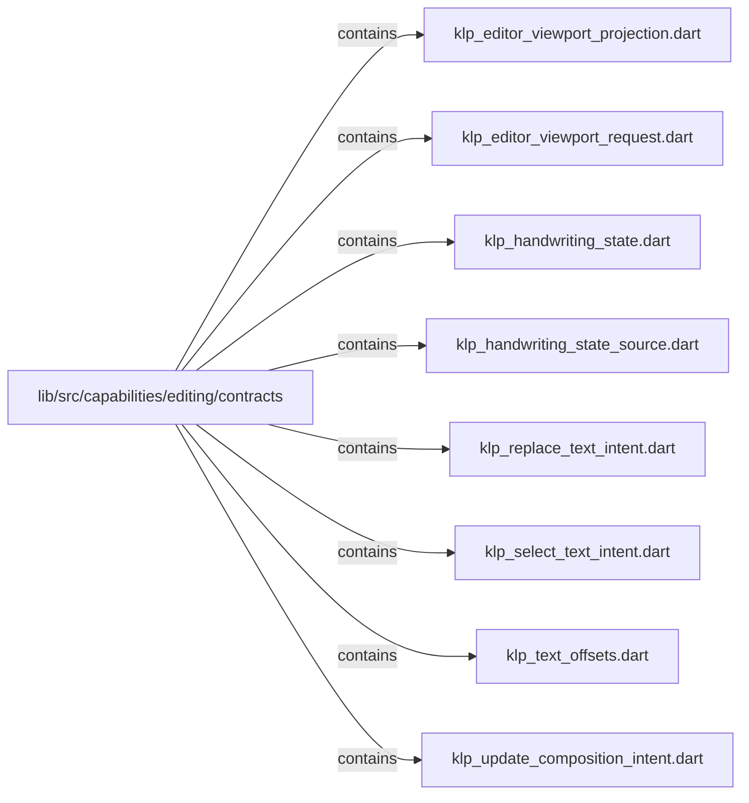

# lib/src/capabilities/editing/contracts：架構分析入口

[上一層](../README.md)

## 範圍

閱讀 `lib/src/capabilities/editing/contracts` 的直接子目錄與 Dart 檔案。結構圖表示實際檔案包含關係；依賴圖表示本層檔案明寫的 directives。每個檔案頁另列直接依賴、宣告、欄位、方法、建構子及行號證據。

## 本層直接依賴圖

箭頭以本層 Dart 檔案明寫的 directive 彙總到目標所在目錄或外部套件邊界；不遞迴將子目錄依賴算入本層。相同目標的不同 directive 類型分開計數。

| 目標邊界 | 關係 | directive 數 | 第一筆來源證據 |
|---|---|---|---|
| <code>dart:async</code> | import | 3 | [lib/src/capabilities/editing/contracts/klp_editing_save_source.dart:1](../../../../../../lib/src/capabilities/editing/contracts/klp_editing_save_source.dart#L1) |
| <code>lib/src/capabilities/editing/internal</code> | import | 2 | [lib/src/capabilities/editing/contracts/klp_editing_drawing.dart:2](../../../../../../lib/src/capabilities/editing/contracts/klp_editing_drawing.dart#L2) |
| <code>lib/src/capabilities/state</code> | import | 2 | [lib/src/capabilities/editing/contracts/klp_editing_save_source.dart:3](../../../../../../lib/src/capabilities/editing/contracts/klp_editing_save_source.dart#L3) |
| <code>lib/src/kernel/diagnostics</code> | import | 1 | [lib/src/capabilities/editing/contracts/klp_handwriting_state_source.dart:3](../../../../../../lib/src/capabilities/editing/contracts/klp_handwriting_state_source.dart#L3) |

### 同目錄依賴

| 來源 → 目標 | 關係 | 證據 |
|---|---|---|
| <code>klp_begin_composition_intent.dart → klp_editing_intent.dart</code> | part of | [lib/src/capabilities/editing/contracts/klp_begin_composition_intent.dart:1](../../../../../../lib/src/capabilities/editing/contracts/klp_begin_composition_intent.dart#L1) |
| <code>klp_block_command_anchor.dart → klp_command_anchor.dart</code> | part of | [lib/src/capabilities/editing/contracts/klp_block_command_anchor.dart:1](../../../../../../lib/src/capabilities/editing/contracts/klp_block_command_anchor.dart#L1) |
| <code>klp_block_drop_preview.dart → klp_editing_stamp.dart</code> | import | [lib/src/capabilities/editing/contracts/klp_block_drop_preview.dart:1](../../../../../../lib/src/capabilities/editing/contracts/klp_block_drop_preview.dart#L1) |
| <code>klp_block_item.dart → klp_editing_draw_command.dart</code> | import | [lib/src/capabilities/editing/contracts/klp_block_item.dart:1](../../../../../../lib/src/capabilities/editing/contracts/klp_block_item.dart#L1) |
| <code>klp_block_item.dart → klp_block_request.dart</code> | import | [lib/src/capabilities/editing/contracts/klp_block_item.dart:2](../../../../../../lib/src/capabilities/editing/contracts/klp_block_item.dart#L2) |
| <code>klp_block_projection.dart → klp_block_item.dart</code> | import | [lib/src/capabilities/editing/contracts/klp_block_projection.dart:1](../../../../../../lib/src/capabilities/editing/contracts/klp_block_projection.dart#L1) |
| <code>klp_block_projection.dart → klp_editing_stamp.dart</code> | import | [lib/src/capabilities/editing/contracts/klp_block_projection.dart:2](../../../../../../lib/src/capabilities/editing/contracts/klp_block_projection.dart#L2) |
| <code>klp_block_request.dart → klp_editing_stamp.dart</code> | import | [lib/src/capabilities/editing/contracts/klp_block_request.dart:1](../../../../../../lib/src/capabilities/editing/contracts/klp_block_request.dart#L1) |
| <code>klp_block_viewport_request.dart → klp_editing_stamp.dart</code> | import | [lib/src/capabilities/editing/contracts/klp_block_viewport_request.dart:1](../../../../../../lib/src/capabilities/editing/contracts/klp_block_viewport_request.dart#L1) |
| <code>klp_cancel_composition_intent.dart → klp_editing_intent.dart</code> | part of | [lib/src/capabilities/editing/contracts/klp_cancel_composition_intent.dart:1](../../../../../../lib/src/capabilities/editing/contracts/klp_cancel_composition_intent.dart#L1) |
| <code>klp_caret_command_anchor.dart → klp_command_anchor.dart</code> | part of | [lib/src/capabilities/editing/contracts/klp_caret_command_anchor.dart:1](../../../../../../lib/src/capabilities/editing/contracts/klp_caret_command_anchor.dart#L1) |
| <code>klp_command_anchor.dart → klp_editing_draw_command.dart</code> | import | [lib/src/capabilities/editing/contracts/klp_command_anchor.dart:1](../../../../../../lib/src/capabilities/editing/contracts/klp_command_anchor.dart#L1) |
| <code>klp_command_anchor.dart → klp_editing_endpoint.dart</code> | import | [lib/src/capabilities/editing/contracts/klp_command_anchor.dart:2](../../../../../../lib/src/capabilities/editing/contracts/klp_command_anchor.dart#L2) |
| <code>klp_command_anchor.dart → klp_editing_stamp.dart</code> | import | [lib/src/capabilities/editing/contracts/klp_command_anchor.dart:3](../../../../../../lib/src/capabilities/editing/contracts/klp_command_anchor.dart#L3) |
| <code>klp_command_anchor.dart → klp_block_command_anchor.dart</code> | part | [lib/src/capabilities/editing/contracts/klp_command_anchor.dart:5](../../../../../../lib/src/capabilities/editing/contracts/klp_command_anchor.dart#L5) |
| <code>klp_command_anchor.dart → klp_caret_command_anchor.dart</code> | part | [lib/src/capabilities/editing/contracts/klp_command_anchor.dart:6](../../../../../../lib/src/capabilities/editing/contracts/klp_command_anchor.dart#L6) |
| <code>klp_command_projection.dart → klp_command_anchor.dart</code> | import | [lib/src/capabilities/editing/contracts/klp_command_projection.dart:1](../../../../../../lib/src/capabilities/editing/contracts/klp_command_projection.dart#L1) |
| <code>klp_command_projection.dart → klp_command_item.dart</code> | import | [lib/src/capabilities/editing/contracts/klp_command_projection.dart:2](../../../../../../lib/src/capabilities/editing/contracts/klp_command_projection.dart#L2) |
| <code>klp_command_projection.dart → klp_editing_stamp.dart</code> | import | [lib/src/capabilities/editing/contracts/klp_command_projection.dart:3](../../../../../../lib/src/capabilities/editing/contracts/klp_command_projection.dart#L3) |
| <code>klp_command_reply.dart → klp_editing_projection.dart</code> | import | [lib/src/capabilities/editing/contracts/klp_command_reply.dart:1](../../../../../../lib/src/capabilities/editing/contracts/klp_command_reply.dart#L1) |
| <code>klp_command_reply.dart → klp_editing_reply.dart</code> | import | [lib/src/capabilities/editing/contracts/klp_command_reply.dart:2](../../../../../../lib/src/capabilities/editing/contracts/klp_command_reply.dart#L2) |
| <code>klp_command_request.dart → klp_command_anchor.dart</code> | import | [lib/src/capabilities/editing/contracts/klp_command_request.dart:1](../../../../../../lib/src/capabilities/editing/contracts/klp_command_request.dart#L1) |
| <code>klp_command_request.dart → klp_editing_stamp.dart</code> | import | [lib/src/capabilities/editing/contracts/klp_command_request.dart:2](../../../../../../lib/src/capabilities/editing/contracts/klp_command_request.dart#L2) |
| <code>klp_commit_composition_intent.dart → klp_editing_intent.dart</code> | part of | [lib/src/capabilities/editing/contracts/klp_commit_composition_intent.dart:1](../../../../../../lib/src/capabilities/editing/contracts/klp_commit_composition_intent.dart#L1) |
| <code>klp_composition_segment.dart → klp_composition_attribute.dart</code> | import | [lib/src/capabilities/editing/contracts/klp_composition_segment.dart:1](../../../../../../lib/src/capabilities/editing/contracts/klp_composition_segment.dart#L1) |
| <code>klp_composition_text.dart → klp_text_offsets.dart</code> | import | [lib/src/capabilities/editing/contracts/klp_composition_text.dart:1](../../../../../../lib/src/capabilities/editing/contracts/klp_composition_text.dart#L1) |
| <code>klp_composition_text.dart → klp_composition_segment.dart</code> | import | [lib/src/capabilities/editing/contracts/klp_composition_text.dart:2](../../../../../../lib/src/capabilities/editing/contracts/klp_composition_text.dart#L2) |
| <code>klp_editing_command_intent.dart → klp_editing_intent.dart</code> | part of | [lib/src/capabilities/editing/contracts/klp_editing_command_intent.dart:1](../../../../../../lib/src/capabilities/editing/contracts/klp_editing_command_intent.dart#L1) |
| <code>klp_editing_draw_command.dart → klp_editing_path.dart</code> | import | [lib/src/capabilities/editing/contracts/klp_editing_draw_command.dart:1](../../../../../../lib/src/capabilities/editing/contracts/klp_editing_draw_command.dart#L1) |
| <code>klp_editing_drawing.dart → klp_editing_draw_command.dart</code> | import | [lib/src/capabilities/editing/contracts/klp_editing_drawing.dart:1](../../../../../../lib/src/capabilities/editing/contracts/klp_editing_drawing.dart#L1) |
| <code>klp_editing_drawing.dart → klp_editing_projection.dart</code> | import | [lib/src/capabilities/editing/contracts/klp_editing_drawing.dart:3](../../../../../../lib/src/capabilities/editing/contracts/klp_editing_drawing.dart#L3) |
| <code>klp_editing_drawing.dart → klp_block_projection.dart</code> | import | [lib/src/capabilities/editing/contracts/klp_editing_drawing.dart:4](../../../../../../lib/src/capabilities/editing/contracts/klp_editing_drawing.dart#L4) |
| <code>klp_editing_drawing.dart → klp_command_projection.dart</code> | import | [lib/src/capabilities/editing/contracts/klp_editing_drawing.dart:5](../../../../../../lib/src/capabilities/editing/contracts/klp_editing_drawing.dart#L5) |
| <code>klp_editing_drawing.dart → klp_editor_mode_projection.dart</code> | import | [lib/src/capabilities/editing/contracts/klp_editing_drawing.dart:6](../../../../../../lib/src/capabilities/editing/contracts/klp_editing_drawing.dart#L6) |
| <code>klp_editing_intent.dart → klp_text_offsets.dart</code> | import | [lib/src/capabilities/editing/contracts/klp_editing_intent.dart:1](../../../../../../lib/src/capabilities/editing/contracts/klp_editing_intent.dart#L1) |
| <code>klp_editing_intent.dart → klp_composition_text.dart</code> | import | [lib/src/capabilities/editing/contracts/klp_editing_intent.dart:2](../../../../../../lib/src/capabilities/editing/contracts/klp_editing_intent.dart#L2) |
| <code>klp_editing_intent.dart → klp_replace_text_intent.dart</code> | part | [lib/src/capabilities/editing/contracts/klp_editing_intent.dart:4](../../../../../../lib/src/capabilities/editing/contracts/klp_editing_intent.dart#L4) |
| <code>klp_editing_intent.dart → klp_select_text_intent.dart</code> | part | [lib/src/capabilities/editing/contracts/klp_editing_intent.dart:5](../../../../../../lib/src/capabilities/editing/contracts/klp_editing_intent.dart#L5) |
| <code>klp_editing_intent.dart → klp_begin_composition_intent.dart</code> | part | [lib/src/capabilities/editing/contracts/klp_editing_intent.dart:6](../../../../../../lib/src/capabilities/editing/contracts/klp_editing_intent.dart#L6) |
| <code>klp_editing_intent.dart → klp_update_composition_intent.dart</code> | part | [lib/src/capabilities/editing/contracts/klp_editing_intent.dart:7](../../../../../../lib/src/capabilities/editing/contracts/klp_editing_intent.dart#L7) |
| <code>klp_editing_intent.dart → klp_commit_composition_intent.dart</code> | part | [lib/src/capabilities/editing/contracts/klp_editing_intent.dart:8](../../../../../../lib/src/capabilities/editing/contracts/klp_editing_intent.dart#L8) |
| <code>klp_editing_intent.dart → klp_cancel_composition_intent.dart</code> | part | [lib/src/capabilities/editing/contracts/klp_editing_intent.dart:9](../../../../../../lib/src/capabilities/editing/contracts/klp_editing_intent.dart#L9) |
| <code>klp_editing_intent.dart → klp_editing_command_intent.dart</code> | part | [lib/src/capabilities/editing/contracts/klp_editing_intent.dart:10](../../../../../../lib/src/capabilities/editing/contracts/klp_editing_intent.dart#L10) |
| <code>klp_editing_layout.dart → klp_editing_style.dart</code> | import | [lib/src/capabilities/editing/contracts/klp_editing_layout.dart:1](../../../../../../lib/src/capabilities/editing/contracts/klp_editing_layout.dart#L1) |
| <code>klp_editing_layout.dart → klp_editing_viewport.dart</code> | import | [lib/src/capabilities/editing/contracts/klp_editing_layout.dart:2](../../../../../../lib/src/capabilities/editing/contracts/klp_editing_layout.dart#L2) |
| <code>klp_editing_point_request.dart → klp_editing_stamp.dart</code> | import | [lib/src/capabilities/editing/contracts/klp_editing_point_request.dart:1](../../../../../../lib/src/capabilities/editing/contracts/klp_editing_point_request.dart#L1) |
| <code>klp_editing_projection.dart → klp_editing_endpoint.dart</code> | import | [lib/src/capabilities/editing/contracts/klp_editing_projection.dart:1](../../../../../../lib/src/capabilities/editing/contracts/klp_editing_projection.dart#L1) |
| <code>klp_editing_projection.dart → klp_editing_stamp.dart</code> | import | [lib/src/capabilities/editing/contracts/klp_editing_projection.dart:2](../../../../../../lib/src/capabilities/editing/contracts/klp_editing_projection.dart#L2) |
| <code>klp_editing_projection.dart → klp_editing_text_window.dart</code> | import | [lib/src/capabilities/editing/contracts/klp_editing_projection.dart:3](../../../../../../lib/src/capabilities/editing/contracts/klp_editing_projection.dart#L3) |
| <code>klp_editing_reply.dart → klp_editing_projection.dart</code> | import | [lib/src/capabilities/editing/contracts/klp_editing_reply.dart:1](../../../../../../lib/src/capabilities/editing/contracts/klp_editing_reply.dart#L1) |
| <code>klp_editing_request.dart → klp_editing_intent.dart</code> | import | [lib/src/capabilities/editing/contracts/klp_editing_request.dart:1](../../../../../../lib/src/capabilities/editing/contracts/klp_editing_request.dart#L1) |
| <code>klp_editing_request.dart → klp_editing_stamp.dart</code> | import | [lib/src/capabilities/editing/contracts/klp_editing_request.dart:2](../../../../../../lib/src/capabilities/editing/contracts/klp_editing_request.dart#L2) |
| <code>klp_editing_save_reply.dart → klp_editing_save_projection.dart</code> | import | [lib/src/capabilities/editing/contracts/klp_editing_save_reply.dart:1](../../../../../../lib/src/capabilities/editing/contracts/klp_editing_save_reply.dart#L1) |
| <code>klp_editing_save_request.dart → klp_editing_stamp.dart</code> | import | [lib/src/capabilities/editing/contracts/klp_editing_save_request.dart:1](../../../../../../lib/src/capabilities/editing/contracts/klp_editing_save_request.dart#L1) |
| <code>klp_editing_save_source.dart → klp_editing_save_projection.dart</code> | import | [lib/src/capabilities/editing/contracts/klp_editing_save_source.dart:5](../../../../../../lib/src/capabilities/editing/contracts/klp_editing_save_source.dart#L5) |
| <code>klp_editing_save_source.dart → klp_editing_save_reply.dart</code> | import | [lib/src/capabilities/editing/contracts/klp_editing_save_source.dart:6](../../../../../../lib/src/capabilities/editing/contracts/klp_editing_save_source.dart#L6) |
| <code>klp_editing_save_source.dart → klp_editing_save_request.dart</code> | import | [lib/src/capabilities/editing/contracts/klp_editing_save_source.dart:7](../../../../../../lib/src/capabilities/editing/contracts/klp_editing_save_source.dart#L7) |
| <code>klp_editing_save_source.dart → klp_editing_source.dart</code> | import | [lib/src/capabilities/editing/contracts/klp_editing_save_source.dart:8](../../../../../../lib/src/capabilities/editing/contracts/klp_editing_save_source.dart#L8) |
| <code>klp_editing_source.dart → klp_editing_drawing.dart</code> | import | [lib/src/capabilities/editing/contracts/klp_editing_source.dart:3](../../../../../../lib/src/capabilities/editing/contracts/klp_editing_source.dart#L3) |
| <code>klp_editing_source.dart → klp_editing_interaction.dart</code> | import | [lib/src/capabilities/editing/contracts/klp_editing_source.dart:4](../../../../../../lib/src/capabilities/editing/contracts/klp_editing_source.dart#L4) |
| <code>klp_editing_source.dart → klp_editing_layout.dart</code> | import | [lib/src/capabilities/editing/contracts/klp_editing_source.dart:5](../../../../../../lib/src/capabilities/editing/contracts/klp_editing_source.dart#L5) |
| <code>klp_editing_source.dart → klp_editing_point_request.dart</code> | import | [lib/src/capabilities/editing/contracts/klp_editing_source.dart:6](../../../../../../lib/src/capabilities/editing/contracts/klp_editing_source.dart#L6) |
| <code>klp_editing_source.dart → klp_editing_reply.dart</code> | import | [lib/src/capabilities/editing/contracts/klp_editing_source.dart:7](../../../../../../lib/src/capabilities/editing/contracts/klp_editing_source.dart#L7) |
| <code>klp_editing_source.dart → klp_editing_request.dart</code> | import | [lib/src/capabilities/editing/contracts/klp_editing_source.dart:8](../../../../../../lib/src/capabilities/editing/contracts/klp_editing_source.dart#L8) |
| <code>klp_editing_source.dart → klp_block_request.dart</code> | import | [lib/src/capabilities/editing/contracts/klp_editing_source.dart:9](../../../../../../lib/src/capabilities/editing/contracts/klp_editing_source.dart#L9) |
| <code>klp_editing_source.dart → klp_block_viewport_request.dart</code> | import | [lib/src/capabilities/editing/contracts/klp_editing_source.dart:10](../../../../../../lib/src/capabilities/editing/contracts/klp_editing_source.dart#L10) |
| <code>klp_editing_source.dart → klp_command_request.dart</code> | import | [lib/src/capabilities/editing/contracts/klp_editing_source.dart:11](../../../../../../lib/src/capabilities/editing/contracts/klp_editing_source.dart#L11) |
| <code>klp_editing_source.dart → klp_command_reply.dart</code> | import | [lib/src/capabilities/editing/contracts/klp_editing_source.dart:12](../../../../../../lib/src/capabilities/editing/contracts/klp_editing_source.dart#L12) |
| <code>klp_editing_source.dart → klp_editor_mode_reply.dart</code> | import | [lib/src/capabilities/editing/contracts/klp_editing_source.dart:13](../../../../../../lib/src/capabilities/editing/contracts/klp_editing_source.dart#L13) |
| <code>klp_editing_source.dart → klp_editor_mode_request.dart</code> | import | [lib/src/capabilities/editing/contracts/klp_editing_source.dart:14](../../../../../../lib/src/capabilities/editing/contracts/klp_editing_source.dart#L14) |
| <code>klp_editing_source.dart → klp_editor_viewport_request.dart</code> | import | [lib/src/capabilities/editing/contracts/klp_editing_source.dart:15](../../../../../../lib/src/capabilities/editing/contracts/klp_editing_source.dart#L15) |
| <code>klp_editing_text_window.dart → klp_editing_stamp.dart</code> | import | [lib/src/capabilities/editing/contracts/klp_editing_text_window.dart:1](../../../../../../lib/src/capabilities/editing/contracts/klp_editing_text_window.dart#L1) |
| <code>klp_editing_text_window.dart → klp_text_offsets.dart</code> | import | [lib/src/capabilities/editing/contracts/klp_editing_text_window.dart:2](../../../../../../lib/src/capabilities/editing/contracts/klp_editing_text_window.dart#L2) |
| <code>klp_editor_mode_projection.dart → klp_editing_stamp.dart</code> | import | [lib/src/capabilities/editing/contracts/klp_editor_mode_projection.dart:1](../../../../../../lib/src/capabilities/editing/contracts/klp_editor_mode_projection.dart#L1) |
| <code>klp_editor_mode_projection.dart → klp_editor_mode_item.dart</code> | import | [lib/src/capabilities/editing/contracts/klp_editor_mode_projection.dart:2](../../../../../../lib/src/capabilities/editing/contracts/klp_editor_mode_projection.dart#L2) |
| <code>klp_editor_mode_projection.dart → klp_editor_tool_item.dart</code> | import | [lib/src/capabilities/editing/contracts/klp_editor_mode_projection.dart:3](../../../../../../lib/src/capabilities/editing/contracts/klp_editor_mode_projection.dart#L3) |
| <code>klp_editor_mode_projection.dart → klp_editor_viewport_projection.dart</code> | import | [lib/src/capabilities/editing/contracts/klp_editor_mode_projection.dart:4](../../../../../../lib/src/capabilities/editing/contracts/klp_editor_mode_projection.dart#L4) |
| <code>klp_editor_mode_reply.dart → klp_editing_projection.dart</code> | import | [lib/src/capabilities/editing/contracts/klp_editor_mode_reply.dart:1](../../../../../../lib/src/capabilities/editing/contracts/klp_editor_mode_reply.dart#L1) |
| <code>klp_editor_mode_reply.dart → klp_editing_reply.dart</code> | import | [lib/src/capabilities/editing/contracts/klp_editor_mode_reply.dart:2](../../../../../../lib/src/capabilities/editing/contracts/klp_editor_mode_reply.dart#L2) |
| <code>klp_editor_mode_reply.dart → klp_editor_mode_projection.dart</code> | import | [lib/src/capabilities/editing/contracts/klp_editor_mode_reply.dart:3](../../../../../../lib/src/capabilities/editing/contracts/klp_editor_mode_reply.dart#L3) |
| <code>klp_editor_mode_request.dart → klp_editing_stamp.dart</code> | import | [lib/src/capabilities/editing/contracts/klp_editor_mode_request.dart:1](../../../../../../lib/src/capabilities/editing/contracts/klp_editor_mode_request.dart#L1) |
| <code>klp_editor_tool_item.dart → klp_editor_mode_item.dart</code> | import | [lib/src/capabilities/editing/contracts/klp_editor_tool_item.dart:1](../../../../../../lib/src/capabilities/editing/contracts/klp_editor_tool_item.dart#L1) |
| <code>klp_editor_viewport_projection.dart → klp_editing_stamp.dart</code> | import | [lib/src/capabilities/editing/contracts/klp_editor_viewport_projection.dart:1](../../../../../../lib/src/capabilities/editing/contracts/klp_editor_viewport_projection.dart#L1) |
| <code>klp_editor_viewport_request.dart → klp_editing_stamp.dart</code> | import | [lib/src/capabilities/editing/contracts/klp_editor_viewport_request.dart:1](../../../../../../lib/src/capabilities/editing/contracts/klp_editor_viewport_request.dart#L1) |
| <code>klp_handwriting_state.dart → klp_editing_draw_command.dart</code> | import | [lib/src/capabilities/editing/contracts/klp_handwriting_state.dart:1](../../../../../../lib/src/capabilities/editing/contracts/klp_handwriting_state.dart#L1) |
| <code>klp_handwriting_state.dart → klp_editing_drawing.dart</code> | import | [lib/src/capabilities/editing/contracts/klp_handwriting_state.dart:3](../../../../../../lib/src/capabilities/editing/contracts/klp_handwriting_state.dart#L3) |
| <code>klp_handwriting_state_source.dart → klp_editing_draw_command.dart</code> | import | [lib/src/capabilities/editing/contracts/klp_handwriting_state_source.dart:4](../../../../../../lib/src/capabilities/editing/contracts/klp_handwriting_state_source.dart#L4) |
| <code>klp_handwriting_state_source.dart → klp_editing_drawing.dart</code> | import | [lib/src/capabilities/editing/contracts/klp_handwriting_state_source.dart:5](../../../../../../lib/src/capabilities/editing/contracts/klp_handwriting_state_source.dart#L5) |
| <code>klp_handwriting_state_source.dart → klp_editing_source.dart</code> | import | [lib/src/capabilities/editing/contracts/klp_handwriting_state_source.dart:6](../../../../../../lib/src/capabilities/editing/contracts/klp_handwriting_state_source.dart#L6) |
| <code>klp_handwriting_state_source.dart → klp_handwriting_state.dart</code> | import | [lib/src/capabilities/editing/contracts/klp_handwriting_state_source.dart:7](../../../../../../lib/src/capabilities/editing/contracts/klp_handwriting_state_source.dart#L7) |
| <code>klp_replace_text_intent.dart → klp_editing_intent.dart</code> | part of | [lib/src/capabilities/editing/contracts/klp_replace_text_intent.dart:1](../../../../../../lib/src/capabilities/editing/contracts/klp_replace_text_intent.dart#L1) |
| <code>klp_select_text_intent.dart → klp_editing_intent.dart</code> | part of | [lib/src/capabilities/editing/contracts/klp_select_text_intent.dart:1](../../../../../../lib/src/capabilities/editing/contracts/klp_select_text_intent.dart#L1) |
| <code>klp_update_composition_intent.dart → klp_editing_intent.dart</code> | part of | [lib/src/capabilities/editing/contracts/klp_update_composition_intent.dart:1](../../../../../../lib/src/capabilities/editing/contracts/klp_update_composition_intent.dart#L1) |

## 目錄結構圖

## 子目錄

| 目錄 | 導航 | 來源證據 |
|---|---|---|
| 無 | 目前沒有下一層目錄 | — |

## 本層檔案

| 檔案 | 宣告 | 細節 | 來源證據 |
|---|---|---|---|
| `klp_begin_composition_intent.dart` | KlpBeginCompositionIntent | [架構與 API](klp_begin_composition_intent.md) | [lib/src/capabilities/editing/contracts/klp_begin_composition_intent.dart:1](../../../../../../lib/src/capabilities/editing/contracts/klp_begin_composition_intent.dart#L1) |
| `klp_block_command_anchor.dart` | KlpBlockCommandAnchor | [架構與 API](klp_block_command_anchor.md) | [lib/src/capabilities/editing/contracts/klp_block_command_anchor.dart:1](../../../../../../lib/src/capabilities/editing/contracts/klp_block_command_anchor.dart#L1) |
| `klp_block_drop_preview.dart` | KlpBlockDropPlacement, KlpBlockDropPreview | [架構與 API](klp_block_drop_preview.md) | [lib/src/capabilities/editing/contracts/klp_block_drop_preview.dart:1](../../../../../../lib/src/capabilities/editing/contracts/klp_block_drop_preview.dart#L1) |
| `klp_block_item.dart` | KlpBlockKind, KlpBlockItem | [架構與 API](klp_block_item.md) | [lib/src/capabilities/editing/contracts/klp_block_item.dart:1](../../../../../../lib/src/capabilities/editing/contracts/klp_block_item.dart#L1) |
| `klp_block_projection.dart` | KlpBlockProjection | [架構與 API](klp_block_projection.md) | [lib/src/capabilities/editing/contracts/klp_block_projection.dart:1](../../../../../../lib/src/capabilities/editing/contracts/klp_block_projection.dart#L1) |
| `klp_block_request.dart` | KlpBlockIntent, KlpBlockTextKind, KlpBlockRequest | [架構與 API](klp_block_request.md) | [lib/src/capabilities/editing/contracts/klp_block_request.dart:1](../../../../../../lib/src/capabilities/editing/contracts/klp_block_request.dart#L1) |
| `klp_block_viewport_request.dart` | KlpBlockViewportRequest | [架構與 API](klp_block_viewport_request.md) | [lib/src/capabilities/editing/contracts/klp_block_viewport_request.dart:1](../../../../../../lib/src/capabilities/editing/contracts/klp_block_viewport_request.dart#L1) |
| `klp_cancel_composition_intent.dart` | KlpCancelCompositionIntent | [架構與 API](klp_cancel_composition_intent.md) | [lib/src/capabilities/editing/contracts/klp_cancel_composition_intent.dart:1](../../../../../../lib/src/capabilities/editing/contracts/klp_cancel_composition_intent.dart#L1) |
| `klp_caret_command_anchor.dart` | KlpCaretCommandAnchor | [架構與 API](klp_caret_command_anchor.md) | [lib/src/capabilities/editing/contracts/klp_caret_command_anchor.dart:1](../../../../../../lib/src/capabilities/editing/contracts/klp_caret_command_anchor.dart#L1) |
| `klp_command_anchor.dart` | KlpCommandAnchor | [架構與 API](klp_command_anchor.md) | [lib/src/capabilities/editing/contracts/klp_command_anchor.dart:1](../../../../../../lib/src/capabilities/editing/contracts/klp_command_anchor.dart#L1) |
| `klp_command_item.dart` | KlpCommandAvailability, KlpCommandTone, KlpCommandItem | [架構與 API](klp_command_item.md) | [lib/src/capabilities/editing/contracts/klp_command_item.dart:1](../../../../../../lib/src/capabilities/editing/contracts/klp_command_item.dart#L1) |
| `klp_command_projection.dart` | KlpCommandProjection | [架構與 API](klp_command_projection.md) | [lib/src/capabilities/editing/contracts/klp_command_projection.dart:1](../../../../../../lib/src/capabilities/editing/contracts/klp_command_projection.dart#L1) |
| `klp_command_reply.dart` | KlpCommandReply | [架構與 API](klp_command_reply.md) | [lib/src/capabilities/editing/contracts/klp_command_reply.dart:1](../../../../../../lib/src/capabilities/editing/contracts/klp_command_reply.dart#L1) |
| `klp_command_request.dart` | KlpCommandRequest | [架構與 API](klp_command_request.md) | [lib/src/capabilities/editing/contracts/klp_command_request.dart:1](../../../../../../lib/src/capabilities/editing/contracts/klp_command_request.dart#L1) |
| `klp_commit_composition_intent.dart` | KlpCommitCompositionIntent | [架構與 API](klp_commit_composition_intent.md) | [lib/src/capabilities/editing/contracts/klp_commit_composition_intent.dart:1](../../../../../../lib/src/capabilities/editing/contracts/klp_commit_composition_intent.dart#L1) |
| `klp_composition_attribute.dart` | KlpCompositionAttribute | [架構與 API](klp_composition_attribute.md) | [lib/src/capabilities/editing/contracts/klp_composition_attribute.dart:1](../../../../../../lib/src/capabilities/editing/contracts/klp_composition_attribute.dart#L1) |
| `klp_composition_segment.dart` | KlpCompositionSegment | [架構與 API](klp_composition_segment.md) | [lib/src/capabilities/editing/contracts/klp_composition_segment.dart:1](../../../../../../lib/src/capabilities/editing/contracts/klp_composition_segment.dart#L1) |
| `klp_composition_text.dart` | KlpCompositionText | [架構與 API](klp_composition_text.md) | [lib/src/capabilities/editing/contracts/klp_composition_text.dart:1](../../../../../../lib/src/capabilities/editing/contracts/klp_composition_text.dart#L1) |
| `klp_editing_command_intent.dart` | KlpEditingCommand, KlpEditingCommandIntent | [架構與 API](klp_editing_command_intent.md) | [lib/src/capabilities/editing/contracts/klp_editing_command_intent.dart:1](../../../../../../lib/src/capabilities/editing/contracts/klp_editing_command_intent.dart#L1) |
| `klp_editing_draw_command.dart` | KlpEditingPaintRole, KlpEditingRect, _validateRect, KlpEditingDrawCommand, KlpEditingDrawRect, KlpEditingDrawPath, KlpEditingPushClip, KlpEditingPopClip, KlpEditingPushTransform, KlpEditingPopTransform | [架構與 API](klp_editing_draw_command.md) | [lib/src/capabilities/editing/contracts/klp_editing_draw_command.dart:1](../../../../../../lib/src/capabilities/editing/contracts/klp_editing_draw_command.dart#L1) |
| `klp_editing_drawing.dart` | _validateGeometry, KlpEditingDrawing | [架構與 API](klp_editing_drawing.md) | [lib/src/capabilities/editing/contracts/klp_editing_drawing.dart:1](../../../../../../lib/src/capabilities/editing/contracts/klp_editing_drawing.dart#L1) |
| `klp_editing_endpoint.dart` | KlpEditingAffinity, KlpEditingEndpoint | [架構與 API](klp_editing_endpoint.md) | [lib/src/capabilities/editing/contracts/klp_editing_endpoint.dart:1](../../../../../../lib/src/capabilities/editing/contracts/klp_editing_endpoint.dart#L1) |
| `klp_editing_intent.dart` | KlpEditingIntent | [架構與 API](klp_editing_intent.md) | [lib/src/capabilities/editing/contracts/klp_editing_intent.dart:1](../../../../../../lib/src/capabilities/editing/contracts/klp_editing_intent.dart#L1) |
| `klp_editing_interaction.dart` | KlpEditingInteraction, KlpEditingInteractionBinding | [架構與 API](klp_editing_interaction.md) | [lib/src/capabilities/editing/contracts/klp_editing_interaction.dart:1](../../../../../../lib/src/capabilities/editing/contracts/klp_editing_interaction.dart#L1) |
| `klp_editing_layout.dart` | KlpEditingLayout | [架構與 API](klp_editing_layout.md) | [lib/src/capabilities/editing/contracts/klp_editing_layout.dart:1](../../../../../../lib/src/capabilities/editing/contracts/klp_editing_layout.dart#L1) |
| `klp_editing_path.dart` | KlpEditingPathOperation, KlpEditingPathCommand, KlpEditingPath | [架構與 API](klp_editing_path.md) | [lib/src/capabilities/editing/contracts/klp_editing_path.dart:1](../../../../../../lib/src/capabilities/editing/contracts/klp_editing_path.dart#L1) |
| `klp_editing_point_request.dart` | KlpEditingPointRequest | [架構與 API](klp_editing_point_request.md) | [lib/src/capabilities/editing/contracts/klp_editing_point_request.dart:1](../../../../../../lib/src/capabilities/editing/contracts/klp_editing_point_request.dart#L1) |
| `klp_editing_projection.dart` | KlpEditingProjection | [架構與 API](klp_editing_projection.md) | [lib/src/capabilities/editing/contracts/klp_editing_projection.dart:1](../../../../../../lib/src/capabilities/editing/contracts/klp_editing_projection.dart#L1) |
| `klp_editing_reply.dart` | KlpEditingDecision, KlpEditingReply | [架構與 API](klp_editing_reply.md) | [lib/src/capabilities/editing/contracts/klp_editing_reply.dart:1](../../../../../../lib/src/capabilities/editing/contracts/klp_editing_reply.dart#L1) |
| `klp_editing_request.dart` | KlpEditingRequest | [架構與 API](klp_editing_request.md) | [lib/src/capabilities/editing/contracts/klp_editing_request.dart:1](../../../../../../lib/src/capabilities/editing/contracts/klp_editing_request.dart#L1) |
| `klp_editing_save_projection.dart` | KlpEditingSavePhase, KlpEditingSaveError, KlpEditingSaveProjection | [架構與 API](klp_editing_save_projection.md) | [lib/src/capabilities/editing/contracts/klp_editing_save_projection.dart:1](../../../../../../lib/src/capabilities/editing/contracts/klp_editing_save_projection.dart#L1) |
| `klp_editing_save_reply.dart` | KlpEditingSaveDecision, KlpEditingSaveReply | [架構與 API](klp_editing_save_reply.md) | [lib/src/capabilities/editing/contracts/klp_editing_save_reply.dart:1](../../../../../../lib/src/capabilities/editing/contracts/klp_editing_save_reply.dart#L1) |
| `klp_editing_save_request.dart` | KlpEditingSaveIntent, KlpEditingSaveRequest | [架構與 API](klp_editing_save_request.md) | [lib/src/capabilities/editing/contracts/klp_editing_save_request.dart:1](../../../../../../lib/src/capabilities/editing/contracts/klp_editing_save_request.dart#L1) |
| `klp_editing_save_source.dart` | KlpEditingSaveSource, KlpEditingSaveStatePublisher | [架構與 API](klp_editing_save_source.md) | [lib/src/capabilities/editing/contracts/klp_editing_save_source.dart:1](../../../../../../lib/src/capabilities/editing/contracts/klp_editing_save_source.dart#L1) |
| `klp_editing_source.dart` | KlpEditingSource, KlpEditingLayoutSource, KlpEditableSource, KlpBlockControlSource, KlpAnchoredCommandSource, KlpEditorModeSource | [架構與 API](klp_editing_source.md) | [lib/src/capabilities/editing/contracts/klp_editing_source.dart:1](../../../../../../lib/src/capabilities/editing/contracts/klp_editing_source.dart#L1) |
| `klp_editing_stamp.dart` | KlpEditingStamp | [架構與 API](klp_editing_stamp.md) | [lib/src/capabilities/editing/contracts/klp_editing_stamp.dart:1](../../../../../../lib/src/capabilities/editing/contracts/klp_editing_stamp.dart#L1) |
| `klp_editing_style.dart` | KlpEditingMarkerFormat, KlpEditingStyle | [架構與 API](klp_editing_style.md) | [lib/src/capabilities/editing/contracts/klp_editing_style.dart:1](../../../../../../lib/src/capabilities/editing/contracts/klp_editing_style.dart#L1) |
| `klp_editing_text_window.dart` | KlpEditingTextWindow | [架構與 API](klp_editing_text_window.md) | [lib/src/capabilities/editing/contracts/klp_editing_text_window.dart:1](../../../../../../lib/src/capabilities/editing/contracts/klp_editing_text_window.dart#L1) |
| `klp_editing_viewport.dart` | KlpEditingViewport | [架構與 API](klp_editing_viewport.md) | [lib/src/capabilities/editing/contracts/klp_editing_viewport.dart:1](../../../../../../lib/src/capabilities/editing/contracts/klp_editing_viewport.dart#L1) |
| `klp_editor_mode_item.dart` | KlpEditorInputPurpose, KlpEditorModeAvailability, KlpEditorModeItem | [架構與 API](klp_editor_mode_item.md) | [lib/src/capabilities/editing/contracts/klp_editor_mode_item.dart:1](../../../../../../lib/src/capabilities/editing/contracts/klp_editor_mode_item.dart#L1) |
| `klp_editor_mode_projection.dart` | KlpEditorModeTransition, KlpEditorModeProjection | [架構與 API](klp_editor_mode_projection.md) | [lib/src/capabilities/editing/contracts/klp_editor_mode_projection.dart:1](../../../../../../lib/src/capabilities/editing/contracts/klp_editor_mode_projection.dart#L1) |
| `klp_editor_mode_reply.dart` | KlpEditorModeReply | [架構與 API](klp_editor_mode_reply.md) | [lib/src/capabilities/editing/contracts/klp_editor_mode_reply.dart:1](../../../../../../lib/src/capabilities/editing/contracts/klp_editor_mode_reply.dart#L1) |
| `klp_editor_mode_request.dart` | KlpEditorModeRequest | [架構與 API](klp_editor_mode_request.md) | [lib/src/capabilities/editing/contracts/klp_editor_mode_request.dart:1](../../../../../../lib/src/capabilities/editing/contracts/klp_editor_mode_request.dart#L1) |
| `klp_editor_tool_item.dart` | KlpEditorPointerKind, KlpEditorToolItem | [架構與 API](klp_editor_tool_item.md) | [lib/src/capabilities/editing/contracts/klp_editor_tool_item.dart:1](../../../../../../lib/src/capabilities/editing/contracts/klp_editor_tool_item.dart#L1) |
| `klp_editor_viewport_projection.dart` | KlpEditorViewportProjection | [架構與 API](klp_editor_viewport_projection.md) | [lib/src/capabilities/editing/contracts/klp_editor_viewport_projection.dart:1](../../../../../../lib/src/capabilities/editing/contracts/klp_editor_viewport_projection.dart#L1) |
| `klp_editor_viewport_request.dart` | KlpEditorViewportRequest | [架構與 API](klp_editor_viewport_request.md) | [lib/src/capabilities/editing/contracts/klp_editor_viewport_request.dart:1](../../../../../../lib/src/capabilities/editing/contracts/klp_editor_viewport_request.dart#L1) |
| `klp_handwriting_state.dart` | KlpHandwritingPhase, KlpHandwritingCaptureIdentity, KlpHandwritingState | [架構與 API](klp_handwriting_state.md) | [lib/src/capabilities/editing/contracts/klp_handwriting_state.dart:1](../../../../../../lib/src/capabilities/editing/contracts/klp_handwriting_state.dart#L1) |
| `klp_handwriting_state_source.dart` | KlpHandwritingStateSource, KlpHandwritingStatePublisher, _allows, _sameCommands | [架構與 API](klp_handwriting_state_source.md) | [lib/src/capabilities/editing/contracts/klp_handwriting_state_source.dart:1](../../../../../../lib/src/capabilities/editing/contracts/klp_handwriting_state_source.dart#L1) |
| `klp_replace_text_intent.dart` | KlpReplaceTextIntent | [架構與 API](klp_replace_text_intent.md) | [lib/src/capabilities/editing/contracts/klp_replace_text_intent.dart:1](../../../../../../lib/src/capabilities/editing/contracts/klp_replace_text_intent.dart#L1) |
| `klp_select_text_intent.dart` | KlpSelectTextIntent | [架構與 API](klp_select_text_intent.md) | [lib/src/capabilities/editing/contracts/klp_select_text_intent.dart:1](../../../../../../lib/src/capabilities/editing/contracts/klp_select_text_intent.dart#L1) |
| `klp_text_offsets.dart` | KlpTextOffsets | [架構與 API](klp_text_offsets.md) | [lib/src/capabilities/editing/contracts/klp_text_offsets.dart:1](../../../../../../lib/src/capabilities/editing/contracts/klp_text_offsets.dart#L1) |
| `klp_update_composition_intent.dart` | KlpUpdateCompositionIntent | [架構與 API](klp_update_composition_intent.md) | [lib/src/capabilities/editing/contracts/klp_update_composition_intent.dart:1](../../../../../../lib/src/capabilities/editing/contracts/klp_update_composition_intent.dart#L1) |

## 閱讀說明

箭頭只表示來源明寫的靜態關係；import 不等於呼叫。未分析動態呼叫、欄位的實際物件擁有權、狀態轉移或渲染流程；型別未進行語意解析，繼承目標保留原始型別拼寫。public／private 依 Dart 名稱前綴判斷；public 宣告不代表已由 `lib/kallopis.dart` 匯出。

本頁的目錄與檔案由來源清冊產生；`manifest.json` 位於本圖集根目錄，可核對 SHA-256 與覆蓋數。人工模組摘要存於 `tool/architecture_atlas/briefs/`，重新生成時保留。
