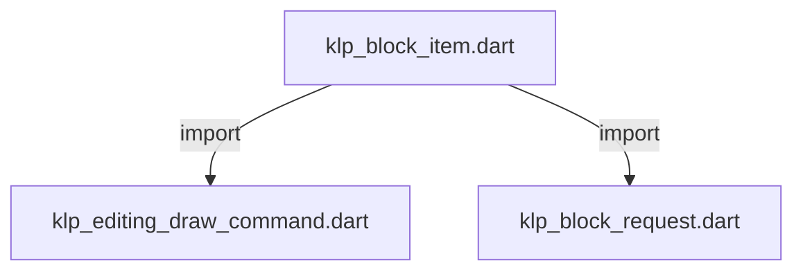
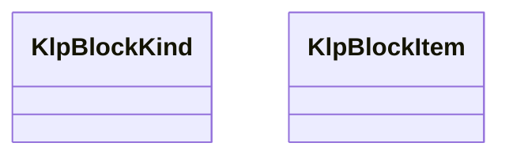

# klp_block_item.dart：直接依賴與宣告架構

[回到目錄](README.md) · [來源檔案](../../../../../../lib/src/capabilities/editing/contracts/klp_block_item.dart)

## 範圍

核心是 `lib/src/capabilities/editing/contracts/klp_block_item.dart`。主要視角為該檔案明寫的 import／export／part；輔助視角為本檔宣告及 extends／implements／with／on 關係。只展開一層外部邊界。

## 直接依賴圖

## 依賴證據

| 關係 | 原始 directive | 來源 |
|---|---|---|
| import | <code>import &#x27;klp_editing_draw_command.dart&#x27;;</code> | [lib/src/capabilities/editing/contracts/klp_block_item.dart:1](../../../../../../lib/src/capabilities/editing/contracts/klp_block_item.dart#L1) |
| import | <code>import &#x27;klp_block_request.dart&#x27;;</code> | [lib/src/capabilities/editing/contracts/klp_block_item.dart:2](../../../../../../lib/src/capabilities/editing/contracts/klp_block_item.dart#L2) |

## 宣告關係圖

本組節點是本檔宣告；沒有箭頭的宣告未在此圖主張互相依賴。

## 宣告與成員證據

成員包含 public 與 private；簽章取自來源，省略函式本體與欄位初始值。`(inferred)` 表示來源未明寫型別；建構子只顯示參數部分，不含初始化列表。

### KlpBlockKind

EnumDeclaration · public · [lib/src/capabilities/editing/contracts/klp_block_item.dart:4](../../../../../../lib/src/capabilities/editing/contracts/klp_block_item.dart#L4)

<code>enum KlpBlockKind</code>

來源註解摘要：舊正文區塊的呈現種類；結構與內容仍由提供者掌管。

| 成員 | 可見性 | 簽章／型別 | 來源註解摘要 | 證據 |
|---|---|---|---|---|
| enum value <code>paragraph</code> | public | <code>paragraph</code> |  | [lib/src/capabilities/editing/contracts/klp_block_item.dart:5](../../../../../../lib/src/capabilities/editing/contracts/klp_block_item.dart#L5) |
| enum value <code>heading</code> | public | <code>heading</code> |  | [lib/src/capabilities/editing/contracts/klp_block_item.dart:5](../../../../../../lib/src/capabilities/editing/contracts/klp_block_item.dart#L5) |
| enum value <code>unorderedListItem</code> | public | <code>unorderedListItem</code> |  | [lib/src/capabilities/editing/contracts/klp_block_item.dart:5](../../../../../../lib/src/capabilities/editing/contracts/klp_block_item.dart#L5) |
| enum value <code>orderedListItem</code> | public | <code>orderedListItem</code> |  | [lib/src/capabilities/editing/contracts/klp_block_item.dart:5](../../../../../../lib/src/capabilities/editing/contracts/klp_block_item.dart#L5) |
| enum value <code>taskListItem</code> | public | <code>taskListItem</code> |  | [lib/src/capabilities/editing/contracts/klp_block_item.dart:5](../../../../../../lib/src/capabilities/editing/contracts/klp_block_item.dart#L5) |
| enum value <code>quote</code> | public | <code>quote</code> |  | [lib/src/capabilities/editing/contracts/klp_block_item.dart:5](../../../../../../lib/src/capabilities/editing/contracts/klp_block_item.dart#L5) |
| enum value <code>code</code> | public | <code>code</code> |  | [lib/src/capabilities/editing/contracts/klp_block_item.dart:5](../../../../../../lib/src/capabilities/editing/contracts/klp_block_item.dart#L5) |
| enum value <code>thematicBreak</code> | public | <code>thematicBreak</code> |  | [lib/src/capabilities/editing/contracts/klp_block_item.dart:5](../../../../../../lib/src/capabilities/editing/contracts/klp_block_item.dart#L5) |
| enum value <code>comment</code> | public | <code>comment</code> |  | [lib/src/capabilities/editing/contracts/klp_block_item.dart:5](../../../../../../lib/src/capabilities/editing/contracts/klp_block_item.dart#L5) |
| enum value <code>toggleListItem</code> | public | <code>toggleListItem</code> |  | [lib/src/capabilities/editing/contracts/klp_block_item.dart:5](../../../../../../lib/src/capabilities/editing/contracts/klp_block_item.dart#L5) |
| enum value <code>math</code> | public | <code>math</code> |  | [lib/src/capabilities/editing/contracts/klp_block_item.dart:5](../../../../../../lib/src/capabilities/editing/contracts/klp_block_item.dart#L5) |

### KlpBlockItem

ClassDeclaration · public · [lib/src/capabilities/editing/contracts/klp_block_item.dart:7](../../../../../../lib/src/capabilities/editing/contracts/klp_block_item.dart#L7)

<code>final class KlpBlockItem</code>

來源註解摘要：同一 core frame 的穩定區塊身分、操作能力與兩種幾何。

| 成員 | 可見性 | 簽章／型別 | 來源註解摘要 | 證據 |
|---|---|---|---|---|
| field <code>id</code> | public | <code>final String id</code> |  | [lib/src/capabilities/editing/contracts/klp_block_item.dart:9](../../../../../../lib/src/capabilities/editing/contracts/klp_block_item.dart#L9) |
| field <code>kind</code> | public | <code>final KlpBlockKind kind</code> |  | [lib/src/capabilities/editing/contracts/klp_block_item.dart:10](../../../../../../lib/src/capabilities/editing/contracts/klp_block_item.dart#L10) |
| field <code>textKind</code> | public | <code>final KlpBlockTextKind? textKind</code> |  | [lib/src/capabilities/editing/contracts/klp_block_item.dart:11](../../../../../../lib/src/capabilities/editing/contracts/klp_block_item.dart#L11) |
| field <code>taskChecked</code> | public | <code>final bool? taskChecked</code> |  | [lib/src/capabilities/editing/contracts/klp_block_item.dart:12](../../../../../../lib/src/capabilities/editing/contracts/klp_block_item.dart#L12) |
| field <code>toggleCollapsed</code> | public | <code>final bool? toggleCollapsed</code> |  | [lib/src/capabilities/editing/contracts/klp_block_item.dart:13](../../../../../../lib/src/capabilities/editing/contracts/klp_block_item.dart#L13) |
| field <code>nestingDepth</code> | public | <code>final int? nestingDepth</code> |  | [lib/src/capabilities/editing/contracts/klp_block_item.dart:14](../../../../../../lib/src/capabilities/editing/contracts/klp_block_item.dart#L14) |
| field <code>listOrdinal</code> | public | <code>final int? listOrdinal</code> |  | [lib/src/capabilities/editing/contracts/klp_block_item.dart:15](../../../../../../lib/src/capabilities/editing/contracts/klp_block_item.dart#L15) |
| field <code>canIndent</code> | public | <code>final bool canIndent</code> |  | [lib/src/capabilities/editing/contracts/klp_block_item.dart:16](../../../../../../lib/src/capabilities/editing/contracts/klp_block_item.dart#L16) |
| field <code>canOutdent</code> | public | <code>final bool canOutdent</code> |  | [lib/src/capabilities/editing/contracts/klp_block_item.dart:17](../../../../../../lib/src/capabilities/editing/contracts/klp_block_item.dart#L17) |
| field <code>selected</code> | public | <code>final bool selected</code> |  | [lib/src/capabilities/editing/contracts/klp_block_item.dart:18](../../../../../../lib/src/capabilities/editing/contracts/klp_block_item.dart#L18) |
| field <code>selectionAnchor</code> | public | <code>final bool selectionAnchor</code> |  | [lib/src/capabilities/editing/contracts/klp_block_item.dart:19](../../../../../../lib/src/capabilities/editing/contracts/klp_block_item.dart#L19) |
| field <code>selectionFocus</code> | public | <code>final bool selectionFocus</code> |  | [lib/src/capabilities/editing/contracts/klp_block_item.dart:20](../../../../../../lib/src/capabilities/editing/contracts/klp_block_item.dart#L20) |
| field <code>canMoveBefore</code> | public | <code>final bool canMoveBefore</code> |  | [lib/src/capabilities/editing/contracts/klp_block_item.dart:21](../../../../../../lib/src/capabilities/editing/contracts/klp_block_item.dart#L21) |
| field <code>canMoveAfter</code> | public | <code>final bool canMoveAfter</code> |  | [lib/src/capabilities/editing/contracts/klp_block_item.dart:22](../../../../../../lib/src/capabilities/editing/contracts/klp_block_item.dart#L22) |
| field <code>hitRect</code> | public | <code>final KlpEditingRect hitRect</code> |  | [lib/src/capabilities/editing/contracts/klp_block_item.dart:23](../../../../../../lib/src/capabilities/editing/contracts/klp_block_item.dart#L23) |
| field <code>visualRect</code> | public | <code>final KlpEditingRect visualRect</code> |  | [lib/src/capabilities/editing/contracts/klp_block_item.dart:24](../../../../../../lib/src/capabilities/editing/contracts/klp_block_item.dart#L24) |
| constructor <code>KlpBlockItem</code> | public | <code>KlpBlockItem({required this.id, required this.kind, required this.textKind, this.taskChecked, this.toggleCollapsed, this.nestingDepth, this.listOrdinal, this.canIndent = false, this.canOutdent = false, required this.selected, bool? selectionAnchor, bool? selectionFocus, required this.canMoveBefore, required this.canMoveAfter, required this.hitRect, required this.visualRect})</code> |  | [lib/src/capabilities/editing/contracts/klp_block_item.dart:26](../../../../../../lib/src/capabilities/editing/contracts/klp_block_item.dart#L26) |
| method <code>_validate</code> | private | <code>void _validate(KlpEditingRect rect)</code> |  | [lib/src/capabilities/editing/contracts/klp_block_item.dart:52](../../../../../../lib/src/capabilities/editing/contracts/klp_block_item.dart#L52) |

## 閱讀說明與限制

箭頭只表示來源明寫的靜態關係；import 不等於呼叫。未分析動態呼叫、欄位的實際物件擁有權、狀態轉移或渲染流程；型別未進行語意解析，繼承目標保留原始型別拼寫。public／private 依 Dart 名稱前綴判斷；public 宣告不代表已由 `lib/kallopis.dart` 匯出。

本頁由 `tool/architecture_atlas` 產生；編輯來源或生成工具後重新產生，避免手改本頁。
