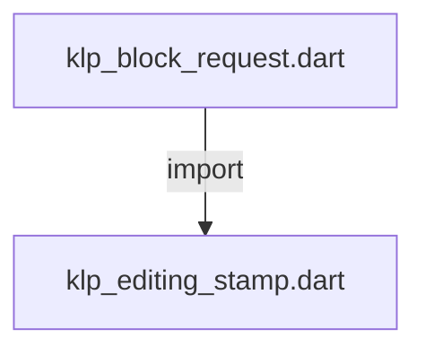

# klp_block_request.dart：直接依賴與宣告架構

[回到目錄](README.md) · [來源檔案](../../../../../../lib/src/capabilities/editing/contracts/klp_block_request.dart)

## 範圍

核心是 `lib/src/capabilities/editing/contracts/klp_block_request.dart`。主要視角為該檔案明寫的 import／export／part；輔助視角為本檔宣告及 extends／implements／with／on 關係。只展開一層外部邊界。

## 直接依賴圖

## 依賴證據

| 關係 | 原始 directive | 來源 |
|---|---|---|
| import | <code>import &#x27;klp_editing_stamp.dart&#x27;;</code> | [lib/src/capabilities/editing/contracts/klp_block_request.dart:1](../../../../../../lib/src/capabilities/editing/contracts/klp_block_request.dart#L1) |

## 宣告關係圖

本組節點是本檔宣告；沒有箭頭的宣告未在此圖主張互相依賴。

## 宣告與成員證據

成員包含 public 與 private；簽章取自來源，省略函式本體與欄位初始值。`(inferred)` 表示來源未明寫型別；建構子只顯示參數部分，不含初始化列表。

### KlpBlockIntent

EnumDeclaration · public · [lib/src/capabilities/editing/contracts/klp_block_request.dart:3](../../../../../../lib/src/capabilities/editing/contracts/klp_block_request.dart#L3)

<code>enum KlpBlockIntent</code>

來源註解摘要：舊正文區塊操作的請求種類；不在呈現層執行交易或維護 undo。

| 成員 | 可見性 | 簽章／型別 | 來源註解摘要 | 證據 |
|---|---|---|---|---|
| enum value <code>select</code> | public | <code>select</code> |  | [lib/src/capabilities/editing/contracts/klp_block_request.dart:4](../../../../../../lib/src/capabilities/editing/contracts/klp_block_request.dart#L4) |
| enum value <code>moveBefore</code> | public | <code>moveBefore</code> |  | [lib/src/capabilities/editing/contracts/klp_block_request.dart:4](../../../../../../lib/src/capabilities/editing/contracts/klp_block_request.dart#L4) |
| enum value <code>moveAfter</code> | public | <code>moveAfter</code> |  | [lib/src/capabilities/editing/contracts/klp_block_request.dart:4](../../../../../../lib/src/capabilities/editing/contracts/klp_block_request.dart#L4) |
| enum value <code>convert</code> | public | <code>convert</code> |  | [lib/src/capabilities/editing/contracts/klp_block_request.dart:4](../../../../../../lib/src/capabilities/editing/contracts/klp_block_request.dart#L4) |
| enum value <code>convertToUnorderedList</code> | public | <code>convertToUnorderedList</code> |  | [lib/src/capabilities/editing/contracts/klp_block_request.dart:4](../../../../../../lib/src/capabilities/editing/contracts/klp_block_request.dart#L4) |
| enum value <code>convertToOrderedList</code> | public | <code>convertToOrderedList</code> |  | [lib/src/capabilities/editing/contracts/klp_block_request.dart:4](../../../../../../lib/src/capabilities/editing/contracts/klp_block_request.dart#L4) |
| enum value <code>convertListToParagraph</code> | public | <code>convertListToParagraph</code> |  | [lib/src/capabilities/editing/contracts/klp_block_request.dart:4](../../../../../../lib/src/capabilities/editing/contracts/klp_block_request.dart#L4) |
| enum value <code>indentList</code> | public | <code>indentList</code> |  | [lib/src/capabilities/editing/contracts/klp_block_request.dart:4](../../../../../../lib/src/capabilities/editing/contracts/klp_block_request.dart#L4) |
| enum value <code>outdentList</code> | public | <code>outdentList</code> |  | [lib/src/capabilities/editing/contracts/klp_block_request.dart:4](../../../../../../lib/src/capabilities/editing/contracts/klp_block_request.dart#L4) |
| enum value <code>toggleTaskChecked</code> | public | <code>toggleTaskChecked</code> |  | [lib/src/capabilities/editing/contracts/klp_block_request.dart:4](../../../../../../lib/src/capabilities/editing/contracts/klp_block_request.dart#L4) |
| enum value <code>toggleCollapsed</code> | public | <code>toggleCollapsed</code> |  | [lib/src/capabilities/editing/contracts/klp_block_request.dart:4](../../../../../../lib/src/capabilities/editing/contracts/klp_block_request.dart#L4) |
| enum value <code>undo</code> | public | <code>undo</code> |  | [lib/src/capabilities/editing/contracts/klp_block_request.dart:4](../../../../../../lib/src/capabilities/editing/contracts/klp_block_request.dart#L4) |
| enum value <code>redo</code> | public | <code>redo</code> |  | [lib/src/capabilities/editing/contracts/klp_block_request.dart:4](../../../../../../lib/src/capabilities/editing/contracts/klp_block_request.dart#L4) |

### KlpBlockTextKind

EnumDeclaration · public · [lib/src/capabilities/editing/contracts/klp_block_request.dart:6](../../../../../../lib/src/capabilities/editing/contracts/klp_block_request.dart#L6)

<code>enum KlpBlockTextKind</code>

來源註解摘要：已核准的單一文字區塊語意；不以任意階層或原生常數擴張集合。

| 成員 | 可見性 | 簽章／型別 | 來源註解摘要 | 證據 |
|---|---|---|---|---|
| enum value <code>paragraph</code> | public | <code>paragraph</code> |  | [lib/src/capabilities/editing/contracts/klp_block_request.dart:7](../../../../../../lib/src/capabilities/editing/contracts/klp_block_request.dart#L7) |
| enum value <code>heading1</code> | public | <code>heading1</code> |  | [lib/src/capabilities/editing/contracts/klp_block_request.dart:7](../../../../../../lib/src/capabilities/editing/contracts/klp_block_request.dart#L7) |
| enum value <code>heading2</code> | public | <code>heading2</code> |  | [lib/src/capabilities/editing/contracts/klp_block_request.dart:7](../../../../../../lib/src/capabilities/editing/contracts/klp_block_request.dart#L7) |
| enum value <code>heading3</code> | public | <code>heading3</code> |  | [lib/src/capabilities/editing/contracts/klp_block_request.dart:7](../../../../../../lib/src/capabilities/editing/contracts/klp_block_request.dart#L7) |

### KlpBlockRequest

ClassDeclaration · public · [lib/src/capabilities/editing/contracts/klp_block_request.dart:9](../../../../../../lib/src/capabilities/editing/contracts/klp_block_request.dart#L9)

<code>final class KlpBlockRequest</code>

來源註解摘要：K02-S1 單一區塊命令；target 一律使用 stable ID。

| 成員 | 可見性 | 簽章／型別 | 來源註解摘要 | 證據 |
|---|---|---|---|---|
| field <code>sequence</code> | public | <code>final int sequence</code> |  | [lib/src/capabilities/editing/contracts/klp_block_request.dart:11](../../../../../../lib/src/capabilities/editing/contracts/klp_block_request.dart#L11) |
| field <code>expected</code> | public | <code>final KlpEditingStamp expected</code> |  | [lib/src/capabilities/editing/contracts/klp_block_request.dart:12](../../../../../../lib/src/capabilities/editing/contracts/klp_block_request.dart#L12) |
| field <code>blockId</code> | public | <code>final String blockId</code> |  | [lib/src/capabilities/editing/contracts/klp_block_request.dart:13](../../../../../../lib/src/capabilities/editing/contracts/klp_block_request.dart#L13) |
| field <code>rangeEndId</code> | public | <code>final String? rangeEndId</code> |  | [lib/src/capabilities/editing/contracts/klp_block_request.dart:14](../../../../../../lib/src/capabilities/editing/contracts/klp_block_request.dart#L14) |
| field <code>intent</code> | public | <code>final KlpBlockIntent intent</code> |  | [lib/src/capabilities/editing/contracts/klp_block_request.dart:15](../../../../../../lib/src/capabilities/editing/contracts/klp_block_request.dart#L15) |
| field <code>targetId</code> | public | <code>final String? targetId</code> |  | [lib/src/capabilities/editing/contracts/klp_block_request.dart:16](../../../../../../lib/src/capabilities/editing/contracts/klp_block_request.dart#L16) |
| field <code>conversion</code> | public | <code>final KlpBlockTextKind? conversion</code> |  | [lib/src/capabilities/editing/contracts/klp_block_request.dart:17](../../../../../../lib/src/capabilities/editing/contracts/klp_block_request.dart#L17) |
| constructor <code>KlpBlockRequest</code> | public | <code>KlpBlockRequest({required this.sequence, required this.expected, required this.blockId, this.rangeEndId, required this.intent, this.targetId, this.conversion})</code> |  | [lib/src/capabilities/editing/contracts/klp_block_request.dart:19](../../../../../../lib/src/capabilities/editing/contracts/klp_block_request.dart#L19) |

## 閱讀說明與限制

箭頭只表示來源明寫的靜態關係；import 不等於呼叫。未分析動態呼叫、欄位的實際物件擁有權、狀態轉移或渲染流程；型別未進行語意解析，繼承目標保留原始型別拼寫。public／private 依 Dart 名稱前綴判斷；public 宣告不代表已由 `lib/kallopis.dart` 匯出。

本頁由 `tool/architecture_atlas` 產生；編輯來源或生成工具後重新產生，避免手改本頁。
