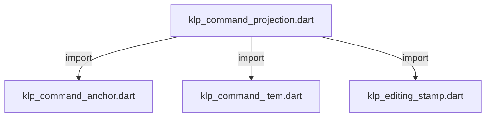
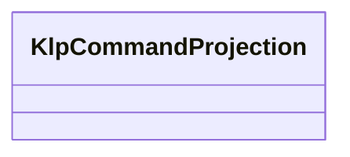

# klp_command_projection.dart：直接依賴與宣告架構

[回到目錄](README.md) · [來源檔案](../../../../../../lib/src/capabilities/editing/contracts/klp_command_projection.dart)

## 範圍

核心是 `lib/src/capabilities/editing/contracts/klp_command_projection.dart`。主要視角為該檔案明寫的 import／export／part；輔助視角為本檔宣告及 extends／implements／with／on 關係。只展開一層外部邊界。

## 直接依賴圖

## 依賴證據

| 關係 | 原始 directive | 來源 |
|---|---|---|
| import | <code>import &#x27;klp_command_anchor.dart&#x27;;</code> | [lib/src/capabilities/editing/contracts/klp_command_projection.dart:1](../../../../../../lib/src/capabilities/editing/contracts/klp_command_projection.dart#L1) |
| import | <code>import &#x27;klp_command_item.dart&#x27;;</code> | [lib/src/capabilities/editing/contracts/klp_command_projection.dart:2](../../../../../../lib/src/capabilities/editing/contracts/klp_command_projection.dart#L2) |
| import | <code>import &#x27;klp_editing_stamp.dart&#x27;;</code> | [lib/src/capabilities/editing/contracts/klp_command_projection.dart:3](../../../../../../lib/src/capabilities/editing/contracts/klp_command_projection.dart#L3) |

## 宣告關係圖

本組節點是本檔宣告；沒有箭頭的宣告未在此圖主張互相依賴。

## 宣告與成員證據

成員包含 public 與 private；簽章取自來源，省略函式本體與欄位初始值。`(inferred)` 表示來源未明寫型別；建構子只顯示參數部分，不含初始化列表。

### KlpCommandProjection

ClassDeclaration · public · [lib/src/capabilities/editing/contracts/klp_command_projection.dart:5](../../../../../../lib/src/capabilities/editing/contracts/klp_command_projection.dart#L5)

<code>final class KlpCommandProjection</code>

來源註解摘要：同一 drawing 的有序命令候選；revision 只識別這份不可變候選。

| 成員 | 可見性 | 簽章／型別 | 來源註解摘要 | 證據 |
|---|---|---|---|---|
| field <code>stamp</code> | public | <code>final KlpEditingStamp stamp</code> |  | [lib/src/capabilities/editing/contracts/klp_command_projection.dart:7](../../../../../../lib/src/capabilities/editing/contracts/klp_command_projection.dart#L7) |
| field <code>revision</code> | public | <code>final int revision</code> |  | [lib/src/capabilities/editing/contracts/klp_command_projection.dart:8](../../../../../../lib/src/capabilities/editing/contracts/klp_command_projection.dart#L8) |
| field <code>anchor</code> | public | <code>final KlpCommandAnchor anchor</code> |  | [lib/src/capabilities/editing/contracts/klp_command_projection.dart:9](../../../../../../lib/src/capabilities/editing/contracts/klp_command_projection.dart#L9) |
| field <code>emptyLabel</code> | public | <code>final String emptyLabel</code> |  | [lib/src/capabilities/editing/contracts/klp_command_projection.dart:10](../../../../../../lib/src/capabilities/editing/contracts/klp_command_projection.dart#L10) |
| field <code>items</code> | public | <code>final List&lt;KlpCommandItem&gt; items</code> |  | [lib/src/capabilities/editing/contracts/klp_command_projection.dart:11](../../../../../../lib/src/capabilities/editing/contracts/klp_command_projection.dart#L11) |
| constructor <code>KlpCommandProjection</code> | public | <code>KlpCommandProjection({required this.stamp, required this.revision, required this.anchor, required this.emptyLabel, required Iterable&lt;KlpCommandItem&gt; items})</code> |  | [lib/src/capabilities/editing/contracts/klp_command_projection.dart:13](../../../../../../lib/src/capabilities/editing/contracts/klp_command_projection.dart#L13) |

## 閱讀說明與限制

箭頭只表示來源明寫的靜態關係；import 不等於呼叫。未分析動態呼叫、欄位的實際物件擁有權、狀態轉移或渲染流程；型別未進行語意解析，繼承目標保留原始型別拼寫。public／private 依 Dart 名稱前綴判斷；public 宣告不代表已由 `lib/kallopis.dart` 匯出。

本頁由 `tool/architecture_atlas` 產生；編輯來源或生成工具後重新產生，避免手改本頁。
