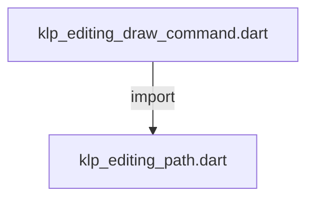
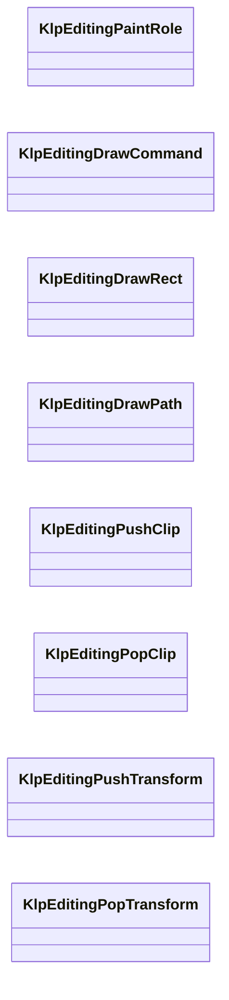
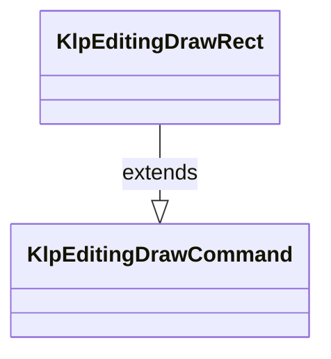
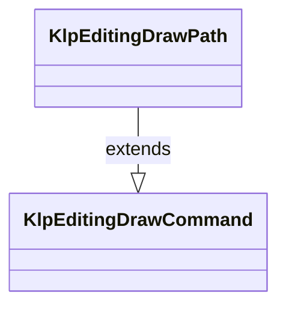
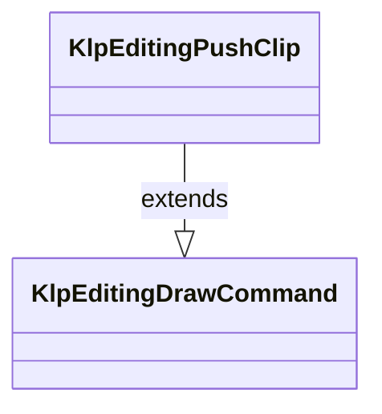
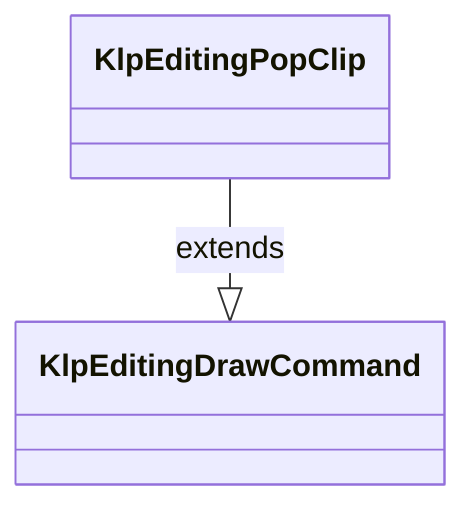
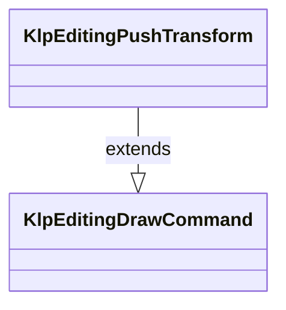
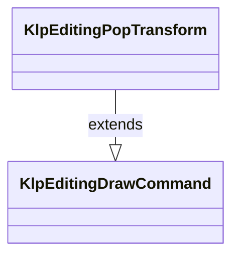

# klp_editing_draw_command.dart：直接依賴與宣告架構

[回到目錄](README.md) · [來源檔案](../../../../../../lib/src/capabilities/editing/contracts/klp_editing_draw_command.dart)

## 範圍

核心是 `lib/src/capabilities/editing/contracts/klp_editing_draw_command.dart`。主要視角為該檔案明寫的 import／export／part；輔助視角為本檔宣告及 extends／implements／with／on 關係。只展開一層外部邊界。

## 直接依賴圖

## 依賴證據

| 關係 | 原始 directive | 來源 |
|---|---|---|
| import | <code>import &#x27;klp_editing_path.dart&#x27;;</code> | [lib/src/capabilities/editing/contracts/klp_editing_draw_command.dart:1](../../../../../../lib/src/capabilities/editing/contracts/klp_editing_draw_command.dart#L1) |

## 宣告關係圖

本組節點是本檔宣告；沒有箭頭的宣告未在此圖主張互相依賴。

## 宣告與成員證據

成員包含 public 與 private；簽章取自來源，省略函式本體與欄位初始值。`(inferred)` 表示來源未明寫型別；建構子只顯示參數部分，不含初始化列表。

### KlpEditingPaintRole

EnumDeclaration · public · [lib/src/capabilities/editing/contracts/klp_editing_draw_command.dart:3](../../../../../../lib/src/capabilities/editing/contracts/klp_editing_draw_command.dart#L3)

<code>enum KlpEditingPaintRole</code>

來源註解摘要：提供者只能標示用途，實際顏色由本庫解析。

| 成員 | 可見性 | 簽章／型別 | 來源註解摘要 | 證據 |
|---|---|---|---|---|
| enum value <code>text</code> | public | <code>text</code> |  | [lib/src/capabilities/editing/contracts/klp_editing_draw_command.dart:4](../../../../../../lib/src/capabilities/editing/contracts/klp_editing_draw_command.dart#L4) |
| enum value <code>ink</code> | public | <code>ink</code> |  | [lib/src/capabilities/editing/contracts/klp_editing_draw_command.dart:4](../../../../../../lib/src/capabilities/editing/contracts/klp_editing_draw_command.dart#L4) |
| enum value <code>caret</code> | public | <code>caret</code> |  | [lib/src/capabilities/editing/contracts/klp_editing_draw_command.dart:4](../../../../../../lib/src/capabilities/editing/contracts/klp_editing_draw_command.dart#L4) |
| enum value <code>selection</code> | public | <code>selection</code> |  | [lib/src/capabilities/editing/contracts/klp_editing_draw_command.dart:4](../../../../../../lib/src/capabilities/editing/contracts/klp_editing_draw_command.dart#L4) |
| enum value <code>listMarker</code> | public | <code>listMarker</code> |  | [lib/src/capabilities/editing/contracts/klp_editing_draw_command.dart:4](../../../../../../lib/src/capabilities/editing/contracts/klp_editing_draw_command.dart#L4) |

### KlpEditingRect

GenericTypeAlias · public · [lib/src/capabilities/editing/contracts/klp_editing_draw_command.dart:6](../../../../../../lib/src/capabilities/editing/contracts/klp_editing_draw_command.dart#L6)

<code>typedef KlpEditingRect = ({double x, double y, double width, double height});</code>

### _validateRect

FunctionDeclaration · private · [lib/src/capabilities/editing/contracts/klp_editing_draw_command.dart:8](../../../../../../lib/src/capabilities/editing/contracts/klp_editing_draw_command.dart#L8)

<code>void _validateRect(KlpEditingRect rect)</code>

### KlpEditingDrawCommand

ClassDeclaration · public · [lib/src/capabilities/editing/contracts/klp_editing_draw_command.dart:12](../../../../../../lib/src/capabilities/editing/contracts/klp_editing_draw_command.dart#L12)

<code>sealed class KlpEditingDrawCommand</code>

| 成員 | 可見性 | 簽章／型別 | 來源註解摘要 | 證據 |
|---|---|---|---|---|
| constructor <code>KlpEditingDrawCommand</code> | public | <code>const KlpEditingDrawCommand()</code> |  | [lib/src/capabilities/editing/contracts/klp_editing_draw_command.dart:14](../../../../../../lib/src/capabilities/editing/contracts/klp_editing_draw_command.dart#L14) |

### KlpEditingDrawRect

ClassDeclaration · public · [lib/src/capabilities/editing/contracts/klp_editing_draw_command.dart:17](../../../../../../lib/src/capabilities/editing/contracts/klp_editing_draw_command.dart#L17)

<code>final class KlpEditingDrawRect extends KlpEditingDrawCommand</code>

來源註解摘要：以語意用途繪製矩形的資料指令；不攜帶原生 painter 或顏色。

- `extends` → <code>KlpEditingDrawCommand</code>：[lib/src/capabilities/editing/contracts/klp_editing_draw_command.dart:18](../../../../../../lib/src/capabilities/editing/contracts/klp_editing_draw_command.dart#L18)

| 成員 | 可見性 | 簽章／型別 | 來源註解摘要 | 證據 |
|---|---|---|---|---|
| field <code>rect</code> | public | <code>final KlpEditingRect rect</code> |  | [lib/src/capabilities/editing/contracts/klp_editing_draw_command.dart:20](../../../../../../lib/src/capabilities/editing/contracts/klp_editing_draw_command.dart#L20) |
| field <code>role</code> | public | <code>final KlpEditingPaintRole role</code> |  | [lib/src/capabilities/editing/contracts/klp_editing_draw_command.dart:21](../../../../../../lib/src/capabilities/editing/contracts/klp_editing_draw_command.dart#L21) |
| constructor <code>KlpEditingDrawRect</code> | public | <code>KlpEditingDrawRect(this.rect, this.role)</code> |  | [lib/src/capabilities/editing/contracts/klp_editing_draw_command.dart:23](../../../../../../lib/src/capabilities/editing/contracts/klp_editing_draw_command.dart#L23) |

### KlpEditingDrawPath

ClassDeclaration · public · [lib/src/capabilities/editing/contracts/klp_editing_draw_command.dart:26](../../../../../../lib/src/capabilities/editing/contracts/klp_editing_draw_command.dart#L26)

<code>final class KlpEditingDrawPath extends KlpEditingDrawCommand</code>

來源註解摘要：以語意用途繪製提供者路徑的指令；不擁有筆刷或平台畫布。

- `extends` → <code>KlpEditingDrawCommand</code>：[lib/src/capabilities/editing/contracts/klp_editing_draw_command.dart:27](../../../../../../lib/src/capabilities/editing/contracts/klp_editing_draw_command.dart#L27)

| 成員 | 可見性 | 簽章／型別 | 來源註解摘要 | 證據 |
|---|---|---|---|---|
| field <code>path</code> | public | <code>final KlpEditingPath path</code> |  | [lib/src/capabilities/editing/contracts/klp_editing_draw_command.dart:29](../../../../../../lib/src/capabilities/editing/contracts/klp_editing_draw_command.dart#L29) |
| field <code>role</code> | public | <code>final KlpEditingPaintRole role</code> |  | [lib/src/capabilities/editing/contracts/klp_editing_draw_command.dart:30](../../../../../../lib/src/capabilities/editing/contracts/klp_editing_draw_command.dart#L30) |
| constructor <code>KlpEditingDrawPath</code> | public | <code>const KlpEditingDrawPath(this.path, this.role)</code> |  | [lib/src/capabilities/editing/contracts/klp_editing_draw_command.dart:32](../../../../../../lib/src/capabilities/editing/contracts/klp_editing_draw_command.dart#L32) |

### KlpEditingPushClip

ClassDeclaration · public · [lib/src/capabilities/editing/contracts/klp_editing_draw_command.dart:35](../../../../../../lib/src/capabilities/editing/contracts/klp_editing_draw_command.dart#L35)

<code>final class KlpEditingPushClip extends KlpEditingDrawCommand</code>

來源註解摘要：將矩形裁切範圍推入繪製狀態；只描述操作而不持有畫布。

- `extends` → <code>KlpEditingDrawCommand</code>：[lib/src/capabilities/editing/contracts/klp_editing_draw_command.dart:36](../../../../../../lib/src/capabilities/editing/contracts/klp_editing_draw_command.dart#L36)

| 成員 | 可見性 | 簽章／型別 | 來源註解摘要 | 證據 |
|---|---|---|---|---|
| field <code>rect</code> | public | <code>final KlpEditingRect rect</code> |  | [lib/src/capabilities/editing/contracts/klp_editing_draw_command.dart:38](../../../../../../lib/src/capabilities/editing/contracts/klp_editing_draw_command.dart#L38) |
| constructor <code>KlpEditingPushClip</code> | public | <code>KlpEditingPushClip(this.rect)</code> |  | [lib/src/capabilities/editing/contracts/klp_editing_draw_command.dart:40](../../../../../../lib/src/capabilities/editing/contracts/klp_editing_draw_command.dart#L40) |

### KlpEditingPopClip

ClassDeclaration · public · [lib/src/capabilities/editing/contracts/klp_editing_draw_command.dart:43](../../../../../../lib/src/capabilities/editing/contracts/klp_editing_draw_command.dart#L43)

<code>final class KlpEditingPopClip extends KlpEditingDrawCommand</code>

來源註解摘要：結束最近一層裁切的資料指令；配對與執行由繪製流程驗證。

- `extends` → <code>KlpEditingDrawCommand</code>：[lib/src/capabilities/editing/contracts/klp_editing_draw_command.dart:44](../../../../../../lib/src/capabilities/editing/contracts/klp_editing_draw_command.dart#L44)

| 成員 | 可見性 | 簽章／型別 | 來源註解摘要 | 證據 |
|---|---|---|---|---|
| constructor <code>KlpEditingPopClip</code> | public | <code>const KlpEditingPopClip()</code> |  | [lib/src/capabilities/editing/contracts/klp_editing_draw_command.dart:46](../../../../../../lib/src/capabilities/editing/contracts/klp_editing_draw_command.dart#L46) |

### KlpEditingPushTransform

ClassDeclaration · public · [lib/src/capabilities/editing/contracts/klp_editing_draw_command.dart:49](../../../../../../lib/src/capabilities/editing/contracts/klp_editing_draw_command.dart#L49)

<code>final class KlpEditingPushTransform extends KlpEditingDrawCommand</code>

來源註解摘要：六值仿射矩陣依序為 a、b、c、d、tx、ty；不可攜帶平台 Matrix 型別。

- `extends` → <code>KlpEditingDrawCommand</code>：[lib/src/capabilities/editing/contracts/klp_editing_draw_command.dart:50](../../../../../../lib/src/capabilities/editing/contracts/klp_editing_draw_command.dart#L50)

| 成員 | 可見性 | 簽章／型別 | 來源註解摘要 | 證據 |
|---|---|---|---|---|
| field <code>affine</code> | public | <code>final List&lt;double&gt; affine</code> |  | [lib/src/capabilities/editing/contracts/klp_editing_draw_command.dart:52](../../../../../../lib/src/capabilities/editing/contracts/klp_editing_draw_command.dart#L52) |
| constructor <code>KlpEditingPushTransform</code> | public | <code>KlpEditingPushTransform(Iterable&lt;double&gt; affine)</code> |  | [lib/src/capabilities/editing/contracts/klp_editing_draw_command.dart:54](../../../../../../lib/src/capabilities/editing/contracts/klp_editing_draw_command.dart#L54) |

### KlpEditingPopTransform

ClassDeclaration · public · [lib/src/capabilities/editing/contracts/klp_editing_draw_command.dart:59](../../../../../../lib/src/capabilities/editing/contracts/klp_editing_draw_command.dart#L59)

<code>final class KlpEditingPopTransform extends KlpEditingDrawCommand</code>

來源註解摘要：結束最近一層座標轉換的資料指令；不保存平台矩陣狀態。

- `extends` → <code>KlpEditingDrawCommand</code>：[lib/src/capabilities/editing/contracts/klp_editing_draw_command.dart:60](../../../../../../lib/src/capabilities/editing/contracts/klp_editing_draw_command.dart#L60)

| 成員 | 可見性 | 簽章／型別 | 來源註解摘要 | 證據 |
|---|---|---|---|---|
| constructor <code>KlpEditingPopTransform</code> | public | <code>const KlpEditingPopTransform()</code> |  | [lib/src/capabilities/editing/contracts/klp_editing_draw_command.dart:62](../../../../../../lib/src/capabilities/editing/contracts/klp_editing_draw_command.dart#L62) |

## 閱讀說明與限制

箭頭只表示來源明寫的靜態關係；import 不等於呼叫。未分析動態呼叫、欄位的實際物件擁有權、狀態轉移或渲染流程；型別未進行語意解析，繼承目標保留原始型別拼寫。public／private 依 Dart 名稱前綴判斷；public 宣告不代表已由 `lib/kallopis.dart` 匯出。

本頁由 `tool/architecture_atlas` 產生；編輯來源或生成工具後重新產生，避免手改本頁。
