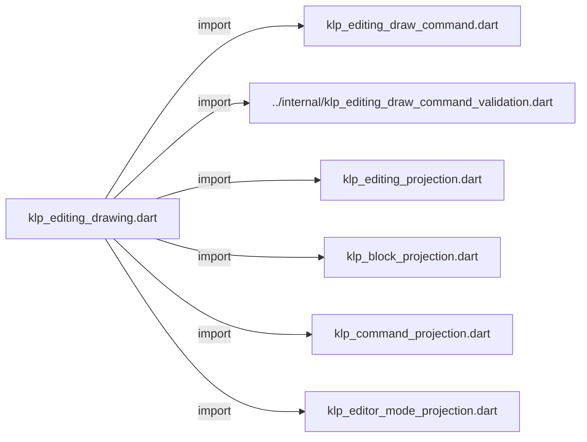
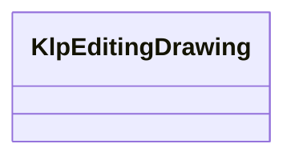

# klp_editing_drawing.dart：直接依賴與宣告架構

[回到目錄](README.md) · [來源檔案](../../../../../../lib/src/capabilities/editing/contracts/klp_editing_drawing.dart)

## 範圍

核心是 `lib/src/capabilities/editing/contracts/klp_editing_drawing.dart`。主要視角為該檔案明寫的 import／export／part；輔助視角為本檔宣告及 extends／implements／with／on 關係。只展開一層外部邊界。

## 直接依賴圖

## 依賴證據

| 關係 | 原始 directive | 來源 |
|---|---|---|
| import | <code>import &#x27;klp_editing_draw_command.dart&#x27;;</code> | [lib/src/capabilities/editing/contracts/klp_editing_drawing.dart:1](../../../../../../lib/src/capabilities/editing/contracts/klp_editing_drawing.dart#L1) |
| import | <code>import &#x27;../internal/klp_editing_draw_command_validation.dart&#x27;;</code> | [lib/src/capabilities/editing/contracts/klp_editing_drawing.dart:2](../../../../../../lib/src/capabilities/editing/contracts/klp_editing_drawing.dart#L2) |
| import | <code>import &#x27;klp_editing_projection.dart&#x27;;</code> | [lib/src/capabilities/editing/contracts/klp_editing_drawing.dart:3](../../../../../../lib/src/capabilities/editing/contracts/klp_editing_drawing.dart#L3) |
| import | <code>import &#x27;klp_block_projection.dart&#x27;;</code> | [lib/src/capabilities/editing/contracts/klp_editing_drawing.dart:4](../../../../../../lib/src/capabilities/editing/contracts/klp_editing_drawing.dart#L4) |
| import | <code>import &#x27;klp_command_projection.dart&#x27;;</code> | [lib/src/capabilities/editing/contracts/klp_editing_drawing.dart:5](../../../../../../lib/src/capabilities/editing/contracts/klp_editing_drawing.dart#L5) |
| import | <code>import &#x27;klp_editor_mode_projection.dart&#x27;;</code> | [lib/src/capabilities/editing/contracts/klp_editing_drawing.dart:6](../../../../../../lib/src/capabilities/editing/contracts/klp_editing_drawing.dart#L6) |

## 宣告關係圖

本組節點是本檔宣告；沒有箭頭的宣告未在此圖主張互相依賴。

## 宣告與成員證據

成員包含 public 與 private；簽章取自來源，省略函式本體與欄位初始值。`(inferred)` 表示來源未明寫型別；建構子只顯示參數部分，不含初始化列表。

### _validateGeometry

FunctionDeclaration · private · [lib/src/capabilities/editing/contracts/klp_editing_drawing.dart:8](../../../../../../lib/src/capabilities/editing/contracts/klp_editing_drawing.dart#L8)

<code>void _validateGeometry(KlpEditingRect rect)</code>

### KlpEditingDrawing

ClassDeclaration · public · [lib/src/capabilities/editing/contracts/klp_editing_drawing.dart:12](../../../../../../lib/src/capabilities/editing/contracts/klp_editing_drawing.dart#L12)

<code>final class KlpEditingDrawing</code>

來源註解摘要：與輸入投影一起發布的封閉幾何快照；不接受文字重排或繪製回呼。

| 成員 | 可見性 | 簽章／型別 | 來源註解摘要 | 證據 |
|---|---|---|---|---|
| field <code>projection</code> | public | <code>final KlpEditingProjection projection</code> |  | [lib/src/capabilities/editing/contracts/klp_editing_drawing.dart:15](../../../../../../lib/src/capabilities/editing/contracts/klp_editing_drawing.dart#L15) |
| field <code>width</code> | public | <code>final double width</code> |  | [lib/src/capabilities/editing/contracts/klp_editing_drawing.dart:16](../../../../../../lib/src/capabilities/editing/contracts/klp_editing_drawing.dart#L16) |
| field <code>height</code> | public | <code>final double height</code> |  | [lib/src/capabilities/editing/contracts/klp_editing_drawing.dart:17](../../../../../../lib/src/capabilities/editing/contracts/klp_editing_drawing.dart#L17) |
| field <code>caretRect</code> | public | <code>final KlpEditingRect? caretRect</code> |  | [lib/src/capabilities/editing/contracts/klp_editing_drawing.dart:18](../../../../../../lib/src/capabilities/editing/contracts/klp_editing_drawing.dart#L18) |
| field <code>composingRect</code> | public | <code>final KlpEditingRect? composingRect</code> |  | [lib/src/capabilities/editing/contracts/klp_editing_drawing.dart:19](../../../../../../lib/src/capabilities/editing/contracts/klp_editing_drawing.dart#L19) |
| field <code>blocks</code> | public | <code>final KlpBlockProjection? blocks</code> |  | [lib/src/capabilities/editing/contracts/klp_editing_drawing.dart:20](../../../../../../lib/src/capabilities/editing/contracts/klp_editing_drawing.dart#L20) |
| field <code>anchoredCommands</code> | public | <code>final KlpCommandProjection? anchoredCommands</code> |  | [lib/src/capabilities/editing/contracts/klp_editing_drawing.dart:21](../../../../../../lib/src/capabilities/editing/contracts/klp_editing_drawing.dart#L21) |
| field <code>editorModes</code> | public | <code>final KlpEditorModeProjection? editorModes</code> |  | [lib/src/capabilities/editing/contracts/klp_editing_drawing.dart:22](../../../../../../lib/src/capabilities/editing/contracts/klp_editing_drawing.dart#L22) |
| field <code>commands</code> | public | <code>final List&lt;KlpEditingDrawCommand&gt; commands</code> |  | [lib/src/capabilities/editing/contracts/klp_editing_drawing.dart:23](../../../../../../lib/src/capabilities/editing/contracts/klp_editing_drawing.dart#L23) |
| constructor <code>KlpEditingDrawing</code> | public | <code>KlpEditingDrawing({required this.projection, required this.width, required this.height, required Iterable&lt;KlpEditingDrawCommand&gt; commands, this.caretRect, this.composingRect, this.blocks, this.anchoredCommands, this.editorModes})</code> |  | [lib/src/capabilities/editing/contracts/klp_editing_drawing.dart:25](../../../../../../lib/src/capabilities/editing/contracts/klp_editing_drawing.dart#L25) |

## 閱讀說明與限制

箭頭只表示來源明寫的靜態關係；import 不等於呼叫。未分析動態呼叫、欄位的實際物件擁有權、狀態轉移或渲染流程；型別未進行語意解析，繼承目標保留原始型別拼寫。public／private 依 Dart 名稱前綴判斷；public 宣告不代表已由 `lib/kallopis.dart` 匯出。

本頁由 `tool/architecture_atlas` 產生；編輯來源或生成工具後重新產生，避免手改本頁。
