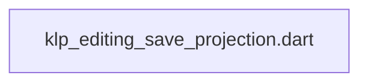
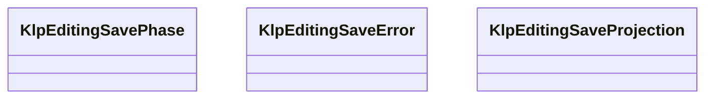

# klp_editing_save_projection.dart：直接依賴與宣告架構

[回到目錄](README.md) · [來源檔案](../../../../../../lib/src/capabilities/editing/contracts/klp_editing_save_projection.dart)

## 範圍

核心是 `lib/src/capabilities/editing/contracts/klp_editing_save_projection.dart`。主要視角為該檔案明寫的 import／export／part；輔助視角為本檔宣告及 extends／implements／with／on 關係。只展開一層外部邊界。

## 直接依賴圖

## 依賴證據

| 關係 | 原始 directive | 來源 |
|---|---|---|
| 無 | 本檔未宣告 import／export／part | [lib/src/capabilities/editing/contracts/klp_editing_save_projection.dart:1](../../../../../../lib/src/capabilities/editing/contracts/klp_editing_save_projection.dart#L1) |

## 宣告關係圖

本組節點是本檔宣告；沒有箭頭的宣告未在此圖主張互相依賴。

## 宣告與成員證據

成員包含 public 與 private；簽章取自來源，省略函式本體與欄位初始值。`(inferred)` 表示來源未明寫型別；建構子只顯示參數部分，不含初始化列表。

### KlpEditingSavePhase

EnumDeclaration · public · [lib/src/capabilities/editing/contracts/klp_editing_save_projection.dart:1](../../../../../../lib/src/capabilities/editing/contracts/klp_editing_save_projection.dart#L1)

<code>enum KlpEditingSavePhase</code>

來源註解摘要：來源回報的保存作業階段；階段本身不證明特定修訂已落盤。

| 成員 | 可見性 | 簽章／型別 | 來源註解摘要 | 證據 |
|---|---|---|---|---|
| enum value <code>idle</code> | public | <code>idle</code> |  | [lib/src/capabilities/editing/contracts/klp_editing_save_projection.dart:2](../../../../../../lib/src/capabilities/editing/contracts/klp_editing_save_projection.dart#L2) |
| enum value <code>saving</code> | public | <code>saving</code> |  | [lib/src/capabilities/editing/contracts/klp_editing_save_projection.dart:2](../../../../../../lib/src/capabilities/editing/contracts/klp_editing_save_projection.dart#L2) |
| enum value <code>saved</code> | public | <code>saved</code> |  | [lib/src/capabilities/editing/contracts/klp_editing_save_projection.dart:2](../../../../../../lib/src/capabilities/editing/contracts/klp_editing_save_projection.dart#L2) |
| enum value <code>failed</code> | public | <code>failed</code> |  | [lib/src/capabilities/editing/contracts/klp_editing_save_projection.dart:2](../../../../../../lib/src/capabilities/editing/contracts/klp_editing_save_projection.dart#L2) |

### KlpEditingSaveError

EnumDeclaration · public · [lib/src/capabilities/editing/contracts/klp_editing_save_projection.dart:4](../../../../../../lib/src/capabilities/editing/contracts/klp_editing_save_projection.dart#L4)

<code>enum KlpEditingSaveError</code>

來源註解摘要：保存失敗的具型別原因；結果是否確定另由保存投影表達。

| 成員 | 可見性 | 簽章／型別 | 來源註解摘要 | 證據 |
|---|---|---|---|---|
| enum value <code>rejected</code> | public | <code>rejected</code> |  | [lib/src/capabilities/editing/contracts/klp_editing_save_projection.dart:5](../../../../../../lib/src/capabilities/editing/contracts/klp_editing_save_projection.dart#L5) |
| enum value <code>conflict</code> | public | <code>conflict</code> |  | [lib/src/capabilities/editing/contracts/klp_editing_save_projection.dart:5](../../../../../../lib/src/capabilities/editing/contracts/klp_editing_save_projection.dart#L5) |
| enum value <code>unavailable</code> | public | <code>unavailable</code> |  | [lib/src/capabilities/editing/contracts/klp_editing_save_projection.dart:5](../../../../../../lib/src/capabilities/editing/contracts/klp_editing_save_projection.dart#L5) |
| enum value <code>ioFailure</code> | public | <code>ioFailure</code> |  | [lib/src/capabilities/editing/contracts/klp_editing_save_projection.dart:5](../../../../../../lib/src/capabilities/editing/contracts/klp_editing_save_projection.dart#L5) |
| enum value <code>unknown</code> | public | <code>unknown</code> |  | [lib/src/capabilities/editing/contracts/klp_editing_save_projection.dart:5](../../../../../../lib/src/capabilities/editing/contracts/klp_editing_save_projection.dart#L5) |

### KlpEditingSaveProjection

ClassDeclaration · public · [lib/src/capabilities/editing/contracts/klp_editing_save_projection.dart:7](../../../../../../lib/src/capabilities/editing/contracts/klp_editing_save_projection.dart#L7)

<code>final class KlpEditingSaveProjection</code>

來源註解摘要：同一 editor source 的只讀保存作業狀態；不公開路徑或原生 fingerprint。

| 成員 | 可見性 | 簽章／型別 | 來源註解摘要 | 證據 |
|---|---|---|---|---|
| field <code>documentId</code> | public | <code>final String documentId</code> |  | [lib/src/capabilities/editing/contracts/klp_editing_save_projection.dart:9](../../../../../../lib/src/capabilities/editing/contracts/klp_editing_save_projection.dart#L9) |
| field <code>pageId</code> | public | <code>final String pageId</code> |  | [lib/src/capabilities/editing/contracts/klp_editing_save_projection.dart:10](../../../../../../lib/src/capabilities/editing/contracts/klp_editing_save_projection.dart#L10) |
| field <code>sessionId</code> | public | <code>final String sessionId</code> |  | [lib/src/capabilities/editing/contracts/klp_editing_save_projection.dart:11](../../../../../../lib/src/capabilities/editing/contracts/klp_editing_save_projection.dart#L11) |
| field <code>generation</code> | public | <code>final int generation</code> |  | [lib/src/capabilities/editing/contracts/klp_editing_save_projection.dart:12](../../../../../../lib/src/capabilities/editing/contracts/klp_editing_save_projection.dart#L12) |
| field <code>stateRevision</code> | public | <code>final int stateRevision</code> |  | [lib/src/capabilities/editing/contracts/klp_editing_save_projection.dart:13](../../../../../../lib/src/capabilities/editing/contracts/klp_editing_save_projection.dart#L13) |
| field <code>jobId</code> | public | <code>final int jobId</code> |  | [lib/src/capabilities/editing/contracts/klp_editing_save_projection.dart:14](../../../../../../lib/src/capabilities/editing/contracts/klp_editing_save_projection.dart#L14) |
| field <code>requestedContentRevision</code> | public | <code>final int requestedContentRevision</code> |  | [lib/src/capabilities/editing/contracts/klp_editing_save_projection.dart:15](../../../../../../lib/src/capabilities/editing/contracts/klp_editing_save_projection.dart#L15) |
| field <code>confirmedSavedContentRevision</code> | public | <code>final int? confirmedSavedContentRevision</code> |  | [lib/src/capabilities/editing/contracts/klp_editing_save_projection.dart:16](../../../../../../lib/src/capabilities/editing/contracts/klp_editing_save_projection.dart#L16) |
| field <code>phase</code> | public | <code>final KlpEditingSavePhase phase</code> |  | [lib/src/capabilities/editing/contracts/klp_editing_save_projection.dart:17](../../../../../../lib/src/capabilities/editing/contracts/klp_editing_save_projection.dart#L17) |
| field <code>error</code> | public | <code>final KlpEditingSaveError? error</code> |  | [lib/src/capabilities/editing/contracts/klp_editing_save_projection.dart:18](../../../../../../lib/src/capabilities/editing/contracts/klp_editing_save_projection.dart#L18) |
| field <code>outcomeKnown</code> | public | <code>final bool outcomeKnown</code> |  | [lib/src/capabilities/editing/contracts/klp_editing_save_projection.dart:19](../../../../../../lib/src/capabilities/editing/contracts/klp_editing_save_projection.dart#L19) |
| field <code>retryAllowed</code> | public | <code>final bool retryAllowed</code> |  | [lib/src/capabilities/editing/contracts/klp_editing_save_projection.dart:20](../../../../../../lib/src/capabilities/editing/contracts/klp_editing_save_projection.dart#L20) |
| constructor <code>KlpEditingSaveProjection</code> | public | <code>KlpEditingSaveProjection({ required this.documentId, required this.pageId, required this.sessionId, required this.generation, required this.stateRevision, required this.jobId, required this.requestedContentRevision, required this.confirmedSavedContentRevision, required this.phase, required this.error, required this.outcomeKnown, required this.retryAllowed, })</code> |  | [lib/src/capabilities/editing/contracts/klp_editing_save_projection.dart:22](../../../../../../lib/src/capabilities/editing/contracts/klp_editing_save_projection.dart#L22) |

## 閱讀說明與限制

箭頭只表示來源明寫的靜態關係；import 不等於呼叫。未分析動態呼叫、欄位的實際物件擁有權、狀態轉移或渲染流程；型別未進行語意解析，繼承目標保留原始型別拼寫。public／private 依 Dart 名稱前綴判斷；public 宣告不代表已由 `lib/kallopis.dart` 匯出。

本頁由 `tool/architecture_atlas` 產生；編輯來源或生成工具後重新產生，避免手改本頁。
