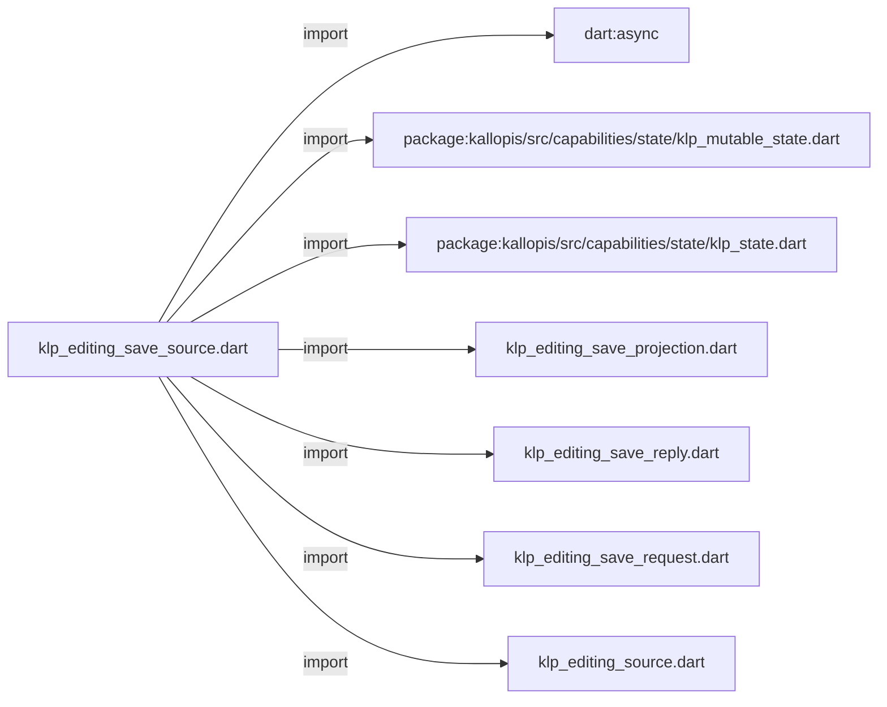
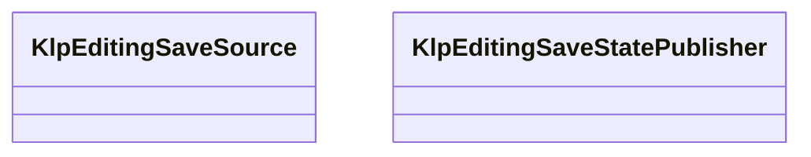
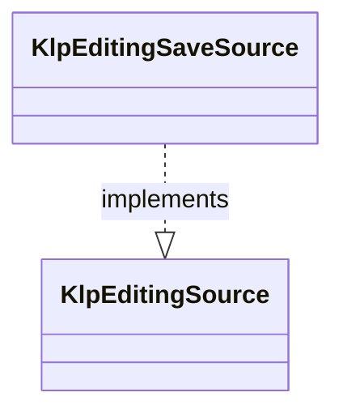

# klp_editing_save_source.dart：直接依賴與宣告架構

[回到目錄](README.md) · [來源檔案](../../../../../../lib/src/capabilities/editing/contracts/klp_editing_save_source.dart)

## 範圍

核心是 `lib/src/capabilities/editing/contracts/klp_editing_save_source.dart`。主要視角為該檔案明寫的 import／export／part；輔助視角為本檔宣告及 extends／implements／with／on 關係。只展開一層外部邊界。

## 直接依賴圖

## 依賴證據

| 關係 | 原始 directive | 來源 |
|---|---|---|
| import | <code>import &#x27;dart:async&#x27;;</code> | [lib/src/capabilities/editing/contracts/klp_editing_save_source.dart:1](../../../../../../lib/src/capabilities/editing/contracts/klp_editing_save_source.dart#L1) |
| import | <code>import &#x27;package:kallopis/src/capabilities/state/klp_mutable_state.dart&#x27;;</code> | [lib/src/capabilities/editing/contracts/klp_editing_save_source.dart:3](../../../../../../lib/src/capabilities/editing/contracts/klp_editing_save_source.dart#L3) |
| import | <code>import &#x27;package:kallopis/src/capabilities/state/klp_state.dart&#x27;;</code> | [lib/src/capabilities/editing/contracts/klp_editing_save_source.dart:4](../../../../../../lib/src/capabilities/editing/contracts/klp_editing_save_source.dart#L4) |
| import | <code>import &#x27;klp_editing_save_projection.dart&#x27;;</code> | [lib/src/capabilities/editing/contracts/klp_editing_save_source.dart:5](../../../../../../lib/src/capabilities/editing/contracts/klp_editing_save_source.dart#L5) |
| import | <code>import &#x27;klp_editing_save_reply.dart&#x27;;</code> | [lib/src/capabilities/editing/contracts/klp_editing_save_source.dart:6](../../../../../../lib/src/capabilities/editing/contracts/klp_editing_save_source.dart#L6) |
| import | <code>import &#x27;klp_editing_save_request.dart&#x27;;</code> | [lib/src/capabilities/editing/contracts/klp_editing_save_source.dart:7](../../../../../../lib/src/capabilities/editing/contracts/klp_editing_save_source.dart#L7) |
| import | <code>import &#x27;klp_editing_source.dart&#x27;;</code> | [lib/src/capabilities/editing/contracts/klp_editing_save_source.dart:8](../../../../../../lib/src/capabilities/editing/contracts/klp_editing_save_source.dart#L8) |

## 宣告關係圖

本組節點是本檔宣告；沒有箭頭的宣告未在此圖主張互相依賴。

## 宣告與成員證據

成員包含 public 與 private；簽章取自來源，省略函式本體與欄位初始值。`(inferred)` 表示來源未明寫型別；建構子只顯示參數部分，不含初始化列表。

### KlpEditingSaveSource

ClassDeclaration · public · [lib/src/capabilities/editing/contracts/klp_editing_save_source.dart:10](../../../../../../lib/src/capabilities/editing/contracts/klp_editing_save_source.dart#L10)

<code>abstract interface class KlpEditingSaveSource implements KlpEditingSource</code>

- `implements` → <code>KlpEditingSource</code>：[lib/src/capabilities/editing/contracts/klp_editing_save_source.dart:10](../../../../../../lib/src/capabilities/editing/contracts/klp_editing_save_source.dart#L10)

| 成員 | 可見性 | 簽章／型別 | 來源註解摘要 | 證據 |
|---|---|---|---|---|
| getter <code>saveState</code> | public | <code>KlpState&lt;KlpEditingSaveProjection&gt; get saveState</code> |  | [lib/src/capabilities/editing/contracts/klp_editing_save_source.dart:11](../../../../../../lib/src/capabilities/editing/contracts/klp_editing_save_source.dart#L11) |
| method <code>issueCommandSequence</code> | public | <code>int issueCommandSequence()</code> |  | [lib/src/capabilities/editing/contracts/klp_editing_save_source.dart:12](../../../../../../lib/src/capabilities/editing/contracts/klp_editing_save_source.dart#L12) |
| method <code>submitSave</code> | public | <code>FutureOr&lt;KlpEditingSaveReply&gt; submitSave(KlpEditingSaveRequest request)</code> |  | [lib/src/capabilities/editing/contracts/klp_editing_save_source.dart:13](../../../../../../lib/src/capabilities/editing/contracts/klp_editing_save_source.dart#L13) |

### KlpEditingSaveStatePublisher

ClassDeclaration · public · [lib/src/capabilities/editing/contracts/klp_editing_save_source.dart:16](../../../../../../lib/src/capabilities/editing/contracts/klp_editing_save_source.dart#L16)

<code>final class KlpEditingSaveStatePublisher</code>

來源註解摘要：提供者持有的單一保存狀態；只接受相同頁面且嚴格前進的 publication。

| 成員 | 可見性 | 簽章／型別 | 來源註解摘要 | 證據 |
|---|---|---|---|---|
| field <code>_state</code> | private | <code>final KlpMutableState&lt;KlpEditingSaveProjection&gt; _state</code> |  | [lib/src/capabilities/editing/contracts/klp_editing_save_source.dart:18](../../../../../../lib/src/capabilities/editing/contracts/klp_editing_save_source.dart#L18) |
| field <code>_closed</code> | private | <code>bool _closed</code> |  | [lib/src/capabilities/editing/contracts/klp_editing_save_source.dart:19](../../../../../../lib/src/capabilities/editing/contracts/klp_editing_save_source.dart#L19) |
| constructor <code>KlpEditingSaveStatePublisher</code> | public | <code>KlpEditingSaveStatePublisher(KlpEditingSaveProjection initial)</code> |  | [lib/src/capabilities/editing/contracts/klp_editing_save_source.dart:21](../../../../../../lib/src/capabilities/editing/contracts/klp_editing_save_source.dart#L21) |
| getter <code>state</code> | public | <code>KlpState&lt;KlpEditingSaveProjection&gt; get state</code> |  | [lib/src/capabilities/editing/contracts/klp_editing_save_source.dart:23](../../../../../../lib/src/capabilities/editing/contracts/klp_editing_save_source.dart#L23) |
| getter <code>value</code> | public | <code>KlpEditingSaveProjection get value</code> |  | [lib/src/capabilities/editing/contracts/klp_editing_save_source.dart:24](../../../../../../lib/src/capabilities/editing/contracts/klp_editing_save_source.dart#L24) |
| method <code>publish</code> | public | <code>void publish(KlpEditingSaveProjection next)</code> |  | [lib/src/capabilities/editing/contracts/klp_editing_save_source.dart:26](../../../../../../lib/src/capabilities/editing/contracts/klp_editing_save_source.dart#L26) |
| method <code>close</code> | public | <code>void close()</code> |  | [lib/src/capabilities/editing/contracts/klp_editing_save_source.dart:42](../../../../../../lib/src/capabilities/editing/contracts/klp_editing_save_source.dart#L42) |

## 閱讀說明與限制

箭頭只表示來源明寫的靜態關係；import 不等於呼叫。未分析動態呼叫、欄位的實際物件擁有權、狀態轉移或渲染流程；型別未進行語意解析，繼承目標保留原始型別拼寫。public／private 依 Dart 名稱前綴判斷；public 宣告不代表已由 `lib/kallopis.dart` 匯出。

本頁由 `tool/architecture_atlas` 產生；編輯來源或生成工具後重新產生，避免手改本頁。
