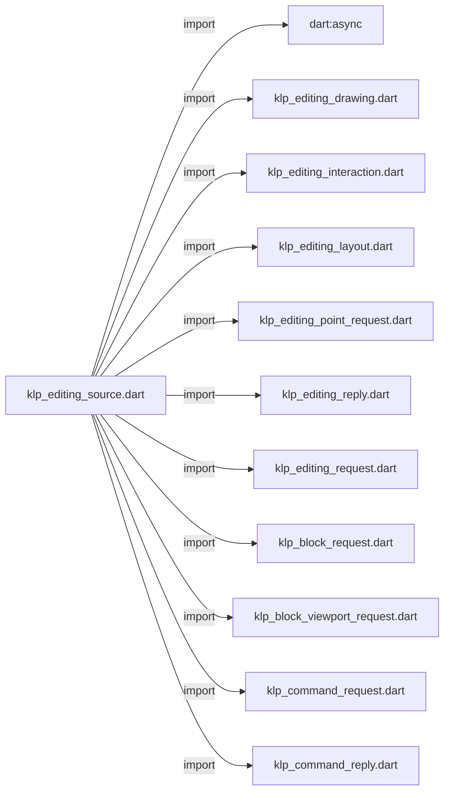
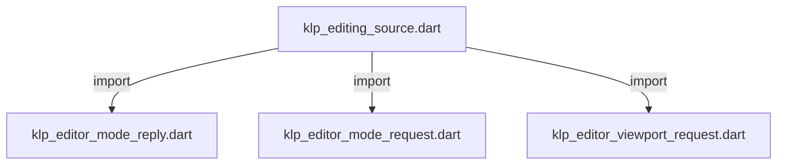
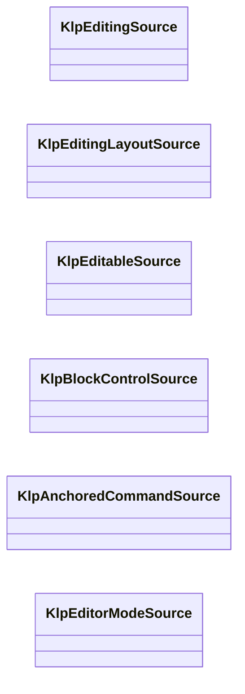
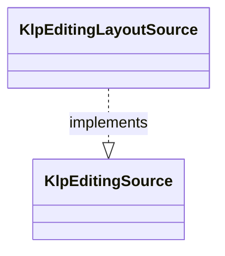
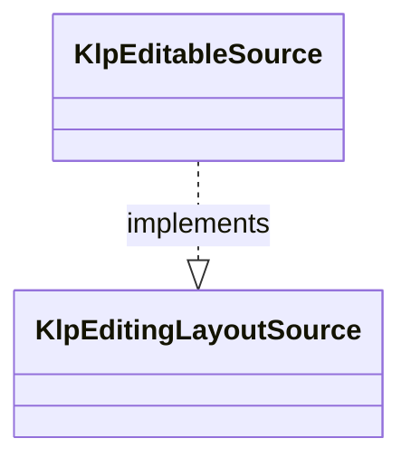
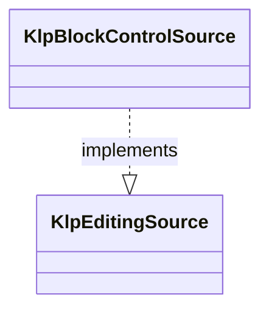
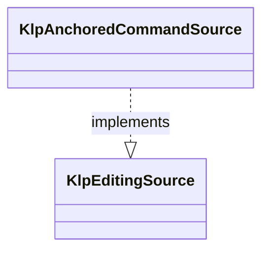
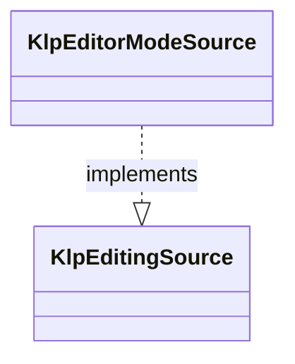

# klp_editing_source.dart：直接依賴與宣告架構

[回到目錄](README.md) · [來源檔案](../../../../../../lib/src/capabilities/editing/contracts/klp_editing_source.dart)

## 範圍

核心是 `lib/src/capabilities/editing/contracts/klp_editing_source.dart`。主要視角為該檔案明寫的 import／export／part；輔助視角為本檔宣告及 extends／implements／with／on 關係。只展開一層外部邊界。

## 直接依賴圖

## 依賴證據

| 關係 | 原始 directive | 來源 |
|---|---|---|
| import | <code>import &#x27;dart:async&#x27;;</code> | [lib/src/capabilities/editing/contracts/klp_editing_source.dart:1](../../../../../../lib/src/capabilities/editing/contracts/klp_editing_source.dart#L1) |
| import | <code>import &#x27;klp_editing_drawing.dart&#x27;;</code> | [lib/src/capabilities/editing/contracts/klp_editing_source.dart:3](../../../../../../lib/src/capabilities/editing/contracts/klp_editing_source.dart#L3) |
| import | <code>import &#x27;klp_editing_interaction.dart&#x27;;</code> | [lib/src/capabilities/editing/contracts/klp_editing_source.dart:4](../../../../../../lib/src/capabilities/editing/contracts/klp_editing_source.dart#L4) |
| import | <code>import &#x27;klp_editing_layout.dart&#x27;;</code> | [lib/src/capabilities/editing/contracts/klp_editing_source.dart:5](../../../../../../lib/src/capabilities/editing/contracts/klp_editing_source.dart#L5) |
| import | <code>import &#x27;klp_editing_point_request.dart&#x27;;</code> | [lib/src/capabilities/editing/contracts/klp_editing_source.dart:6](../../../../../../lib/src/capabilities/editing/contracts/klp_editing_source.dart#L6) |
| import | <code>import &#x27;klp_editing_reply.dart&#x27;;</code> | [lib/src/capabilities/editing/contracts/klp_editing_source.dart:7](../../../../../../lib/src/capabilities/editing/contracts/klp_editing_source.dart#L7) |
| import | <code>import &#x27;klp_editing_request.dart&#x27;;</code> | [lib/src/capabilities/editing/contracts/klp_editing_source.dart:8](../../../../../../lib/src/capabilities/editing/contracts/klp_editing_source.dart#L8) |
| import | <code>import &#x27;klp_block_request.dart&#x27;;</code> | [lib/src/capabilities/editing/contracts/klp_editing_source.dart:9](../../../../../../lib/src/capabilities/editing/contracts/klp_editing_source.dart#L9) |
| import | <code>import &#x27;klp_block_viewport_request.dart&#x27;;</code> | [lib/src/capabilities/editing/contracts/klp_editing_source.dart:10](../../../../../../lib/src/capabilities/editing/contracts/klp_editing_source.dart#L10) |
| import | <code>import &#x27;klp_command_request.dart&#x27;;</code> | [lib/src/capabilities/editing/contracts/klp_editing_source.dart:11](../../../../../../lib/src/capabilities/editing/contracts/klp_editing_source.dart#L11) |
| import | <code>import &#x27;klp_command_reply.dart&#x27;;</code> | [lib/src/capabilities/editing/contracts/klp_editing_source.dart:12](../../../../../../lib/src/capabilities/editing/contracts/klp_editing_source.dart#L12) |
| import | <code>import &#x27;klp_editor_mode_reply.dart&#x27;;</code> | [lib/src/capabilities/editing/contracts/klp_editing_source.dart:13](../../../../../../lib/src/capabilities/editing/contracts/klp_editing_source.dart#L13) |
| import | <code>import &#x27;klp_editor_mode_request.dart&#x27;;</code> | [lib/src/capabilities/editing/contracts/klp_editing_source.dart:14](../../../../../../lib/src/capabilities/editing/contracts/klp_editing_source.dart#L14) |
| import | <code>import &#x27;klp_editor_viewport_request.dart&#x27;;</code> | [lib/src/capabilities/editing/contracts/klp_editing_source.dart:15](../../../../../../lib/src/capabilities/editing/contracts/klp_editing_source.dart#L15) |

## 宣告關係圖

本組節點是本檔宣告；沒有箭頭的宣告未在此圖主張互相依賴。

## 宣告與成員證據

成員包含 public 與 private；簽章取自來源，省略函式本體與欄位初始值。`(inferred)` 表示來源未明寫型別；建構子只顯示參數部分，不含初始化列表。

### KlpEditingSource

ClassDeclaration · public · [lib/src/capabilities/editing/contracts/klp_editing_source.dart:17](../../../../../../lib/src/capabilities/editing/contracts/klp_editing_source.dart#L17)

<code>abstract interface class KlpEditingSource</code>

來源註解摘要：提供者擁有的編輯快照來源；安裝端只借用目前值與非同步廣播。 [drawings] 必須是非同步 broadcast stream。每個事件必須已成為 [drawing] 的目前值，且同一 stamp 重播時必須沿用同一個不可變 [KlpEditingDrawing]。 基礎 provider 快照／廣播合約持續保留；KLP-0020 不將保存或手寫等共用用途整體棄用。

| 成員 | 可見性 | 簽章／型別 | 來源註解摘要 | 證據 |
|---|---|---|---|---|
| getter <code>drawing</code> | public | <code>KlpEditingDrawing get drawing</code> |  | [lib/src/capabilities/editing/contracts/klp_editing_source.dart:23](../../../../../../lib/src/capabilities/editing/contracts/klp_editing_source.dart#L23) |
| getter <code>drawings</code> | public | <code>Stream&lt;KlpEditingDrawing&gt; get drawings</code> |  | [lib/src/capabilities/editing/contracts/klp_editing_source.dart:24](../../../../../../lib/src/capabilities/editing/contracts/klp_editing_source.dart#L24) |

### KlpEditingLayoutSource

ClassDeclaration · public · [lib/src/capabilities/editing/contracts/klp_editing_source.dart:27](../../../../../../lib/src/capabilities/editing/contracts/klp_editing_source.dart#L27)

<code>abstract interface class KlpEditingLayoutSource implements KlpEditingSource</code>

來源註解摘要：可重排來源由 Kallopis 提供完整 layout/style；唯讀資料也可實作此能力。 此 layout 通道只維護舊正文相容與回退；新 BlockNote 的排版由上游引擎掌管。

- `implements` → <code>KlpEditingSource</code>：[lib/src/capabilities/editing/contracts/klp_editing_source.dart:29](../../../../../../lib/src/capabilities/editing/contracts/klp_editing_source.dart#L29)

| 成員 | 可見性 | 簽章／型別 | 來源註解摘要 | 證據 |
|---|---|---|---|---|
| method <code>layout</code> | public | <code>KlpEditingDrawing layout(KlpEditingLayout layout)</code> |  | [lib/src/capabilities/editing/contracts/klp_editing_source.dart:30](../../../../../../lib/src/capabilities/editing/contracts/klp_editing_source.dart#L30) |

### KlpEditableSource

ClassDeclaration · public · [lib/src/capabilities/editing/contracts/klp_editing_source.dart:33](../../../../../../lib/src/capabilities/editing/contracts/klp_editing_source.dart#L33)

<code>abstract interface class KlpEditableSource implements KlpEditingLayoutSource</code>

來源註解摘要：可編輯來源另外接受 typed 命令並綁定單一平台輸入 host。 文字、IME 與 hit testing 操作限舊正文相容；新 BlockNote 不經此通道建立第二交易或 undo 權威。

- `implements` → <code>KlpEditingLayoutSource</code>：[lib/src/capabilities/editing/contracts/klp_editing_source.dart:35](../../../../../../lib/src/capabilities/editing/contracts/klp_editing_source.dart#L35)

| 成員 | 可見性 | 簽章／型別 | 來源註解摘要 | 證據 |
|---|---|---|---|---|
| method <code>issueCommandSequence</code> | public | <code>int issueCommandSequence()</code> |  | [lib/src/capabilities/editing/contracts/klp_editing_source.dart:36](../../../../../../lib/src/capabilities/editing/contracts/klp_editing_source.dart#L36) |
| method <code>submit</code> | public | <code>FutureOr&lt;KlpEditingReply&gt; submit(KlpEditingRequest request, {required int committedAtMs})</code> |  | [lib/src/capabilities/editing/contracts/klp_editing_source.dart:37](../../../../../../lib/src/capabilities/editing/contracts/klp_editing_source.dart#L37) |
| method <code>selectPoint</code> | public | <code>FutureOr&lt;KlpEditingReply&gt; selectPoint(KlpEditingPointRequest request)</code> |  | [lib/src/capabilities/editing/contracts/klp_editing_source.dart:38](../../../../../../lib/src/capabilities/editing/contracts/klp_editing_source.dart#L38) |
| method <code>bindInteraction</code> | public | <code>KlpEditingInteractionBinding bindInteraction(KlpEditingInteraction interaction)</code> |  | [lib/src/capabilities/editing/contracts/klp_editing_source.dart:39](../../../../../../lib/src/capabilities/editing/contracts/klp_editing_source.dart#L39) |

### KlpBlockControlSource

ClassDeclaration · public · [lib/src/capabilities/editing/contracts/klp_editing_source.dart:42](../../../../../../lib/src/capabilities/editing/contracts/klp_editing_source.dart#L42)

<code>abstract interface class KlpBlockControlSource implements KlpEditingSource</code>

來源註解摘要：同一編輯來源可選擇提供 K02 區塊控制；命令不得另行注入來源。 區塊、清單與 undo 操作限舊正文相容；不向新 BlockNote 回放本合約的正文操作。

- `implements` → <code>KlpEditingSource</code>：[lib/src/capabilities/editing/contracts/klp_editing_source.dart:44](../../../../../../lib/src/capabilities/editing/contracts/klp_editing_source.dart#L44)

| 成員 | 可見性 | 簽章／型別 | 來源註解摘要 | 證據 |
|---|---|---|---|---|
| method <code>issueCommandSequence</code> | public | <code>int issueCommandSequence()</code> |  | [lib/src/capabilities/editing/contracts/klp_editing_source.dart:45](../../../../../../lib/src/capabilities/editing/contracts/klp_editing_source.dart#L45) |
| method <code>submitBlock</code> | public | <code>FutureOr&lt;KlpEditingReply&gt; submitBlock(KlpBlockRequest request, {required int committedAtMs})</code> |  | [lib/src/capabilities/editing/contracts/klp_editing_source.dart:46](../../../../../../lib/src/capabilities/editing/contracts/klp_editing_source.dart#L46) |
| method <code>submitBlockViewport</code> | public | <code>FutureOr&lt;KlpEditingReply&gt; submitBlockViewport(KlpBlockViewportRequest request, {required int committedAtMs})</code> |  | [lib/src/capabilities/editing/contracts/klp_editing_source.dart:47](../../../../../../lib/src/capabilities/editing/contracts/klp_editing_source.dart#L47) |

### KlpAnchoredCommandSource

ClassDeclaration · public · [lib/src/capabilities/editing/contracts/klp_editing_source.dart:50](../../../../../../lib/src/capabilities/editing/contracts/klp_editing_source.dart#L50)

<code>abstract interface class KlpAnchoredCommandSource implements KlpEditingSource</code>

來源註解摘要：同一 editor source 可選擇提供 K03 候選與原子確認能力。 保留共用候選命令與定位資料；舊正文 caret／block 操作用途仍受相容界線約束。

- `implements` → <code>KlpEditingSource</code>：[lib/src/capabilities/editing/contracts/klp_editing_source.dart:52](../../../../../../lib/src/capabilities/editing/contracts/klp_editing_source.dart#L52)

| 成員 | 可見性 | 簽章／型別 | 來源註解摘要 | 證據 |
|---|---|---|---|---|
| method <code>issueCommandSequence</code> | public | <code>int issueCommandSequence()</code> |  | [lib/src/capabilities/editing/contracts/klp_editing_source.dart:53](../../../../../../lib/src/capabilities/editing/contracts/klp_editing_source.dart#L53) |
| method <code>submitAnchoredCommand</code> | public | <code>FutureOr&lt;KlpCommandReply&gt; submitAnchoredCommand(KlpCommandRequest request, {required int committedAtMs})</code> |  | [lib/src/capabilities/editing/contracts/klp_editing_source.dart:54](../../../../../../lib/src/capabilities/editing/contracts/klp_editing_source.dart#L54) |

### KlpEditorModeSource

ClassDeclaration · public · [lib/src/capabilities/editing/contracts/klp_editing_source.dart:57](../../../../../../lib/src/capabilities/editing/contracts/klp_editing_source.dart#L57)

<code>abstract interface class KlpEditorModeSource implements KlpEditingSource</code>

來源註解摘要：同一 editor source 可選擇提供 K04 模式、工具與 viewport 能力。 保留現有模式與手寫通道合約；不在此決定未定案的手寫正文整合或 Spatial 引擎。

- `implements` → <code>KlpEditingSource</code>：[lib/src/capabilities/editing/contracts/klp_editing_source.dart:59](../../../../../../lib/src/capabilities/editing/contracts/klp_editing_source.dart#L59)

| 成員 | 可見性 | 簽章／型別 | 來源註解摘要 | 證據 |
|---|---|---|---|---|
| method <code>issueCommandSequence</code> | public | <code>int issueCommandSequence()</code> |  | [lib/src/capabilities/editing/contracts/klp_editing_source.dart:60](../../../../../../lib/src/capabilities/editing/contracts/klp_editing_source.dart#L60) |
| method <code>submitEditorMode</code> | public | <code>FutureOr&lt;KlpEditorModeReply&gt; submitEditorMode(KlpEditorModeRequest request, {required int committedAtMs})</code> |  | [lib/src/capabilities/editing/contracts/klp_editing_source.dart:61](../../../../../../lib/src/capabilities/editing/contracts/klp_editing_source.dart#L61) |
| method <code>submitEditorViewport</code> | public | <code>FutureOr&lt;KlpEditorModeReply&gt; submitEditorViewport(KlpEditorViewportRequest request, {required int committedAtMs})</code> |  | [lib/src/capabilities/editing/contracts/klp_editing_source.dart:62](../../../../../../lib/src/capabilities/editing/contracts/klp_editing_source.dart#L62) |

## 閱讀說明與限制

箭頭只表示來源明寫的靜態關係；import 不等於呼叫。未分析動態呼叫、欄位的實際物件擁有權、狀態轉移或渲染流程；型別未進行語意解析，繼承目標保留原始型別拼寫。public／private 依 Dart 名稱前綴判斷；public 宣告不代表已由 `lib/kallopis.dart` 匯出。

本頁由 `tool/architecture_atlas` 產生；編輯來源或生成工具後重新產生，避免手改本頁。
