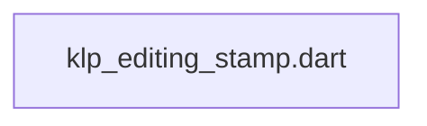
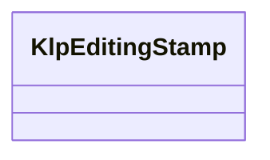

# klp_editing_stamp.dart：直接依賴與宣告架構

[回到目錄](README.md) · [來源檔案](../../../../../../lib/src/capabilities/editing/contracts/klp_editing_stamp.dart)

## 範圍

核心是 `lib/src/capabilities/editing/contracts/klp_editing_stamp.dart`。主要視角為該檔案明寫的 import／export／part；輔助視角為本檔宣告及 extends／implements／with／on 關係。只展開一層外部邊界。

## 直接依賴圖

## 依賴證據

| 關係 | 原始 directive | 來源 |
|---|---|---|
| 無 | 本檔未宣告 import／export／part | [lib/src/capabilities/editing/contracts/klp_editing_stamp.dart:1](../../../../../../lib/src/capabilities/editing/contracts/klp_editing_stamp.dart#L1) |

## 宣告關係圖

本組節點是本檔宣告；沒有箭頭的宣告未在此圖主張互相依賴。

## 宣告與成員證據

成員包含 public 與 private；簽章取自來源，省略函式本體與欄位初始值。`(inferred)` 表示來源未明寫型別；建構子只顯示參數部分，不含初始化列表。

### KlpEditingStamp

ClassDeclaration · public · [lib/src/capabilities/editing/contracts/klp_editing_stamp.dart:1](../../../../../../lib/src/capabilities/editing/contracts/klp_editing_stamp.dart#L1)

<code>final class KlpEditingStamp</code>

來源註解摘要：編輯投影的完整身分；內容未提交時，組字與選取仍可發布新投影。

| 成員 | 可見性 | 簽章／型別 | 來源註解摘要 | 證據 |
|---|---|---|---|---|
| field <code>documentId</code> | public | <code>final String documentId</code> |  | [lib/src/capabilities/editing/contracts/klp_editing_stamp.dart:4](../../../../../../lib/src/capabilities/editing/contracts/klp_editing_stamp.dart#L4) |
| field <code>pageId</code> | public | <code>final String pageId</code> |  | [lib/src/capabilities/editing/contracts/klp_editing_stamp.dart:5](../../../../../../lib/src/capabilities/editing/contracts/klp_editing_stamp.dart#L5) |
| field <code>generation</code> | public | <code>final int generation</code> |  | [lib/src/capabilities/editing/contracts/klp_editing_stamp.dart:6](../../../../../../lib/src/capabilities/editing/contracts/klp_editing_stamp.dart#L6) |
| field <code>projectionRevision</code> | public | <code>final int projectionRevision</code> |  | [lib/src/capabilities/editing/contracts/klp_editing_stamp.dart:7](../../../../../../lib/src/capabilities/editing/contracts/klp_editing_stamp.dart#L7) |
| field <code>contentRevision</code> | public | <code>final int contentRevision</code> |  | [lib/src/capabilities/editing/contracts/klp_editing_stamp.dart:8](../../../../../../lib/src/capabilities/editing/contracts/klp_editing_stamp.dart#L8) |
| field <code>compositionRevision</code> | public | <code>final int compositionRevision</code> |  | [lib/src/capabilities/editing/contracts/klp_editing_stamp.dart:9](../../../../../../lib/src/capabilities/editing/contracts/klp_editing_stamp.dart#L9) |
| field <code>layoutRevision</code> | public | <code>final int layoutRevision</code> |  | [lib/src/capabilities/editing/contracts/klp_editing_stamp.dart:10](../../../../../../lib/src/capabilities/editing/contracts/klp_editing_stamp.dart#L10) |
| field <code>environmentId</code> | public | <code>final String environmentId</code> |  | [lib/src/capabilities/editing/contracts/klp_editing_stamp.dart:11](../../../../../../lib/src/capabilities/editing/contracts/klp_editing_stamp.dart#L11) |
| constructor <code>KlpEditingStamp</code> | public | <code>KlpEditingStamp({ required this.documentId, required this.pageId, required this.generation, required this.projectionRevision, required this.contentRevision, required this.compositionRevision, required this.layoutRevision, required this.environmentId, })</code> |  | [lib/src/capabilities/editing/contracts/klp_editing_stamp.dart:13](../../../../../../lib/src/capabilities/editing/contracts/klp_editing_stamp.dart#L13) |
| method <code>sameSession</code> | public | <code>bool sameSession(KlpEditingStamp other)</code> |  | [lib/src/capabilities/editing/contracts/klp_editing_stamp.dart:31](../../../../../../lib/src/capabilities/editing/contracts/klp_editing_stamp.dart#L31) |
| method <code>requireExact</code> | public | <code>void requireExact(KlpEditingStamp expected)</code> |  | [lib/src/capabilities/editing/contracts/klp_editing_stamp.dart:33](../../../../../../lib/src/capabilities/editing/contracts/klp_editing_stamp.dart#L33) |
| method <code>==</code> | public | <code>bool operator ==(Object other)</code> |  | [lib/src/capabilities/editing/contracts/klp_editing_stamp.dart:37](../../../../../../lib/src/capabilities/editing/contracts/klp_editing_stamp.dart#L37) |
| getter <code>hashCode</code> | public | <code>int get hashCode</code> |  | [lib/src/capabilities/editing/contracts/klp_editing_stamp.dart:46](../../../../../../lib/src/capabilities/editing/contracts/klp_editing_stamp.dart#L46) |

## 閱讀說明與限制

箭頭只表示來源明寫的靜態關係；import 不等於呼叫。未分析動態呼叫、欄位的實際物件擁有權、狀態轉移或渲染流程；型別未進行語意解析，繼承目標保留原始型別拼寫。public／private 依 Dart 名稱前綴判斷；public 宣告不代表已由 `lib/kallopis.dart` 匯出。

本頁由 `tool/architecture_atlas` 產生；編輯來源或生成工具後重新產生，避免手改本頁。
