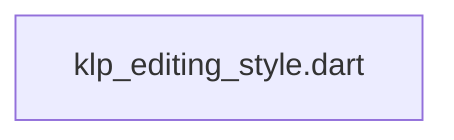
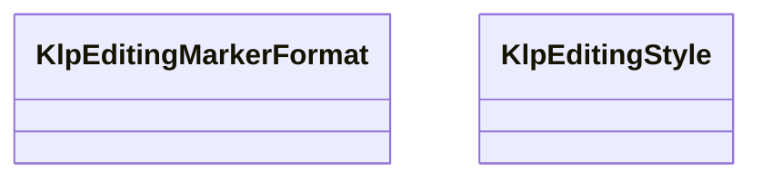

# klp_editing_style.dart：直接依賴與宣告架構

[回到目錄](README.md) · [來源檔案](../../../../../../lib/src/capabilities/editing/contracts/klp_editing_style.dart)

## 範圍

核心是 `lib/src/capabilities/editing/contracts/klp_editing_style.dart`。主要視角為該檔案明寫的 import／export／part；輔助視角為本檔宣告及 extends／implements／with／on 關係。只展開一層外部邊界。

## 直接依賴圖

## 依賴證據

| 關係 | 原始 directive | 來源 |
|---|---|---|
| 無 | 本檔未宣告 import／export／part | [lib/src/capabilities/editing/contracts/klp_editing_style.dart:1](../../../../../../lib/src/capabilities/editing/contracts/klp_editing_style.dart#L1) |

## 宣告關係圖

本組節點是本檔宣告；沒有箭頭的宣告未在此圖主張互相依賴。

## 宣告與成員證據

成員包含 public 與 private；簽章取自來源，省略函式本體與欄位初始值。`(inferred)` 表示來源未明寫型別；建構子只顯示參數部分，不含初始化列表。

### KlpEditingMarkerFormat

EnumDeclaration · public · [lib/src/capabilities/editing/contracts/klp_editing_style.dart:1](../../../../../../lib/src/capabilities/editing/contracts/klp_editing_style.dart#L1)

<code>enum KlpEditingMarkerFormat</code>

來源註解摘要：舊正文標記的呈現格式；不在 Kallopis 建立清單資料權威。

| 成員 | 可見性 | 簽章／型別 | 來源註解摘要 | 證據 |
|---|---|---|---|---|
| enum value <code>bulletAndDecimal</code> | public | <code>bulletAndDecimal</code> |  | [lib/src/capabilities/editing/contracts/klp_editing_style.dart:2](../../../../../../lib/src/capabilities/editing/contracts/klp_editing_style.dart#L2) |

### KlpEditingStyle

ClassDeclaration · public · [lib/src/capabilities/editing/contracts/klp_editing_style.dart:4](../../../../../../lib/src/capabilities/editing/contracts/klp_editing_style.dart#L4)

<code>final class KlpEditingStyle</code>

來源註解摘要：Kallopis 已完整解析的核心排版值；提供者只能核對支援能力後整套採用。

| 成員 | 可見性 | 簽章／型別 | 來源註解摘要 | 證據 |
|---|---|---|---|---|
| field <code>fontFamily</code> | public | <code>final String fontFamily</code> |  | [lib/src/capabilities/editing/contracts/klp_editing_style.dart:6](../../../../../../lib/src/capabilities/editing/contracts/klp_editing_style.dart#L6) |
| field <code>fontFallbacks</code> | public | <code>final List&lt;String&gt; fontFallbacks</code> |  | [lib/src/capabilities/editing/contracts/klp_editing_style.dart:7](../../../../../../lib/src/capabilities/editing/contracts/klp_editing_style.dart#L7) |
| field <code>fontWeight</code> | public | <code>final int fontWeight</code> |  | [lib/src/capabilities/editing/contracts/klp_editing_style.dart:8](../../../../../../lib/src/capabilities/editing/contracts/klp_editing_style.dart#L8) |
| field <code>fontSize</code> | public | <code>final double fontSize</code> |  | [lib/src/capabilities/editing/contracts/klp_editing_style.dart:9](../../../../../../lib/src/capabilities/editing/contracts/klp_editing_style.dart#L9) |
| field <code>lineHeight</code> | public | <code>final double lineHeight</code> |  | [lib/src/capabilities/editing/contracts/klp_editing_style.dart:10](../../../../../../lib/src/capabilities/editing/contracts/klp_editing_style.dart#L10) |
| field <code>letterSpacing</code> | public | <code>final double letterSpacing</code> |  | [lib/src/capabilities/editing/contracts/klp_editing_style.dart:11](../../../../../../lib/src/capabilities/editing/contracts/klp_editing_style.dart#L11) |
| field <code>horizontalPadding</code> | public | <code>final double horizontalPadding</code> |  | [lib/src/capabilities/editing/contracts/klp_editing_style.dart:12](../../../../../../lib/src/capabilities/editing/contracts/klp_editing_style.dart#L12) |
| field <code>verticalPadding</code> | public | <code>final double verticalPadding</code> |  | [lib/src/capabilities/editing/contracts/klp_editing_style.dart:13](../../../../../../lib/src/capabilities/editing/contracts/klp_editing_style.dart#L13) |
| field <code>blockSpacing</code> | public | <code>final double blockSpacing</code> |  | [lib/src/capabilities/editing/contracts/klp_editing_style.dart:14](../../../../../../lib/src/capabilities/editing/contracts/klp_editing_style.dart#L14) |
| field <code>overscan</code> | public | <code>final double overscan</code> |  | [lib/src/capabilities/editing/contracts/klp_editing_style.dart:15](../../../../../../lib/src/capabilities/editing/contracts/klp_editing_style.dart#L15) |
| field <code>textRgba</code> | public | <code>final int textRgba</code> |  | [lib/src/capabilities/editing/contracts/klp_editing_style.dart:16](../../../../../../lib/src/capabilities/editing/contracts/klp_editing_style.dart#L16) |
| field <code>inkRgba</code> | public | <code>final int inkRgba</code> |  | [lib/src/capabilities/editing/contracts/klp_editing_style.dart:17](../../../../../../lib/src/capabilities/editing/contracts/klp_editing_style.dart#L17) |
| field <code>caretRgba</code> | public | <code>final int caretRgba</code> |  | [lib/src/capabilities/editing/contracts/klp_editing_style.dart:18](../../../../../../lib/src/capabilities/editing/contracts/klp_editing_style.dart#L18) |
| field <code>listIndent</code> | public | <code>final double listIndent</code> |  | [lib/src/capabilities/editing/contracts/klp_editing_style.dart:19](../../../../../../lib/src/capabilities/editing/contracts/klp_editing_style.dart#L19) |
| field <code>markerGap</code> | public | <code>final double markerGap</code> |  | [lib/src/capabilities/editing/contracts/klp_editing_style.dart:20](../../../../../../lib/src/capabilities/editing/contracts/klp_editing_style.dart#L20) |
| field <code>minimumBodyEm</code> | public | <code>final double minimumBodyEm</code> |  | [lib/src/capabilities/editing/contracts/klp_editing_style.dart:21](../../../../../../lib/src/capabilities/editing/contracts/klp_editing_style.dart#L21) |
| field <code>markerRgba</code> | public | <code>final int markerRgba</code> |  | [lib/src/capabilities/editing/contracts/klp_editing_style.dart:22](../../../../../../lib/src/capabilities/editing/contracts/klp_editing_style.dart#L22) |
| field <code>markerFormat</code> | public | <code>final KlpEditingMarkerFormat markerFormat</code> |  | [lib/src/capabilities/editing/contracts/klp_editing_style.dart:23](../../../../../../lib/src/capabilities/editing/contracts/klp_editing_style.dart#L23) |
| constructor <code>KlpEditingStyle</code> | public | <code>KlpEditingStyle({ required this.fontFamily, Iterable&lt;String&gt; fontFallbacks = const [], required this.fontWeight, required this.fontSize, required this.lineHeight, required this.letterSpacing, required this.horizontalPadding, required this.verticalPadding, required this.blockSpacing, required this.overscan, required this.textRgba, required this.inkRgba, required this.caretRgba, required this.listIndent, required this.markerGap, required this.minimumBodyEm, required this.markerRgba, required this.markerFormat, })</code> |  | [lib/src/capabilities/editing/contracts/klp_editing_style.dart:25](../../../../../../lib/src/capabilities/editing/contracts/klp_editing_style.dart#L25) |
| method <code>==</code> | public | <code>bool operator ==(Object other)</code> |  | [lib/src/capabilities/editing/contracts/klp_editing_style.dart:55](../../../../../../lib/src/capabilities/editing/contracts/klp_editing_style.dart#L55) |
| getter <code>hashCode</code> | public | <code>int get hashCode</code> |  | [lib/src/capabilities/editing/contracts/klp_editing_style.dart:64](../../../../../../lib/src/capabilities/editing/contracts/klp_editing_style.dart#L64) |
| method <code>_sameList</code> | private | <code>bool _sameList(List&lt;String&gt; left, List&lt;String&gt; right)</code> |  | [lib/src/capabilities/editing/contracts/klp_editing_style.dart:67](../../../../../../lib/src/capabilities/editing/contracts/klp_editing_style.dart#L67) |

## 閱讀說明與限制

箭頭只表示來源明寫的靜態關係；import 不等於呼叫。未分析動態呼叫、欄位的實際物件擁有權、狀態轉移或渲染流程；型別未進行語意解析，繼承目標保留原始型別拼寫。public／private 依 Dart 名稱前綴判斷；public 宣告不代表已由 `lib/kallopis.dart` 匯出。

本頁由 `tool/architecture_atlas` 產生；編輯來源或生成工具後重新產生，避免手改本頁。
