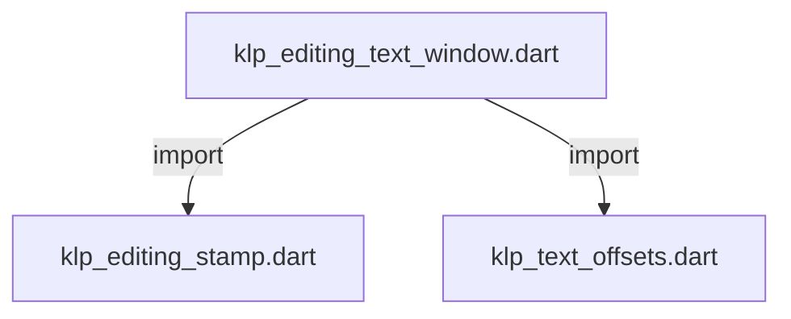
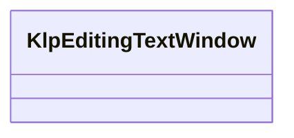

# klp_editing_text_window.dart：直接依賴與宣告架構

[回到目錄](README.md) · [來源檔案](../../../../../../lib/src/capabilities/editing/contracts/klp_editing_text_window.dart)

## 範圍

核心是 `lib/src/capabilities/editing/contracts/klp_editing_text_window.dart`。主要視角為該檔案明寫的 import／export／part；輔助視角為本檔宣告及 extends／implements／with／on 關係。只展開一層外部邊界。

## 直接依賴圖

## 依賴證據

| 關係 | 原始 directive | 來源 |
|---|---|---|
| import | <code>import &#x27;klp_editing_stamp.dart&#x27;;</code> | [lib/src/capabilities/editing/contracts/klp_editing_text_window.dart:1](../../../../../../lib/src/capabilities/editing/contracts/klp_editing_text_window.dart#L1) |
| import | <code>import &#x27;klp_text_offsets.dart&#x27;;</code> | [lib/src/capabilities/editing/contracts/klp_editing_text_window.dart:2](../../../../../../lib/src/capabilities/editing/contracts/klp_editing_text_window.dart#L2) |

## 宣告關係圖

本組節點是本檔宣告；沒有箭頭的宣告未在此圖主張互相依賴。

## 宣告與成員證據

成員包含 public 與 private；簽章取自來源，省略函式本體與欄位初始值。`(inferred)` 表示來源未明寫型別；建構子只顯示參數部分，不含初始化列表。

### KlpEditingTextWindow

ClassDeclaration · public · [lib/src/capabilities/editing/contracts/klp_editing_text_window.dart:4](../../../../../../lib/src/capabilities/editing/contracts/klp_editing_text_window.dart#L4)

<code>final class KlpEditingTextWindow</code>

來源註解摘要：權威發布的單一區塊輸入視窗；位移均相對此文字，以 UTF-8 byte 表示。 此物件只驗證與轉接，不取得文件、字素選取或組字交易的所有權。 來源座標屬於此版本的投影文字，包含組字預覽時不可當成已提交文件座標。

| 成員 | 可見性 | 簽章／型別 | 來源註解摘要 | 證據 |
|---|---|---|---|---|
| field <code>stamp</code> | public | <code>final KlpEditingStamp stamp</code> |  | [lib/src/capabilities/editing/contracts/klp_editing_text_window.dart:9](../../../../../../lib/src/capabilities/editing/contracts/klp_editing_text_window.dart#L9) |
| field <code>blockId</code> | public | <code>final String blockId</code> |  | [lib/src/capabilities/editing/contracts/klp_editing_text_window.dart:10](../../../../../../lib/src/capabilities/editing/contracts/klp_editing_text_window.dart#L10) |
| field <code>sourceStartUtf8</code> | public | <code>final int sourceStartUtf8</code> |  | [lib/src/capabilities/editing/contracts/klp_editing_text_window.dart:11](../../../../../../lib/src/capabilities/editing/contracts/klp_editing_text_window.dart#L11) |
| field <code>offsets</code> | public | <code>final KlpTextOffsets offsets</code> |  | [lib/src/capabilities/editing/contracts/klp_editing_text_window.dart:12](../../../../../../lib/src/capabilities/editing/contracts/klp_editing_text_window.dart#L12) |
| field <code>anchorUtf8</code> | public | <code>final int? anchorUtf8</code> |  | [lib/src/capabilities/editing/contracts/klp_editing_text_window.dart:13](../../../../../../lib/src/capabilities/editing/contracts/klp_editing_text_window.dart#L13) |
| field <code>focusUtf8</code> | public | <code>final int? focusUtf8</code> |  | [lib/src/capabilities/editing/contracts/klp_editing_text_window.dart:14](../../../../../../lib/src/capabilities/editing/contracts/klp_editing_text_window.dart#L14) |
| field <code>composingStartUtf8</code> | public | <code>final int? composingStartUtf8</code> |  | [lib/src/capabilities/editing/contracts/klp_editing_text_window.dart:15](../../../../../../lib/src/capabilities/editing/contracts/klp_editing_text_window.dart#L15) |
| field <code>composingEndUtf8</code> | public | <code>final int? composingEndUtf8</code> |  | [lib/src/capabilities/editing/contracts/klp_editing_text_window.dart:16](../../../../../../lib/src/capabilities/editing/contracts/klp_editing_text_window.dart#L16) |
| constructor <code>KlpEditingTextWindow</code> | public | <code>KlpEditingTextWindow({ required this.stamp, required this.blockId, required this.sourceStartUtf8, required String text, this.anchorUtf8, this.focusUtf8, this.composingStartUtf8, this.composingEndUtf8, })</code> |  | [lib/src/capabilities/editing/contracts/klp_editing_text_window.dart:18](../../../../../../lib/src/capabilities/editing/contracts/klp_editing_text_window.dart#L18) |
| getter <code>text</code> | public | <code>String get text</code> |  | [lib/src/capabilities/editing/contracts/klp_editing_text_window.dart:43](../../../../../../lib/src/capabilities/editing/contracts/klp_editing_text_window.dart#L43) |
| getter <code>anchorUtf16</code> | public | <code>int? get anchorUtf16</code> |  | [lib/src/capabilities/editing/contracts/klp_editing_text_window.dart:44](../../../../../../lib/src/capabilities/editing/contracts/klp_editing_text_window.dart#L44) |
| getter <code>focusUtf16</code> | public | <code>int? get focusUtf16</code> |  | [lib/src/capabilities/editing/contracts/klp_editing_text_window.dart:45](../../../../../../lib/src/capabilities/editing/contracts/klp_editing_text_window.dart#L45) |
| getter <code>composingStartUtf16</code> | public | <code>int? get composingStartUtf16</code> |  | [lib/src/capabilities/editing/contracts/klp_editing_text_window.dart:46](../../../../../../lib/src/capabilities/editing/contracts/klp_editing_text_window.dart#L46) |
| getter <code>composingEndUtf16</code> | public | <code>int? get composingEndUtf16</code> |  | [lib/src/capabilities/editing/contracts/klp_editing_text_window.dart:47](../../../../../../lib/src/capabilities/editing/contracts/klp_editing_text_window.dart#L47) |
| method <code>toSourceUtf8</code> | public | <code>int toSourceUtf8(int localUtf16, KlpEditingStamp expected)</code> |  | [lib/src/capabilities/editing/contracts/klp_editing_text_window.dart:49](../../../../../../lib/src/capabilities/editing/contracts/klp_editing_text_window.dart#L49) |
| method <code>toLocalUtf16</code> | public | <code>int toLocalUtf16(int sourceUtf8, KlpEditingStamp expected)</code> |  | [lib/src/capabilities/editing/contracts/klp_editing_text_window.dart:54](../../../../../../lib/src/capabilities/editing/contracts/klp_editing_text_window.dart#L54) |

## 閱讀說明與限制

箭頭只表示來源明寫的靜態關係；import 不等於呼叫。未分析動態呼叫、欄位的實際物件擁有權、狀態轉移或渲染流程；型別未進行語意解析，繼承目標保留原始型別拼寫。public／private 依 Dart 名稱前綴判斷；public 宣告不代表已由 `lib/kallopis.dart` 匯出。

本頁由 `tool/architecture_atlas` 產生；編輯來源或生成工具後重新產生，避免手改本頁。
