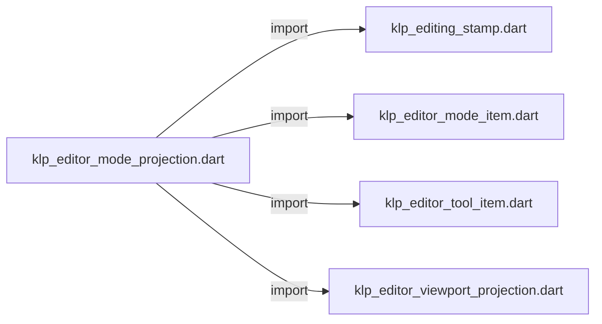
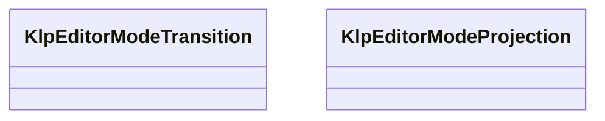

# klp_editor_mode_projection.dart：直接依賴與宣告架構

[回到目錄](README.md) · [來源檔案](../../../../../../lib/src/capabilities/editing/contracts/klp_editor_mode_projection.dart)

## 範圍

核心是 `lib/src/capabilities/editing/contracts/klp_editor_mode_projection.dart`。主要視角為該檔案明寫的 import／export／part；輔助視角為本檔宣告及 extends／implements／with／on 關係。只展開一層外部邊界。

## 直接依賴圖

## 依賴證據

| 關係 | 原始 directive | 來源 |
|---|---|---|
| import | <code>import &#x27;klp_editing_stamp.dart&#x27;;</code> | [lib/src/capabilities/editing/contracts/klp_editor_mode_projection.dart:1](../../../../../../lib/src/capabilities/editing/contracts/klp_editor_mode_projection.dart#L1) |
| import | <code>import &#x27;klp_editor_mode_item.dart&#x27;;</code> | [lib/src/capabilities/editing/contracts/klp_editor_mode_projection.dart:2](../../../../../../lib/src/capabilities/editing/contracts/klp_editor_mode_projection.dart#L2) |
| import | <code>import &#x27;klp_editor_tool_item.dart&#x27;;</code> | [lib/src/capabilities/editing/contracts/klp_editor_mode_projection.dart:3](../../../../../../lib/src/capabilities/editing/contracts/klp_editor_mode_projection.dart#L3) |
| import | <code>import &#x27;klp_editor_viewport_projection.dart&#x27;;</code> | [lib/src/capabilities/editing/contracts/klp_editor_mode_projection.dart:4](../../../../../../lib/src/capabilities/editing/contracts/klp_editor_mode_projection.dart#L4) |

## 宣告關係圖

本組節點是本檔宣告；沒有箭頭的宣告未在此圖主張互相依賴。

## 宣告與成員證據

成員包含 public 與 private；簽章取自來源，省略函式本體與欄位初始值。`(inferred)` 表示來源未明寫型別；建構子只顯示參數部分，不含初始化列表。

### KlpEditorModeTransition

EnumDeclaration · public · [lib/src/capabilities/editing/contracts/klp_editor_mode_projection.dart:6](../../../../../../lib/src/capabilities/editing/contracts/klp_editor_mode_projection.dart#L6)

<code>enum KlpEditorModeTransition</code>

來源註解摘要：編輯模式切換的暫態階段；文件與工具狀態仍以提供者投影為準。

| 成員 | 可見性 | 簽章／型別 | 來源註解摘要 | 證據 |
|---|---|---|---|---|
| enum value <code>ready</code> | public | <code>ready</code> |  | [lib/src/capabilities/editing/contracts/klp_editor_mode_projection.dart:7](../../../../../../lib/src/capabilities/editing/contracts/klp_editor_mode_projection.dart#L7) |
| enum value <code>switching</code> | public | <code>switching</code> |  | [lib/src/capabilities/editing/contracts/klp_editor_mode_projection.dart:7](../../../../../../lib/src/capabilities/editing/contracts/klp_editor_mode_projection.dart#L7) |
| enum value <code>suspended</code> | public | <code>suspended</code> |  | [lib/src/capabilities/editing/contracts/klp_editor_mode_projection.dart:7](../../../../../../lib/src/capabilities/editing/contracts/klp_editor_mode_projection.dart#L7) |

### KlpEditorModeProjection

ClassDeclaration · public · [lib/src/capabilities/editing/contracts/klp_editor_mode_projection.dart:9](../../../../../../lib/src/capabilities/editing/contracts/klp_editor_mode_projection.dart#L9)

<code>final class KlpEditorModeProjection</code>

來源註解摘要：同一 editor 的模式、工具與 viewport 投影；不保存文件內容副本。

| 成員 | 可見性 | 簽章／型別 | 來源註解摘要 | 證據 |
|---|---|---|---|---|
| field <code>stamp</code> | public | <code>final KlpEditingStamp stamp</code> |  | [lib/src/capabilities/editing/contracts/klp_editor_mode_projection.dart:11](../../../../../../lib/src/capabilities/editing/contracts/klp_editor_mode_projection.dart#L11) |
| field <code>revision</code> | public | <code>final int revision</code> |  | [lib/src/capabilities/editing/contracts/klp_editor_mode_projection.dart:12](../../../../../../lib/src/capabilities/editing/contracts/klp_editor_mode_projection.dart#L12) |
| field <code>activeModeId</code> | public | <code>final String activeModeId</code> |  | [lib/src/capabilities/editing/contracts/klp_editor_mode_projection.dart:13](../../../../../../lib/src/capabilities/editing/contracts/klp_editor_mode_projection.dart#L13) |
| field <code>activeToolId</code> | public | <code>final String activeToolId</code> |  | [lib/src/capabilities/editing/contracts/klp_editor_mode_projection.dart:14](../../../../../../lib/src/capabilities/editing/contracts/klp_editor_mode_projection.dart#L14) |
| field <code>transition</code> | public | <code>final KlpEditorModeTransition transition</code> |  | [lib/src/capabilities/editing/contracts/klp_editor_mode_projection.dart:15](../../../../../../lib/src/capabilities/editing/contracts/klp_editor_mode_projection.dart#L15) |
| field <code>modes</code> | public | <code>final List&lt;KlpEditorModeItem&gt; modes</code> |  | [lib/src/capabilities/editing/contracts/klp_editor_mode_projection.dart:16](../../../../../../lib/src/capabilities/editing/contracts/klp_editor_mode_projection.dart#L16) |
| field <code>tools</code> | public | <code>final List&lt;KlpEditorToolItem&gt; tools</code> |  | [lib/src/capabilities/editing/contracts/klp_editor_mode_projection.dart:17](../../../../../../lib/src/capabilities/editing/contracts/klp_editor_mode_projection.dart#L17) |
| field <code>viewport</code> | public | <code>final KlpEditorViewportProjection viewport</code> |  | [lib/src/capabilities/editing/contracts/klp_editor_mode_projection.dart:18](../../../../../../lib/src/capabilities/editing/contracts/klp_editor_mode_projection.dart#L18) |
| constructor <code>KlpEditorModeProjection</code> | public | <code>KlpEditorModeProjection({ required this.stamp, required this.revision, required this.activeModeId, required this.activeToolId, required this.transition, required Iterable&lt;KlpEditorModeItem&gt; modes, required Iterable&lt;KlpEditorToolItem&gt; tools, required this.viewport, })</code> |  | [lib/src/capabilities/editing/contracts/klp_editor_mode_projection.dart:20](../../../../../../lib/src/capabilities/editing/contracts/klp_editor_mode_projection.dart#L20) |
| getter <code>activePurpose</code> | public | <code>KlpEditorInputPurpose get activePurpose</code> |  | [lib/src/capabilities/editing/contracts/klp_editor_mode_projection.dart:59](../../../../../../lib/src/capabilities/editing/contracts/klp_editor_mode_projection.dart#L59) |

## 閱讀說明與限制

箭頭只表示來源明寫的靜態關係；import 不等於呼叫。未分析動態呼叫、欄位的實際物件擁有權、狀態轉移或渲染流程；型別未進行語意解析，繼承目標保留原始型別拼寫。public／private 依 Dart 名稱前綴判斷；public 宣告不代表已由 `lib/kallopis.dart` 匯出。

本頁由 `tool/architecture_atlas` 產生；編輯來源或生成工具後重新產生，避免手改本頁。
