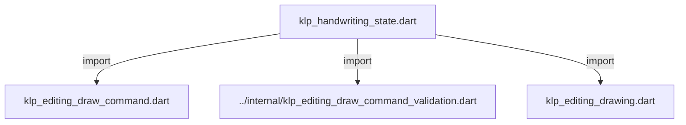
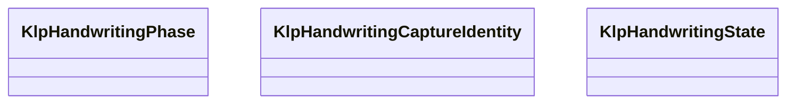

# klp_handwriting_state.dart：直接依賴與宣告架構

[回到目錄](README.md) · [來源檔案](../../../../../../lib/src/capabilities/editing/contracts/klp_handwriting_state.dart)

## 範圍

核心是 `lib/src/capabilities/editing/contracts/klp_handwriting_state.dart`。主要視角為該檔案明寫的 import／export／part；輔助視角為本檔宣告及 extends／implements／with／on 關係。只展開一層外部邊界。

## 直接依賴圖

## 依賴證據

| 關係 | 原始 directive | 來源 |
|---|---|---|
| import | <code>import &#x27;klp_editing_draw_command.dart&#x27;;</code> | [lib/src/capabilities/editing/contracts/klp_handwriting_state.dart:1](../../../../../../lib/src/capabilities/editing/contracts/klp_handwriting_state.dart#L1) |
| import | <code>import &#x27;../internal/klp_editing_draw_command_validation.dart&#x27;;</code> | [lib/src/capabilities/editing/contracts/klp_handwriting_state.dart:2](../../../../../../lib/src/capabilities/editing/contracts/klp_handwriting_state.dart#L2) |
| import | <code>import &#x27;klp_editing_drawing.dart&#x27;;</code> | [lib/src/capabilities/editing/contracts/klp_handwriting_state.dart:3](../../../../../../lib/src/capabilities/editing/contracts/klp_handwriting_state.dart#L3) |

## 宣告關係圖

本組節點是本檔宣告；沒有箭頭的宣告未在此圖主張互相依賴。

## 宣告與成員證據

成員包含 public 與 private；簽章取自來源，省略函式本體與欄位初始值。`(inferred)` 表示來源未明寫型別；建構子只顯示參數部分，不含初始化列表。

### KlpHandwritingPhase

EnumDeclaration · public · [lib/src/capabilities/editing/contracts/klp_handwriting_state.dart:5](../../../../../../lib/src/capabilities/editing/contracts/klp_handwriting_state.dart#L5)

<code>enum KlpHandwritingPhase</code>

來源註解摘要：來源回報的筆跡擷取階段；未知結果不代表已提交或可安全重試。

| 成員 | 可見性 | 簽章／型別 | 來源註解摘要 | 證據 |
|---|---|---|---|---|
| enum value <code>capturing</code> | public | <code>capturing</code> |  | [lib/src/capabilities/editing/contracts/klp_handwriting_state.dart:6](../../../../../../lib/src/capabilities/editing/contracts/klp_handwriting_state.dart#L6) |
| enum value <code>overloaded</code> | public | <code>overloaded</code> |  | [lib/src/capabilities/editing/contracts/klp_handwriting_state.dart:6](../../../../../../lib/src/capabilities/editing/contracts/klp_handwriting_state.dart#L6) |
| enum value <code>committed</code> | public | <code>committed</code> |  | [lib/src/capabilities/editing/contracts/klp_handwriting_state.dart:6](../../../../../../lib/src/capabilities/editing/contracts/klp_handwriting_state.dart#L6) |
| enum value <code>canceled</code> | public | <code>canceled</code> |  | [lib/src/capabilities/editing/contracts/klp_handwriting_state.dart:6](../../../../../../lib/src/capabilities/editing/contracts/klp_handwriting_state.dart#L6) |
| enum value <code>unknown</code> | public | <code>unknown</code> |  | [lib/src/capabilities/editing/contracts/klp_handwriting_state.dart:6](../../../../../../lib/src/capabilities/editing/contracts/klp_handwriting_state.dart#L6) |

### KlpHandwritingCaptureIdentity

ClassDeclaration · public · [lib/src/capabilities/editing/contracts/klp_handwriting_state.dart:8](../../../../../../lib/src/capabilities/editing/contracts/klp_handwriting_state.dart#L8)

<code>final class KlpHandwritingCaptureIdentity</code>

來源註解摘要：capture ID 為來源核發的不透明值；generation 來自共用命令序號或同等單調權威。

| 成員 | 可見性 | 簽章／型別 | 來源註解摘要 | 證據 |
|---|---|---|---|---|
| field <code>generation</code> | public | <code>final int generation</code> |  | [lib/src/capabilities/editing/contracts/klp_handwriting_state.dart:10](../../../../../../lib/src/capabilities/editing/contracts/klp_handwriting_state.dart#L10) |
| field <code>id</code> | public | <code>final String id</code> |  | [lib/src/capabilities/editing/contracts/klp_handwriting_state.dart:11](../../../../../../lib/src/capabilities/editing/contracts/klp_handwriting_state.dart#L11) |
| constructor <code>KlpHandwritingCaptureIdentity</code> | public | <code>KlpHandwritingCaptureIdentity({required this.generation, required this.id})</code> |  | [lib/src/capabilities/editing/contracts/klp_handwriting_state.dart:13](../../../../../../lib/src/capabilities/editing/contracts/klp_handwriting_state.dart#L13) |
| method <code>==</code> | public | <code>bool operator ==(Object other)</code> |  | [lib/src/capabilities/editing/contracts/klp_handwriting_state.dart:17](../../../../../../lib/src/capabilities/editing/contracts/klp_handwriting_state.dart#L17) |
| getter <code>hashCode</code> | public | <code>int get hashCode</code> |  | [lib/src/capabilities/editing/contracts/klp_handwriting_state.dart:20](../../../../../../lib/src/capabilities/editing/contracts/klp_handwriting_state.dart#L20) |

### KlpHandwritingState

ClassDeclaration · public · [lib/src/capabilities/editing/contracts/klp_handwriting_state.dart:24](../../../../../../lib/src/capabilities/editing/contracts/klp_handwriting_state.dart#L24)

<code>final class KlpHandwritingState</code>

來源註解摘要：核心暫態筆跡的不可變快照；不包含平台樣本、筆刷或 placement 決策。

| 成員 | 可見性 | 簽章／型別 | 來源註解摘要 | 證據 |
|---|---|---|---|---|
| field <code>drawing</code> | public | <code>final KlpEditingDrawing drawing</code> |  | [lib/src/capabilities/editing/contracts/klp_handwriting_state.dart:26](../../../../../../lib/src/capabilities/editing/contracts/klp_handwriting_state.dart#L26) |
| field <code>capture</code> | public | <code>final KlpHandwritingCaptureIdentity capture</code> |  | [lib/src/capabilities/editing/contracts/klp_handwriting_state.dart:27](../../../../../../lib/src/capabilities/editing/contracts/klp_handwriting_state.dart#L27) |
| field <code>phase</code> | public | <code>final KlpHandwritingPhase phase</code> |  | [lib/src/capabilities/editing/contracts/klp_handwriting_state.dart:28](../../../../../../lib/src/capabilities/editing/contracts/klp_handwriting_state.dart#L28) |
| field <code>acceptedBatchSequence</code> | public | <code>final int acceptedBatchSequence</code> |  | [lib/src/capabilities/editing/contracts/klp_handwriting_state.dart:29](../../../../../../lib/src/capabilities/editing/contracts/klp_handwriting_state.dart#L29) |
| field <code>previewRevision</code> | public | <code>final int previewRevision</code> |  | [lib/src/capabilities/editing/contracts/klp_handwriting_state.dart:30](../../../../../../lib/src/capabilities/editing/contracts/klp_handwriting_state.dart#L30) |
| field <code>sampleCapacity</code> | public | <code>final int sampleCapacity</code> |  | [lib/src/capabilities/editing/contracts/klp_handwriting_state.dart:31](../../../../../../lib/src/capabilities/editing/contracts/klp_handwriting_state.dart#L31) |
| field <code>bufferedSampleCount</code> | public | <code>final int bufferedSampleCount</code> |  | [lib/src/capabilities/editing/contracts/klp_handwriting_state.dart:32](../../../../../../lib/src/capabilities/editing/contracts/klp_handwriting_state.dart#L32) |
| field <code>remainingSampleCapacity</code> | public | <code>final int? remainingSampleCapacity</code> |  | [lib/src/capabilities/editing/contracts/klp_handwriting_state.dart:33](../../../../../../lib/src/capabilities/editing/contracts/klp_handwriting_state.dart#L33) |
| field <code>previewCommands</code> | public | <code>final List&lt;KlpEditingDrawCommand&gt; previewCommands</code> |  | [lib/src/capabilities/editing/contracts/klp_handwriting_state.dart:34](../../../../../../lib/src/capabilities/editing/contracts/klp_handwriting_state.dart#L34) |
| constructor <code>KlpHandwritingState</code> | public | <code>KlpHandwritingState({ required this.drawing, required this.capture, required this.phase, required this.acceptedBatchSequence, required this.previewRevision, required this.sampleCapacity, required this.bufferedSampleCount, required this.remainingSampleCapacity, required Iterable&lt;KlpEditingDrawCommand&gt; previewCommands, })</code> |  | [lib/src/capabilities/editing/contracts/klp_handwriting_state.dart:36](../../../../../../lib/src/capabilities/editing/contracts/klp_handwriting_state.dart#L36) |
| getter <code>terminal</code> | public | <code>bool get terminal</code> |  | [lib/src/capabilities/editing/contracts/klp_handwriting_state.dart:60](../../../../../../lib/src/capabilities/editing/contracts/klp_handwriting_state.dart#L60) |

## 閱讀說明與限制

箭頭只表示來源明寫的靜態關係；import 不等於呼叫。未分析動態呼叫、欄位的實際物件擁有權、狀態轉移或渲染流程；型別未進行語意解析，繼承目標保留原始型別拼寫。public／private 依 Dart 名稱前綴判斷；public 宣告不代表已由 `lib/kallopis.dart` 匯出。

本頁由 `tool/architecture_atlas` 產生；編輯來源或生成工具後重新產生，避免手改本頁。
