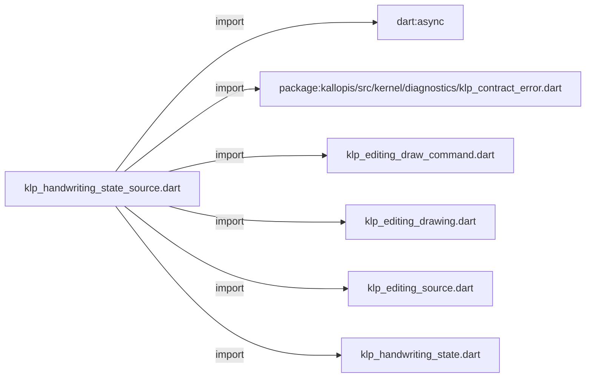
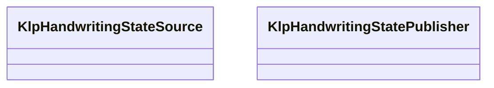
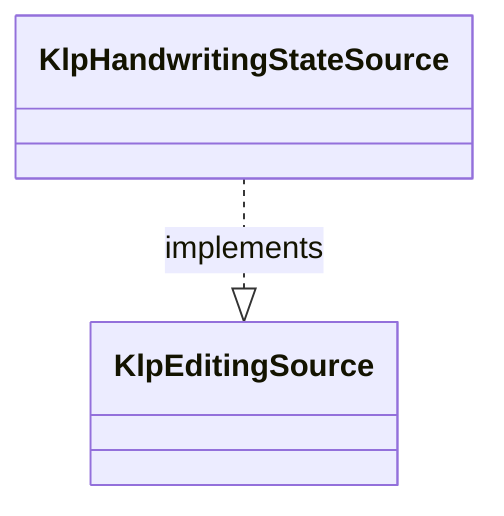

# klp_handwriting_state_source.dart：直接依賴與宣告架構

[回到目錄](README.md) · [來源檔案](../../../../../../lib/src/capabilities/editing/contracts/klp_handwriting_state_source.dart)

## 範圍

核心是 `lib/src/capabilities/editing/contracts/klp_handwriting_state_source.dart`。主要視角為該檔案明寫的 import／export／part；輔助視角為本檔宣告及 extends／implements／with／on 關係。只展開一層外部邊界。

## 直接依賴圖

## 依賴證據

| 關係 | 原始 directive | 來源 |
|---|---|---|
| import | <code>import &#x27;dart:async&#x27;;</code> | [lib/src/capabilities/editing/contracts/klp_handwriting_state_source.dart:1](../../../../../../lib/src/capabilities/editing/contracts/klp_handwriting_state_source.dart#L1) |
| import | <code>import &#x27;package:kallopis/src/kernel/diagnostics/klp_contract_error.dart&#x27;;</code> | [lib/src/capabilities/editing/contracts/klp_handwriting_state_source.dart:3](../../../../../../lib/src/capabilities/editing/contracts/klp_handwriting_state_source.dart#L3) |
| import | <code>import &#x27;klp_editing_draw_command.dart&#x27;;</code> | [lib/src/capabilities/editing/contracts/klp_handwriting_state_source.dart:4](../../../../../../lib/src/capabilities/editing/contracts/klp_handwriting_state_source.dart#L4) |
| import | <code>import &#x27;klp_editing_drawing.dart&#x27;;</code> | [lib/src/capabilities/editing/contracts/klp_handwriting_state_source.dart:5](../../../../../../lib/src/capabilities/editing/contracts/klp_handwriting_state_source.dart#L5) |
| import | <code>import &#x27;klp_editing_source.dart&#x27;;</code> | [lib/src/capabilities/editing/contracts/klp_handwriting_state_source.dart:6](../../../../../../lib/src/capabilities/editing/contracts/klp_handwriting_state_source.dart#L6) |
| import | <code>import &#x27;klp_handwriting_state.dart&#x27;;</code> | [lib/src/capabilities/editing/contracts/klp_handwriting_state_source.dart:7](../../../../../../lib/src/capabilities/editing/contracts/klp_handwriting_state_source.dart#L7) |

## 宣告關係圖

本組節點是本檔宣告；沒有箭頭的宣告未在此圖主張互相依賴。

## 宣告與成員證據

成員包含 public 與 private；簽章取自來源，省略函式本體與欄位初始值。`(inferred)` 表示來源未明寫型別；建構子只顯示參數部分，不含初始化列表。

### KlpHandwritingStateSource

ClassDeclaration · public · [lib/src/capabilities/editing/contracts/klp_handwriting_state_source.dart:9](../../../../../../lib/src/capabilities/editing/contracts/klp_handwriting_state_source.dart#L9)

<code>abstract interface class KlpHandwritingStateSource implements KlpEditingSource</code>

來源註解摘要：同一 editor source 擁有的獨立暫態筆跡通道；null 表示沒有未確認 capture。

- `implements` → <code>KlpEditingSource</code>：[lib/src/capabilities/editing/contracts/klp_handwriting_state_source.dart:10](../../../../../../lib/src/capabilities/editing/contracts/klp_handwriting_state_source.dart#L10)

| 成員 | 可見性 | 簽章／型別 | 來源註解摘要 | 證據 |
|---|---|---|---|---|
| getter <code>inkState</code> | public | <code>KlpHandwritingState? get inkState</code> |  | [lib/src/capabilities/editing/contracts/klp_handwriting_state_source.dart:11](../../../../../../lib/src/capabilities/editing/contracts/klp_handwriting_state_source.dart#L11) |
| getter <code>inkStates</code> | public | <code>Stream&lt;KlpHandwritingState?&gt; get inkStates</code> |  | [lib/src/capabilities/editing/contracts/klp_handwriting_state_source.dart:12](../../../../../../lib/src/capabilities/editing/contracts/klp_handwriting_state_source.dart#L12) |

### KlpHandwritingStatePublisher

ClassDeclaration · public · [lib/src/capabilities/editing/contracts/klp_handwriting_state_source.dart:15](../../../../../../lib/src/capabilities/editing/contracts/klp_handwriting_state_source.dart#L15)

<code>final class KlpHandwritingStatePublisher</code>

來源註解摘要：提供者內使用的有界 publication 狀態；不持有 editor source 或平台資源。

| 成員 | 可見性 | 簽章／型別 | 來源註解摘要 | 證據 |
|---|---|---|---|---|
| field <code>_drawing</code> | private | <code>final KlpEditingDrawing Function() _drawing</code> |  | [lib/src/capabilities/editing/contracts/klp_handwriting_state_source.dart:17](../../../../../../lib/src/capabilities/editing/contracts/klp_handwriting_state_source.dart#L17) |
| field <code>_states</code> | private | <code>final StreamController&lt;KlpHandwritingState?&gt; _states</code> |  | [lib/src/capabilities/editing/contracts/klp_handwriting_state_source.dart:18](../../../../../../lib/src/capabilities/editing/contracts/klp_handwriting_state_source.dart#L18) |
| field <code>_state</code> | private | <code>KlpHandwritingState? _state</code> |  | [lib/src/capabilities/editing/contracts/klp_handwriting_state_source.dart:19](../../../../../../lib/src/capabilities/editing/contracts/klp_handwriting_state_source.dart#L19) |
| field <code>_lastGeneration</code> | private | <code>int _lastGeneration</code> |  | [lib/src/capabilities/editing/contracts/klp_handwriting_state_source.dart:20](../../../../../../lib/src/capabilities/editing/contracts/klp_handwriting_state_source.dart#L20) |
| field <code>_lastKnownPhase</code> | private | <code>KlpHandwritingPhase? _lastKnownPhase</code> |  | [lib/src/capabilities/editing/contracts/klp_handwriting_state_source.dart:21](../../../../../../lib/src/capabilities/editing/contracts/klp_handwriting_state_source.dart#L21) |
| field <code>_closed</code> | private | <code>bool _closed</code> |  | [lib/src/capabilities/editing/contracts/klp_handwriting_state_source.dart:22](../../../../../../lib/src/capabilities/editing/contracts/klp_handwriting_state_source.dart#L22) |
| constructor <code>KlpHandwritingStatePublisher</code> | public | <code>KlpHandwritingStatePublisher(this._drawing)</code> |  | [lib/src/capabilities/editing/contracts/klp_handwriting_state_source.dart:24](../../../../../../lib/src/capabilities/editing/contracts/klp_handwriting_state_source.dart#L24) |
| getter <code>state</code> | public | <code>KlpHandwritingState? get state</code> |  | [lib/src/capabilities/editing/contracts/klp_handwriting_state_source.dart:26](../../../../../../lib/src/capabilities/editing/contracts/klp_handwriting_state_source.dart#L26) |
| getter <code>states</code> | public | <code>Stream&lt;KlpHandwritingState?&gt; get states</code> |  | [lib/src/capabilities/editing/contracts/klp_handwriting_state_source.dart:27](../../../../../../lib/src/capabilities/editing/contracts/klp_handwriting_state_source.dart#L27) |
| method <code>publish</code> | public | <code>KlpHandwritingState publish(KlpHandwritingState next)</code> |  | [lib/src/capabilities/editing/contracts/klp_handwriting_state_source.dart:29](../../../../../../lib/src/capabilities/editing/contracts/klp_handwriting_state_source.dart#L29) |
| method <code>clear</code> | public | <code>void clear(KlpHandwritingCaptureIdentity capture)</code> |  | [lib/src/capabilities/editing/contracts/klp_handwriting_state_source.dart:49](../../../../../../lib/src/capabilities/editing/contracts/klp_handwriting_state_source.dart#L49) |
| method <code>close</code> | public | <code>Future&lt;void&gt; close()</code> |  | [lib/src/capabilities/editing/contracts/klp_handwriting_state_source.dart:58](../../../../../../lib/src/capabilities/editing/contracts/klp_handwriting_state_source.dart#L58) |
| method <code>_validateAdvance</code> | private | <code>void _validateAdvance(KlpHandwritingState current, KlpHandwritingState next)</code> |  | [lib/src/capabilities/editing/contracts/klp_handwriting_state_source.dart:64](../../../../../../lib/src/capabilities/editing/contracts/klp_handwriting_state_source.dart#L64) |

### _allows

FunctionDeclaration · private · [lib/src/capabilities/editing/contracts/klp_handwriting_state_source.dart:80](../../../../../../lib/src/capabilities/editing/contracts/klp_handwriting_state_source.dart#L80)

<code>bool _allows(KlpHandwritingPhase current, KlpHandwritingPhase next)</code>

### _sameCommands

FunctionDeclaration · private · [lib/src/capabilities/editing/contracts/klp_handwriting_state_source.dart:87](../../../../../../lib/src/capabilities/editing/contracts/klp_handwriting_state_source.dart#L87)

<code>bool _sameCommands(List&lt;KlpEditingDrawCommand&gt; left, List&lt;KlpEditingDrawCommand&gt; right)</code>

## 閱讀說明與限制

箭頭只表示來源明寫的靜態關係；import 不等於呼叫。未分析動態呼叫、欄位的實際物件擁有權、狀態轉移或渲染流程；型別未進行語意解析，繼承目標保留原始型別拼寫。public／private 依 Dart 名稱前綴判斷；public 宣告不代表已由 `lib/kallopis.dart` 匯出。

本頁由 `tool/architecture_atlas` 產生；編輯來源或生成工具後重新產生，避免手改本頁。
