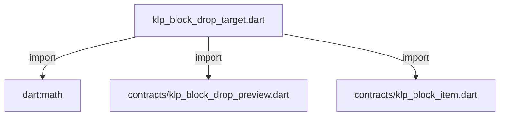
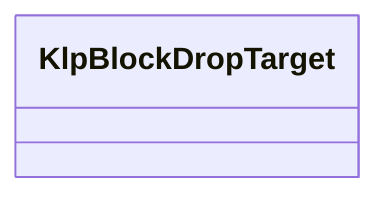

# klp_block_drop_target.dart：直接依賴與宣告架構

[回到目錄](README.md) · [來源檔案](../../../../../lib/src/capabilities/editing/klp_block_drop_target.dart)

## 範圍

核心是 `lib/src/capabilities/editing/klp_block_drop_target.dart`。主要視角為該檔案明寫的 import／export／part；輔助視角為本檔宣告及 extends／implements／with／on 關係。只展開一層外部邊界。

## 直接依賴圖

## 依賴證據

| 關係 | 原始 directive | 來源 |
|---|---|---|
| import | <code>import &#x27;dart:math&#x27; as math;</code> | [lib/src/capabilities/editing/klp_block_drop_target.dart:1](../../../../../lib/src/capabilities/editing/klp_block_drop_target.dart#L1) |
| import | <code>import &#x27;contracts/klp_block_drop_preview.dart&#x27;;</code> | [lib/src/capabilities/editing/klp_block_drop_target.dart:3](../../../../../lib/src/capabilities/editing/klp_block_drop_target.dart#L3) |
| import | <code>import &#x27;contracts/klp_block_item.dart&#x27;;</code> | [lib/src/capabilities/editing/klp_block_drop_target.dart:4](../../../../../lib/src/capabilities/editing/klp_block_drop_target.dart#L4) |

## 宣告關係圖

本組節點是本檔宣告；沒有箭頭的宣告未在此圖主張互相依賴。

## 宣告與成員證據

成員包含 public 與 private；簽章取自來源，省略函式本體與欄位初始值。`(inferred)` 表示來源未明寫型別；建構子只顯示參數部分，不含初始化列表。

### KlpBlockDropTarget

ClassDeclaration · public · [lib/src/capabilities/editing/klp_block_drop_target.dart:6](../../../../../lib/src/capabilities/editing/klp_block_drop_target.dart#L6)

<code>final class KlpBlockDropTarget</code>

來源註解摘要：同幀 hit geometry 推導出的單一合法落點；不包含呈現或提交狀態。

| 成員 | 可見性 | 簽章／型別 | 來源註解摘要 | 證據 |
|---|---|---|---|---|
| field <code>targetId</code> | public | <code>final String targetId</code> |  | [lib/src/capabilities/editing/klp_block_drop_target.dart:8](../../../../../lib/src/capabilities/editing/klp_block_drop_target.dart#L8) |
| field <code>placement</code> | public | <code>final KlpBlockDropPlacement placement</code> |  | [lib/src/capabilities/editing/klp_block_drop_target.dart:9](../../../../../lib/src/capabilities/editing/klp_block_drop_target.dart#L9) |
| field <code>destinationIndex</code> | public | <code>final int destinationIndex</code> |  | [lib/src/capabilities/editing/klp_block_drop_target.dart:10](../../../../../lib/src/capabilities/editing/klp_block_drop_target.dart#L10) |
| constructor <code>KlpBlockDropTarget</code> | public | <code>const KlpBlockDropTarget(this.targetId, this.placement, this.destinationIndex)</code> |  | [lib/src/capabilities/editing/klp_block_drop_target.dart:12](../../../../../lib/src/capabilities/editing/klp_block_drop_target.dart#L12) |

### klpCanDropBlockAt

FunctionDeclaration · public · [lib/src/capabilities/editing/klp_block_drop_target.dart:15](../../../../../lib/src/capabilities/editing/klp_block_drop_target.dart#L15)

<code>bool klpCanDropBlockAt(List&lt;KlpBlockItem&gt; blocks, String sourceId, String targetId, KlpBlockDropPlacement placement, {String? sourceEndId})</code>

### klpBlockDropTargets

FunctionDeclaration · public · [lib/src/capabilities/editing/klp_block_drop_target.dart:23](../../../../../lib/src/capabilities/editing/klp_block_drop_target.dart#L23)

<code>List&lt;KlpBlockDropTarget&gt; klpBlockDropTargets(List&lt;KlpBlockItem&gt; blocks, String sourceId, {String? sourceEndId})</code>

### klpResolveBlockDropTarget

FunctionDeclaration · public · [lib/src/capabilities/editing/klp_block_drop_target.dart:37](../../../../../lib/src/capabilities/editing/klp_block_drop_target.dart#L37)

<code>KlpBlockDropTarget? klpResolveBlockDropTarget({required List&lt;KlpBlockItem&gt; blocks, required String sourceId, String? sourceEndId, required double pointerY, required double viewportHeight})</code>

### _destinationIndex

FunctionDeclaration · private · [lib/src/capabilities/editing/klp_block_drop_target.dart:60](../../../../../lib/src/capabilities/editing/klp_block_drop_target.dart#L60)

<code>int _destinationIndex(int sourceStart, int sourceEnd, int targetIndex, KlpBlockDropPlacement placement)</code>

### _sourceRange

FunctionDeclaration · private · [lib/src/capabilities/editing/klp_block_drop_target.dart:65](../../../../../lib/src/capabilities/editing/klp_block_drop_target.dart#L65)

<code>({int start, int end}) _sourceRange(List&lt;KlpBlockItem&gt; blocks, String firstId, String lastId)</code>

## 閱讀說明與限制

箭頭只表示來源明寫的靜態關係；import 不等於呼叫。未分析動態呼叫、欄位的實際物件擁有權、狀態轉移或渲染流程；型別未進行語意解析，繼承目標保留原始型別拼寫。public／private 依 Dart 名稱前綴判斷；public 宣告不代表已由 `lib/kallopis.dart` 匯出。

本頁由 `tool/architecture_atlas` 產生；編輯來源或生成工具後重新產生，避免手改本頁。
